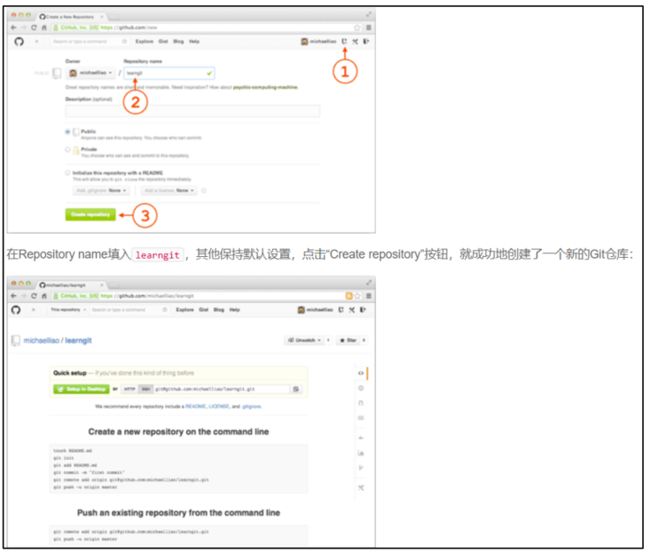
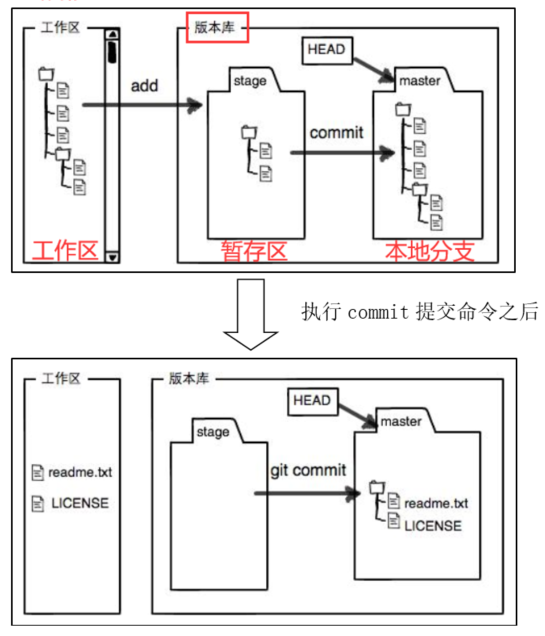

# 1、**关于远程库的搭建、使用**

**注意**：项目名称最好与本地库保持一致

- **创建远程仓库**

  

- **远程库与本地库连接：**

  git remote add origin [git@gihub.com:Zmq1294550676/<](mailto:git@gihub.com:Zmq1294550676/<)项目名>.git

  （origin：为远程库的名字，可以修改为其他的）

- **推送方式：**

  第一次：git push -u origin master

  以后使用简化命令：git push origin master

# 2、常用命令

## 2.1、克隆远程库

- 修改代码（Debug）使用的方式

  命令：git clone git@github.com:Zmq1294550676/gitskills.git

## 2.2、提交文件到远程库

使用git push origin master （注意：必须先提交本地文件）

命令：

- git add <file_name> 添加文件，使用**表示所有

- git commit –m “描述”

- git push：推送到远程库（和当前分支相同的远程分支中）

  git push origin 分支名 （推送至指定远程分支）

## 2.3、**Git分支合并**

当Git无法自动合并分支时，就必须首先解决冲突。解决冲突后，再提交，合并完成。解决冲突就是把Git合并失败的文件手动编辑为我们希望的内容，再提交。

用git log --graph --pretty=oneline --abbrev-commit命令可以看到分支合并图。

## 2.4、分支操作

- 创建分支：git branch 分支名

- 查看当前所在分支：git branch

- 查看所有分支:git branch -a

- 转到对应分支：git checkout 分支名     

  ​					或，git switch 分支名

- 创建并切换到新分支：git checkout -b 分支名

  ​									  git switch –c 分支名  **（新git推荐使用）**

- 删除分支：

  - 删除本地分支：git branch **–d** 分支名

    删除一个没有被合并过的分支：需要强行删除，git branch –D 分支名

  - 删除远程分支：git push origin –-delete 分支名

- 合并（分支1）到当前所在的分支：git merge 分支1

## 2.5、**查看Git暂存区的状态**

git status

## 2.6、**删除版本库中的文件**

git rm 文件名

## 2.7、文件恢复

git checkout -- 文件名

## 2.8、查看分支历史

- （简化版，图形）git log --graph --pretty=oneline --abbrev-commit
- （详细版） git log

## 2.9、添加标签

- 添加标签：git tag 标签名

- 创建带有备注文字的标签：

  git tag -a 标签名 -m "说明文字" 提交的ID （即：commit ID）

- 查看标签：git tag

- 查看对应标签的说明：git show 标签名

- 推送标签的远程：

  - 推送特定标签：git push 分支名 标签名 

    **例如：**git push origin V1.0 

  - 一次性推送所有标签：git push 分支名 –-tags

- 删除**本地**标签：git tag –d 标签名
- 删除远程标签：git push 分支名 :refs/tags/标签名

​     **例如：**git push origin :refs/tags/V1.0

## 2.10、版本回退

- **已经提交到本地仓库中：**

  git reset –hard 版本号后几位

  （查看版本号：git log –pretty=oneline）

- **没有提交到本地仓库中：**

  - **没添加到暂存区：**

    git checkout -- 文件1：丢弃工作区中“文件1”的修改，回到本地仓库中“文件1”的版本内容。

  - **添加到暂存区：**
  - git reset HEAD 文件1：回退暂存区的修改。

  **总之，就是让这个文件回到最近一次git commit****或git add****时的状态** 。

## 2.11、清除所有add、commit的文件

git rm –r –cache **（再次add、commit即可完成数据提交）

# 3、多人协作

## 3.1、多人协作的操作流程

- **查看远程仓库的信息：**

  - git remote
  - （详细版）git remote -v 

  

- **远程仓库默认名称：origin**

  

- **创建分支让其他人开发：**其他人克隆新分支进行开发，再push到新分支。
  - **命令：**git checkout -b dev 远程仓库名/新分支名
  - **例如：**git checkout -b dev origin/dev

  

- **拉取远程仓库：**
  - **拉取默认分支内容：**git pull 

  - **拉取特定分支内容：先设定要获取的分支，再用git pull拉取**

    - **本地关联远程分支：**

      git branch --set-upstream-to=远程仓库名/分支名 本地分支名

    - **例如：**git branch --set-upstream-to=origin/dev dev

 

- **本地local分支和远程master分支合并：**
  - **更新：**获取远程master分支新增的东西 

    - 切换至master分支：git checkout master

    - 更新远程master分支内容：git pull

    - 切换至本地local分支、提交、合并master内容：

      git checkout local

      git add **

      git commit –m “xxx”

      git merge master

    - 最后在local分支上进行修改（**提交时，使用下面的步骤**）

      

  - **提交：**local分支修改的内容至远程

    - 提交本地local分支的内容：（**否则本地仓库无法获取修改内容，导致后面的merge无法产生作用**）

      - git add **

      - git commit –m “修改内容”

    - 切换至master：
      - git checkout master
    - 更新远程的master：
      - git pull
    - 将local分支合并至本地master：
      - git merge local
    - (查看分支状态）：
      - git status
    - 推送本地master分支至远程master：
      - git push
    - 最后切回local分支（后续修改就在local分支中进行）：
      - git checkout local

## 3.2、多人协作时可能出现的错误

- **Git push origin master**出现如下错误时：

  error: failed to push some refs to 'github.com:Zmq/StudyNotes.git'

  hint: Updates were rejected because the remote contains work that you do

  hint: not have locally. This is usually caused by another repository pushing

  - **原因：**

    其他用户已经push新的资料到远程master分支中。当前用户再使用git push，推送本地master至远程master中，就会出现远程mster和本地master本版不一致的问题。

  - **解决方式：**

    - 使用命令：git pull --rebase origin master
      - 解释： pull = fetch + merge，更新、合并远程分支中的内容

        ​			rebase为取消本地已经commit的内容
      
    - 使用命令：git push即可推送至远程master

- **Git merge** 分支1，时出现错误：

  error: Merging is not possible because you have unmerged files.

  hint: Fix them up in the work tree, and then use 'git add/rm <file>'

  hint: as appropriate to mark resolution and make a commit.

  fatal: Exiting because of an unresolved conflict.

  - **原因**

    **两个用户同时修改了同个分支中的同个文件**，但用户A先提交至远程master中（并merge成功）。此时用户B使用git pull origin master，同步远程master，并切换至本地local分支中。然后使用git merge master合并master分支到local中。此时就会出现上述错误。

    这是因为，用户B没有先commit本地local分支，因此会出现local|merging的现象。

  - **解决方式**

    - 使用命令：git add 被修改的文件

    ​                          git commit -m “xxx”

    - 之后就可以进行git merge操作。

# 4、Git存储原理

- **add**命令：将工作区修改的文件先放到暂存区；

- **commit**命令：将暂存区的文件提交到本地分支中；

- **push**命令：将本地分支提交到远程分支中；

# 5、Git中的特殊分支

## 5.1、Debug分支

每个bug都可以通过一个新的临时分支来修复，修复后，合并分支，然后将临时分支删除。

- 保存当前的工作进度：
  - git stash：（等处理完bug，再回到当前的工作进度）

- 转到需要修复bug的分支上，创建临时分支：
  - git checkout develop
  - git checkout –b bug01（修复完bug，并提交文件）
  - git add 文件1
  - git commit –m “修复bug01”： 提交完成后，有一个分支号：[bug01 **4c805e2**] 修复bug01

 

- 回到被修复bug的分支上，合并修复bug的分支: 
  - git checkout develop
  - git merge –-no-ff –m “合并：修复bug01” bug01

 

- 处理好bug，转回原来的工作进度分支上：

  - 查看被保存的工作现场：

    git stash list

  - 恢复工作现场：

    git stash apply （不删除保存的工作现场）

    或，git stash pop （会删除保存的工作现场）

  - 将develop分支修复的bug也复制到当前分支，避免再次修改bug：

    git cheryy-pick **4c805e2** [master 1d4b803] 修复bug01

  - 最后，删除修复bug的临时分支：

    git branch -d bug01

## 5.2、Feature分支

用于开发新的功能，开发完毕后，进行分支合并，然后删除feature分支。

## 5.3、Rebase分支

rebase操作可以把本地未push的分叉提交历史整理成直线；使得我们在查看历史提交的变化时更容易，因为分叉的提交需要三方对比。

