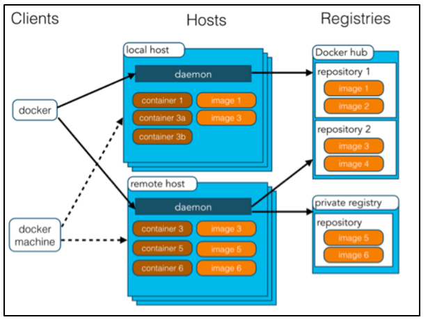
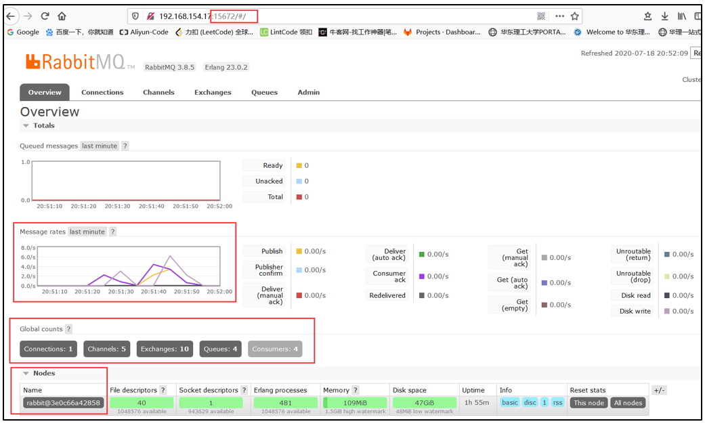

# 1、Docker入门

## 1.1、基本概念

- **主机：**用于运行docker环境的系统（实体主机、虚拟机都可以）；

- **客户端：**使用命令来操作主机中的docker环境；

- **镜像：**指的是一个个软件，用户可以自己打包自己开发环境的某个软件，生成对应的镜像——例如：tomcat、mysql；

- **容器：**镜像在dokcer中运行后就变成容器，容器具有启动、删除、停止等操作；

- **仓库：（eg：dokcer hub）**所有的镜像都可以保存在远程仓库，等需要使用的时候直接下载即可，不再需要对系统进行软件安装。

  

## 1.2、基本使用

### 1.2.1、常用命令

- docker images：

  查看当前系统已经pull安装的镜像；

- docker run 镜像名：

  启动镜像；

- docker stop containerId：

  停止运行某个镜像；

- **docker rm containerId**：

  删除**正在运行**的某个镜像；（即：停止docker ps -a，查找出正在运行的镜像）

- docker rmi 镜像名字：

  删除某个**下载的镜像**；（即：删除docker pull下载的镜像文件）

- docker ps –a：

  显示所有运行的镜像；

- docker ps：

  显示**有端口映射**、且正在运行的镜像；（使用-p启动）

- docker pull 镜像名字：

  从docker仓库**下载镜像**；

- docker restart 容器id：

  重启之前运行的镜像。

  **eg：**当vmware重启之后，使用无法访问之前开启的mysql，使用docker ps无法看到mysql正在运行，使用docker ps –a可以看到，此时只需要使用该命令，就可以重启这个镜像，外部可以正常访问mysql数据库；

### 1.2.2、Docker使用MySQL

- **安装**

  - docker search mysql

  - docker pull mysql （默认安装latest版本）

    （注意：安装的latest的mysql，使用较低版本的navicat是无法登陆，需要更新navicat版本）

- **启动Mysql**

  MySQL默认端口：3306

  - **命令：**

    docker run --name mysql04 -e MYSQL_ROOT_PASSWORD=123456 -d -p 5001:3306 mysql 

  - **解释：**

    - --name：为这次启动的mysql起别名；
    - -e：设置MySQL启动时的环境变量（默认参数），启动时必须配置密码，否则无法连接MySQL数据库
    - MYSQLROOT_PASSWORD：mysql登陆密码；
    - -d：后台运行（daemon）；
    - **-p 5001:3306**  ：将docker容器的端口映射到Linux系统的端口上。mysql的映射端口：**linux为5001，docker为3306**。因此，使用Navicat连接MySQL时，连接端口为Linux的5001端口（而不是Docker的3306端口）
    - mysql：启动的docker镜像（真实的应用名称）

### 1.2.3、Docker安装Redis

安装、启动Redis的方式，参见安装MySQL步骤.

Redis默认端口：6379

- 启动

  - 命令：docker run --name redis01 -d -p 4000:6379 redis

    

### 1.2.4、Docker安装RabbitMQ

- **安装**

  - rabbitmq**（带web界面）**：docker pull **rabbitmq:management** 

  - rabbitmq**（没有web界面）**：docker pull **rabbitmq**

    

- **启动**

  - **命令：**

    docker run -dit --name Myrabbitmq -e RABBITMQ_DEFAULT_USER=admin -e RABBITMQ_DEFAULT_PASS=admin -p 15672:15672 -p 5672:5672 **rabbitmq:management**

  - **解释：**

    - Myrabbitmq：设定此次启动容器的别名

    - RABBITMQ_DEFAULT_USER=admin：设定用户名

    - RABBITMQ_DEFAULT_PASS=admin：设定密码

    - -p 15672:15672：设定浏览器登陆web端口

    - -p 5672:5672：设定客户端端口（springboot中.yml配置的端口）

    - **rabbitmq:management**：此次启动的docker镜像（真实的应用名称）

      

  - **检测是否成功启动：**

    使用浏览器的web界面，IP + 端口15672

    

  

