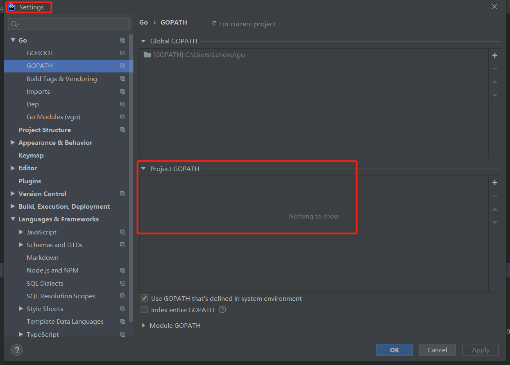

**<font color='red'>注意：笔者选择的开发环境为：VMware、Ubuntu18、Goland</font>**

 

# 1、配置host文件

安装switchhosts软件，新建配置文件，添加以下配置（否则gostack中的私有包无法下载）

```shell
# 屏蔽的域名
#0.0.0.0 bs.studycoder.com

# My hosts
# from liwei
172.28.8.27 git.ctyun.cn
172.28.8.27 rancher.ctyun.cn
172.28.8.27 nexus.ctyun.cn
172.28.8.27 mockbin.ctyun.cn
172.28.8.27 nginx.ctyun.cn
172.28.8.27 gen.ctyun.cn
172.28.8.241 docker.ctyun.cn
172.28.8.27 rancher.ctyun.cn
172.28.8.27 swagger.ctyun.cn
172.28.8.27 moho-manual
172.28.8.27 moho-manual.ctyun.cn
172.28.8.27 doc.ctyun.cn
172.28.8.27 sonar.ctyun.cn
172.28.8.27 ntp.ctyun.cn
172.28.8.27 host.ctyun.cn
10.1.34.173 gitlab.engineering.ctyun.cn
10.1.34.176 intranet.engineering.ctyun.cn
172.28.8.27 gostack.git.ctyun.cn

172.28.8.248 mariadb.cty.os
172.28.8.248 keystone-public.cty.os
172.28.8.248 keystone-internal.cty.os
172.28.8.248 keystone-admin.cty.os 
172.28.8.248 glance-api.cty.os 
172.28.8.248 nova-api.cty.os 
172.28.8.248 nova-api-metadata.cty.os 
172.28.8.248 nova-placement-api.cty.os 
172.28.8.248 neutron-server.cty.os 
172.28.8.248 cinder-api.cty.os 
172.28.8.248 gostack-compute.cty.os
172.28.8.248 gostack-cron.cty.os
```


# 2、安装、配置sshuttle

- 安装软件：

  apt install sshuttle

- 配置：

  需要使用本地机器上的ssh_pub（ssh公钥）

- 连接远程服务器：

  sshuttle --dns -r root@172.28.8.248 10.114.194.0/24 -e 'ssh -p 10000'

  

# 3、安装libvirt

sudo apt-get install libvirt-dev libvirt-daemon libvirt-clients

（不安装libvirt，在gostack/cmd/gostack中执行go build时，将导致参数无法读取，无法完成build操作）


# 4、go env配置

- go编译器版本：

  15.12

  

- 配置命令： 

  go env -w GO111MODULE=on
  go env -w GOPROXY=https://goproxy.io,direct

  go env -w GOINSECURE=git.ctyun.cn
  go env -w GOPRIVATE=git.ctyun.cn

   

  ```shell
  查看是否生效，打开以下路径的文件：
  windows：C:\Users\Lenovo\AppData\Roaming\go\env
  ubuntu:/home/chris/.config/go
  
  GO111MODULE=on
  GOINSECURE=git.ctyun.cn
  GOPRIVATE=git.ctyun.cn
  GOPROXY=https://goproxy.io,direct
  ```

  

  使用go env命令（查看配置）：

  ```shell
  C:\Code\gostack>go env
  set GO111MODULE=on
  set GOARCH=amd64
  set GOBIN=
  set GOCACHE=C:\Users\Lenovo\AppData\Local\go-build
  set GOENV=C:\Users\Lenovo\AppData\Roaming\go\env
  set GOEXE=.exe
  set GOFLAGS= -mod=
  set GOHOSTARCH=amd64
  set GOHOSTOS=windows
  set GOINSECURE=git.ctyun.cn
  set GOMODCACHE=C:\Users\Lenovo\go\pkg\mod
  set GONOPROXY=git.ctyun.cn
  set GONOSUMDB=git.ctyun.cn
  set GOOS=windows
  set GOPATH=C:\Users\Lenovo\go
  set GOPRIVATE=git.ctyun.cn
  set GOPROXY=direct
  set GOROOT=C:\Program Files\Go
  set GOSUMDB=sum.golang.org
  set GOTMPDIR=
  set GOTOOLDIR=C:\Program Files\Go\pkg\tool\windows_amd64
  set GCCGO=gccgo
  set AR=ar
  set CC=gcc
  set CXX=g++
  set CGO_ENABLED=1
  set GOMOD=C:\Code\gostack\go.mod
  set CGO_CFLAGS=-g -O2
  set CGO_CPPFLAGS=
  set CGO_CXXFLAGS=-g -O2
  set CGO_FFLAGS=-g -O2
  set CGO_LDFLAGS=-g -O2
  set PKG_CONFIG=pkg-config
  set GOGCCFLAGS=-m64 -mthreads -fno-caret-diagnostics -Qunused-arguments -fmessage-length=0 -fdebug-prefix-map=C:\Users\Lenovo\AppData\Local\Temp\go-build594281098=/tmp/go-build -gno-re
  cord-gcc-switches
  ```

  

- 获取go.mod中配置的包：

  命令：go mod download

  

  Q：若上述命令执行后未出现错误，但Gostack工程依然不能import外部包

  A：方式一：重启Goland

  ​      方式二：删除Gostack工程，重新git clone工程，打开Goland编译器，即可自动导入外部包。
  
  

- **<font color='red'>在获取GitLab中的包时，需要填写自己的Gitlab账号、密码</font>** 

  

# 5、Goland配置

- 无需配置Goland，否则会出现包无法使用的情况

  


# 6、启动代码

注意：gostack中的所有模块，都需要逐个手动启动，无法一次性全部启动

- **方式一：**

  该方式比较适合Linux环境使用

  - 打包gostack整个工程：

    命令：

    - cd cmd/gostack/

    - go build

    （打包完成后，该目录下会生成一个gostack可执行文件）

  - 启动需要执行的模块

    在cmd/gostack/目录下，使用命令：./gostack xxx

    eg：启动scheduler，  ./gostack scheduler

- **方式二：**

  自己新建一个main函数，调用RunXxx，并配置对应的etc/app.yml文件路径

  eg：windows下，启动scheduler模块

  

  
  
  ```go
  //图中的代码如下
  package main
  import "git.ctyun.cn/gostack/gostack/scheduler"
  
  func main() {
  	path := "./scheduler/etc/app.yml"
  	scheduler.RunScheduler(path)
}
  ```

  
  
  
