Docker-Hub：https://www.docker.com/products/docker-hub

# 1、Docker入门

## 1.1、虚拟技术、容器技术

- **虚拟技术**

  例如Vmware，直接在操作系统中通过软件的方式**虚拟化一个完整的操作系统**，该系统和真实系统没有区别。需要加载内核、Lib相关库，然后其余的APP应用可在该系统中运行。

  - **缺点**

    1、 资源占用十分多：需要加载很多Lib组件

    2、 冗余步骤多：

    3、 启动很慢：加载的系统kernel内核庞大

    4、当Lib组件崩溃时，容易导致系统无法运行。

  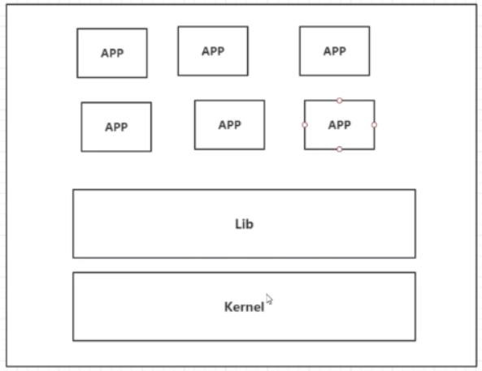

- **容器技术**

  容器化并没有模拟一个完整的操作系统，只需要加载系统核心部分的内核。将Lib组件和APP都封装起来放进一个容器中，每个容器都是相互隔离的，不会相互影响。即使某个容器崩溃，其余容器可照常运行。

  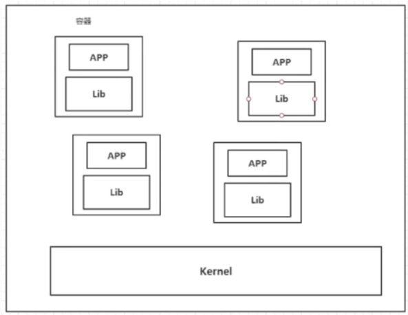

  - **为什么Docker比VMware快**
    1、docker有着比虚拟机更少的抽象层。由于docker不需要Hypervisor实现硬件资源虚拟化,运行在docker容器上的程序直接使用的都是实际物理机的硬件资源。因此在CPU、内存利用率上docker将会在效率上有明显优势。
    2、docker利用的是宿主机的内核,而不需要Guest OS。
  
    

## 1.2、基本概念

- **Docker的设计框架**

  

  - **主机：**用于运行docker环境的系统（实体主机、虚拟机都可以）；

  - **客户端：**使用命令来操作主机中的docker环境；

  - **镜像：**指的是一个个软件，用户可以自己打包自己开发环境的某个软件，生成对应的镜像——例如：tomcat、mysql；

    <font color='red'>Docker 镜像都是只读的，当容器启动时，一个新的可写层加载到镜像的顶部。这一层就是通常说的容器层，容器之下的都叫镜像层。用户所有的操作都是基于容器层进行的。</font>

    

  - **容器：**镜像在dokcer中运行后就变成容器，容器具有启动、删除、停止等操作；

  - **仓库：（eg：dokcer hub）**所有的镜像都可以保存在远程仓库，等需要使用的时候直接下载即可，不再需要对系统进行软件安装。


## 1.3、Ubuntu安装Docker

官网教程：https://docs.docker.com/engine/install/ubuntu/

- 更新安装软件列表

  ```shell
  sudo apt-get update
  ```

- 安装必要的组件

  ```shell
  sudo apt-get install \
      apt-transport-https \
      ca-certificates \
      curl \
      gnupg \
      lsb-release
  ```

- 卸载旧版本的Docker

  ```shell
  sudo apt-get remove docker \
      docker-client \
      docker-client-latest \
      docker-common \
      docker-latest \
      docker-latest-logrotate \
      docker-logrotate \
      docker-engine
  ```

- （可选）修改ubuntu的镜像仓库

  ```shell
  #地址：/etc/apt/sources.list ， 
  
  #阿里源
  deb http://mirrors.aliyun.com/ubuntu/ bionic main restricted universe multiverse
  deb http://mirrors.aliyun.com/ubuntu/ bionic-security main restricted universe multiverse
  deb http://mirrors.aliyun.com/ubuntu/ bionic-updates main restricted universe multiverse
  deb http://mirrors.aliyun.com/ubuntu/ bionic-proposed main restricted universe multiverse
  deb http://mirrors.aliyun.com/ubuntu/ bionic-backports main restricted universe multiverse
  deb-src http://mirrors.aliyun.com/ubuntu/ bionic main restricted universe multiverse
  deb-src http://mirrors.aliyun.com/ubuntu/ bionic-security main restricted universe multiverse
  deb-src http://mirrors.aliyun.com/ubuntu/ bionic-updates main restricted universe multiverse
  deb-src http://mirrors.aliyun.com/ubuntu/ bionic-proposed main restricted universe multiverse
  deb-src http://mirrors.aliyun.com/ubuntu/ bionic-backports main restricted universe multiverse
  
  ```
  
- 添加GPG key

  ```shell
  curl -fsSL https://download.docker.com/linux/ubuntu/gpg | sudo gpg --dearmor -o /usr/share/keyrings/docker-archive-keyring.gpg
  
  echo \
    "deb [arch=amd64 signed-by=/usr/share/keyrings/docker-archive-keyring.gpg] https://download.docker.com/linux/ubuntu \
    $(lsb_release -cs) stable" | sudo tee /etc/apt/sources.list.d/docker.list > /dev/null
  ```
  
  
  
- 安装Docker（推荐使用最新版Docker）

  ```shell
  #方式1
  sudo apt-get update
  sudo apt-get upgrade
  sudo apt-get install docker-ce docker-ce-cli containerd.io
  
  #方式2
  #列出Docker版本列表
  sudo apt-cache madison docker-ce
  #指定使用的Dokcer版本
  sudo apt-get install docker-ce=<VERSION_STRING> docker-ce-cli=<VERSION_STRING> containerd.io
  ```

- 测试Docker是否安装成功

  ```shell
  #需要等待一会儿，因为本地仓库中没有hello-world镜像，需要临时下载
  sudo docker run hello-world
  ```

- **修改Docker的软件下载镜像仓库**

  使用阿里云官网提供的：https://cr.console.aliyun.com/cn-hangzhou/instances/mirrors

  通过修改daemon配置文件/etc/docker/daemon.json来使用加速器

  ```shell
  sudo mkdir -p /etc/docker
  sudo tee /etc/docker/daemon.json <<-'EOF'
  {
    "registry-mirrors": ["https://w0vftfrg.mirror.aliyuncs.com"]
  }
  EOF
  sudo systemctl daemon-reload
  sudo systemctl restart docker
  ```

  


## 1.4、基本使用

### 1.4.1、常用命令

#### 1.4.1.1、镜像命令

- docker images：

  查看当前系统已经pull安装的镜像；

  ```shell
  REPOSITORY    TAG       IMAGE ID       CREATED        SIZE
  hello-world   latest    d1165f221234   4 months ago   13.3kB
  ```

  

- docker search 镜像名字

  搜索镜像

  

- docker pull 镜像名字：  （等同于docker image pull）

  从docker仓库**下载镜像**；默认下载latest最新版

  **下载指定版本**：docker pull mysql:5.7

  ```shell
  root@chris:~# docker pull mysql:5.7
  5.7: Pulling from library/mysql		#如果不写tag，默认就是latest
  b4d181a07f80: Already exists 		#分层下载： docker image 的核心，UFS联合文件系统（防止下载重复的镜像）
  a462b60610f5: Pull complete 		#从第二层开始现在，上一层已经存在，故不重复下载
  578fafb77ab8: Pull complete 
  524046006037: Pull complete 
  d0cbe54c8855: Pull complete 
  aa18e05cc46d: Pull complete 
  32ca814c833f: Pull complete 
  52645b4af634: Pull complete 
  bca6a5b14385: Pull complete 
  309f36297c75: Pull complete 
  7d75cacde0f8: Pull complete 
  Digest: sha256:1a2f9cd257e75cc80e9118b303d1648366bc2049101449bf2c8d82b022ea86b7	# 签名 防伪
  Status: Downloaded newer image for mysql:5.7
  docker.io/library/mysql:5.7	#真实地址
  ```

  - **问题：为什么Docker镜像要采用这种分层的结构呢？**

    有利于资源共享。比如有多个镜像都从相同的Base镜像构建而来，那么宿主机只需在磁盘上保留一份base镜像，同时内存中也只需要加载一份base镜像，这样就可以为所有的容器服务，而且镜像的每一层都可以被共享。减小镜像所占用的资源。

    

- docker rmi 镜像名字：   （等同于docker image rm）

  删除某个**下载的镜像**；（即：删除docker pull下载的镜像文件）

  ```shell
  docker rmi -f 镜像id					 	#删除指定的镜像
  docker rmi -f 镜像id 镜像id 镜像id 镜像id	#删除指定的镜像
  docker rmi -f $(docker images -aq) 		 #删除全部的镜像
  ```
  
  

#### 1.4.1.2、容器命令

- **docker run 镜像名**

  新建、启动容器；

  ```shell
  docker run 可选参数 image名 （或者，docker container run [可选参数] image名）
  #可选参数说明
  --name="Name"		容器名字 tomcat01 tomcat02 用来区分容器
  -d					后台方式运行
  -it 				使用交互方式运行，进入容器查看内容
  -p					指定容器的端口 
  		-p ip:主机端口:容器端口
  		-p 主机端口:容器端口 (常用)，eg：-p 8080(宿主机):8080(容器)
  		-p 容器端口 （默认只有容器端口）
  		
  --rm image名        一般是用来测试，用完就删除容器
  -P(大写) 			  随机指定端口
  ```

  - **eg：**

    - 启动、进入容器中的centos

      docker run **-it** centos /bin/bash

      **说明：**/bin/bash，表示使用命令行的方式进入centos容器中

      

    - 测试tomcat是否能启动

      docker run -it **--rm** tomcat:9.0

    

  - **常见问题：**

    直接使用命令docker run **-d** centos启动，使用docker ps发现centos 停止了。**这是常见的坑**，docker容器使用后台运行，就必须要有要一个前台进程，docker发现没有应用，就会自动停止。

  

- **docker start 容器id**

  启动指定id的容器（启动之前已经docker run运行的容器）

  

- **docker restart 容器id**

  重启之前运行的镜像。

  **eg：**当VMware重启之后，使用无法访问之前开启的mysql，使用docker ps无法看到mysql正在运行，使用docker ps –a可以看到，此时只需要使用该命令，就可以重启这个镜像，外部可以正常访问mysql数据库；

  

- **docker stop 容器id**

  停止运行某个镜像；

  

- **docker kill 容器id**

  强制停止当前容器

  

- **进入正在运行的容器中**

  ```shell
  docker 可选参数 -it 容器id 路径
  #可选参数说明
  	exec   # 进入当前容器后开启一个新的终端，可以在里面操作。（常用，必须是docker ps，显示的正在运行的容器）
  	attach # 进入容器正在执行的终端
  ```

  

- **退出当前进入的容器**

   ```shell
   #方式1（命令）
   exit 		   				#直接退出、停止容器
   #方式2（按键）
   （ctrl +P） + （ctrl +Q）     #退出容器，但不停止容器
   ```

  

- **docker rm 容器Id**：

  删除**正在运行**的某个镜像；（即：停止docker ps -a，查找出正在运行的镜像）

  ```shell
  docker rm 容器id   				#删除指定的容器，不能删除正在运行的容器，如果要强制删除 rm -rf
  docker rm -f $(docker ps -aq)    #删除指定的容器
  docker ps -a -q|xargs docker rm  #删除所有的容器
  ```

  

- **docker ps：**

  显示所有运行的镜像；

  ```shell
  docker ps 可选参数
  #（默认）docker ps：显示 有端口映射（-p启动）、且正在运行的镜像；
  #可选参数说明
    -a, --all             显示所有容器
    -n, --last int        显示指定个数的容器
    -q, --quiet           只显示容器di
  ```


- **<font color='red'>从容器中拷贝数据至宿主机</font>**

  docker cp 容器id:容器内路径  宿主机目的路径

  

- **<font color='red'>从宿主机拷贝数据至容器中</font>**

  docker cp 宿主机目的路径 容器id:容器内路径 

  

- **<font color='red'>挂载宿主机文件夹至容器中</font>**

  **命令：**

  ```shell
  docker run -it -v 宿主机绝对路径:容器绝对路径 容器名 bashshell
  ```

  **eg：**

  ```shell
  docker run -it -v /home/chris/test:/soft centos /bin/bash
  ```

  

  若容器中不存在文件夹，会自动新建该文件夹。注意，**必须在启动新容器时，才能进行-v挂载操作**。

  所有docker容器内的卷，若没有指定宿主机的目录，默认都是挂载至宿主机的`/var/lib/docker/volumes/xxxx/_data`下。**若指定了目录，docker volume ls 是查看不到的。**

  

- 查看挂载的卷数据

  该命令**不能查看**宿主机已挂载至容器的文件夹。

  ```shell
  docker volume ls
  ```

  

- docker的日志

  ```shell
  docker logs -t --tail n 容器id #查看指定容器的n行日志
  docker logs -ft 容器id         #查看指定容器的所有日志
  ```

  

- docker top 容器id

  查看容器的任务管理器

  

- docker inspect 容器id

  查看镜像的元数据，包括：容器id、镜像分层信息、挂载目录等等。

  

- docker stats 

  查看docker容器使用的cpu、内存情况

  

- **Docker可视化工具**

  - portainer（不常用）

    安装命令：

    ```shell
    docker run -d -p 8080:9000 \
    --restart=always -v /var/run/docker.sock:/var/run/docker.sock --privileged=true portainer/portainer
    ```

    浏览器访问：http://192.168.83.136:8080/ ，创建账号后可以访问。（这边的IP为Docker宿主机的网卡地址）

    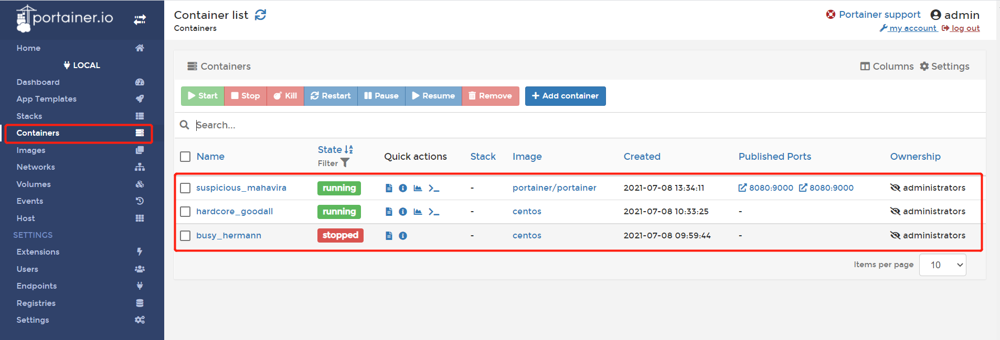

  - Rancher（CI/CD）


#### 1.4.1.3、Docker命令框架图

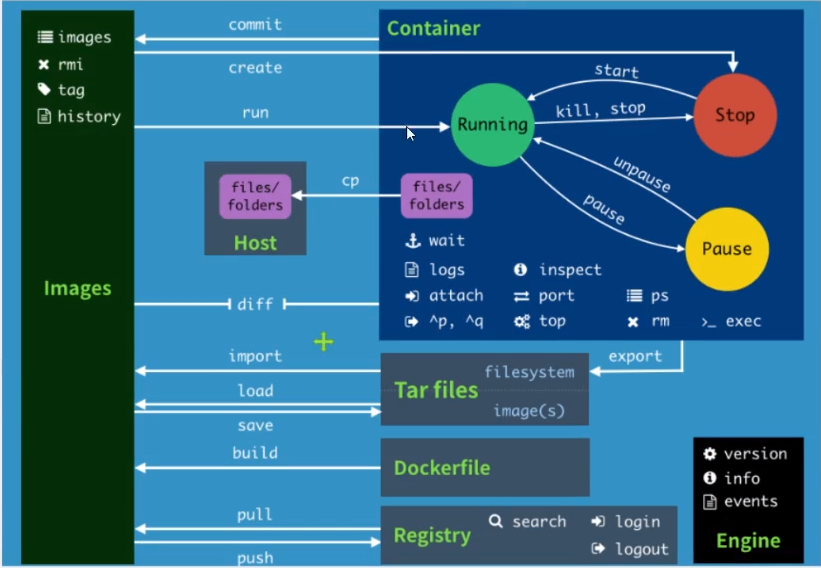


### 1.4.2、Docker使用MySQL

- **安装**

  - docker search mysql

  - docker pull mysql （默认安装latest版本）

    （注意：安装的latest的mysql，使用较低版本的navicat是无法登陆，需要更新navicat版本）

- **启动Mysql**

  MySQL默认端口：3306

  - **命令：**

    docker run --name mysql04 -e MYSQL_ROOT_PASSWORD=123456 -d -p 5001:3306 mysql 

  - **解释：**

    - --name：为这次启动的mysql起别名；
    - -e：设置MySQL启动时的环境变量（默认参数），启动时必须配置密码，否则无法连接MySQL数据库
    - MYSQLROOT_PASSWORD：mysql登陆密码；
    - -d：后台运行（daemon）；
    - **-p 5001:3306**  ：将docker容器的端口映射到Linux系统的端口上。mysql的映射端口：**linux为5001，docker为3306**。因此，使用Navicat连接MySQL时，连接端口为Linux的5001端口（而不是Docker的3306端口）
    - mysql：启动的docker镜像（真实的应用名称）


### 1.4.3、Docker安装Redis

#### 1.4.3.1、搭建Redis单机

安装、启动Redis的方式，参见安装MySQL步骤.

Redis默认端口：6379

- 启动

  - 命令：docker run --name redis01 -d -p 4000:6379 redis


#### 1.4.3.2、搭建Redis集群

- **创建redis节点**

  通过shell脚本的方式启动集群，并且采用自定义网络来连接redis各个节点。

  eg：脚本名：create-redis-clusters.sh

  ```shell
  #!/bin/bash
  # 创建网卡
  docker network create redisNet --subnet 172.38.0.0/16
  
  # 通过脚本创建六个redis配置
  for port in $(seq 1 6); \
  do \
  # 挂载数据卷、配置redis
  mkdir -p  ~/redis-cluster-documents/redis-cluster-data/redis/node-${port}/conf
  touch  ~/redis-cluster-documents/redis-cluster-data/redis/node-${port}/conf/redis.conf
  cat << EOF > ~/redis-cluster-documents/redis-cluster-data/redis/node-${port}/conf/redis.conf
  port 6379
  bind 0.0.0.0
  cluster-enabled yes
  cluster-config-file nodes.conf
  cluster-node-timeout 5000
  cluster-announce-ip 172.38.0.1${port}
  cluster-announce-port 6379
  cluster-announce-bus-port 16379
  appendonly yes
  EOF
  
  # 在docker中启动redis节点
  docker run -p 637${port}:6379 -p 1637${port}:16379 --name redis-${port} \
  -v ~/redis-cluster-documents/redis-cluster-data/redis/node-${port}/data:/data \
  -v ~/redis-cluster-documents/redis-cluster-data/redis/node-${port}/conf/redis.conf:/etc/redis/redis.conf \
  -d --net redisNet --ip 172.38.0.1${port} redis:5.0.9-alpine3.11 redis-server /etc/redis/redis.conf
  done
  
  exit 0
  ```

  

- **启动集群**

  启动所有节点后，进入redis-1节点

  ```shell
  # 进入redis-1节点：redis默认没有bash
  docker exec -it redis-1 /bin/sh 
  
  # 创建redis集群
  redis-cli --cluster create 172.38.0.11:6379 172.38.0.12:6379 172.38.0.13:6379 172.38.0.14:6379 172.38.0.15:6379 172.38.0.16:6379  --cluster-replicas 1
  
  # 进入redis-1节点的redis客户端工具
  redis-cli -c 
  
  # 查看集redis群信息、节点信息
  cluster info
  cluster nodes
  
  # 清理当前连接的节点下的所有slot  
  cluster flushslots
  ```

  

- **关闭、删除redis集群**

  通过脚本，停止、删除redis节点容器，并删除自定义的docker network网络

  eg：脚本名：delete-redis-clusters.sh

  ```shell
  #!/bin/bash
  # 删除已创建的redis容器
  for port in $(seq 1 6); \
  do \
  echo "stop :"
  docker stop redis-${port}
  echo "remove :"
  docker rm redis-${port}
  done
  
  # 删除网卡（先删除容器，才能卸载网卡）
  echo "remove docker network: "
  docker network rm redisNet 
  
  exit 0
  ```

  


### 1.4.4、Docker安装RabbitMQ

- **安装**

  - rabbitmq**（带web界面）**：docker pull **rabbitmq:management** 

  - rabbitmq**（没有web界面）**：docker pull **rabbitmq**

    

- **启动**

  - **命令：**

    docker run -dit --name Myrabbitmq -e RABBITMQ_DEFAULT_USER=admin -e RABBITMQ_DEFAULT_PASS=admin -p 15672:15672 -p 5672:5672 **rabbitmq:management**

  - **解释：**

    - Myrabbitmq：设定此次启动容器的别名

    - RABBITMQ_DEFAULT_USER=admin：设定用户名

    - RABBITMQ_DEFAULT_PASS=admin：设定密码

    - -p 15672:15672：设定浏览器登陆web端口

    - -p 5672:5672：设定客户端端口（springboot中.yml配置的端口）

    - **rabbitmq:management**：此次启动的docker镜像（真实的应用名称）

      

  - **检测是否成功启动：**

    使用浏览器的web界面，IP + 端口15672

    


# 2、Docker进阶

## 2.1、容器的数据卷

**实现容器和宿主机数据共享**，将容器中的数据同步至宿主机保存。以防止容器被删除后，数据丢失。本质上就是：将宿主机的文件夹挂挂载到容器中。

- **实现方式：**

  - **-v命令**

    docker run -it -v 宿主机绝对路径**:**容器绝对路径 容器名 bashshell

    若容器中不存在文件夹，会自动新建该文件夹。注意，**必须在启动新容器时，才能进行-v挂载操作**。

    eg：

    - 挂载MySQL的配置文件、数据存放文件

      ```shell
      docker run \
      -d \
      -p 3306:3306 \
      -v /home/chris/mysql/conf:/etc/mysql/conf.d \
      -v /home/chris/mysql/data:/var/lib/mysql \
      -e MYSQL_ROOT_PASSWORD=123456 \
      --name mysql01 mysql:5.7
      ```

    - 使用docker inspect 容器id查看结果

      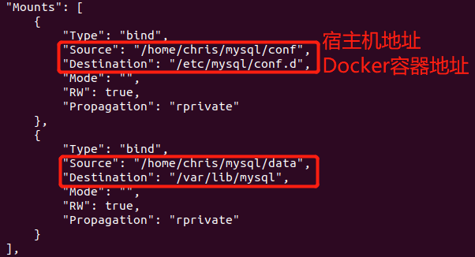

- **挂载类型**

  - **匿名挂载**

    不指定容器所挂载文件的别名

    - 命令

      ```shell
      docker run -d -P --name nginx01 -v /etc/nginx nginx
      ```

      

    - 查看容器的卷

      - 方式一：

      ```shell
      docker volume ls
      ```

      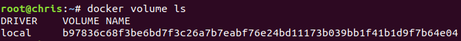

      - 方式二：

      ```shell
      docker inspect 容器id 
      ```

      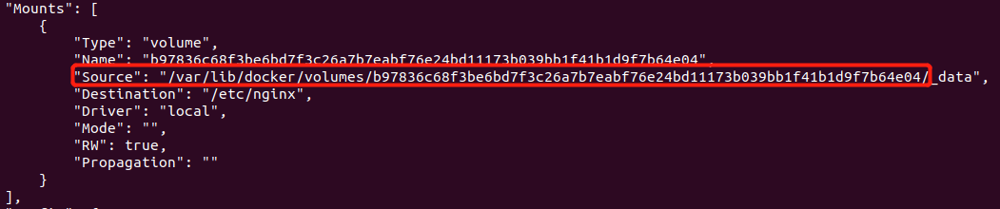

      

    - 查看宿主机的挂载位置

      若未指定挂载宿主机的位置，默认挂载在宿主机的/var/lib/docker/volumes

      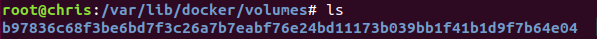

      

  - **具名挂载**

    指定容器所挂载的文件别名

    - 命令：

      取别名为juming-nginx

      ```shell
      docker run -d -P --name nginx02 -v juming-nginx:/etc/nginx nginx
      ```

    

  - **指定路径挂载**（常用）

    此时，使用docker volume ls无法查看卷。只能使用  **docker inspect 容器id**  查看。

    ```shell
    docker run \
    -d \
    -p 3306:3306 \
    -v /home/chris/mysql/conf:/etc/mysql/conf.d \
    -v /home/chris/mysql/data:/var/lib/mysql \
    -e MYSQL_ROOT_PASSWORD=123456 \
    --name mysql01 mysql:5.7
    ```

    

## 2.2、数据卷容器

和容器的数据卷功能类似，都是实现文件挂载。但，**数据卷容器是用于共享多个容器的数据卷**。

通过命令   **--volumes-from 容器名**  ，共享其他容器的数据卷。并且该数据卷是通过复制的方式来实现数据共享的（**<font color='red'>通过将容器的数据写入宿主机的数据卷（共享文件）中，实现数据持久化、各个容器间的数据共享</font>**），因此其中一个容器若出现宕机，不会影响数据卷中的数据，其他容器依旧可以访问该数据卷中的数据。当宕机的容器恢复后，可自动获取数据卷的最新数据。

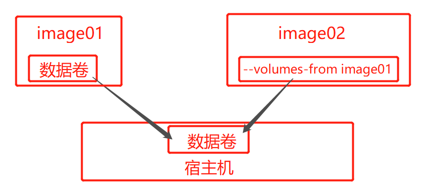

- **示例：**

  -  多个mysql实现数据共享

    ```shell
    #mysql01
    docker run -d -p 3306:3306 -v /home/mysql/conf:/etc/mysql/conf.d -v /home/mysql/data:/var/lib/mysql -e MYSQL_ROOT_PASSWORD=123456 --name mysql01 mysql:5.7
    
    #mysql02
    docker run -d -p 3307:3306 -e MYSQL_ROOT_PASSWORD=123456 --name mysql02 --volumes-from mysql01  mysql:5.7
    
    ```

    

  - 共享两个ubuntu的文件夹：sharefile

    ```shell
    #开启image01容器，挂载sharefile文件至宿主机中
    docker run -it --name image01 -v /sharefile ubuntu /bin/bash
    
    #开启image02容器，并挂载image01容器的共享文件夹
    docker run -it --name image02 --volumes-from image01  ubuntu /bin/bash
    
    #查看共享的文件夹
    ls    #可显示sharefile文件
    ```

    

## 2.3、DockerFile

Docker File用来构建docker镜像的构建文件，本质就是shell脚本。

Docker官方**默认的Docker File文件名为：Dockerfile**，在使用时，可以不用通过-f指定文件路径，即可自动加载当前目录中的Dockerfile文件。


- **Dockerfile文件的命令：**

  Dockerfile所有名的指令都需要大写。**每一条指令都是镜像的一层**。

  - FROM

    基础镜像，从此处开始构建

  - MAINTAINER			

    镜像的作者

  - RUN					

    镜像构建的时候需要运行的命令。可为镜像安装某些软件

  - ADD					

    用于添加文件至镜像中。

    格式：添加内容 添加至镜像中的某个目录

  - WORKDIR				

    镜像的工作目录

  - VOLUME				

    挂载目录，指定需要将容器中的哪些文件夹挂载至宿主机（若，未填写宿主机挂载路径，则默认挂载至宿主机的/var/lib/docker/volumes）

  - EXPOSE				

    配置镜像对外暴露的端口

  - CMD					

    指定这个容器启动的时要运行的命令，只有最后一个会生效，可被替代。

    ```shell
    FROM centos
    #这个CMD会被覆盖：无法执行
    CMD ["ls","-a"]
    #只有这个CMD会被执行
    CMD ["ps","-a"]
    ```

    

  - ENTRYPOINT	（和CMD类似）	

    指定这个容器启动的时要运行的命令，可以追加命令

  - ONBUILD				

    当构建一个被继承 DockerFile 这个时候就会运行ONBUILD的指令，触发指令。
  
  - COPY				
  
    将文件拷贝到镜像中（类似于ADD）
  
  - ENV					
  
    构建的时候设置环境变量
  
  

## 2.4、制作、发布自己的镜像

在centos镜像上，制作一个Tomcat镜像

**前提：**准备的资料都放在同一个目录中

- README文件
- jdk-8u231-linux-x64.tar.gz
- apache-tomcat-9.0.35.tar.gz


1. 编写一个Dockerfile文件

   ```shell
   #基础镜像
   FROM centos	
   
   #作者
   MAINTAINER chrisZhang<1294550676@qq.com>
   
   #复制文件：从宿主机的当前目录， 复制README文件至容器中/usr/local/README
   COPY README /usr/local/README 
   #复制解压：从宿主机的当前目录， 解压后，复制至容器中/usr/local/ 
   ADD jdk-8u231-linux-x64.tar.gz /usr/local/ 
   #复制解压：从宿主机的当前目录， 解压后，复制至容器中/usr/local/
   ADD apache-tomcat-9.0.35.tar.gz /usr/local/ 
   
   #镜像中安装vim工具
   RUN yum -y install vim
   
   #设置环境变量
   ENV MYPATH /usr/local
   ENV JAVA_HOME /usr/local/jdk1.8.0_231 
   ENV CATALINA_HOME /usr/local/apache-tomcat-9.0.35 
   ENV PATH $PATH:$JAVA_HOME/bin:$CATALINA_HOME/lib 
   #设置工作目录：-it 进入容器后，默认的当前路径
   WORKDIR $MYPATH
   
   #设置镜像对外暴露的端口
   EXPOSE 8080 
   
   #设置默认命令：  &&：与，用于拼接多个命令
   CMD /usr/local/apache-tomcat-9.0.35/bin/startup.sh && tail -F /usr/local/apache-tomcat-9.0.35/logs/catalina.out 
   ```

   

2. docker build ：构建一个镜像

   **注意：下面的命令最后都有 `.`**    若不没有添加该部分，就会导致build失败。

   - 若编写的Docker File文件名，不为：Dockerfile

     ```shell
     # -f, 指定使用的DockerFile文件
     # -t, 指定构建的镜像名：版本号
     docker build -f DockerFile文件的路径 -t mytomcat:0.1 .
     ```

     

   - 若使用默认文件名：Dockerfile

     ```shell
     docker build -t mytomcat:0.1 .
     ```

     

3. docker run：运行自己构建的镜像

   ```shell
   docker run \
   -d \
   -p 8080:8080 \
   --name tomcat01 \
   -v /home/chris/build/tomcat/test:/usr/local/apache-tomcat-9.0.35/webapps/test \
   -v /home/chris/build/tomcat/tomcatlogs/:/usr/local/apache-tomcat-9.0.35/logs \
   mytomcat:0.1
   ```

   

4. docker push发布镜像（DockerHub 、阿里云仓库)

   - **发布至DockerHub**

     Docker-Hub： https://hub.docker.com/

     - 宿主机命令行登陆Docker

       ```shell
       docker login -u DockerHub的ID
       # 之后会提示输入密码
       ```

       

     - 若，发布的镜像没有添加自己的DockerHub ID，需要使用 tag 添加

       **即：最终发布的镜像全名为：DockerHub ID/镜像名:版本号**
   
       ```shell
       docker tag 镜像ID DockerHub的ID/镜像名:版本
       # 若，版本不填写，则默认查找latest最新版，但是一般都找不到的
       ```

       

     - 推送至DockerHub
   
       ```shell
       docker push DockerHub的ID/镜像名:版本
       ```

       

   - **发布至阿里云仓库**

     阿里云仓库：https://cr.console.aliyun.com/repository/
   
     ```shell
     ######################    参考示例    ######################
     
     docker login --username=阿里云ID registry.cn-shenzhen.aliyuncs.com
     docker tag [ImageId] registry.cn-shenzhen.aliyuncs.com/dsadxzc/cheng:[镜像版本号]
     # 修改id 和 版本
     docker tag a5ef1f32aaae registry.cn-shenzhen.aliyuncs.com/dsadxzc/cheng:1.0
     # 修改版本
     docker push registry.cn-shenzhen.aliyuncs.com/dsadxzc/cheng:[镜像版本号]
     ```
   
      

# 3、Docker高级

## 3.1、Docker网络

### 3.1.1、Docker中容器的虚拟设备接口

每启动一个docker容器，docker就会给docker容器分配一个网卡ip，就会有一个docker0桥接模式，使用的技术是veth-pair技术（**虚拟设备接口**）。**也会在宿主机上创建 veth27fa178@ifxx 虚拟设备接口ip，这个序号和docker容器中的<font color='red'>网卡ip是成对出现</font>。用于docker容器和宿主机之间的通信。**


**eg：**

- 启动tomcat，命令：docker run -it --name tomcat01 tomcat /bin/bash

- 查看容器的虚拟设备接口：ip addr

- 查看宿主机的虚拟设备接口：ip addr （ifconfig也可以）

- **结论：**（看宿主机）

  - **47**：对应Docker中tomcat容器的虚拟设备接口

  - **veth27fa178@if46**：为Docker给宿主机分配的虚拟设备接口

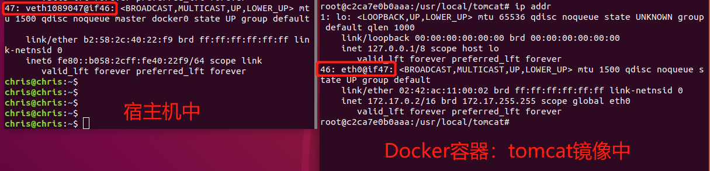


### 3.1.2、Docker的网络结构

所有的容器不指定网络的情况下，都是docker0路由的，docker会给的容器分配一个默认的可用ip。

**eg：**

开启两个tomcat，测试两者是否能够相互ping通

- **命令：**

  准备两个终端

  ```shell
  #终端1
  #启动tomcat01
  docker run -it --name tomcat01 tomcat /bin/bash
  #获取ip
  ip addr
  #ping
  ping tomcat02虚拟设备接口地址
  
  
  #终端2
  #启动tomcat02
  docker run -it --name tomcat02 tomcat /bin/bash
  #获取ip
  ip addr
  #ping
  ping tomcat01虚拟设备接口地址
  ```

- **结论：**

  tomcat01和tomcat02公用一个路由器，docker0。

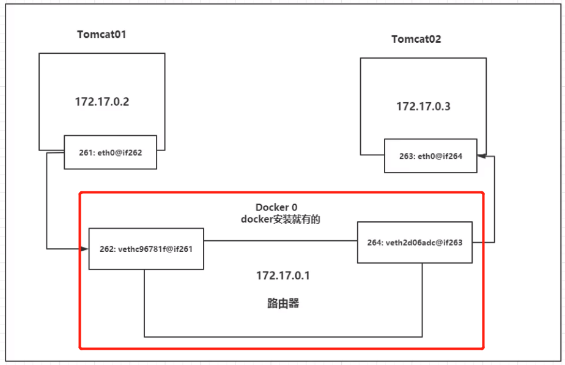

### 3.1.3、Docker网络常用命令

- -link

  本质就是在hosts配置中添加映射，现在使用Docker已经**不建议使用**–link了。

  **应用：**当容器访问某个域名时，可转至某个ip（即：不需要使用ip取访问应用，因为ip可能会变，但是域名一般不变化）

  ```shell
  #测试用例
  docker exec -it tomcat02 ping tomca01   # ping不通
  ping: tomca01: Name or service not known
  
  # 运行一个tomcat03 --link tomcat02 
  docker run -d -P --name tomcat03 --link tomcat02 tomcat
  
  # 用tomcat03 ping tomcat02 可以ping通
  docker exec -it tomcat03 ping tomcat02
  ```

  

- docker network ls

  查看所有的docker网络

  - **网络模式**

    - bridge ：桥接 docker（默认，自己创建也是用bridge模式）

    - none ：不配置网络，一般不用

    - host ：和所主机共享网络

      

  - 使用 docker network ls的结果：

  | NETWORK ID   | NAME   | DRIVER | SCOPE |
  | ------------ | ------ | ------ | ----- |
  | 440c39627077 | bridge | bridge | local |
  | b0b648b77700 | host   | host   | local |
  | e1f49181e053 | none   | null   | local |


- **<font color='red'>创建自定义网络（网卡）</font>**

  即：不使用默认的Docker0路由网段（172.17.0.0开头）

  命令：docker network create --driver 网络模式 --subbet 子网掩码 --gateway网关  网卡名

  ```shell
  # --driver网络模式 |  --subnet子网掩码  |  --gateway网关  |  mynet自定义的网络名（网卡名）
  docker network create --driver bridge --subnet 192.168.0.0/16 --gateway 192.168.0.1 mynet
  ```

  

### 3.1.4、Docker容器间的网络连通

不使用-link指定修改容器的host文件，根据域名跳转指定的IP。

**这里采用自定义网络路由的方式实现容器之间的相互访问（通过容器名相互访问，而不是直接通过容器的虚拟设备接口IP来访问）**

```shell
#自定义网络（网卡）
docker network create --driver bridge --subnet 192.168.0.0/16 --gateway 192.168.0.1 mynet
	#（可选）在宿主机上使用ip addr、ifconfig查看：可知有一个新的网卡
	ip addr 、 ifconfig
	# 结果：
	# br-38502ae31f16: inet 192.168.0.1

#创建新的tomcat-net-01容器：并指定其网络（虚拟设备接口）为：mynet
docker run -d -P --name tomcat-net-01 --net mynet tomcat
	#（可选）通过ip addr可查看该容器的虚拟设备接口IP
	docker exec -it tomcat-net-01 /bin/bash
	ip addr
	#结果：inet 192.168.0.3/16

#创建新容器tomcat01
docker run -d -P --name tomcat01 tomcat
#tomcat01容器新增虚拟设备接口：已经启动的tomcat01容器，新增虚拟设备接口：mynet
docker network connect tomcat01 mynet
	#（可选）通过ip addr查看tomcat01的虚拟设备接口
	docker exec -it tomcat01 /bin/bash
	ip addr
	#结果：（有两个虚拟设备接口）
	#46: eth0@if47: inet 172.17.0.2/16
	#53: eth1@if54: inet 192.168.0.2/16

#尝试ping两个容器（通过容器名来ping，而不是容器的虚拟设备接口IP）
docker exec tomcat-net-01 ping tomcat01

```


## 3.2、Docker Compose


## 3.3、Docker Swarm


## 3.4、Jenkins

- **DevOps**

  - DevOps（Development、Operations，开发、运维）

    是一组过程、方法与系统的统称，用于促进开发、技术运营和质量保障（QA）部门之间的沟通、协作与整合。

  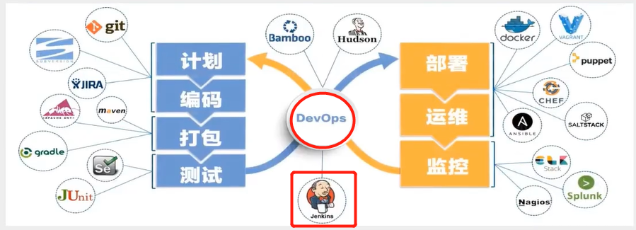

  

  - 与瀑布模型、敏捷开发的区别：

  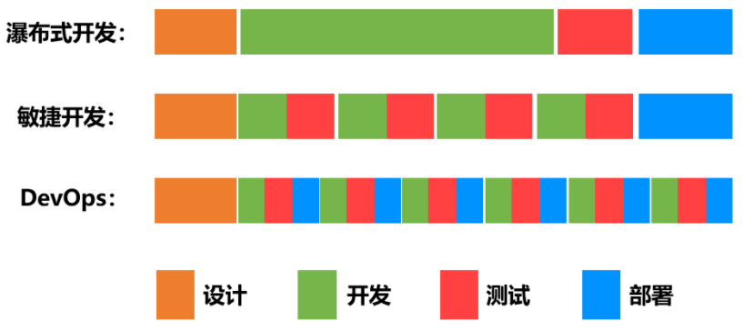

  

- **Jenkins**

  - **概念**：

    CI/CD：continuous delivery、continuous integration，持续集成、持续交付

    - CI：

      是一种软件开发时间。持续集成强调**开发人员提交了新代码之后，立刻进行构建、（单元）测试**。根据测试结果，可以确定新代码和原有代码能否正确地集成在一起。

    - CD：

      是在持续集成的基础上，将集成后的代码部署到更贴近真实运行环境(类生产环境)中。比如，完成单元测试后，可以把代码部署到连接数据库的Staging环境中更多的测试。如果代码没有问题，可以继续手动部署到生产环境。

    

  - **作用：**

    Jenkins是CI工具。主要用于持续、自动的构建/测试软件项目、监控外部任务的运行。Jenkins用Java语言编写，可在Tomcat等流行的servlet容器中运行，也可独立运行。通常与版本管理工具(SCM)、构建工具结合使用。常用的版本控制工具有SVN、GIT，构建工具有Maven、Ant、Gradle。

  

  - **代码开发 -》 打包-》 部署的流程：**

    开发人员只需在Git上提交代码，Jenkins即可自动完成编译、打包操作。基于DockerFile、Docker-compose.yml文件进行镜像打包、推送镜像至Docker仓库。服务器拉取镜像后，可完成自动部署。

    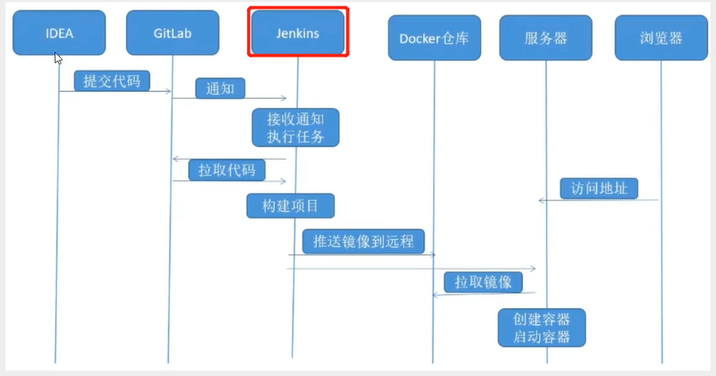


