# 1、TCP/IP

##　1.1、基本概念

- 全双工（数据再两个方向上独立传输）、面向连接的、字节流传输服务；

- 插口对：1个IP地址 + 1个端口；

- **TCP/IP七层模型**

  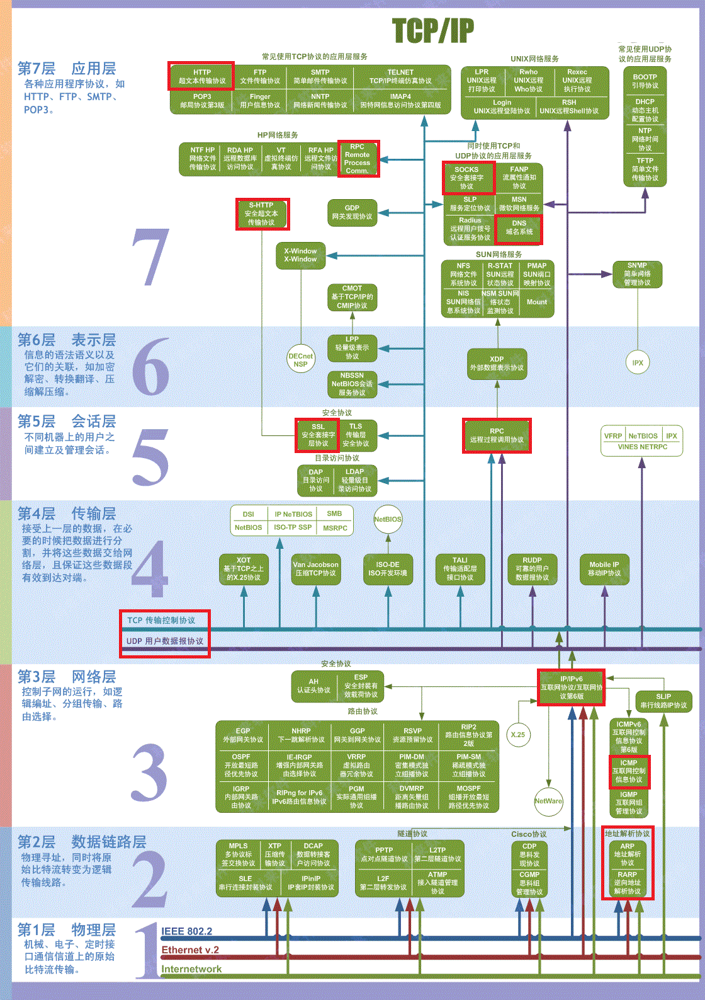

## 1.2、TCP可靠性的保证

-  **校验和**

  （TCP中一定需要校验，UDP的校验是可选的）

  - 在计算时添加12Byte的伪首部。
  - 校验的范围：TCP首部 + 数据。
  - 计算方法：发送方把报文分成多个16bit的段，把所有段的进行反码计算，然后相加，存放在校验和字段中。接收方用相同的方法计算，如果最终得到的校验字段所有位都 = 1，说明数据正确。

- **序号：**

  - 对所有数据进行编号，用来统计发送了多少数据；

  - 作用：
    - 保证可靠性：当接收方接收的数据少了某个序号，就可以发现数据缺失；
    - 提升发送效率：可以多次发送数据，只进行一次确认；
    - 去除重复数据：数据传输时的确认应答处理、重发机制可以通过序号实现。

- **确认应答机制（ACK）**

  采用标志位ACK，确认接收方是否收到数据。如果发送方在一段时间内没有收到接受对方的ACK，就会启动超时重传机制；

- **超时重传：**

  发送数据时，启动一个定时器**，等待接收端收到这个报文后返回一个确认位，如果超过这个定时时间还没有收到确认位，就再次重发这个消息；

- **连接管理机制**

  - 三次握手

  - 四次挥手

- **窗口控制**

  TCP可以进行流量控制，TCP连接的每个客户端都有固定大小的缓存空间，TCP客户端只允许接收缓存区能够收纳的数据量：**防止较快主机发消息过快，导致较慢主机的缓存区溢出、数据丢失**；

## 1.3、TCP的首部结构

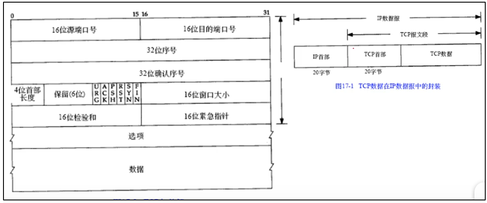

- **源端口号：**

  表示发送端的端口号；

- **目标端口号：**

  接收端端口号，一个server端能够创建的TCP连接数：16bit = 2^16 = 0~63335个连接；  

  （和源端口组成一个唯一的TCP连接）

- **序号**seq：

  表示发送数据的位置，每发送一次就累加一次该数据的字节数大小，用来标记数据段的顺序。序列号不从0、1开始，而在建立连接时生成的随机数，通过SYN包发送过去，每次发送过去的数据累积到初始值上。每次发送的SYN、FIN包都会累加一个字节的数据到序号上。

  **作用：**统计这个机器发送了多少数据

- **确认序号**Ack：

  表示下一次应该收到数据的序号，在这个确认序号之前的数据都已经正常接收**，因此：确认序号 = 该段报文最后一个字节编号 + 1 ；

- **保留：**

  为了后面扩展使用，长度 = 6bit，默认都是0；

- **标志位：**

  - URG：紧急指针
  - **ACK**：确认接收到消息，即: 确认序号有效
  - PSH：接收方尽快把这个报文交给应用层
  - RST：重新连接
  - **SYN**：同步序号，用来发起一个连接
  - **FIN**：断开连接时使用，表示发送端完成数据发送
  - CWR：拥塞窗口减小，通知接收方，已经将拥塞窗口减小；
  - ECE：表示网络拥塞

- **窗口大小：**

  表示从确认序号所指位置开始，能够接收的最大数据大小，而且**发送端发送的消息在这个长度内，可以不用等待接收端的确认消息，直接把消息发送出来即可**（发送端不允许发送超过这个窗口大小的数据，**解决：确认序号返回时间长的问题**）。如果窗口 = 0，表示发送窗口大小检测，获取最新窗口大小；

  - **窗口最大**16bit = 2^16 - 1 = 65535字节
  - **窗口的分类：**
    - 通告窗口（滑动窗，针对于接收方）
    - **拥塞窗口（针对于发送方）**

- **校验和**

  发送端将校验和字段设为0，然后进行补码计算（结果为OX FFFF），接收端接收到数据后，获取TCP首部数据，计算校验和，得到的数据为OXFFFF，则说明接收的数据正确；

- **紧急指针：**

  当且仅当紧急标志位URG = 1时才会生效，**紧急指针指向紧急数据的尾部**（应用程序知道紧急数据的起始位置，但是TCP中不会指出紧急数据的起始位置）。当接收端接受数据时，URG = 1，说明需要优先处理紧急指针指向的数据。

- **选项：**

## 1.4、**TCP的相关机制**

### 1.4.1、**确认应答机制：**ACK

接收端接收到发送端的消息时，接收端会返回一个已收到的消息给发送端，到苏发送端已经收到消息。当发送端发送消息后，在一段时间内（一般是200ms）没有收到接收端的确认消息，就重新发送该消息；

 

### 1.4.2、**超时重发**

发送端发送数据后，超过一段时间（一般是200ms）后，没有收到接收端的确认序号，就会从新发送这条消息。

- **超时时间的计算：**

  一般是找到一个最小的时间，保证“确认序号”一定能够在这个时间内返回，由于网络情况不同，为了保证超时重发，在每次发送数据时都会计算**报文的往返时间**（**RTT**，round trip time），以及偏差。

- **超时时间** **= RTT +** **偏差；**

 

### 1.4.3、**序号机制**

- “确认应答机制”、“消息重发机制”都可以通过序号实现。

- 接收端在接收消息时，**通过查询****TCP首部中的序号、窗口大小（数据长度），获取到对应的数据**，并且**把自己下一步需要接受到数据的序号作为应答号返回给发送端**。（也就是确认序号，保证了TCP数据传输的可靠性）

 

### 1.4.4、**最大消息长度: MSS**

（MSS：maximum segment size）在TCP建立连接时的3次握手中计算得到（取发送端和接收端可以接收数据的最小值）.

- **发送端：**在TCP首部添加自己可以接收最大的消息长度；（此时：TCP头部 = 20 + 4 = 24bit）
- **接收端：**接收到连接请求，也在TCP首部添加自己能够接收最大的消息长度；（此时：TCP头部 = 20 + 4 = 24bit）
- **发送端：**接收到消息，**取“发送端”、“接收端”可以接收消息的最小值作为**MSS；

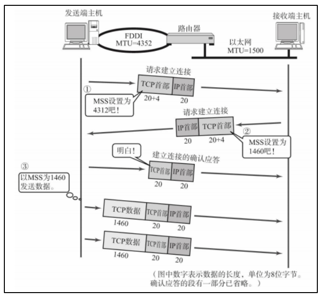

### 1.4.5、**窗口控制**

- **使用窗口控制的原因：**

  TCP发送消息时，以1个段为单位去发送消息，但是当接收方的确认序号返回时间较长时，发送端就需要一直等收到确认序号后，才能继续发送下一个消息，这样容易导致TCP通信性能下降。

 

- **原理：**

  发送端可以发送窗口指定大小的数据，在这个大小范围内的数据，发送端不需要等到接受方返回的确认序号，可以一直发送**，当收到接受方的确认序号之后就可以将窗口右移，以便获取发送数据（类似于滑动窗口的概念，**用一个固定大小的窗口去遍历等待发送的数据）

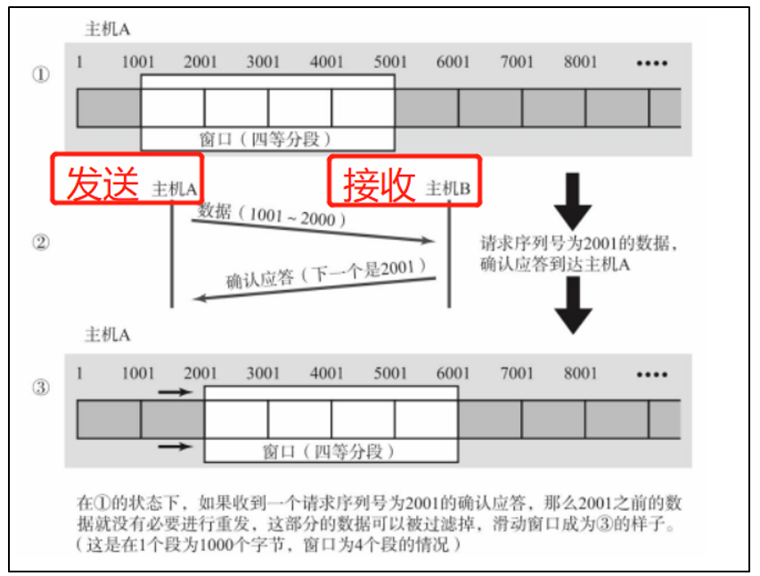

- **具体应用：**

  - **流量控制：**

    可以使用窗口控制实现**“流量控制”**，本质上：就是规定发送端能发送的数据大小 = 接收端可以接收数据的大小（MMS），在TCP首部中采用16bit的窗口大小来记录这个数值。

    **窗口大小越大：说明吞吐量越高**

   

- **窗口控制下的超时重发：**

  当某段报文丢失时，发送端会多次收到接收端的发来的同个确认序号，如果接收到同个确认序号超过3次，发送端就重新发送发数据

### 1.4.6、**拥塞控制: CWDN**

（cwnd，**congestion windows**）

基于窗口控制（**本质上，发送方的窗口就是拥塞窗**），发送端、接收端的数据传输不再以一个数据段为单位，不需要发一个数据一直等待确认序号。当发送端发送一个很大的数据包时，可能会使网络拥堵，为了防止这个现象，TCP采用**“慢启动”，**对发送的数据量进行控制。

（Nagle算法也时用于提高网络使用率）

 

- **造成网络拥塞的原因：**

  - **基本概念**

    - **通道容量（窗口大小）** = 带宽 * RTT

    - **带宽**：**指的是单位时间内通过链路的数据量，即：每秒可传速的位数，单位bps。**

  - **连路速度不相同时：**

    高速链路➡低速链路，由于高速链路的数据量大，低速链路无法在同一时间接收这些数据；

  - **链路汇聚时：**

    多条链路汇聚到一起，在汇聚的总链路上通道容量小无法接收这些数据；

 

- **慢启动：**
  - **原理：**

    - 通俗的讲：一开始时，发送方从最小的发送数据量开始增加，通过拥塞窗口来动态控制发送方发送的数据量，避免一建立TCP连接就发送大量的数据，导致网络堵塞。

      

    - 慢启动在发送方增加了一个窗口（拥塞窗口，cwnd），当另一个主机和发送端建立TCP连接时，**拥塞窗口初始化为一个报文段（大小和接收端报文段大小相同）**，之后发送方每接收到一个ACK，拥塞窗口就增加一个报文段长度。**发送方获取拥塞窗口和通告窗口（接收方的窗口大小）的最小值作为发送上限**。

      

    - **拥塞窗口：****发送方**的流量控制，本质上就是发送方TCP头部的窗口；拥塞窗口大小的增长数速度=2^n，因为第一次拥塞窗 = 1个报文段，第二次 = 2个报文段，第三次 = 2^2 = 4个报文段；用来限定发送方可以发送的数据数量。**

      

    - **通告窗口（滑动窗）**：接收方**的流量控制，本质就是接收方TCP头部的窗口；用来告诉发送方最多可以发送多少数据；

      

  - **作用：**

    避免发送方一开始就把一大包的数据发送出去，由于发送方和接收方之间存在路由器、速率慢的连路这会导致网络拥塞，其他的服务无法被使用。

- **Nagle**算法

  要求TCP连接上最多只有一个未被确认的包，在该包被确认之前不发送其他的小包，该算法收集这些小包，当发送端收到这个未确认包的确认序号后，将这些小分组发送出去。

  （这样可以减小这些小包的发送次数，但是增加了延时，因此对于时效性要求高场景不适合使用Nagle算法，eg：鼠标移动）

## 1.5、TCP中的定时器

- **超时重传定时器：**

  发送端在规定时间内，接收到接收端返回的确认序号；

  

- **坚持定时器：**
  - **应用场景：**当通告窗口更新确认数据丢失时，发送方、接收方有可能一直等待下去（发送方：等待接收方给定新的窗口大小； 接收方：等待发送发发过来的数据）；
  - **解决方法：**使用坚持定时器，定期获取接收方的窗口大小（窗口勘察）；

 

- **保活定时器：**

  检测一个空闲连接的另一端是否需要保持连接；

 

- **2MSL定时器**

  检测处于TIME_WAIT状态。

## 1.6、TCP吞吐量的限制因素

- 最快不能超过最慢链路的速度 

- 最快不能比最慢机器的内存速度快 

- 最快运行速率的上限是由TCP窗口大小和光速限制的。

  **公式：**带宽 = 窗口大小 / RTT 

## 1.7、TCP的3次握手

- **符号含义**
  - SYN：Sychnorize sequence numbers，同步位（同步序列编号），用来发起一个连接
  - ACK：Acknowledgement，确认收到（确认值）
  - Seq：Sequence，序号
  - Ack：Acknowledgement Number，确认序号
  - RST：重新建立连接

- **3次握手的流程**

  三次握手是为了建立可靠的通信信道，双方都确认自己和对方的发送和接受都是正常的。SYN=1 表 示这是个连接请求或连接接受报文，不携带数据。

  1. **客户端：**

     发起连接，发送TCP连接请求包，发送同步标志：SYN = 1，确认位ACK = 0（等待确认），序列号：seq = x；然后等待回复； 

  2. **服务器：**

     收到客户端连接请求，发送连接确认包，发送同步标志：SYN = 1，确认位ACK = 1（确认连接），序列号seq = y， 确认编号Ack = x + 1；

  3. **客户端：**

     接收到服务器返回数据，发送连接确认包，ACK = 1，seq = x + 1，Ack = y + 1；

  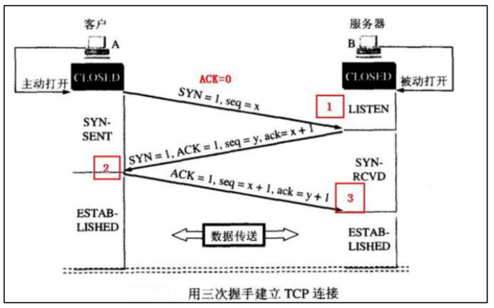

- 问题1：**建立连接时，SYN丢失，即：出现连接中断问问题**

  答：当服务端接收到客户端的SYN包，并且回复了SYN-ACK之后，客户端掉线，此时的连接状态处于尚未连接。服务端需要去重新发送SYN-ACK包，在linux中一共会重发5次，时间间隔为1、2、4、8、16s，第5次完成后还需要等待31s后，如果没有连接上，就断开TCP连接。

  

- 问题2：**为什么TCP是3次握手？**

  1. 本质上可以是4次握手，但是第二次握手时，服务端把确认序号Ack = x + 1和同步连接SYN = 1合并到一起发送给客户端。
  2. **如果采用****2次握手，可能会导致脏连接**，当出现网络延时，客户端发送的第一次握手在网络中被阻塞，由于超时，客户端再次发送SYN同步序号，此时服务端接收到了，并且回复客户端收到请求与之建立了TCP连接。但是之前被阻塞在网络中的握手请求到达服务端，此时服务端接收到连接请求，并且给客户端回复序号、重新建立TCP连接这就会可能导致目前正在传送的数据丢失。**
  3. TCP接收端收到数据时，不是立刻返回一个确认位**，通常会推迟200ms；**因为：**如果在等待的时间内，接收端有需要发送的消息，就顺带把确认序号也发送过去

## 1.8、**TCP的4次挥手**

- **各个标志位的含义：**
  - FIN：Final，终止连接标志
  - FIN-WAIT：终止等待
  - CLOSE-WAIT：关闭等待
  - LAST-ACK：
  - TIME-WAIT：

- 4次挥手流程

  1. **客户端：**

     主动发起关闭请求，发送终止连接标志FIN = 1，序列号seq = u，然后进入FIN-WAIT-1（终止等待1）；

  2. **服务器：**

     接收到客户端的终止请求，发送确认位ACK = 1，序列号seq = 1，确认编号Ack = u + 1；然后进入CLOSE-WAIT（等**待关闭，需要等待服务器的数据传输完，再关闭连接**）

  3. **服务器：**

     服务器的数据已经传输完毕，发送终止连接标志FIN = 1，确认位ACK = 1，序列号seq = w，确认值Ack = u + 1；然后进入LAST-ACK；

  4. **客户端：**

     收到服务端的关闭请求，发送确认位ACK = 1，序列号seq = u + 1，确认值Ack = w + 1；（此时TCP还没有断开连接）然后进入TIME-WAIT（等待2MSL，因为第四次发送的报文可能丢失，因此需要一定的时间等待重发丢失的报文）

  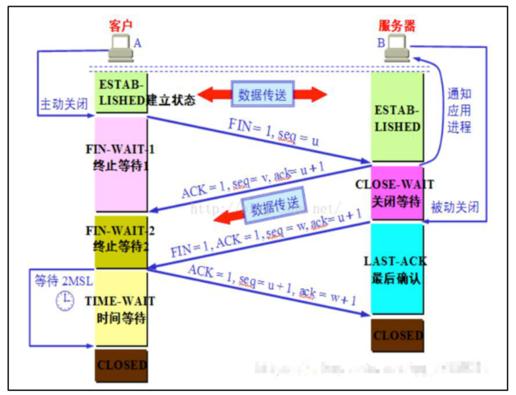

- 问题1：**为什么是4次挥手？**

  **A1:**因为TCP是全双工连接，因此需要关闭两个连接通道，每关闭一个通道就需要对方确认一次关闭

  

- 问题2：**TIME-WAIT等待时间的意义**？

  **A2:**

  1. **保证TCP能够被可靠的关闭**，因为第四次发送的报文可能丢失，因此需要一定的时间等待重发丢失的报文。
  2. 处于TIME-WAIT等待时，不允许去启动一个新的连接，这样可以防止先前的TCP继续进行

- 问题2：**2MSL时间有什么作用？**

  A3**：**

  1. TIME_WAIT状态称为2MSL状态，每个具体的TCP实现必须选择一个报文段的最大生成时间MSL（maximum segment lifetime），指的是任何报文被丢弃前，在网络内的最长时间，RFC793指定常用的MSL时间有30s、60s、120s等等。
  2. **2MSL**是为了保障在第四次挥手时，服务端能够收到客户端发送的ACK。服务端在第三次挥手时，发送了FIN包到客户端，假设由于网络延时，客户端第四次挥手时发送的ACK还没有到达服务端，服务端由于超时重发机制，将会再次执行**第三次挥手**（再次发送FIN包），客户端继续执行第四次挥手（此时从新计时2MSL）

## 1.9、**TCP发送消息时的数据包封装**

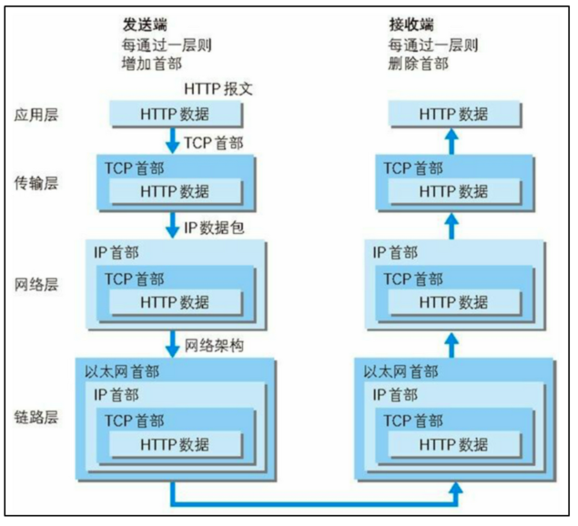

# 2、UDP

## 2.1、基本概念

- 和TCP一样属于传输层协议，在IP数据报文的基础上增加了复用、分用、差错检测；

- 属于无连接服务，只负责数据的收发，不负责确认数据是否被接收方接收；

- **应用场景：**

  **QQ视频、QQ中的TFTP（文件传输协议）**

## 2.2、UDP的首部结构

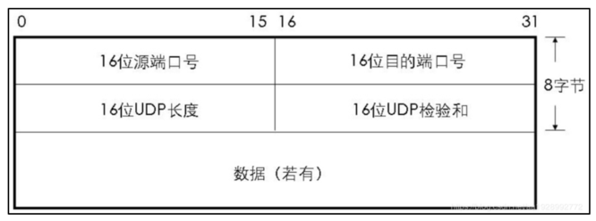

- 源端口号：

- 目的端口号：

- UDP长度：UDP数据包的长度

- UDP检验和：（可选）

  如果UDP数据包在传输过程中出错，可以直接丢弃该报文。

  eg：UDP传输过来的目的端口号不正确，接收方在接收数据时会丢弃该报文，并通过ICMP回复发送端“端口不可达”。

## 2.3、**UDP的优缺点**

- **优点：**

  - **UDP不存在拥塞窗口**

    因此，使用udp发送大的数据包时，容易导致网络拥塞，当网络状况较差时可能会出现网络奔溃。TCP就不会出现这个问题。

    所以，**UDP适合发送小的数据包**。eg：DNS

  - UDP由于没有拥塞窗、握手、确认、超时重传等机制，因此**传输速度比TCP更快**。

    

- **缺点：**

  不可靠，由于没有TCP的可靠机制，因此在网络状况较差时，容易导致数据丢失

# 3、HTTP

## 3.1、HTTP的请求格式

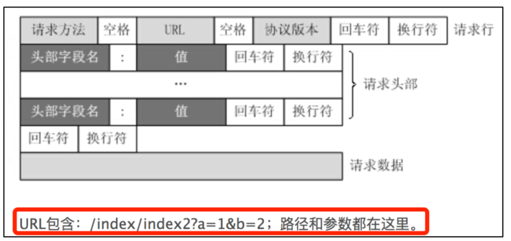

- eg：使用浏览器开发者工具就可以看到

  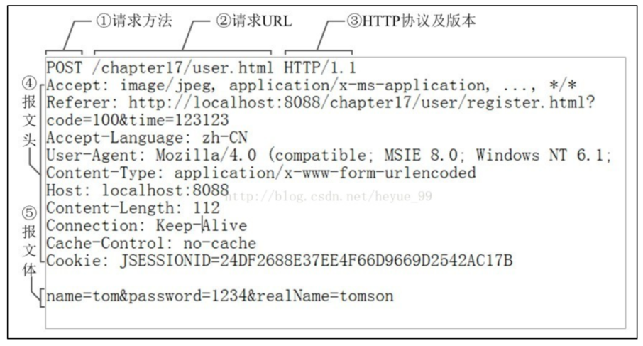

  1. **accept：**告诉服务器，客户端接收什么类型的数据

  2. **referer：**表示这次请求的请求来自于哪个URL。

     **eg：**使用谷歌搜索，输入‘百度’，在会的结果的页面的referer = ‘https://www.google.com.hk/’

  3. **accept-language：**客户端接收的语言

  4. **user-agnet：**客户端的浏览器和用户代理名等信息告诉服务器；

  5. **content-encoding：**说明报文的编码方式

     eg：gzip

  6. **content-type：**说明客户端发送的数据是什么格式的，

     **eg：**

     - text/html（html格式）
     - text/plain（纯文本）
     - image/gif（gif图片）
     - application/json（json格式）
     - application/pdf（pdf格式）
     - application/x-www-form-urlencoded：最常见的post提交表单的数据格式；
     - multipart/form-data：常见的post提交文件的数据格式；

  7. **host：**指定要请求资源的主机所在地址、端口；
  8. **connection：**管理客户端和服务端的持久连接，**keep-alive**保持连接（HTTP1.1后默认开启），Nginx中的keep-alive默认为60s，即**:HTTP的长连接会保持60s连接，60s后没有数据 传速就会关闭**HTTP连接；
  9. **cache-control：**缓存控制
  10. **cookie：**
  11. **authorization：**客户端的认证信息；可能会出现401：没有授权的错误代码；

## 3.2、HTTP响应格式

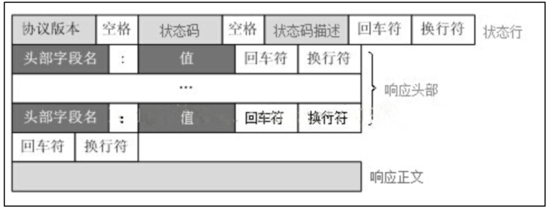

- eg：浏览器查看响应报文

  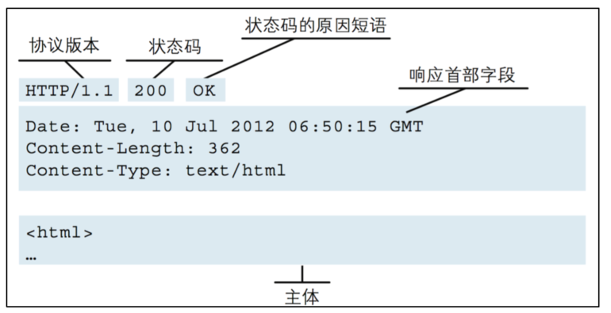

## 3.3、HTTP中常见的请求方式

- **GET**（查，获取）：量小，请求参数url可见，不安全。一般用于查找/获取资源。浏览器使用GET获取网络资源（URL）。

  GET请求数据组成：URL + ？ + 传输数据；（？用于分隔）

- **POST**（改，提交）：量大，请求参数url不可见，安全。一般用于更新资源；

- **PUT**（增、提交文件）：**传输文档数据**；

- **DELETE**（删）：

- **HEAD****：**和GET方法类似，但返回的响应中没有内容，**用于获取报文头**：确认URI的有效性及资源更新的日期时间等。

  - 判断类型； 

  - 查看响应中的状态码，看对象是否存在（响应：请求执行成功了，但无数据返回）；

  - 测试资源是否被修改过

- **OPTION**：用来查询这个URI获取资源的方法**。（客户端可以使用什么方法去请求这个URI）**
- **CONNECTON**：HTTP1.1中预留的可将连接改成管道的代理服务器

- **TRACE：**用来回显服务器收到的请求，可以用在测试和诊断

## 3.4、HTTP各个版本之间的区别

- HTTP0.9：
  - 是最早的HTTP版本，属于无状态链接；
  - 只能传输纯文本的数据；
  - 每次发送HTTP请求都需要附带本次请求所有的参数；
  - 没有状态码；

 

- HTTP1.0：

  - 可以传输任何形式的数据；

  - 增加了状态码、keep-alive、header、multi-part type、authorization、cache、content encoding；
  - 可以通过header来传输信息；

 

- HTTP1.1：

  - **新增 长连接：**

    - 在传输完数据后，不会进行四次挥手，而是保持这个通道连接，TCP链接可以被多个请求复用，当长时间不使用这个TCP链接会被自动关闭
    - 长连接默认开启，使用connection：keep-alive。一个TCP连接上可以传递多个HTTP请求，减少因为建立连接引起的延时。

    （**短连接：**和长连接定义相反）

  - **增加host处理**：支持虚拟主机，虚拟主机共享一个IP地址；

  - **缓存处理：**1.1中增加了更多的缓存策略：Entity tag、If-Match等；

  - 新增24个错误状态码：409、410

 

- HTTP2.0：
  - 使用多路复用：一次TCP连接可以处理多个请求。
  - 报文头压缩，减小开销，传输速度更快；
  - 增加推送功能；

## 3.5、HTTP、HTTPS区别

- **HTTP：**

  - 明文传输、无状态，端口为80，没有加密，不安全

  - 这里的无状态：**指的是两个不同HTTP请求之间，是不会保存之前已经发送的HTTP请求的信息（不是之401、500这种错误代码）**，即：如果在登陆界面使用的是HTTP请求，那么每次跳转页面都需要重新发送登陆。

    为了解决这种无状态问题，因此在HTTP中添加了Cookie、session技术；可以让浏览器获服务器记住之前的HTTP请求状态

- **HTTPS：**

  - 加密传输，端口为443，使用ssl加密，需要申请证书到ca；（ca：Certifi*ca*te Authority，证书颁发机构）

  - **优点：**

    使用SSL加密，信息安全性高；

  - **缺点：**

    - SSL加密需要用到ca证书，ca证书需要支付费用；
    - HTTPS，由于使用了SSL，因此在握手阶段还需要进行SSL握手，这就增加了整体的握手时间；

## 3.6、**浏览器访问URL的过程**

- **大致流程：**

  DNS解析 -》 TCP连接 -》 发送HTTP请求 -》 服务器处理请求并返回HTTP报文 -》 浏览器解析报文，渲染页面

- **详细步骤：**

  - DNS域名解析：将对应的域名（网站）解析成IP：

    1. 浏览器先根据自身的DNS缓存查找对应的域名，若存在直接使用这个域名对应的IP；

    2. 如果浏览器缓存的DNS失效，会去查找系统中缓存的DNS，如果找到就直接使用这个域名对应的IP；

       **windows中可以使用命令：ipconfig /displaydns查看DNS缓存**

    3. 如果系统中的DNS缓存也没找到，就尝试读取系统中的hosts文件（c:\Windows\System32\drivers\etc），查看是否有这个域名的IP，若存在就直接使用；

    4. 如果hosts文件中不存在，就会使用运营商提供的DNS服务器，搜索过程：运营商DNS --> 根域名服务器 --> 顶级域名服务器 --> 域名注册商服务器；

       

  - 发起TCP的3次握手：

    获得IP之后，浏览器会使用一个随机端口（1024-65535）向服务器的80端口发起TCP请求，可能需要经过Netfilter防火墙，简历TCP连接；

    

  - 发起HTTP请求：

    TCP连接后，浏览器发起HTTP请求，可以使用HTTP的GET、PUT、POST、DELETE等方法获取URL中的服务器的资源；

    

  - 服务器响应HTTP请求，并返回结果：

    HTTP返回的报文中，包含着HTTP状态码、数据等；

    

  - 浏览器解析得到的结果（eg：html），并且请求html中的资源（eg：js、css、图片）：

    浏览器获得服务器返回的报文后，如果遇到js、css、image等静态资源时，还需要向服务器请求下载这些资源，这是就是使用到HTTP中的keep-alive（私用多线程去下载资源）；

    

  - 浏览器渲染页面：

    浏览器获取资源后对静态资源、html文件进行渲染

# 4、SSL

## 4.1、SSL概念

（SSL：secure socket layer，安全套接层）

- **非对称加密：**

  指加密和解密使用的是两个不同的密钥，分为**公钥（给其他人公开使用）和私钥（自己保存）**。**（HTTPS开始时获取密钥的过程）**

  - 公钥加密的数据只能使用私钥解密；

  - 私钥加密的数据只能使用公钥解密；

    

- **对称加密：**

  加密和解密使用的密钥是同一份密钥；（HTTPS正常数据传输时，服务端、客户端解密对方传输数据的过程）

## 4.2、SSL加密过程（精简版）

- **详细流程**
  1. 服务器发送非对称加密的**公钥A** 给浏览器
  2. 客户端(SSL/TLS)解析证书（无效会弹出警告）；生成随机值(这个相当于传送数据的密钥)，作为对称加密的**密钥B（客户端解密的密钥）**。 
  3. 浏览器使用服务器的公钥A，对自己生成的对称加密密钥B 进行加密，得到**密钥C**。
  4. 浏览器将密钥C发送给服务器；
  5. 服务器使用自己的**私钥D**对接受的密钥C进行解密，得到对称加密**密钥B（服务端解密的密钥）**。 
  6. 服务端将信息和密钥B混合在一起进行对称加密，将加密的内容发送给客户端； 
  7. 客户端用密钥B解密信息

- **总结**

  - **服务端：**保存公钥（发送给客户端）和私钥（服务端自己留着）；

  - **客户端：**生成随机数 + 公钥，进行加密，得到服务端和客户端通信使用的最终加密、解密的**密钥F**。并且通过公钥加密密钥F，服务端使用私钥解密，获取密钥F。 
  - **服务端和客户端传输数据使用的加密、解密的密钥，来自于客户端通过公钥 + 随机数生成的密钥**

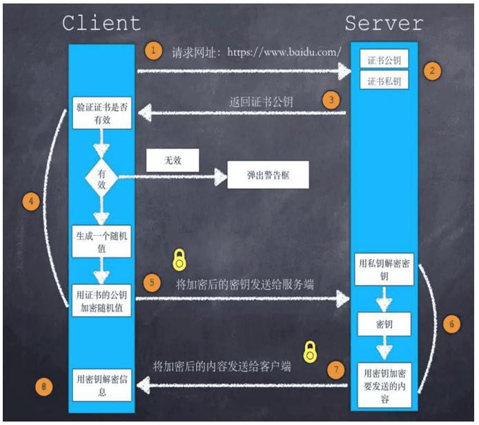

## 4.3、SSL加密过程（详细版）

**即：SSL的4次握手过程**

1. 客户端发出请求：向服务器发出通信加密请求，称为“ClientHello”；
2. 服务器回应：接收到客户端请求，给出回应，称为“ServerHello”；
3. 客户端回应：接收到服务端回应后，验证服务器证书，若出现证书过期，则会提示是否继续通信；
4. 服务器回应：服务器收到客户端的第三个随机数pre-master key后，计算生成本次会话的“密钥”。再向客户端通知编码方式、握手结束通知；

（注意：完成握手后，服务器、客户端之间的通信使用的是HTTP，只不过需要用“密钥”加密内容）；

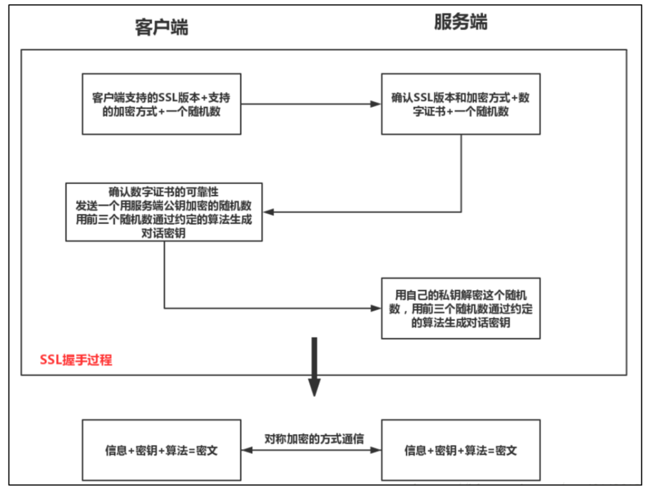

