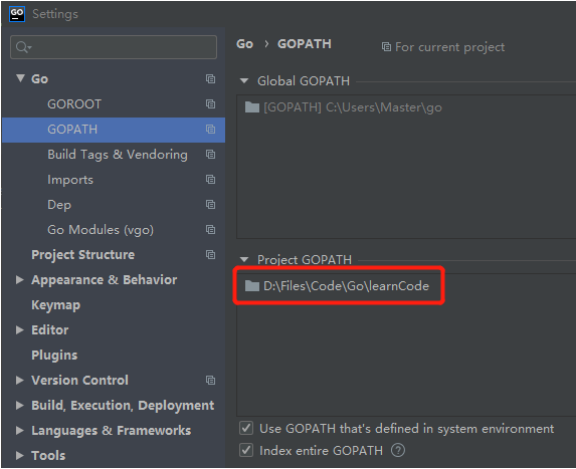

Go中文API手册：https://studygolang.com/pkgdoc

Go官方教程：https://tour.golang.org/welcome/1

# 1、Goland编译器使用

## 1.1、配置

1. 增加Gopath路径，添加自己工程的路径（以便能够import自己工程中定义的包，否则会出现包无法导入的问题）

   （若项目中使用第三方依赖包，，则Project GOPATH就不需要设置，否则会导致第三方依赖包无法被编译器找到）

   - Golbal GOPATH

     go env中已经配置，用于存储下载的第三方依赖包。包含：src、pkg、bin三个文件夹。

     路径：C:\Users\用户名\go\

     

   - Project GOPATH

     此工程的文件存放位置

   

2. 不使用Go Modules（若项目中使用第三方依赖包，则必须启用该项，并且设置代理，去下载第三方依赖包）

   


## 1.2、调用自定义包中的函数

**<font color='red'>问题：若不在src文件夹中新建package包存放新的.go文件，则无法在同一个包中调用其他类的方法，亦无法使用File方式运行.go文件。</font>**

**<font color='red'>解决方式</font>：这是由于Goland编译器的底层调用机制原因，导致无法调用同一个package包中其他类的方法。需要配置run configuration中的Run kind为Package模式，然后运行**。

1. 调用代码的地方

   

2. 被调用的代码

   

   

## 1.3、cmd命令

- `go build` 编译自身包和依赖包

- `go install` 编译并安装自身包和依赖包


## 1.4、常见问题

- Goland无法下载go.mod中的依赖包（或者下载依赖包超时）

  则需要设置Goland代理

  


- 全局搜索

  ctrl + shift + F

- 全局查找替换

  ctrl + shift + R


# 2、基本语法

Go中只有二元运算，不存在三元运算，例如Java中的：return  num = 3 ?  true ：false


## 2.1、数据类型

- **<font color='red'>Go数据之间的比较，必须是建立在两个数据类型相同的情况下，否则无法进行比较，未编译之前就报错</font>**
- **Go中不存在this、self等关键字**
- 数据输出printf：
  - %d：输出整数  （%02d：输出2位数长度的int数据）
  - %x、%X：输出十六进制形式的数据（不带0x）
  - %p：以十六进制形式的输出参数的地址（必须使用指针的形式传入才能打印，带0x）
  - %f：输出float数据（%.2f：保留2位小数输出）
  - %e：输出科学计数法格式
  - %s：输出字符串
  - %c：输出字符
  - %T：输出数据类型
  - %v：输出数据值（指着类型：传入*pointer，若传入pointer，会打印出  &+数据值）

### 2.1.1、基本数据类型

基本数据类型在赋值时，是将内存地址中的数据进行复制，并不会修改原有内存地址中的数据。

- bool

- string：Go中的字符串可根据需要，自动调整占用内存大小（1~4字节），java中的string固定占用2字节。

  Go中的string字符串改用UTF-8编码，因此在编写web应用时，并不会出现乱码。

  **字符串、数组相互转换：**[]byte、string()     ，将string改为[]byte切片

  ```go
  //修改字符串中的某个字符
  str := "chris"
  //将string改为[]byte切片
  ch := []byte(str)
  ch[0] = 'F'
  str = string(ch)
  fmt.Println(str)
  ```

  

- **int：**int8（-128 -> 127）、  int16 、 int32 、 int64
  **uint：**uint8（0-> 255）、 uint16、 uint32、 uint64 

  **uintptr：**无符号整型，用于存放指针
  
  `int`, `uint` 和 `uintptr` 在 32 位系统上通常为 32 位宽，在 64 位系统上则为 64 位宽。 当需要一个整数值时应使用 `int` 类型，除非在特定的场景需要使用固定大小或无符号的整数类型。
  
- byte ：uint8 的别名，**不可存放汉字**（8位，1个字节，表示范围0-255）

- rune ：uint32 的别名，**可存放汉字**，表示一个 Unicode 码点（32位，4个字节，表示范围0-65535）。虽然有uint32类型，但uint32直观感觉是整数（实际上uint32可以表示字符），因此新增rune用于表示字符。
  
- float32（少用）

  float64（常用）：因为math包中需要传入的参数基本都是float64

- complex64  ：32位实数 + 32位虚数

  complex128

- iota：特殊的常量，可以被编译器修改。用于const之后，当第一次出现const时，iota被初始化为0，定义变量时每增加一行，iota的值自动+1.

  eg：

  ```go
  const(
  	a = iota	//1
      b = iota	//2
      c = iota	//3
  )
  
  const(
  	a = iota	//1
      b			//1，iota + 1
      c = iota	//2
  )
  ```


### 2.1.2、引用数据类型

引用数据类型，本质上是指向内存地址中的数据，可以直接修改内存地址中的数据。

Eg：使用指针结构体作为参数，传入函数中，可修改该结构体中的数据。（**指针本身有一个存储空间**，使用指针，本质上就是使用一个地址指向对象所在地址）

- **指针**：Go中的指针并不支持移动（eg：*num++），简化了指针使用的难度，防止出现内存泄漏问题。

  **<font color='red'>指针传递的是地址值，不是地址中的数据。因此，指针也属于值传递（并不是引用传递，本质上Java中也是只有值传递，不存在引用传递）</font>**

  指针传递的是地址值，共2个字节，因此指针作为参数传递，具备更高的性能。也正是应为指针传递的是地址值，并没有复制地址中的数据，因此使用指针传参可以直接修改地址中的数据。


**map、channel、slice都需要使用make初始化内存组成部分后才能使用**

- map
- channel
- slice
- interface


## 2.2、变量

仅全局变量可被声明但不使用。局部变量必须声明且使用（否则会报错）

- 定义变量的方式

  - var param string = “chris”  //（**显式**类型定义）需要写明参数类型、初值

  - var param := “chris”            //（**隐式**类型定义）自动根据初值类型，获取相应的类型

  - param := “chris”                  //自动根据初值类型，获取相应的类型

  - const param string = ”chris“ //定义常量，

    **数字型的常量，没有精度限制，即定义任意精度都不会出现溢出**

    const可用于定义枚举

  - **_ **  空白符：可将数据赋给 _  ，然后系统自动丢弃该数据。用于for、定义变量时，忽略某个参数值（抛弃数据）

    ```go
    const(
    	_	= iota  			//忽略0
        a	= 1 << (10 * iota)	//1 << (10 * 1)
    )
    ```

    

-  Go默认未赋值变量的初始值（**Go给所有的变量都进行了初始化**）

  - bool：false
  - int：0
  - string：”“
  - *int、[]int、map[string] int、chan int、funct(string) int、error（接口）：默认均为nil（空值、无、null）

-  &param：返回param的存储地址

  *param：表明param为指针 变量

  
  
- **函数中的  ...  参数：**（Java中也有这样的传参方式）

  - 表示传入的参数是一个不定长度的**<font color='red'>数组参数</font>**，可以是多个参数（用数组的方式进行存取）

  - **作用**：<font color='red'>**...  +  空接口**</font>   可实现  **“函数重载”**  的效果（Go中并不允许函数重载，使用该方式可以起到类似效果）。

    ​			**实现函数重载的方式**：在所定义的函数中，其结尾的传入形参，定义为： vars ...interface{}   ，即：该函数可接受任意类型的参数

    ​                                                  eg: func getData(name string, vars ...interface{}){   }

  ```go
  /*
  ...  ：表示arr是一个不定长度的参数
   */
  func GetData(arr ...int) (index int, val int){
     if len(arr) == 0{
        return -1, -1
     }
     var min = arr[0]
     var minIndex = 0
     // 采用数组的方式存取传入参数的数据
     for index, val := range arr {
        if val < min{
           min = val
           minIndex = index
        }
     }
     return minIndex, min
  }
  ```

  


## 2.3、基本控制流程语句

- if-else

  **在if中定义局部变量v，仅可在此if-else中使用**

  ```go
  func ifTest(num1 int , num2 int) int{
  	//在if中定义局部变量v，仅可在此if-else中使用
  	if v := num1 - num2; v < num2{
  		return num2
  	} else{
  		fmt.Println("return V=：", v)
  	}
  	//这里不能使用v
  	return num1 - num2
  }
  ```

  

- switch

  - Go 自动提供了每个 case 后面所需的 break 语句，因此不需要添加break。

  - case后面若存在多条语句，可以不添加{}
  - 可以使用fallthrough，继续执行后面的case

  ```go
  func switchTest(str string) string{
  	switch sw := str; sw{
  	case "chris":
  		return "select " + str
  	case "fyj":{
  		return  "select " + str
  	}
  	default:
  		return "null"
  	}
  }
  ```

  

- **defer**

  defer推迟调用函数：仅当外层函数执行完后，在**return之后**执行defer的函数。

  - **作用**：

    - 可用于追踪代码执行的位置（因为，defer是在函数执行完成之后，才会执行的）
    - 可用于程序结束时，释放资源（类似于java中的finally）：释放锁、关闭数据库连接

    

  - **执行流程**：defer推迟的函数调用会被压入一个**栈**中。当外层函数返回时，被推迟的函数会按照后进先出的顺序调用

  

  - **defer在return之后执行的**

    **<font color='red'>return运行机制（重要）：</font>**实际上return返回数据分为两步执行（并非原子操作），包含：**赋值 -> 返回值**

    - 首先，return默认指定了一个返回值A（***隐性不可见***），若函数未指定返回值名，则在return时自动将 return B 中的B赋值给A，然后返回。（而return后执行的defer，操作的是B，和A无关，因此不会影响return的值）

    - 其次，若函数指定了返回值名B，则在执行return B时，将A 和 B绑定，即：修改B的数据，A也会修改。（因此，下面的test2()函数中：defer执行后修改了B，return的值A也被修改了）

    

    ```go
    func main() {
    	// defer 和 return之间的顺序是先返回值,后defer
        //i=0
    	fmt.Println("return:", test1())
    	//i = 2
    	fmt.Println("return:", test2())
    }
    
    //返回值未命名（此函数的defer不改变return值）
    func test1() int {
    	var i int
    	defer func() {
    		i++
    		fmt.Println("defer1", i) //作为闭包引用，i=2
    	}()
    	defer func() {
    		i++
    		fmt.Println("defer2", i) //作为闭包引用，i=1
    	}()
    	return i  //i=0
    }
    
    
    //返回值有命名i（此函数的defer可改变return值）
    func test2() (i int) { 
    	defer func() {
    		i++
    		fmt.Println("defer1", i) //i=2
    	}()
    	defer func() {
    		i++
    		fmt.Println("defer2", i) //i=1
    	}()
    	return i   //i=2
    }
    ```

    

  - 加锁、解锁

    ```go
    func deferTest(){
       //加锁操作
       mu.Lock()  
       //等待程序结束后，释放锁 
       defer mu.Unlock() 
        
       for index := 0; index < 10; index++{
          defer fmt.Print(index)
       }
    }
    ```

    


-  for

  - Go中没有while，使用 for {   }来实现while(true){  }功能
  - 使用for实现while(index >= 1){}的功能：for index >=1{}
  - for-range：循环读取容器中的数据。eg：for val := range chan{ }
  
  ```go
  func arrTest(){
     //方式1
     var arr1 [10]int
     for index := 0; index < len(arr1); index++{
        arr1[index] = index
     }
     for index := 0; index < len(arr1); index++{
        fmt.Print(" ", arr1[index])
     }
  
     //方式2：输出[1 2 3 4 5]
     arr2 := [5]int{1,2,3,4,5}
     fmt.Println(arr2)
  }
  ```
  
  
  
-  goto（少用）

   可以跳转至指定标签的位置，但是会导致代码混乱

   ```go
   func main() {
   
   LABEL1:
   	for i := 0; i <= 5; i++ {
   		for j := 0; j <= 5; j++ {
   			if j == 4 {
   				continue LABEL1
   			}
   			fmt.Printf("i is: %d, and j is: %d\n", i, j)
   		}
   	}
   
   }
   ```

   

- **select**

  select 做的就是：选择处理列出的多个通信情况中的一个。

  - 如果所有的channel通道都阻塞了，会等待直到其中一个可以处理为止。
  - 如果多个可以处理，随机选择一个
  - 如果没有通道操作可以处理并且写了 default 语句，就会执行default。在 select中使用发送操作并且有 default可以确保发送不被阻塞！如果没有 default，select 就会一直阻塞。

  

## 2.4、集合

### 2.4.1、array（数组）

- 定义方式（所有的定义方式，其数组的初始值均为 ： 0~num）

  - var := [3]int {1,2,3}					//**类型为：[3]int**

  - var arr [3]int = [3]int {1,2,3}   //**类型为：[3]int**

  - var arr = new([3]int)                 //**类型为：*[3]int**，属于**指针**

  - var arr = [...]int{1, 2, 4: 1, 5: 1}**//类型为：[6]int，{1，2，0，0，1，1}**

    

- 数组类型：

  ```go
  // 字符串数组
  var s1 = [2]string{"hello", "world"}
  var s2 = [...]string{"你好", "世界"}
  var s3 = [...]string{1: "世界", 0: "你好", }
  
  // 结构体数组
  var line1 [2]image.Point
  var line2 = [...]image.Point{image.Point{X: 0, Y: 0}, image.Point{X: 1, Y: 1}}
  
  // 图像解码器数组
  var decoder1 [2]func(io.Reader) (image.Image, error)
  
  // 接口数组
  var unknown1 [2]interface{}
  var unknown2 = [...]interface{}{123, "你好"}
  
  // 管道数组
  var chanList = [2]chan int{}
  ```

  

- 输入、分割、读取数组

  ```go
  func main(){
      var nums []int
  	var target int
      //输入整数
  	fmt.Println("请输目标值：")
  	fmt.Scan(&target)
  
  	//输入的数据不能包含空格，否则后面的数据无法被输入（正确输入，eg：1,4,97,6）
      fmt.Println("请输入数组：")
  	fmt.Scanf("%s ", &str)
      
      //分割字符串：按照,分割
  	strs := strings.Split(str,",")
  	for index := 0; index < len(strs); index++{
  		temp, _ := strconv.Atoi(strs[index])
  		nums = append(nums, temp)
  	}
      
      //遍历数组
  	fmt.Println("输入的数据，转化为数组：")
  	for _, ele := range nums{
  		fmt.Print(ele, ", ")
  	}
  }
  ```
  
  
  
- 遍历数组

  ```go
  var arr [3]int = [3]int {1,2,3}
  for index := 0; index < len(arr); index++{
     fmt.Println(arr[index])
  }
  
  arr1 := [3]int {2,2,3}
  for index := 0; index < len(arr); index++{
     fmt.Println(arr1[index])
  }
  ```


### 2.4.2、slice（切片）

**（数组可以转化为切片）**

切片的长度可以扩充，数组是固定的长度（底层为一个数组，当数组未被使用时，其所占用的内存才会被回收（GC））

- 定义方式

  - slice := []int {1, 2, 3}	//通过引用数组，来创建切片

  - var slice := []int                   //**nil切片：**指向nil

  - var slice := make([]int, 0)   //**空切片：**指向一个内存地址，但未分配内存空间，底层包含0个元素

  - var silce []int = make([]int, 长度, 容量)   // 容量：可选填。**未填写cap，则默认len = cap**

    或者 slice := make([]int, 长度, 容量)
    
     **eg：**两者等价
    
    slice := make([]int, 100, 100)
    
    silce := new([100]int)[0:100]		//new([cap]int)[0:len]
    
    

- 切片初始化

  slice := []int {1, 2, 3}

  

- 获取切片中的片段

  - // startIndex：可从0开始    ；  endIndex：最终获取的结果不包括endIndex所在的元素。

    newSlice := slice[startIndex : endIndex]   
    
  - //获取整个silce中的元素
  
    newSlice := silce[:]
    
    ```go
     newSlice := slice[startIndex : endIndex]   
    
    - //获取整个silce中的元素
    
    newSlice := silce[:]
    ```
    
    


  - len(切片)：获取切片中现存元素的个数

    cap(切片) ：获取切片允许的最大长度

    

  - append(切片, 数据)：在切片后面，添加数据

    copy(newSlice, oleSlice)：拷贝切片数据至另一个切片

    

  - 判断切片是否为空

    一般使用len()获取切片元素的长度，来判断是否为空。而不是和nil对比。


  - 删除切片元素

    ```go
    //方式一：
    a = []int{1, 2, 3}
    //移动指针
    a[0] = nil // GC回收第一个元素内存（置为nil，确保GC可发现需要被回收的内存空间——防止内存泄露）
    a = a[1:]  // 删除开头1个元素
    //append
    a = append(a[:0], a[1:]...) // 删除开头1个元素
    //copy
    a = a[:copy(a, a[1:])]      // 删除开头1个元素
    
    //方式二：原地删除切片元素（不会出现内存不足的情况）
    func Filter(s []byte, fn func(x byte) bool) []byte {
    	b := s[:0]
    	for _, x := range s {
    		if !fn(x) {
    			b = append(b, x)
    		}
    	}
    	return b
    }
    ```

     

  - 遍历切片（for-range、for数组索引遍历）

    ```go
    slice := []int {1,2,3,4}
    for index, val := range slice{
        //打印索引、数据、数据类型
        fmt.Printf("index = %d, val = %d, type = %T", index, val, val)
    }
    ```

    

- **<font color='red'>切片和数组的关系</font>** 

  - **切片的内存结构**

    第一个指向数据的地址、len、cap。本质上就是一个struct结构体。

    

    

  - 对数组进行切片，所得到的切片是原数组的引用（共享内存中的数据）
  
    （即：切片引用数组的内存地址，对切片上的数据进行操作，也会改变元素组的数据——改变同位置上的数据）
  
   因此，<font color='red'>**对数组进行切片，当切片未被回收时，将会导致该数组所占用的内存无法被释放（增加程序所占用的内存）**</font>。可以将数组的数据克隆（append）一份至切片中，已解决该问题。
  
  
  
- 切片的长度和容量不同
  
  - len()：长度为实际包含的元素个数，即**：切片可以索引位置的范围，0 ~ (len(slice) - 1)**
    - cap()：容量为endIndex - startIndex

    eg：从数组切片，获取长度和容量不相同的切片
  
    slice := arr[stratIndex : endIndex : max]   //  arr[ 起始位置 ：结束位置 ：容量= max - startIndex ]  
  
    
  
  - **切片的切片**
  
    由于切片是对数组的引用，因此可以通过对切片再次切片，获取原数组上的元素片段。（注意：切片虽然能够再次获得原数组的数据，但是在访问切片数据的时候，依然只能访问到被映射出来的数据，超出索引范围的数据（即：**访问的索引值 < len(slice)**）是不能被访问到的）
  
  ```go
  func main() {
      var numbers4 = [...]int{1, 2, 3, 4, 5, 6, 7, 8, 9, 10}
    //获取长度和容量不相等的切片
      myslice := numbers4[4:6:8]		//{5,6}  ; len() = 2;  cap() = 4
      fmt.Printf("myslice为 %d, 其长度为: %d\n", myslice, len(myslice))
  
      myslice = myslice[:cap(myslice)]  //{5,6，7，8}  ; len() = 4;  cap() = 4
      fmt.Printf("myslice的第四个元素为: %d", myslice[3])
  }
  ```
  
  
  
  

### 2.4.3、map（映射）

存放键值对，和java的hashmap类似（都是无序存放）

**不要使用new创建map，否则会得到一个nil指针（即：获得一个未初始化变量的地址）。必须使用make创建map**

```go
 /**
 映射：类似于java中的hashmap：存放的是键值对
  */
 type websites struct{
 	name string
 	ip string
 }
 
 /*
 map中key为string，value为websites结构体
 */
 var m = map[string]websites{
 	//websites可以省略
 	"baidu": websites{
 		"baidu",
 		"1,2,3,4",
 	},
 	"google": websites{
 		"google",
 		"8.7.9.7",
 	},
 }
 
 func mapTest(){
 	fmt.Println(m)
 	//获取元素
 	fmt.Println(m["baidu"])
 
 	//修改元素
 	m["baidu"] = websites{m["baidu"].name, "2.2.2.2"}
 	fmt.Println(m["baidu"])
 
 	//查找元素是否存在
 	if val, ok := m["baidu"]; ok{
 		//删除元素
 		delete(m, "baidu")
 		fmt.Println("delete val = ", val)
 	}
 	fmt.Println(m)
     
     //遍历map
     for key, val := range m{
         fmt.Printf("key = %s, val = %s\n", key, val)
     }
 }
```


### 2.4.4、数组、字符串、切片的异同

- 数组

  - 数组的长度大小是固定的，且存储数据的类型固定。

  - Go中的数组作为参数传递时，并不同于C语言（C传递的是数组的第一个元素的地址），**Go中传递的数组是复制整个数组的元素值，然后进行传递**，因此若传递较大的数组会消耗较大的内存。（可以使用一个数组指针A，指向数组，然后将指针A作为参数进行传递，就可以将数组的地址作为参数传递出去）

  - 对于len()——获取元素的个数、cap()——获取数组最大容量，数组获得的数值都是一样的。

  - **支持切片操作**

    

- 字符串

  - Go中字符串低层也是采用数组组成，但该数组不支持数据修改

  - 字符串赋值只是复制了数据地址和对应的长度，而不会复制底层数据。

  - **支持切片操作**

    

- 切片

  - 切片的底层数据结构也是数组，该数组可以修改数据。
  - 每个切片有独立的长度和容量信息，切片赋值和函数传参数时也是将切片头信息部分按**传值方式**处理。因为切片头含有底层数据的指针，故对切片赋值时，可直接改变原始数据（未进行数据复制操作）。


## 2.5、常用的编程类型

### 2.5.1、**函数值（“回调”）**

将函数作为参数传入另一个函数中，在该函数中可以之接使用传入的函数，进行运算

```go
//f为传入的函数值
func funcVal(f func(float64, float64) float64, x float64, y float64) float64{
   return f(x, y)
}

func funcValTest(){
   //作为参数传入的函数
   mySqrt := func(x float64, y float64) float64{
      sum := 1.0
      for index := 1; index <= int(y); index++{
         sum = sum * x
      }
      return sum
   }
   //两者等效
   fmt.Println(funcVal(mySqrt, 3, 4))
   fmt.Println(funcVal(math.Pow, 3, 4))
}
```

 

### 2.5.2、**lambda函数**

（本质也是“匿名函数”）

当函数只需要在一个函数中被调用时，可以使用lambda函数（为了精简）

```go
func main(){
    //any interface{}：空接口可用于接收任何类型的参数（类似于Java中的Object）
	lambda := func(any interface{}) string{
		switch val := any.(type){
		case bool:
			return "this param type is bool"
		case string:
			return "this param " + val +" type is string"
		default:
			return "unknow param type"
		}
	}
    
    var str = "chris"
    res := lambda(str)
    fmt.Println(res)
}
```


### 2.5.3、**闭包**

（当**“ 匿名函数 ”**中引用了外部的变量，该匿名函数即可称之为 “**闭包**” ）

**闭包的本质：**函数B引用另一个函数A中的变量（可以起到类似缓存的效果，即：函数A中的局部变量可被缓存、重复使用）。

**<font color='red'>闭包在使用外部变量时，采用的是引用传递的方式（而不是值传递，Go中仅此一处使用引用传递）</font>**

```go
//closure：即为函数A，（return 函数B）
func closure() func(int) int{
   //该值可被缓存
   sum := 0
   //闭包：匿名函数func(x int)即为函数B：使用的外部变量为sum，可将sum值循环叠加
   return func(x int) int{
      sum += x
      return sum
   }
}

func closureTest(){
   //f1、 f2对应一个闭包：闭包中的数值会一直存在，可以循环叠加
   f1, f2 := closure(), closure()
   for index := 0; index < 10; index++{
      //index即为传入的x值
      fmt.Println(f1(index), f2(-2 * index))
   }
   
   //匿名函数：自动迭代运行10 
    sum := func (iterator int) int{
        temp := 0
        for index := 0; index < iterator; index++{
            temp += index
        }
        return temp
     //10：为func传入的参数，赋给iterator形参的值   
    }(10)
    fmt.Println("sum = ", sum)
}
```


### 2.5.4、**结构体**

结构体中，最好重写String()方法，方便后期打印结构体中的数据。

- **创建对象**

  - var impl struct                                           //impl为结构体类型变量
  
  - var impl *struct                                         //impl为指向结构体类型变量的  **指针**
  - impl := person{filedName: "chris"}		//impl为结构体类型的变量
  - impl := &person{filedName: "chris"}     //impl为指向结构体类型变量的  **指针**  （该方式，可直接赋初始值）
  - impl := new(person)                                 //impl为指向结构体类型变量的  **指针**  （该方式，需要自己手动给属性赋值）
  
  **使用&struct{}创建对象，其底层依然会调用new(struct)方式创建（两者等价）**
  
- <font color='red'>使用impl := person{filedName:"xxx"} 和impl := &person{filedName:"xxx" }的区别：（内存中的数据分布情况，如下所示）</font>

  

  

  

- **结构体的方法**   

  - **方法和函数异同**

    - 方法有接收者（方法属于结构体），而函数没有（函数则独立存在）

    - **函数：**传入的参数类型固定，若传入参数为指针类型，则在调用时必须传入指针类型的参数

      **方法：**其接收者为指针类型（结构体类型的指针变量）、结构体类型变量，在调用时可以传入的参数可以是2者中任意一种类型。但该方法能否直接改变对象属性数据，取决于接收者的类型，而不是传入参数的类型。

  - Go中没有类，使用该方式给结构体增加方法，相当于java中定义类的方法。（java中的方法不能独立存在，一定属于某个类）

  - **由结构体创建对象时，只能使用 new()  或者  :=  。**不能使用make创建，否则会引发编译错误。

  

- **方法的定义**：

  - **func (参数名A  结构体名B)  方法名(参数名  类型)  返回值{}**

    - **结构体名**：即接收者，根据类型不同可分为：指针接收者*，值接收者
      
      **<font color='red'>下面两种方法均可被：结构体类型变量的指针、结构体类型变量   调用</font>**  （因为，编译器做了优化，使用结构体类型变量的指针时可省略&）。区分一个结构体的方法能否改变对象的属性数据（即：对象传入时，进行值拷贝或者地址拷贝），只需要看接收者类型。
      
      - **值接收者**
      
        （**少用**，无法改变传入结构体的属性、数据值），该方法称之为“**指针方法**”
      
        在**栈**中分配内存，直接把 **对象（作为参数）** 的值传入 **结构体名B ** 中，然后将 **结构体B** 对应的数据 **拷贝（值拷贝）** 至 **参数名A**，方法中通过 **此参数A** 获取这些数据。
      
        eg：c.area()   //c：对象    （内存分布如下）
      
        
      
      - **指针接收者**
      
        （**常用**，可以改变传入结构体的属性、数据值），该方法称之为“**值方法**”
      
        传入的是对象的地址（并不是进行值拷贝）
        
        直接把 **对象** 的地址传入 **结构体名B（指针结构体） ** 中，然后**参数名A** 去引用 **结构体B** 的地址，方法中通过 **此参数A** 获取这些数据，就可以直接修改原有对象中的数据。
      
        
      
    - **<font color='red'>方法名（全局变量名也一样）</font>**：
      
      - **首字母大写**：即java中的public方法，可被所有类调用（即：该方法可被导出）
      
      - **首字母小写**：即java中的protected方法，只能被类内、包内的类调用。包外的类无法访问。（即：该方法不可被导出）
      
        
  
  - **结构体的方法可以在不同.go文件中，但是必须与该结构体在同一个包里面**

```go
/*
结构体
*/
type way struct{
	x float64
	y float64
    res float64
}

/**
值接收者（少用）：myWay way，该方式仅仅修改way结构体中数据的副本（退出该函数后，不影响原有的数据）
 */
func (myWay way) ABS() float64{
	if myWay.x - myWay.y >= 0{
        myWay.res = myWay.x - myWay.y
		return myWay.x - myWay.y
	} else{
        myWay.res = myWay.y - myWay.x
		return myWay.y - myWay.x
	}
}

/**
指针接收者（常用）：myWay *way，可以直接改变way结构体中的数据
 */
func (myWay *way) Scale(num float64){
	myWay.x = myWay.x * num
	myWay.y = myWay.y * num
}
//将上述的  方法  重写为  函数
func ScaleFunc(myWay *way, num float64){
	myWay.x = myWay.x * num
	myWay.y = myWay.y * num
}

/**
该方法：仅能被类内、包内的类调用
*/
func (myWay *way) getData() (float64, float64){
    return myWay.x, myWay.y
}

func wayTest(){
    //创建方式1：结构体类型变量
	w := way{
		x: 3,
		y: 4,
	}
    
    //创建方式1：指向结构体类型变量的指针
	w1 := &way{
		x: 5,
		y: 6,
	}
	//调用 ： 方法
	w.Scale(10)
	//调用 ： 函数   (两者等效)
	//ScaleFunc(&w, 10)

	fmt.Printf("w = %v, w1 = %v \n", w, w1)
	fmt.Println(w.ABS())
}
```


- **如何强制使用New()方法（防止使用new()创建对象）、Set()、Get()**

  -  将结构体名的首字母小写，其他包无法使用new()、package.结构体名创建对象。在结构体所在的.go文件中新建New方法，返回结构体即可。用户直接使用New方法创建对象。 

  - Set、Get方法同理。

  ```go
  package factory_struct
  
  //将结构体首字母小写，强制用户只能使用NewFactoryStruct方法创建对象
  type factoryStruct struct {
  	name string
  	age int
  	address string
  }
  
  //等同于java中的构造函数new()
  func NewFactoryStruct(name string, age int, address string) *factoryStruct{
  	object := new(factoryStruct)
  	object.name = name
  	object.age = age
  	object.address = address
  	return object
  }
  
  //等同于Java中的Set方法
  func (this *factoryStruct) SetName(name string){
  	this.name = name
  }
  
  //等同于Java中的Get方法
  func (this *factoryStruct) GetName() string{
  	return this.name
  }
  
  /******************************   main    **************************************/
  package main
  
  import (
  	"factory_struct"
  	"fmt"
  )
  
  func main() {
  	object := factory_struct.NewFactoryStruct("chris", 18, "shanghai")
  	fmt.Println(*object)
  	object.SetName("FYJ")
  	fmt.Println(object.GetName())
  }
  
  ```

  

- **结构体内嵌结构体**

  - 可实现类似  **继承**  的效果  （结构体中内嵌多个匿名结构体，该结构体即可直接使用匿名结构体中的属性，即：**多重继承**）

    ```go
    type human struct{
    	name string
    }
    
    ```

type man struct{
        //匿名结构体：实现多继承。man对象可以直接使用human中的属性
  	human
    	age int
    }
    ```
    
    
    
    - 内嵌的结构体，其参数同样遵循**首字母大写（public）**、**首字母小写（protected）**的访问原则。
    
      **（即：外部结构体，可直接访问内嵌结构体内的所有属性、方法，但其他包中的类无法直接访问内嵌结构体的protected属性、方法）**
    
    - 外部结构体、内嵌结构体的属性**尽量不重名**（本质上可以重名，在使用时通过指明使用哪个结构体中的属性即可。或者编译器使用就近原则，由外层➡内层，逐层检索需要的字段，第一次命中时取出。）
    
    - 两个内嵌结构体中（统一层次），出现重名属性：直接报错。

  ```go
  package embeded_struct
  
  type outer struct{
  	Name string
  	age int
  	//内嵌结构体（非匿名结构体）
  	Inner inner
  }
  
  type inner struct{
  	Name string
  	Sex string
  }
  
  //构造器
  func NewOuter(name string, age int) *outer{
  	return &outer{Name: name, age: age}
  }
  
  
  /******************************   main    **************************************/
  package main
  
  import (
  	"embeded_struct"
	"fmt"
  )
  
  func main() {
  	var outer = embeded_struct.NewOuter("chris", 18)
  	//输出：{chris 18 { }}
  	fmt.Println(*outer)
  	//访问内部类
  	outer.Inner.Name = "Fyj"
  	outer.Inner.Sex = "women"
  	//输出：{chris 18 {Fyj women}}
  	fmt.Println(*outer)
  }
  ```

  

- **结构体内嵌接口** 

  通过内嵌匿名接口、匿名指针对象，可以实现多继承，这种继承属于“纯虚继承”（继承的是接口指定的规范，只有在真正运行时才能进行注入）。 

   ```go
   type grpcPlugin struct {
       //内嵌匿名指针对象
   	*generator.Generator
   }
   
   func (p *grpcPlugin) Name() string { return "grpc" }
   
   //只有在运行时，执行init函数，才会注入Generator
   func (p *grpcPlugin) Init(g *generator.Generator) {
   	p.Generator = g
   }
   ```

  

  

### 2.5.5、**接口**

**Go中的接口是隐式实现，对象只需要实现接口中所有的方法，即可说对象实现了该接口。**

和java中的接口类似。可以对接口中的方法进行**重写**，eg：Error（）、String（）等方法。

**<font color='red'>接口本身就是一个指针，因此不可以使用指针变量指向接口。</font>**

- **空接口**

  可用于接收任意类型的数据（类似于Java中的**Object对象**）。

  - 本质上，**Go中的任何类型都实现了空接口**

  - 空接口占用的内存：2个字节，分别存放：存储的数据类型、指向数据的指针

  **（使用空接口的特性，可以写出通用的结构体）**

  ```go
  type Any interface{
     
  }
  
  type Human struct{
      //使用空接口定义一个可接收任意参数的属性
      arr []Any
  }
  
  func main(){
      var any Any
      var str = "Chris"
      any = str		//此时，any的类型为String，值为Chris
      
  }
  ```

  

- **结构体继承接口注意事项：**

  - 结构体和接口的.go文件尽量存放在同一个包内（虽然放在不同包亦可以继承，但是容易造成包的管理混乱）

  - 接口可以定义带不定长度参数的方法（参数名可以忽略不写）。结构体在继承实现时，均已数组方式传入参数。

    ```go
    //接口
    type I interface{
        //可不带参数
    	Say()
        //or Set(name string) stirng
        Set(... string) string
    }
    
    //结构体
    type T struct{
    	name string
    	age int
    }
    //实现方法：传入的...不定长参数name为数组
    func (t *T) Set(names ...string) string{
        t.name = names[0]
        return "set name = " + names[0] + "success"
    }
    ```


- **结构体新增接口**

  若原有结构体以及继承某个接口，现在结构体需要增加一个新继承的接口。Go中无需改变原有代码（Java中需要在对象后的extends中添加新接口名），直接给原有的结构体，增加新接口定义的方法、并实现该方法即可。 

  ```go
  type Shaper interface {
  	Area() float32
  }
  
  //新接口
  type TopologicalGenus interface {
  	Rank() int
  }
  
  type Square struct {
  	side float32
  }
  
  func (sq *Square) Area() float32 {
  	return sq.side * sq.side
  }
  
  //Square结构体新增、实现该接口（TopologicalGenus）的方法，即可实现  “接口的多继承”
  func (sq *Square) Rank() int {
  	return 1
  }
  
  ```

  
  
- **多态** 

  Go中使用接口实现多态。多个对象实现同一个接口，但不同对象所实现的接口方法，具有不同功能。在调用接口中的方法时，根据传入的对象（该对象实现了接口）不同，可自动调用到相应对象实现的接口放方法。 

  

  - **多态数组：**

    接口数组中，可以存放任意实现了该接口的对象。

  

**结构体、接口的使用实例**

```go
/*****************************  接口  ***********************************/
//接口
type I interface{
    //可不带参数
	Say()
    //or Set(name string) stirng
    Set(... string) string
}

/*****************************  结构体  ***********************************/
//结构体
type T struct{
	name string
	age int
}

//实现接口I中的方法
func (t *T) Say(){
	fmt.Println(t.name)
}
//传入的...不定长参数name为数组
func (t *T) Set(names ...string) string{
    t.name = names[0]
    return "set name = " + names[0] + "success"
}

//重写fmt中的String()方法
func (t *T) String() string{
	return fmt.Sprintf("%v :(%d year)", t.name, t.age)
}

//重写Error()方法：当出现错误时，若需要返回error对象，则会调用该重写的方法打印信息
func (t *T) Error() string{
	if t.name == ""  || t.age <= 0 {
		return fmt.Sprintf("name or age is error")
	}
	return ""
}

//创建新的对象
func CreateNew(name string, age int) error{
	return &T{name, age}
}

/*****************************  main  ***********************************/
func main()  {
    //创建方式1  （指针）
    var impl := new(T)
    impl.name = "chris"
    impl.age = 18
    
    //创建方式2（指针，底层依然会使用new()的方式创建）
	var impl I = &T{name: "chris", age: 18}
    
    //创建方式3：（结构体类型变量）
    var imp I
    impl.name = "chris"
    impl.age = 18
    
	impl.Say()
	//重写String(), 使用自定义的输出格式
	fmt.Println(impl)
	//重写error()
	if err := CreateNew("chris", -1); err != nil {
		fmt.Println(err)
	} else{
		fmt.Println("success")
	}
}
```


实现接口方法，调用sort.Sort()方法。

```go
/**************************************** 实现接口的对象包 **********************************************/
package polymorphic_interface

type Person struct{
	name string
	age int
}

func(p *Person) SetName(name string){
	p.name = name
}

func(p *Person) SetAge(age int){
	p.age = age
}


//接口的切片（在此切片类型中，实现Interface{}接口，即可调用sort.Sort()）
type PersonSlice []Person

//实现Interface接口，用于使用sort.Sort()方法
func(p PersonSlice) Len()int{
	return len(p)
}

func(p PersonSlice) Less(i, j int) bool{
	return p[i].age < p[j].age
}

func(p PersonSlice) Swap(i, j int){
	temp := p[i]
	p[i] = p[j]
	p[j] = temp
}


/**************************************** main **********************************************/
package main

import (
	"fmt"
	"math/rand"
	pi "polymorphic_interface"
	"sort"
	"strconv"
)

func main() {
    //创建接口切片
	var ps pi.PersonSlice
	//初始化：随机值
	for index := 0; index < 10; index++{
        //创建对象
		var p pi.Person
		p.SetName("hero id : " + strconv.Itoa(rand.Intn(100)))
		p.SetAge(rand.Intn(100))
        //给接口切片添加数据
		ps = append(ps, p)
	}
	fmt.Println("sort before: ")
	for index, val := range ps{
		fmt.Println("th : " + strconv.Itoa(index), val)
	}

	//排序（对年龄进行排序-升序）
	fmt.Println("sorted after: ")
	sort.Sort(ps)
	for index, val := range ps{
		fmt.Println("th : " + strconv.Itoa(index), val)
	}
}
```


### 2.5.6、**断言**

- 使用方法：

  **接口类型的变量.(类型)**

  若左边不是接口类型的变量，则会报错：invalid type assertion: varI.(T) (non-interface type (type of varI) on left)

  通常情况下使用new创建对象之后，为获得接口类型的变量，需要将new出来的对象赋给一个接口类型的变量，然后使用这个变量进行断言操作。

- 用于判断结构体，是否继承某个接口

```go
/******************************  接口  ******************************************/
package embeded_interface

type Shaper interface {
	Area() float32
}

//嵌套接口
type AllShaper interface {
	Shaper
	Color() string
}

/*********************  结构体（继承接口，实现接口方法）  ****************************/
package embeded_interface

import "math"

type Square struct {
	Side float32
}

//实现接口方法（即：继承接口）
func (sq *Square) Area() float32 {
	return sq.Side * sq.Side
}

/******************************  main  ******************************************/
package main

import (
	em "embeded_interface"
	"fmt"
)

//断言：用于判断结构体，是否继承某个接口
func main() {
	var shaper em.Shaper
	sq := &em.Square{Side: 18}

	shaper = sq
	//断言： 接口变量.(*结构体名)
	if val, ok := shaper.(*em.Square); ok{
		fmt.Println("val = ", val)
	}
}

```


### 2.5.7、**工厂函数**

工厂函数的返回值为另一个函数，可用于动态添加数据。

```go
package factory_function

func AddSuffix(suffix string) func(string) string{
	return func (name string) string{
		return name + suffix
	}
}

/****************************  main  *****************************************/
package main

import (
    //给包起别名：factory
	factory "factory_function"
	"fmt"
)

func main() {
	//使用工厂函数：创建新的函数
	addBmp := factory.AddSuffix(".bmp")
	addJpg := factory.AddSuffix(".jpg")

	//动态添加后缀
	bmpFile := addBmp("picture_1")
	jpgFile := addJpg("picture_2")
	fmt.Println(bmpFile, jpgFile)
}
```

 

### 2.5.8、动态方法

通过断言实现。在判断调用何种方法时，使用空接口接收传入的参数（对象），然后使用断言，判断该对象是否继承自某个接口（实现该接口中的方法）。若满足需求，则返回该接口的方法。不满足，则使用其他的处理方式。

```go
/*************  定义接口  *******************/
type xmlWriter interface {
	WriteXML(w io.Writer) error
}

/*************  定义：调用动态方法的函数  *******************/
func StreamXML(v interface{}, w io.Writer) error {
    //断言：判断传入的对象是否继承了xmlWriter接口
	if xw, ok := v.(xmlWriter); ok {
        //继承了：返回接口中的方法
		return xw.WriteXML(w)
	}
    //未继承：返回其他方法
	return encodeToXML(v, w)
}

func encodeToXML(v interface{}, w io.Writer) error {
	// ...
}
```


## 2.6、并发

### 2.6.1、**通道**

类似于java中的队列，先进先出。

- **定义：**

  - 通常方式（默认双向读写）：

    ch := make(chan 存入的数据类型,  缓存空间大小)
  
    通常需要指定一定大小的缓存空间，以存放数据，等待协程将其取出。（避免出现死锁现象）
  
  - 无缓冲通道：（亦称之为“同步通道”）
  
    ch := make(chan int)
  
    **缓存空间为0，即ch存入数据的同时，需要立刻将其取出（即：具有同步阻塞的特性，常用于同步）。**
  
  - 定义**只写通道**：
  
    var writeChan **chan<-** int
  
  - 定义**只读通道**：
  
    var readChan **<-chan** int 


**<font color='red'>（通道中存、取数据操作都是原子操作，不会相互影响）</font>**

- **存数据：**

  ch <- 2

- **取数据：**

  val := <- ch

  

- **关闭通道：**

  close(chan)

  - 关闭通道后，只能读数据，不能写数据，相当于加了读锁。
  
  - **作用**：**<font color='red'>在协程中，协程A任务执行完成后关闭通道，其他协程检测到该通道关闭后，可断定协程A执行完毕，进而执行其他协程的任务（结束其他协程的阻塞状态）</font>**
  
  - **注意**：**<font color='red'>使用for-range遍历，若遍历结束前未关闭通道，会出现deadlocal错误。关闭通道，则可以正常遍历结果。</font>**
  
    ​            **for-range、select，可以保证通道被关闭，解决死锁问题**
  
  
  
- **适用范围：**

  Go中所有的类型都可使用通道传递数据，包括：**空接口**

  * **使用锁的情景：**
    - 访问共享数据结构中的缓存信息
  - 保存应用程序上下文和状态信息数据
  * **使用通道的情景：**
    
    - 与异步操作的结果进行交互
    
    - 分发任务
    
    - 传递数据所有权
    
      
  
- **channel会出现堵塞的情况**：

  channel缓存区满：写数据堵塞，读数据不堵塞

  channel缓存区空：读数据堵塞，写数据不堵塞
  
  **若不设置channel的缓存区，则默认为0，即：channel中的数据一旦存入，就需要被取出，否则会出现deadlock死锁错误（可以使用go协程，编写生产者-消费者模型，即可实现0缓冲区channel的数据存取）**
  
  
  
- **通道异常情况：**

    

  

- **检测通道是否关闭**

   使用range或者  val, ok := ch判断

  ```go
  //方式一
  for input := range ch {
      Process(input)
  }
  
  //方式二
  for {
      if input, open := <-ch; !open {
          break // 通道是关闭的
      }
      Process(input)
  }
  ```

  

使用go协程、channel计算斐波那契数列

```go
func fibonacci(num int, ch chan int){
	pre := 0
	next := 1
	temp := 0
	for index := 0; index < num; index++{
		ch <- pre
		temp = pre
		pre = next
		next = pre + temp
	}
	//结束数据输入后：关闭信道
	defer close(ch)
}

func main(){
	ch := make(chan int, 10)
	go fibonacci(cap(ch), ch)
    //遍历channel中的数据
	for val := range ch{
		fmt.Println(val)
	}
}
```


**使用Go协程 + channel，实现数据阻塞读写。**

```go
func main() {
	//数据管道
	var chData = make(chan int, 10)
	//退出管道
	var chExit = make(chan int)
	var totalNum = 20

	//写入数据的协程
	go func(chData chan int) {
		for index := 0; index < totalNum; index++{
			time.Sleep(500 * time.Millisecond)
			chData <- index
			fmt.Printf("th %d: input data = %d, len = %d\n", index, index, len(chData))
		}
		//写入完成后，关闭管道
		close(chData)
	}(chData)


	//读取数据的协程
	go func(chData chan int, chExit chan int){
		//遍历管道（方式1）：for-range，遍历结束前一定要关闭管道，否则会出现死锁
		for val := range chData{
			fmt.Printf("get data = %d\n", val)
		}

		//遍历管道（方式2）：while，循环判断管道是否关闭
		//for {
		//	if val, open := <- chData; !open{
		//		break
		//	} else{
		//		fmt.Printf("get data = %d\n", val)
		//	}
		//}

		//关闭退出管道
		close(chExit)
	}(chData, chExit)


	//检测到退出管道关闭后，程序向下执行（即：退出main主函数）
	for {
		if _, open := <- chExit; !open{
			break
		}
	}
}
```


### 2.6.2、**协程**

属于轻量级线程，和java中的线程不同。Go协程不涉及锁的升级、状态转换等，因此速度更快。协程使用sync包中的Mutex（互斥锁）、Channel（通道、信道）来保证各个协程之间的并发控制。

- **基本概念**

  - Goroutine占用2KB栈空间（可以动态增长），OS系统线程占用2MB栈空间
  
  - Go中，协程的并发处理使用的时Channel，而不是syn包中的锁（会降低处理速度）
  
  - 协程时在栈中创建的（在同一个地址空间中，开辟独立的栈空间），对栈进行分割，动态改变占用的大小（当协程执行完成之后，自动释放占用的内存），不需要使用GC对栈进行管理。
  
  - Go的协程是并发运行（不是并行运行的），即：同一时间只有一个协程在运行。可通过设置runtime.GOMAXPROCS变量，配置可同时并行运行的协程数量。
  
    **一般情况下，若处理器为n核，则GOMAXPROCS设置的协程数量m = n - 1  性能最佳。m > 1 + GOMAXPROCS > 1**
  
  - 若main主线程执行完毕，则Go协程也会随之退出。
  
  
  
- **开启方式**

  go 方法名(参数)
  
  
  
- **关闭协程**

  runtime.Goexit()

  
  
- **<font color='red'>协程在栈中的存放</font>**

  Go中的goroutine存放在栈中，初始时栈空间大小为4~8kb，可动态调整栈空间大小（最大值：32bit系统为250MB，64bit系统为1GB）。

  - **go1.4之前：**使用的是链表来实现动态栈，但此方法会导致创建的动态栈内存不连续，导致CPU高速缓存命中率下降。

  - **go1.4之后：**使用动态数组来实现动态栈，虽然解决了内存不连续的问题，但是数组扩容时需要复制所有元素，并且迁移至新位置，导致栈中数据的地址会发生变化，因此在实际编程中是不可以保存数据地址的 or 不能将指针的数值保存至其他变量中。（只能引用指针来处理这些数据）

  

- **使用Goroutine协程可能存在的问题**

  - **内存泄漏**

    若在函数中使用for、循环调用某函数，不断创建新的Goroutine，则当main函数不在调用这些新创建的Goroutine时，这些Goroutine并未被回收，这就导致内存泄漏。因此，需要  **在新建Goroutine时，使用context包、select-case语句添加一个return条件，用于关闭此Goroutine**。

    

  - **例：Goroutine内存泄漏的代码**
  
  ```go
  /*
  当v==5时，执行break。go func所占用的内存就无法被回收，即：Goroutine一直处于开启的状态
  */
  func main() {
  	ch := func() <-chan int {
  		ch := make(chan int)
  		go func() {
  			for i := 0; ; i++ {
  				ch <- i
  			}
  		} ()
  		return ch
  	}()
  
  	for v := range ch {
  		fmt.Println(v)
  		if v == 5 {
  			break
  		}
  	}
  }
  ```
  
  
  
  使用context包、select-case解决goroutine内存泄露问题
  
  ```go
  func main() {
  	ctx, cancel := context.WithCancel(context.Background())
  
  	ch := func(ctx context.Context) <-chan int {
  		ch := make(chan int)
  		go func() {
  			for i := 0; ; i++ {
  				select {
                  //执行cancle()后， 可执行此处的return（即：释放该Goroutine所占用的内存）
  				case <- ctx.Done():
  					return
  				case ch <- i:
  				}
  			}
  		} ()
  		return ch
  	}(ctx)
  
  	for v := range ch {
  		fmt.Println(v)
  		if v == 5 {
              //通知context执行结束，此时ctx.Done()可取出数据
  			cancel()
  			break
  		}
  	}
  }
  ```
  
  


- Goroutine协程计算斐波那契数列

```go
  func goForSum(arr []int, ch chan int) {
  	res := 0
  	for _, val := range arr{
  		res += val
  	}
  	//结果存入信道
  	ch <- res
  }
  
  func main(){
  	var arr []int = []int{1,2,3,4,5,6,7,8,9}
  	//创建信道：缓冲区为2，即：信道中最多可存储2个数据
  	ch := make(chan int, 3)
  	//开启两个协程：计算求和
  	go goForSum(arr[ : len(arr) / 2], ch)
  	go goForSum(arr[len(arr) / 2 :], ch)
  	//从信道中取出结果
  	res1 := <- ch
  	res2 := <- ch
  	fmt.Println(res1, res2, res1 + res2)
  }
```


- Goroutine计算素数（**启动多个协程，并行计算**，即：<font color='red'>协程池</font>）

```go
/************************************* 计算素数工具包 *******************************************/
package go_prime_number

type GoPrimeNumber struct{
	//goroutine的数量
	GoroutineNum int
	//求解素数的范围
	PrimeNumber int
}

/*
存入数据
*/
func(g GoPrimeNumber) inputNum(dataChan chan int){
	for i := 0; i < g.PrimeNumber; i++{
		dataChan <- i
	}
	close(dataChan)
}

/**
计算素数
*/
func(g GoPrimeNumber) countPrimeNumber(dataChan chan int, resChan chan int, exitChan chan bool){
	var flag bool
	for{
		num, open := <- dataChan
		if !open{
			break
		}
		//假设是素数
		flag = true
		//判断素数
		for i := 2; i < num; i++{
			//该数不是素数
			if num % i == 0{
				flag = false
				break
			}
		}
		//存入素数
		if flag{
			resChan <- num
		}
	}
	fmt.Println("有一个Goroutine执行结束")
	exitChan <- true
}

/**
计算素数
 */
func(g GoPrimeNumber) Count() (chan int, Duration){
    //存放数据
	dataChan := make(chan int, g.PrimeNumber)
    //存放结果：素数
	resChan := make(chan int, g.PrimeNumber / 2)
    //计算素数协程的数量：记录各个协程是否执行完毕
	exitChan := make(chan bool, g.GoroutineNum)

	//存入数据
	go g.inputNum(dataChan)

	//计时开始
	startTime := time.Now().Unix()

	//计算素数：开启多个协程，计算素数  （开启协程池，启动多个协程）
	for i := 0; i < g.GoroutineNum; i++{
		g.countPrimeNumber(dataChan, resChan, exitChan)
	}

	//等待：计算完毕
	go func() {
		for i := 0; i < g.GoroutineNum; i++{
			<- exitChan
		}
		//关闭管道
		close(resChan)
	}()

	//计时结束
	endTime := time.Now().Unix()

    return resChan, endTime.Sub(startTime)
}

/************************************* main *******************************************/

package main

import (
	"fmt"
	gpn "go_prime_number"
)

func main(){
    //new对象
	var goPrimeNumber = new(gpn.GoPrimeNumber)
	//设置启动的协程数
	goPrimeNumber.GoroutineNum = 8
	//设置计算素数的范围：0开始
	goPrimeNumber.PrimeNumber = 80000
	//计算素数
	resChan, totalTime := goPrimeNumber.Count()
	//遍历结果
	for val := range resChan{
		fmt.Println(val)
	}
	fmt.Println("total time = ", totalTime)
}
```


### 2.6.3、**锁**

- 读写锁（互斥锁）：

  使用sync.Mutex中的Lock()、Unlock()方法进行上锁、解锁操作。

  ```go
  type mutex struct{
      //map：存放键值对
      myMap map[string]int
      //互斥锁
      mux sync.Mutex
  }
  
  /**
  增加key对应的val
   */
  func (m *mutex) IncVal(key string){
      //上锁
      m.mux.Lock()
      if val, ok := m.myMap[key]; ok{
          m.myMap[key] = val + 1
      }
      //释放锁
      m.mux.Unlock()
  }
  
  /**
  获取key对应的value
   */
  func (m *mutex) getValue(key string) int{
      m.mux.Lock()
      var res int
      if val, ok := m.myMap[key]; ok{
          res = val
      } else{
          res = -1
      }
      m.mux.Unlock()
      return res
  }
  
  func main() {
      exam := mutex{
          myMap: make(map[string]int),
          mux:   sync.Mutex{},
      }
      exam.myMap["chris"] = 0
      for index := 0; index < 10; index++{
          go exam.IncVal("chris")
      }
      time.Sleep(1000 * time.Millisecond)
      fmt.Println("key = chris , value = ", exam.myMap["chris"])
  }
  ```

  


- 读锁、写锁

  使用syn.RWMutex，

  ```go
  var (
      x      int64
      wg     sync.WaitGroup
      lock   sync.Mutex
      rwlock sync.RWMutex
  )
  
  func write() {
      rwlock.Lock() 					  // 加写锁
      x = x + 1
      time.Sleep(10 * time.Millisecond) // 假设读操作耗时10毫秒
      rwlock.Unlock()                   // 解写锁
      wg.Done()
  }
  
  func read() {
      rwlock.RLock()               // 加读锁
      time.Sleep(time.Millisecond) // 假设读操作耗时1毫秒
      rwlock.RUnlock()             // 解读锁
      wg.Done()
  }
  
  func main() {
      start := time.Now()
      for i := 0; i < 10; i++ {
          wg.Add(1)
          go write()
      }
  
      for i := 0; i < 1000; i++ {
          wg.Add(1)
          go read()
      }
  
      wg.Wait()
      end := time.Now()
      fmt.Println(end.Sub(start))
  }
  ```

  


## 2.7、反射

### 2.7.1、反射的概念

- 和Java的反射类似。都是可以通过参数，反向获取参数的类型、数值、方法。

- **<font color='red'>只能在运行时，动态获取变量的信息，编译时无法确定</font>**，eg：类型（type）、类别（kind）。

- 若变量为结构体，还可以获得结构体的属性、方法，并通过反射的方式修改变量的值。

- 需要使用reflect包中的函数。

- **<font color='red'>反射中，变量、Interfave{}、reflect.Value三者可以相互转换</font>**

  

  ```go
  /*
   一般来说，会写一个专门做反射的方法，该方法传入的参数为 空接口：interface{}
  */
  //函数形参为interface{} 时，传入常量，即可实现：  常量 转 interface{}
  func Test(b interface{}){
      //Interface{} 转 reflect.Value
      rVal := reflect.Value(b)
      
      //reflect.Value 转 Interface{}
      iVal := rVal.Interface()
      
      //interface{} 转 原变量类型   （使用断言的方式转换）
      val := iVal.(原变量类型)
  }
  ```

  

- **应用场景：**

  - 序列化时，结构体的属性若有指定tag，则可通过反射生成相对应的字符串

  - 无法确定需要调用接口的哪个函数时，可根据传入参数，在运行时通过反射确定调用的具体接口

    

### 2.7.2、反射的实现

- reflect.**ValueOf**(**param**)   

  **<font color='red'>主要使用这个方法</font>**，返回值：Value类型的结构体。获取param对象的值  

  （此方法对param进行数据拷贝，无法通过反射的方式修改param的数据）

  - reflect.ValueOf(param).**Type()**  ：获取Type类型的接口

  - reflect.ValueOf(param).**Kind()**   ：获取参数的实际类型（**类别**）。eg：bool、int、map、slice、**struct**

    - 若为对象，则返回struct。
    - 若为常量，则获取常量的类型（int、float等）

  - reflect.ValueOf(param)**.Float()**   ：获取参数param的Float类型的数值

  - reflect.ValueOf(param)**.Interface()**：以接口的形式，返回param的数值

  - reflect.ValueOf(**&param**).**Elem()**：<font color='red'>（用于通过反射的方式来修改数据）</font>获得指针值指向的元素值对象（即：传入的对象s），因此调用函数修改数据时必须传入**指针类型的参数&param**

  - reflect.ValueOf(param).Field(索引x)：获取结构体中第x个属性的值

  - reflect.ValueOf(param).**NumMethod()**：获取结构体方法的数量

  - reflect.ValueOf(param).**Method(索引x).Call(参数P)**：调用结构体第x个方法，传入参数P（p必须为 []reflect.Value 类型）

    

  - **修改<font color='red'>变量</font>param的数据**：

    则需要使用指针的方式传入param变量，即：需要通过内存地址来修改数据

    - reflect.ValueOf(**&param**).**CanSet()**  ：param是否可以使用反射的方式设置参数
    - reflect.ValueOf(**&param**).**Elm()**.**SetFloat(value)**  ：设置param的数值为value

    

  - **修改<font color='red'>对象</font>param的数据**

    则需要使用指针的方式传入对象，即：需要通过内存地址来修改数据

    -  rValueChange := reflect.ValueOf(**&param**)**.Elem().FieldByName("属性名")**：通过指针的方式获取对象的属性名
    -  rValueChange.**Set(reflect.ValueOf(数据值))**：修改对象的属性数据

    

- reflect.**TypeOf**(param)：

  获go取param对象的类型（即：对象所在的  **包名.结构体名**），返回值：Type类型的接口
  
  - reflect.TypeOf(param).**Field(索引x).Tag.Get(标签类型，eg："json")**：获取结构体第x个属性，指定标签所对应的数据值


- 修改变量的数据

  ```go
  func main(){
      var param float64 = 3.14
      val := reflect.ValueOf(param)
      fmt.Println(val)
      
      //打印Type类型的接口
      fmt.Println("type = ", val.Type())
      //打印常量的类型
      fmt.Println("kind = ", val.Kind())
      //reflect.ValueOf(param).Float()：打印的就是param的数值
      fmt.Println("value = ", val.Float())
  
  
      //通过反射修改对象中的数据
      //需要使用指针，获取对象中的数据
      val_1 := reflect.ValueOf(&param)
      //获取变量的实际地址
      val_1 = val_1.Elem()
      //该参数是否可以设置
      fmt.Println("can set = ", val_1.CanSet())
      val_1.SetFloat(22)
      fmt.Println("set value = ",val_1.Interface() )
  }
  
  ```

  

  

- 反射变量、对象，并修改对象的属性数据

  ```go
  /************************ 测试包 *****************************/
  package my_reflect
  type ReflectFuncTest struct{
  
  }
  
  /**
  对常量进行反射
   */
  func(r *ReflectFuncTest) ReflectVar(v interface{}){
  	//获取reflect.TypeOf
  	rType := reflect.TypeOf(v)
  	fmt.Printf("rTpye= %v\n", rType)
  
  	//获取reflect.ValueOf
  	rValue := reflect.ValueOf(v)
  	//获取reflect.ValueOf的值、类型
  	fmt.Printf("rValue = %v, type = %T \n", rValue, rValue)
  	//获取参数值
  	fmt.Println("rValue.Int() = ", rValue.Int())
  
  	//将reflect.ValueOf 转 interface{}
  	rVal2Interface := rValue.Interface()
  	fmt.Println("rVal2Interface = ", rVal2Interface)
  
  	//interface{} 转 变量的实际类型  (断言)
  	value := rVal2Interface.(int)
  	fmt.Println("value = ", value)
  }
  
  
  
  /**
  对结构体进行反射
   */
  type Student struct{
  	//添加标签
  	Name string	`json:"name"`
  	Age int		`json:"age"`
  }
  
  func(s Student) Say(param string){
  	fmt.Println("Student.Say(): ", param)
  }
  
  func(r *ReflectFuncTest) ReflectStruct(s interface{}){
  	//获取reflect.TypeOf
  	rType := reflect.TypeOf(s)
  	fmt.Println("rType = ", rType)
  
  	//获取reflect.ValueOf
  	rValue := reflect.ValueOf(s)
  
  	//改变数据：通过Elem() 获得指针值指向的元素值对象（即：传入的对象s），因此调用函数时必须传入指针类型的s
  	//且对应的结构体属性，首字母必须大写，否则无法获取到此属性
  	rValueChange := rValue.Elem().FieldByName("Age")
  	//需要进行类型强转：Set只能接收Value类型的数据
  	rValueChange.Set(reflect.ValueOf(20))
  
  	//获取Kind
  	rTypeKind := rType.Kind()
  	RvalueKind := rValue.Kind()
  	fmt.Printf("rTypeKind = %v, rValueKind = %v\n", rTypeKind, RvalueKind)
  
  	//将reflect.ValueOf 转 interface{}
  	rValue2Interface := rValue.Interface()
  	fmt.Printf("value = %v, type = %T\n", rValue2Interface, rValue2Interface)
  
  	//interface{} 转 变量的实际类型   (断言)
  	student , ok := rValue2Interface.(*Student)
  	if ok {
  		fmt.Println(student)
  	}
  }
  
  /**
  获取结构体的属性值、标签，通过反射调用结构体的方法
   */
  func(r *ReflectFuncTest) ReflectGetFieldAndMethod(s interface{}){
  	rValue := reflect.ValueOf(s)
  	rType := reflect.TypeOf(s)
  	/********** 获取结构体的属性值、标签 *************/
  	numVal := rValue.NumField()
  	for i := 0; i < numVal; i++{
  		//获取属性值
  		fmt.Printf("Filed %d: val = %v\n", i, rValue.Field(i))
  		//获取标签：为json的字段值
		tagVal := rType.Field(i).Tag.Get("json")
  		if tagVal != ""{
  			fmt.Printf("Field %d: tag = %v\n", i, tagVal)
  		}
  	}
  
  	/********** 获取结构体的方法、并调用 ************/
  	fmt.Println("s method number = ", rValue.NumMethod())
  	var params []reflect.Value
  	params = append(params, reflect.ValueOf("say reflect get struct function"))
      //反射调用的方法，只能传入[]reflect.Value类型的参数
  	rValue.Method(0).Call(params)
  }
  
  
  /************************ main *****************************/
  func main() {
  	var instance = new(my_reflect.ReflectFuncTest)
  	//反射变量
  	instance.ReflectVar(1)
  	//反射结构体：使用new、&{}创建的对象都是ptr指针类型
  	var student = new(my_reflect.Student)
  	student.Name = "chris"
  	student.Age = 18
  	instance.ReflectStruct(student)
  }
  
  ```
  
   

## 2.8、错误处理

Go语言中不存在类似Java的try、catch机制。可通过**defer-panic-and-recover**机制处理错误。结合switch，可以处理相应类型的错误。（fmt.Errorf，可用于创建一个错误对象——输出错误信息）

- **自定义错误**

  - erros.New(错误信息)：创建错误对象

  ```go
  import (
  	"errors"
  	"fmt"
  	"math"
  )
  
  //自定义错误
  var errorNoNegative error = errors.New("Number is negative")
  
  func MySqrt(number float64)(float64, error){
  	if number < 0 {
  		return -1, errorNoNegative
  	}
  	return math.Sqrt(number), nil
  }
  
  func main(){
  	number := -2.0
  	//错误处理
  	if val, err := MySqrt(number); err != nil{
  		fmt.Println(err)
  	} else{
  		fmt.Printf("sqrt(%f) = %f",number, val)
  	}
  }
  ```

  

- **painc(错误信息)**

  - **painc()函数可多层嵌套使用**（即：Go paincking）。<font color='red'>**当程序执行painc()之后，就会列结束当前运行的函数，并执行defer，然后逐级返回**</font>。在运行至最顶层的函数时，painc可以获取到所有的错误。（本质上，就是一个栈中数据出栈的过程，**多个defer嵌套使用，满足先进后出的原则**）

  - 结合**defer**调用 **recover()**  函数，捕捉错误，可使得painc()函数停止向上执行，防止程序因painc报错，导致程序终止运行。（即：上层的painc()不再调用，起到修复程序的作用）

    正常情况下，recover()返回值为nil（因此**<font color='red'>recover()函数需要在defer中执行，可以使得触发panic时，捕捉到异常，并恢复至程序的正常执行流程</font>**）

    **经recover处理之后，程序可正常运行，不会因为painc抛出错误而终止程序**。

  - **<font color='red'>recover()函数必须放在defer所推迟执行的函数内，不能直接defer recover()</font>**
  
  - 结合**error**接口，将painc获取的错误，封装为error，然后返回。用户根据这个错误进行相应的处理。（即：将错误隐藏在包内）
  
  ```go
  import (
  	"fmt"
  )
  
  func badCall() {
  	panic("bad end")
  }
  
  func test() {
  	defer func() {
          //捕捉错误，recover
  		if e := recover(); e != nil {
              //按照类型处理不同的异常
              switch errVal := e.(type){
                  case runtime.Error:
                  	fmt.Println("Runtime Error")
                  case error:
                  	fmt.Println("common error")
                  default:
                  	fmt.Println("Unknow error")
              }
  		}
  	}()
      //调用painc错误
  	badCall()
  	fmt.Printf("After bad call\r\n") 
  }
  
  func main() {
  	fmt.Printf("Calling test\r\n")
  	test()
  	fmt.Printf("Test completed\r\n")
  }
  ```
  
  

## 2.9、单元测试

### 2.9.1、单元测试的基础知识

- **测试文件**：

  Go中的文件**以  _test.go  结尾**，不会被编译器编译，这些文件是被用于测试的（即使这些文件被放到生产环境中，也不会被部署）


- testing包中，通知测试结果的函数：

  - 1）func (t *T) Fail()

    标记测试函数，测试失败。并且继续执行后面的测试

  - 2）func (t *T) FailNow()

    标记测试函数为失败并中止该文件执行；忽略文件中剩余的测试函数，继续执行下一个文件。

  - 3）func (t *T) Log(args ...interface{})

    格式化并打印到错误日志中

  - 4）func (t *T) Fatal(args ...interface{})

    等同于：先执行 3），然后执行 2）的效果

    

- **运行测试程序**：

  - 使用命令go test，执行所有**Testxx的函数** 
    
    - -v 或 --chatty：打印测试函数、测试状态
  - go test -v 文件名：用于测试指定文件
    
    - eg：go test -v chris_test.go 
    
      

### 2.9.1、测试函数

- 文件名：xxx_test.go

- 函数名：**以TestXxx开头** （Test + 首字母大写），需要接收**testing.T**类型的参数

- 测试函数：

  - TestMain(m *testing.M){}：

    该函数可用于在执行其他测试函数之前，执行特定功能。

    ```go
    func TestMain(m *testing.M){
        fmt.Println("开始测试")
        //执行其他的TestXxx测试函数（若不调用此方法，其他的测试函数无法被执行）
        m.Run()
    }
    ```

    

  - testing.T.Run(说明, 测试函数)：

    用于执行**testXxx子测试函数**，因为Go中只能执行TestXxx测试函数

    ```go
    func TestWrite(t *testing.T){
        fmt.Println("testing TestWrite function")
        //执行testXxx子测试函数
        t.run("run testRead: ", testRead)
    }
    
    //子测试函数
    func testRead(t *testing.T){
        fmt.Println("testing testRead function")
    }
    ```

    

eg：func TestAbcde(t *testing.T)

```go
/******************************* 被测试函数：文件名cal.go **********************************/
package cal

//一个被测试函数
func addUpper(n int)  int {
	res := 0
	for i := 1; i <= n - 1; i++ {
		res += i
	}
	return res
}

//求两个数的查
func getSub(n1 int, n2 int) int {
	return n1 - n2
}

/******************************* 测试函数：文件名cal_test.go **********************************/
package cal
import (
	"fmt"
	"testing" //引入go 的testing框架包
)

//编写要给测试用例，去测试addUpper是否正确
func TestAddUpper(t *testing.T) {

	//调用
	res := addUpper(10)
	if res != 55 {
		//fmt.Printf("AddUpper(10) 执行错误，期望值=%v 实际值=%v\n", 55, res)
		t.Fatalf("AddUpper(10) 执行错误，期望值=%v 实际值=%v\n", 55, res)
	}

	//如果正确，输出日志
	t.Logf("AddUpper(10) 执行正确...")

}

//编写要给测试用例，去测试addUpper是否正确
func TestGetSub(t *testing.T) {

	//调用
	res := getSub(10, 3)
	if res != 7 {
		//fmt.Printf("AddUpper(10) 执行错误，期望值=%v 实际值=%v\n", 55, res)
		t.Fatalf("getSub(10, 3) 执行错误，期望值=%v 实际值=%v\n", 7, res)
	}

	//如果正确，输出日志
	t.Logf("getSub(10, 3) 执行正确!!!!...")

}
```


### 2.9.2、基准测试（压力测试）

- 文件名：xxx_test.go

- 函数名：基准测试的函数需要**以BenchmarkXxx开头**（Benchmark+ 首字母大写），需要接收**testing.B**类型的参数

- 基准测试的函数可以执行N次，并可以获得函数执行的平均时间（单位：ns）

- 运行基准测试函数的命令：

  go test命令默认不会执行Benchmark开头的函数，需要添加-test.bench命令
  
  - go test -test.bench=.*    ：执行所有Benchmark开头的函数
  - go test -test.bench=文件名  ：执行指定的文件

```go
package goTest

import (
	"fmt"
	"testing"
)

//可以不用写main函数
func main() {
	fmt.Println(" sync", testing.Benchmark(BenchmarkChannelSync).String())
	fmt.Println("buffered", testing.Benchmark(BenchmarkChannelBuffered).String())
}

func BenchmarkChannelSync(b *testing.B) {
	ch := make(chan int)
	go func() {
		for i := 0; i < b.N; i++ {
			ch <- i
		}
		close(ch)
	}()
	for range ch {
	}
}

func BenchmarkChannelBuffered(b *testing.B) {
	ch := make(chan int, 128)
	go func() {
		for i := 0; i < b.N; i++ {
			ch <- i
		}
		close(ch)
	}()
	for range ch {
	}
}
```


- **表驱动测试**

  将测试数据和预期结果存放到一张表中，程序运行测试数据之后，将测试结果和预期结果进行对比。


- **性能测试**

  - **测试耗时、内存消耗**

    ```shell
    #!/bin/sh
    
    #分别对应用户时间，系统时间，实际时间、最大内存占用
    
    /usr/bin/time -f '%Uu %Ss %er %MkB %C' "$@"
    ```

    

  - **pprof**

    属于runtime/pprof包，可进行测试数据可视化。 


## 2.10、网络通信

### 2.10.1、TCP

 ```go
/******************************  tcp server  ***********************************/
package tcp_pkg

import (
	"fmt"
	"net"
)

type TcpServer struct{

}

func (t *TcpServer) Start() {
	fmt.Println("Starting the server ...")
	// 创建 listener
	listener, err := net.Listen("tcp", "localhost:50000")
	if err != nil {
		fmt.Println("Error listening", err.Error())
		return //终止程序
	}
	// 监听并接受来自客户端的连接
	for {
		conn, err := listener.Accept()
		if err != nil {
			fmt.Println("Error accepting", err.Error())
			return // 终止程序
		}
		go t.doServerStuff(conn)
	}
}

func (t *TcpServer) doServerStuff(conn net.Conn) {
	for {
		buf := make([]byte, 512)
		len, err := conn.Read(buf)
		if err != nil {
			fmt.Println("Error reading", err.Error())
			return //终止程序
		}
		fmt.Printf("Received data: %v\n", string(buf[:len]))
	}
}


/******************************  tcp client  ***********************************/
package tcp_pkg

import (
	"bufio"
	"fmt"
	"net"
	"os"
	"strings"
)

type TcpClient struct{

}

func (t * TcpClient) Start() {
	//打开连接:
	conn, err := net.Dial("tcp", "localhost:50000")
	if err != nil {
		//由于目标计算机积极拒绝而无法创建连接
		fmt.Println("Error dialing", err.Error())
		return // 终止程序
	}

	inputReader := bufio.NewReader(os.Stdin)
	fmt.Println("First, what is your name?")
	clientName, _ := inputReader.ReadString('\n')
	// fmt.Printf("CLIENTNAME %s", clientName)
	trimmedClient := strings.Trim(clientName, "\r\n") // Windows 平台下用 "\r\n"，Linux平台下使用 "\n"
	// 给服务器发送信息直到程序退出：
	for {
		fmt.Println("What to send to the server? Type Q to quit.")
		input, _ := inputReader.ReadString('\n')
		trimmedInput := strings.Trim(input, "\r\n")
		// fmt.Printf("input:--%s--", input)
		// fmt.Printf("trimmedInput:--%s--", trimmedInput)
		if trimmedInput == "Q" {
			return
		}
		_, err = conn.Write([]byte(trimmedClient + " says: " + trimmedInput))
	}
}
 ```


 ### 2.10.2、HTTP

- http.HandleFunc("/", 响应函数)

  针对  /  根路径请求，注册了响应处理函数

- http.ListenAndServer(通信协议, 地址+端口)

  启动http服务，设置通信协议（tcp、udp），监听Http请求的地址 + 端口

- http.Head(url)

  获取url请求的返回值

- http.Get(url)

  获取网页内容，body部分

- http.Redirect(w ResponseWriter, r *Request, url string, code int)：

  会让浏览器重定向到 url（可以是基于请求 url 的相对路径），同时指定状态码。

- http.NotFound(w ResponseWriter, r *Request)：

  将返回网页没有找到，HTTP 404错误。

- http.Error(w ResponseWriter, error string, code int)：

  返回特定的错误信息和 HTTP 代码。

- req.Method

  http.Request对象req的重要属性，这是一个包含 GET或 POST字符串，用来描述网页是以何种方式被请求的。

- **Gohttp中定义的错误代码**

  http.StatusContinue	    	= 100
  http.StatusOK			           = 200
  http.StatusFound		         = 302
  http.StatusBadRequest	   = 400
  http.StatusUnauthorized	= 401
  http.StatusForbidden		  = 403
  http.StatusNotFound		   = 404
  http.StatusInternalServerError	= 500

```go
/***************************  http  *****************************/
package http_pkg

import (
	"fmt"
	"log"
	"net/http"
)

type HttpPkg struct{

}
/**
http.ResponseWriter：通过此对象进行数据输出
http.Request：网页服务器发送的响应对象
 */
func (h *HttpPkg) HelloWordServer(w http.ResponseWriter, req *http.Request){
	fmt.Println("Hello world server")
	//[1:] ： 从1开始，是为了滤除根目录/
	fmt.Fprintf(w, "hello, " + req.URL.Path[1:])
}

func (h * HttpPkg) Test(){
	//访问的URL、对应的处理函数
	http.HandleFunc("/", h.HelloWordServer)
	//监听本地端口8080
	err := http.ListenAndServe("localhost:8080", nil)
	if err != nil{
		log.Fatal("ListenAndServer: ", err.Error())
	}
}

/***************************  main  *****************************/
//测试URL：http://localhost:8080/asdfgf
package main

import "http_pkg"

func main() {
	var http = new(http_pkg.HttpPkg)
	http.Test()
}
```


## 2.11、RPC

RPC（Remote Procedure Call）远程调用，**仅适用于客户端、服务端都是用同种语言编写的场景**（若要Go编写的RPC-server需要适配不同语言编写的客户端，则需要使用json格式来转发请求，即可）。和java中使用Feign搭建的RPC服务器类似。都是用于客户端远程调用服务器API，采用HTTP的方式传输数据。即：RPC服务器处理的是HTTP请求，客户端用远程API时，就是通过模拟浏览器HTTP请求的方式，来发送数据给RPC服务器。

- 需要使用的包：
  - net/rpc：建立在gob包之上，封装了rpc的所有功能
  - http：用于获取客户端的DialHTTP请求，建立server-client之间的连接
  - tcp：
-  
- HTTP协议的RPC

```go
/*************************  rpc-object  ***************************/
package rpc_pkg

/**
Rpc：调用的对象
 */
type Args struct{
	N, M int
}

func(a *Args) Multiply(args * Args, reply *int) error{
	*reply = args.N * args.M
	return nil
}

func NewRpcObject(N, M int) *Args{
	obj := new(Args)
	obj.N = N
	obj.M = M
	return obj
}

/*************************  rpc-server  ***************************/
package rpc_pkg

import (
	"log"
	"net"
	"net/http"
	"net/rpc"
	"time"
)

/**
RPC服务器：开启RPC的功能
 */
type RpcServer struct{

}

func(r *RpcServer) StartServer(){
	log.Println("Starting Rc-server......")
	//创建rpc调用对象
	rpcObject := new(Args)
	//注册RPC调用的对象
	rpc.Register(rpcObject)
    //或者：使用RegisterName(路径名+对象名，服务对象)  --- 可以避免出现服务对象重名的情况
    //rpc.RegisterName(path/to/rpc_pkg.Args, rpcObject)
    
	rpc.HandleHTTP()
	//以tcp方式监听本地端口
	listen, err := net.Listen("tcp", "localhost:8888")
	if err != nil{
		log.Fatal("Starting Rpc-server Error :", err)
	}
	//使用协程处理监听到的http请求
	go http.Serve(listen, nil)
	time.Sleep(1000 * time.Second)
}

/*************************  rpc-client  ***************************/
package rpc_pkg

import (
	"fmt"
	"log"
	"net/rpc"
	"strconv"
)
/**
RCP客户端：模拟远程调用RCP
 */
type RpcClient struct{

}

//远程RPC服务器的地址
const RpcServerHost = "localhost:"
const RpcPort = 8888

func (r *RpcClient) StartClient(){
	log.Println("Starting Rc-client......")
	//以TCP方式拨号，连接RPC服务器
	client, errServer := rpc.DialHTTP("tcp", RpcServerHost + strconv.Itoa(RpcPort))
	if errServer != nil{
		log.Fatal("Starting Rpc-client error: ", errServer)
	}
	//创建相应的RPC调用的对象
	args := NewRpcObject(3,4)
	var reply int
	//调用远程方法Args.Multiply()，传入args对象作为所调用方法的参数，响应结果存入reply
	errClient := client.Call("Args.Multiply", args, &reply)
	if errClient != nil{
		log.Fatal("Args Error: ", errClient)
	}
	fmt.Printf("call rpc success: args.n = %d, args.M = %d, reply = %d", args.N, args.M, reply)
}

```


## 2.12、gRPC

gRPC是Google公司基于Protobuf开发的跨语言RPC框架。采用HTTP/2协议，适用于移动端访问。框架如下：


## 2.13、netchan网络通道

区别于channel通道（仅限于本机内存中的数据传输），netchan可用于两台不同的计算机之间的数据传输，且netchan支持缓存（即：网络通道为异步数据传输）

- 使用的方法：

  - netchan.NewExporter(通讯协议, 地址)

    创建数据发送端

  - netchan.NewImporter(通讯协议, 地址)

    创建数据接收端

````go
/************************  数据发送端  **************************/
//创建数据发送端
exp, err := netchan.NewExporter("tcp", "netchanserver.mydomain.com:1234")
if err != nil {
	log.Fatalf("Error making Exporter: %v", err)
}
ch := make(chan myType)
//发送数据
err := exp.Export("sendmyType", ch, netchan.Send)
if err != nil {
	log.Fatalf("Send Error: %v", err)
}

/************************  数据接收端  **************************/
//创建数据接收端
imp, err := netchan.NewImporter("tcp", "netchanserver.mydomain.com:1234")
if err != nil {
	log.Fatalf("Error making Importer: %v", err)
}
ch := make(chan myType)
//接收数据
err = imp.Import("sendmyType", ch, netchan.Receive)
if err != nil {
	log.Fatalf("Receive Error: %v", err)
}
````


# 3、常用函数、库

**Go中的函数不支持重载、不支持泛型**（可以通过接口实现泛型的效果），因为这些操作需要进行类型匹配，影响程序的性能，Go出于性能考虑，省略了这些功能。

## 3.1、内置函数（builtin）

- close：用于关闭管道

- len：获取某个元素的长度、所含元素的个数（适用于：字符串、数组、切片、map、管道）

  cap：获取某个类型的最大容量（适用于：map、切片）

  **0 <= len() <= cap()**

- new（T）：分配内存，**返回一个指向类型T、值为0的<font color='red'>地址指针</font>**（适用于：**值类型、结构体**），eg：v := new（int）、new（slefStruct）

  make（）：分配内存，**返回类型为T的初始值**（适用于：**引用数据类型，切片、map、管道**）

- copy：复制数据

  append：切片尾部添加数据（底层原理：先复制数据，然后创建新的扩容后的数组，将数据存入新数组中 ）

- panic：用于错误处理

  recover：用于修复程序，捕捉panic抛出的错误，防止程序因painc抛出的错误而退出

-  print()：打印数据

- 


## 3.2、init()函数

- 作用：该函数用于初始化配置。
- 执行时间：在系统初始化init()函数所在包之后，自动执行init()函数，且该函数无法被手动调用，先于main()函数之前执行。

```go
package main
import "fmt"

func init() {
	fmt.Println("init package: main")
}

func main(){
    
}
```


## 3.3、painc()函数

详见2.8


## 3.4、log、runtime调试跟踪

```go
//方式1：调试、打印程序执行的位置
log.SetFlags(log.Llongfile)
log.Print()

//方式2
where := func(){
   _, file, line, _ := runtime.Caller(1)
   log.Print(file, line)
}
where()

//结果
D:/Files/StudyNotes/Golang_学习笔记/Code/basicCode/src/main/factory_main.go:17: 

D:/Files/StudyNotes/Golang_学习笔记/Code/basicCode/src/main/factory_main.go:21: D:/Files/StudyNotes/Golang_学习笔记/Code/basicCode/src/main/factory_main.go23
```


## 3.5、time包

- 获取程序执行的时间

  ```go
  var start := time.Now()
  
  xxxxxxxx执行代码xxxxxxxx
  
  var end := time.Now()
  //计算时间
  fmt.Println("time = ", end.Sub(start))
  ```

  

-  


## 3.6、bytes包

- bytes.Buffer

  类似于Java中的StringBuffer，用于拼接字符串。

  ```go
  var strs = []string{"xx","sss", "wwww"}
  var buffer bytes.Buffer
  for _, val := range strs{
      //写入数据
      buffer.WriteString(string(val))
  }
  fmt.Println(buffer.String())
  ```

  

-  bytes.Compare(a []byte, b []byte)

   比较a，b两个byte数组的数据是否一致

  - a == b：输出0
  - a < b：输出-1
  - a > b：输出1

  

-  


## 3.7、sort包

- sort.Ints(arr []int)

  对arr []int数组进行排序（默认升序）

  

- sort.SearchInts (arr []int, num int)

  搜索arr数组中是否存在num数据 

   

- sort.IntsAreSorted(arr []int)

  判断arr数组是否已经排序，返回bool数值。 

   

-  

-   


## 3.8、fmt包

- **Scan**

  传入获取存储数据的参数，必须是以指针的方式传入

  - fmt.Scanln()

    遇见换行，终止数据输入（**只会获取整个字符串中第一个空格之前的数据**）

  - Scan()

    与Scanln类似，但Scan读取到空格旧结束

  - fmt.Scanf()

    按照特定的格式输入数据

  - fmt.Sscanf()

    按照指定的format格式，读取字符串str中的数据，并分配数据给相应的变量

  ```go
  var(
  	first_name string
  	address string
  	f float32
  	j int
  	s string
  	input = "56.12 / 5212 / Go"
  	format_0 = "%f %d %s"
  	format_1 = "%f / %d / %s"
  )
  
  func main() {
  	fmt.Println("input name and address:")
  	//遇见换行符，终止输入
  	fmt.Scanln(&first_name, &address)
  	fmt.Println(first_name, address)
  
  	fmt.Println("input data ：")
  	//按照特定格式，输入数据
  	fmt.Scanf(format_0, &f, &j, &s)
  	fmt.Println( f, j, s)
  
  	//按照format格式，读取input字符串，并分发给对应的参数
  	fmt.Sscanf(input, format_1, &f, &j, &s)
  	fmt.Println("From the string we read: ", f, j, s)
  }
  ```

  

- Sprintf(数据类型格式，数据)

  根据给定的格式，转换数据

  ```go
  var num int = 99
  var str string
  str = fmt.Sprintf("%d", num)
  ```

  

- 

 

## 3.9、bufio包

以缓存的方式进行文件数据的读写

- 换行符：

  - Linux：\n
  - Windows：\r\n

  

- 读文件

  ```go
  //打开文件
  inputFile, inputError := os.Open("input.dat")
  if inputError != nil {
      fmt.Printf("An error occurred on opening the inputfile\n")
      return 
  }
  //退出程序时，关闭文件（防止程序异常时，该文件还处于打开状态，占用资源）
  defer inputFile.Close()
  
  //获取文件句柄
  inputReader := bufio.NewReader(inputFile)
  for {
      //按行读取文件
      inputString, readerError := inputReader.ReadString('\n')
      fmt.Printf("The input was: %s", inputString)
      if readerError == io.EOF {
          return
      }      
  }
  ```

  

- 写文件

   ```go
  package main
  
  import (
  	"os"
  	"bufio"
  	"fmt"
  )
  
  func main () {
  	// 以：只写、创建文件的方式打开文件（0666：对应权限“读写”）
  	outputFile, outputError := os.OpenFile("output.dat", os.O_WRONLY|os.O_CREATE, 0666)
  	if outputError != nil {
  		fmt.Printf("An error occurred with file opening or creation\n")
  		return  
  	}
  	defer outputFile.Close()
      //获得文件句柄
  	outputWriter := bufio.NewWriter(outputFile)
  	outputString := "hello world!\n"
  
  	for i:=0; i<10; i++ {
          //写入数据
  		outputWriter.WriteString(outputString)
  	}
      //将数据存入内存中
  	outputWriter.Flush()
  }
  ```

  

-  

- 


## 3.10、os包

- os.Open(文件路径)

  打开文件，返回一个*os.File类型的对象（文件句柄）

  ```go
  //打开文件
  inputFile , inputError := os.Open("data.dat")
  //出现错误
  if inputError != nil {
      fmt.Printf("An error occurred on opening the inputfile\n")
      return 
  }
  //退出程序时，关闭文件
  defer inputFile.Close()
  ```

  

- os.Args

  可以读取启动程序时，在命令行后面添加的参数数据 

  ```go
  func main() {
  	who := "Alice "
      //为什么要＞1：因为，程序启动时，第一个参数就是程序的绝对路径
  	if len(os.Args) > 1 {
          //拼接：命令行输入的参数
  		who += strings.Join(os.Args[1:], " ")
  	}
  	fmt.Println("Good Morning", who)
  }
  ```

  

- os.Stdout.WriteString(str) 

  和fmt.Println(str)功能一样。都是在控制台打印是数据。fmt.Println的底层实现是基于os.Stdout.WriteString的。 

  

- os.Exit(状态码)

  **在main函数中，若main函数可正常执行至末尾，会自动默认调用os.Exit(0)来结束程序（以替代显式的return 0）。**
  
  - 作用 ：立即退出程序。让程序以给定的“状态码”退出。
    - 0：表示成功
    - 非0：表示出错。**立即退出程序，且程序不会执行defer部分的代码**
  - 和return的不同之处：
    - return：结束当前的**函数**，并返回数据
    - os.Exit()：结束当前的**程序**


- os.StartProcess

  - 启动外部程序 

    ```go
    /* Linux:环境 */
    env := os.Environ()
    procAttr := &os.ProcAttr{
    			Env: env,
    			Files: []*os.File{
    				os.Stdin,
    				os.Stdout,
    				os.Stderr,
    			},
    		}
    // 启动/bin/ls中的程序，并获取进程的pid
    pid, err := os.StartProcess("/bin/ls", []string{"ls", "-l"}, procAttr)  
    if err != nil {
    		fmt.Printf("Error %v starting process!", err)  //
    		os.Exit(1)
    }
    fmt.Printf("The process id is %v", pid)
    ```

    

  - 显示所有启动的程序

     ```go
    pid, err = os.StartProcess("/bin/ps", []string{"ps", "-e", "-opid,ppid,comm"}, procAttr)  
    
    if err != nil {
    		fmt.Printf("Error %v starting process!", err)  //
    		os.Exit(1)
    }
    
    fmt.Printf("The process id is %v", pid)
    ```

    

- 


## 3.11、flag包

用来获取程序执行时，命令行后添加的参数。flag包相对于os包中的Args获取方式，flag包可以指定参数对应的值，因此获取程序启动参数时，可以让输入参数的顺序不受限制。

- flag.Parse()

  获取命令行输入的参数

- flag.NArg()

  参数的数量

- flag.Arg(index)

  获取第index个参数


```go
import (
	"flag"
	"fmt"
)

//测试输入： -u chris -p 22
func main() {
	//（定义方式1）定义变量，接收命令行输入的canshu
	var user string
	var pwd string
	var port int

	//指定变量对应的命令行输入参数、默认值、说明
	flag.StringVar(&user, "u", "admin", "用户名，默认为admin")
	flag.StringVar(&pwd, "pwd", "ADMIN", "密码，默认为ADMIN")
	flag.IntVar(&port, "p", 88, "端口号， 默认为88")

	//获取命令行输入的参数：从os.Args[1:]中解析注册的flag，必须在所有flag都注册好时且未访问值时执行。
	flag.Parse()

	//打印参数
	fmt.Printf("user = %s, pwd = %s, port = %d", user, pwd, port)
}
```


```go
import (
	"flag" 
	"os"
)

//（定义方式2）定义接收命令行输入参数的接收变量：仅当命令行有输入参数 -n  时，NewLing = true
var NewLine = flag.Bool("n", false, "print newline") 

const (
	Space   = " "
	Newline = "\n"
)

//测试输入： xxx -n 10
func main() {
	flag.PrintDefaults()
    //获取命令行输入的参数
	flag.Parse() 
	var s string = ""
	for i := 0; i < flag.NArg(); i++ {
		if i > 0 {
			s += " "
            //当输入 -n 参数时，添加回车、换行（\n）
			if *NewLine { 
				s += Newline
			}
		}
		s += flag.Arg(i)
	}
	os.Stdout.WriteString(s)
}
```


## 3.12、编码encoding

### 3.12.1、JSON序列化、反序列化

将对象中的数据转换成JSON格式。**<font color='red'>需要转为JSON格式的对象，其对应的struct的属性名应为public（即：首字母大写）。否则，最终得到的数据为空。</font>**

- json.Marshal(序列化的对象)

  ```go
  json, _ := json.Marshal(序列化的对象)
  ```

  

- json.Unmarshal(json数据, 接收数据的对象)

  ```go
  //使用空接口接收数据
  var f interface{}
  err := json.Unmarshal(b, &f)
  
  //map对应的数据结构为map[string]interface{}
  //例如
  map[string]interface{} {
  	"Name": "Wednesday",
  	"Age":  6,
  	"Parents": []interface{} {
  		"Gomez",
  		"Morticia",
  	},
  }
  ```

  
  
- 由于json.Marshal和需要的序列化结构体，不在同一个包中，因此，**<font color='red'>对应的struct的属性名应为public（即：首字母大写）</font>**。

  但是，通常情况下，前端需要的属性名都是小写的，此时就需要给对应结构体的属性添加struct tag标签。通过json包反射获取相应的属性数据，并json序列化后得到的属性名转化为tag标签指定的名字。

```go
/**************************  序列化、反序列化  ********************************/
package serialize

import (
	"bufio"
	"encoding/json"
	"fmt"
	"io"
	"log"
	"os"
)

type Address struct{
	Province string
	City string
	Town string
	Road string

}

type IDCard struct{
	Name      string
	Age       int
	Addresses []*Address
}

type Serialize struct{

}

/**
序列化
注意：转换成JSON格式的数据，其对应的struct的属性名应为public（即：首字母大写）
否则，无法完成数据转换
 */
func (s *Serialize) Encoded(){
	chris_fj := &Address{"FuJian","quanzhou","jinjiang","189"}


	chris_sh := &Address{"shanghai","shanghai","xujiahui","130"}

	idInfo := IDCard{"chris", 18,[]*Address{chris_fj, chris_sh}}
	//进行数据转换
	js, _ := json.Marshal(idInfo)
	fmt.Printf("JSON format: %s \n", js)

	//将数据写入文件
	file, _ := os.OpenFile("./data/idCard.json", os.O_CREATE|os.O_WRONLY, 0666)
	defer file.Close()
	enc := json.NewEncoder(file)
	err := enc.Encode(idInfo)
	if err != nil {
		log.Println("Error in encoding json")
	}
}

/**
反序列化
 */
func(s *Serialize) Decode() interface{}{
	//读取文件中的数据
	var filePath = "./data/idCard.json"
	file, errFile := os.Open(filePath)
	if errFile != nil{
		fmt.Println("Error: open file failure!!, error", errFile)
		return nil
	}
	defer file.Close()
	fileReader := bufio.NewReader(file)
	var datas string
	for {
		data, readErr := fileReader.ReadString('\n')
		if readErr == io.EOF{
			break
		}
		datas += data
	}
	fmt.Println("READ File: ",datas)


	//创建存放数据的对象
	var idCard IDCard
	//反序列化
	errUnmarshal := json.Unmarshal([]byte(datas), &idCard)

	if errUnmarshal != nil{
		fmt.Println("Error: Decode failure! ", errUnmarshal)
	}
	fmt.Print("DECODE JSON: ", idCard.Name, " ", idCard.Age, " ")
	for _, val := range idCard.Addresses{
		//打印指针中的数据
		fmt.Printf("%v  ", *val)
	}
	return idCard
}


/**************************  main  ********************************/
package main

import "serialize"

func main() {
    seri := serialize.Serialize{}
	//序列化、保存
	seri.Encoded()

	//反序列化
	seri.Decode()
}
```


### 3.12.2、Gob（Go binary）

- 作用：

  类似于Java中的Serialization，采用 **二进制** 的形式传输序列化、反序列化数据（**Gob是一种数据格式**）

- 应用场景：

  一般用于RPC远程端口调用中的传输数据。和JSON、XML不同，Gob的效率更高，采用二进制传输的方式，使得数据的解码、编码，不会被编程语言所限制。

  可以结合hash、crypto包中的加密算法进行数据加密。

```go
import (
	"bytes"
	"encoding/gob"
	"fmt"
	"log"
)

type P struct {
	X, Y int
	Name    string
}

type Q struct {
	X, Y *int32
	Name string
}

func main() {
	var network bytes.Buffer   // Stand-in for a network connection
	//通过网络发送数据
	enc := gob.NewEncoder(&network)
	//通过网络读取数据
	dec := gob.NewDecoder(&network)
	// 编码
	err := enc.Encode(P{3, 4, "Pythagoras"})
	if err != nil {
		log.Fatal("encode error:", err)
	}
	// 解码
	var q Q
	err = dec.Decode(&q)
	if err != nil {
		log.Fatal("decode error:", err)
	}
	//打印解码后的数据
	fmt.Printf("decode: %q: {%d, %d}\n", q.Name, q.X, q.Y)
}
```


## 3.13、strconv包

- strconv.Atoi( string )

  string 转 int

- strconv.Itoa( int )

  int 转 string

  如果使用：string(1)，将int型的1，转化为字符串，则得到的结果是ASCII码为1对应的字符（而不是将1转化为字符串1）

- strconv.ParseInt( string, 几进制, 整数类型)     

  string 转 int64

  例如：strconv.ParseInt( string, 10, 64)   //string转换为10进制，int64

- strconv.FormatInt(int64, 10)

  int64 转 string


## 3.14、atomic包

与Java中的原子包Atomic类似，提供原子操作，保证数据的一致性。（原子操作的性能强于加锁操作，因为加锁会涉及到资源占用，原子操作则是使用CAS机制，资源占用少）

- atomic.LoadUint32(&变量)

  加载某个变量地址的值

- atomic.StoreUint32(&变量, 数据值)

  将数据值存入变量地址中

- 


## 3.15、runtime包

- runtime.Gosched()

  让出CPU时间片，重新等待安排任务 

- runtime.Goexit()

  退出当前协程

- runtime.GOMAXPROCS

  Go运行时的调度器使用GOMAXPROCS参数来确定需要使用多少个OS线程来同时执行Go代码。

  - go1.5之前：默认使用单核心运行
  - go1.5之后：默认使用所有核心运行

  ```go
  func a() {
      for i := 1; i < 10; i++ {
          fmt.Println("A:", i)
      }
  }
  
  func b() {
      for i := 1; i < 10; i++ {
          fmt.Println("B:", i)
      }
  }
  
  func main() {
      //使用1个核心运行
      runtime.GOMAXPROCS(1)
      go a()
      go b()
      time.Sleep(time.Second)
  }
  ```


## 3.16、sync包

- **锁**

  - sync.Mutex

    互斥锁（读写锁）

    - sync.Mutex.Lock()
    - sync.Mutex.Unlock()

  - sync.RWMutex

    读锁、写锁

    - 读锁
      - sync.RWMutex.RLock()
      - sync.RWMutex.RUnRLock()
    - 写锁
      - sync.RWMutex.Lock()
      - sync.RWMutex.UnLock()

  

- sync.WaitGroup 

  等待协程执行完毕

  - Add(数量)

    计数器 + num：增加需要等待协程的数量

  - Done()

    计数器 - 1：减小一个等待数量

  - Wait()

    等待（阻塞）：在计数器清零之前，不会执行后面的代码

  ```go
  import (
  	"fmt"
  	"sync"
  )
  
  type GoWaitWaitGroup struct{
  
  }
  
  func(g *GoWaitWaitGroup) Test() {
  	var wg sync.WaitGroup
  
  	// 开N个后台打印线程
  	for i := 0; i < 10; i++ {
  		//增加一个等待协程
  		wg.Add(1)
  		go func() {
  			fmt.Println("你好, 世界")
  			//完成一个等待时间
  			wg.Done()
  		}()
  	}
  
  	// 等待N个后台线程完成
  	wg.Wait()
  	fmt.Println("finish all")
  }
  ```

  

- sync.Once

  - 作用：保证代码只能被执行一次。

  - 原理：使用了互斥锁、bool值。通过互斥锁保证bool变量在并发情况下的安全性，由bool变量来记录操作是否被执行，以此保证代码只能被执行一次。

  ```go
  var icons map[string]image.Image
  
  var loadIconsOnce sync.Once
  
  func loadIcons() {
      icons = map[string]image.Image{
          "left":  loadIcon("left.png"),
          "up":    loadIcon("up.png"),
          "right": loadIcon("right.png"),
          "down":  loadIcon("down.png"),
      }
  }
  
  // Icon 是并发安全的
  func Icon(name string) image.Image {
      //加载配置文件（只能加载一次）
      loadIconsOnce.Do(loadIcons)
      return icons[name]
  }
  ```

  

- sync.Map

  和Java中的ConcurrentHashMap类似。该Map适用于并发情况。

  sync.Map内置了诸如Store、Load、LoadOrStore、Delete、Range等操作方法

  ```go
  var m = sync.Map{}
  
  func main() {
      wg := sync.WaitGroup{}
      for i := 0; i < 20; i++ {
          wg.Add(1)
          go func(n int) {
              key := strconv.Itoa(n)
              //存数据
              m.Store(key, n)
              //取数据
              value, _ := m.Load(key)
              fmt.Printf("k=:%v,v:=%v\n", key, value)
              wg.Done()
          }(i)
      }
      wg.Wait()
  }
  ```

  

## 3.17、context包

Go1.7加入context，它定义了Context类型，专门用来简化 对于处理单个请求的多个 goroutine 之间与请求域的数据、取消信号、截止时间等相关操作。可以使用WithCancel、WithDeadline、WithTimeout或WithValue创建的派生上下文。当一个上下文被取消时，它派生的所有上下文也被取消。


# 4、设计模式

## 4.1、单例模式

```go
import (
   "sync"
   "sync/atomic"
)

/**
单例模式
 */

var (
  //用于存储new的对象  
   instance *singleton
   initialized uint32
   mu sync.Mutex
)

type singleton struct{
   name string
}

//atomic + sync 确保只能创建一个对象
func GetSingletonInstance(name string) *singleton{
   if atomic.LoadUint32(&initialized) == 1{
      return instance
   }

   mu.Lock()
   defer mu.Unlock()

   if instance == nil{
      instance = &singleton{name: name}
      defer atomic.StoreUint32(&initialized, 1)
   }
   return instance
}
```


# 5、并发模式

## 5.1、CSP通讯顺序进程

Go中的CSP（Communicating Sequential Process，通讯顺序进程）是并发编程的核心。通常的语言（**java**、python）在并发控制中都是**使用互斥锁**来保证同一时刻只有一个线程访问共享资源。**Go中则使用Channel控制同一时间只有一个goroutine能够访问共享资源**。并且不会使用共享内存的方式进行数据通信，而是使用通信来保证内存共享。


## 5.2、顺序一致性内存模型

- 代码顺序执行不一致的情况

  - 在不同goroutine中对同个变量进行操作，由于两个goroutine是并发执行的，并无法确定那个gorotine先执行，因此存在执行顺序问题。

    

-  实现顺序同步的方式：

  - 使用0缓存区channel的堵塞特性，在goroutine中存数据至channel中，另一个goroutine中取channel数据，由此可以保证两个goroutine的执行顺序。
  - 使用sync.Mutex锁保证执行顺序。

  ```go
  /***************************** channel ***************************/
  func main() {
  	done := make(chan int)
  
  	go func(){
  		println("你好, 世界")
  		done <- 1
  	}()
  
  	<-done
      fmt.println("Hello world")
  }
  
  /***************************** mutex ***************************/
  func main() {
  	var mu sync.Mutex
  
  	mu.Lock()
  	go func(){
  		println("你好, 世界")
  		mu.Unlock()
  	}()
  
  	mu.Lock()
      fmt.println("Hello world")
  }
  ```

  

## 5.3、等待N个线程执行完成

可以使用带缓冲区的channel、sync.WaitGroup实现（等同Java中的CountDownLatch）

```go
/***************************** channel ***************************/
type GoWaitChannel struct{

}

func(g *GoWaitChannel) Test(){
	done := make(chan int, 10) // 带 10 个缓存

	// 开N个后台打印线程
	for i := 0; i < cap(done); i++ {
		go func(){
			fmt.Println("你好, 世界")
			done <- 1
		}()
	}

	// 等待N个后台线程完成
	for i := 0; i < cap(done); i++ {
		<-done
		fmt.Println(i)
	}
}

/***************************** wait group ***************************/
import (
	"fmt"
	"sync"
)

type GoWaitWaitGroup struct{

}

func(g *GoWaitWaitGroup) Test() {
	var wg sync.WaitGroup

	// 开N个后台打印线程
	for i := 0; i < 10; i++ {
		//增加一个等待协程
		wg.Add(1)
		go func() {
			fmt.Println("你好, 世界")
			//完成一个等待时间
			wg.Done()
		}()
	}

	// 等待N个后台线程完成
	wg.Wait()
	fmt.Println("finish all")
}
```


## 5.4、生产者-消费者模式

使用channel实现

```go
// 生产者: 生成 factor 整数倍的序列
func Producer(factor int, out chan<- int) {
	for i := 0; ; i++ {
		out <- i*factor
	}
}

// 消费者
func Consumer(in <-chan int) {
	for v := range in {
		fmt.Println("consumer: ",v)
	}
}

func main() {
	ch := make(chan int, 64) // 成果队列

	go Producer(3, ch) // 生成 3 的倍数的序列
	go Producer(5, ch) // 生成 5 的倍数的序列
	go Consumer(ch)    // 消费 生成的队列

	// 运行一定时间后退出
	time.Sleep(5 * time.Second)
}
```


## 5.5、发布订阅模式


# 6、go env、mod

和Java中的Maven（或gradle）类似，用于管理项目中的包，但是相较于Maven而言，go.mod仅能依赖包管理，无法进行项目构建、打包、部署。

Go1.11之后才出现go mod，先前必须将所有依赖包全部放入src目录中，导致项目臃肿。

## 6.1、go env

**使用go mod管理依赖包，就必须配置go env**。**<font color='red'>（并且一定要设置代理，否则会导致无法下载第三方依赖包）</font>**

- 使用go env查看当前的go env配置

  ```shell
  #是否开启go module，取值：on、off、auto（自动判断项目中是否存在go.mod，以决定是否开启module模式）
  set GO111MODULE=on
  #目标机器的处理器架构
  set GOARCH=amd64
  #编译器、链接器安装位置
  set GOBIN=
  set GOCACHE=C:\Users\Lenovo\AppData\Local\go-build
  #本机修改后的go env配置的存储位置
  set GOENV=C:\Users\Lenovo\AppData\Roaming\go\env
  #是否产生exe文件
  set GOEXE=.exe
  set GOFLAGS= -mod=
  #本机处理器架构
  set GOHOSTARCH=amd64
  #本机运行环境
  set GOHOSTOS=windows
  
  ###############################  私有使用仓库包的配置  #######################################
  
  #配置私有库域名，比如常用的Gitlab或Gitee。若需设置多个，使用','隔开。（私有仓库一般都需要进行登录，Linux系统配置账号密码的文件路径为~/.netrc）
  set GOPRIVATE=git.ctyun.cn
  #下载此域名下的包，不走代理下载
  set GONOPROXY=git.ctyun.cn
  #下载此域名下的包，默认采用http协议传输（而go mod默认使用https）
  set GOINSECURE=git.ctyun.cn
  #下载此域名下的包，默认不进行gosumdb校验（验证包的有效性）
  set GONOSUMDB=git.ctyun.cn
  
  ##########################################################################################
  
  set GOMODCACHE=C:\Users\Lenovo\go\pkg\mod
  #目标机器的运行环境（需要交叉编译的平台）
  set GOOS=windows
  #项目依赖的第三方包存放目录，包含：src、pkg、bin三个文件夹
  set GOPATH=C:\Users\Lenovo\go
  #本机Go安装的位置
  set GOROOT=C:\Program Files\Go
  #下载第三方包的代理
  set GOPROXY=direct
  #验证包的有效性：国内通用的检验路径
  set GOSUMDB=sum.golang.org
  set GOTMPDIR=
  set GOTOOLDIR=C:\Program Files\Go\pkg\tool\windows_amd64
  set GCCGO=gccgo
  set AR=ar
  set CC=gcc
  set CXX=g++
  set CGO_ENABLED=1
  #go.mod文件存放路径
  set GOMOD=C:\Code\gostack\go.mod
  set CGO_CFLAGS=-g -O2
  set CGO_CPPFLAGS=
  set CGO_CXXFLAGS=-g -O2
  set CGO_FFLAGS=-g -O2
  set CGO_LDFLAGS=-g -O2
  set PKG_CONFIG=pkg-config
  set GOGCCFLAGS=-m64 -mthreads -fno-caret-diagnostics -Qunused-arguments -fmessage-length=0 -fdebug-prefix-map=C:\Users\Lenovo\AppData\Local\Temp\go-build247197874=/tmp/go-build -gno-re
  cord-gcc-switches
  ```

  

- 使用**go env -w** xxx=xxx写入配置至go/env文件中

  eg：go env -w GO111MODULE="on"

  **注意：**<font color='red'>无论是使用Terminal或者Goland进行配置，配置完成后一定要重启Goland，否则Goland中的配置无法生效</font>

  -  **问题：**

    Treminal中执行go env -w GOPROXY=https://goproxy.io,direct发生错误：warning: go env -w GOPROXY=... does not override conflicting OS environment

    **原因：**

    go env中的GOPROXY在Goland编译器中已经设置，存在重复部分，因此需要删除Goland中的GOPROXY配置。

    **解决方式：**

    （1）将Goland编译器中的Go Modules的proxy配置删除，然后保存、重启Goland		

    

  ​		（2）在Goland中设置：https://goproxy.io,direct

  

  ​		（3）在Treminal中执行go env -w GOPROXY=https://goproxy.io,direct

  ​		（4）go env，可查看设置成功

  

- **<font color='red'>启动go module之后，所有依赖的包存放在$GOPATH/pkg。所有的项目可共享此目录中的module</font>**

  eg：C:\Users\Lenovo\go\pkg\mod

  

## 6.2、go mod

- go mod命令

  go mod命令用于管理包。

  | 命令     | 说明                                               |
  | -------- | -------------------------------------------------- |
  | init     | 在当前目录初始化mod，即：为项目创建go.mod文件      |
  | download | 根据go.mod文件配置的信息，下载需要的包             |
  | edit     | 编辑go.mod                                         |
  | tidy     | 拉取缺少的模块，移除不用的模块                     |
  | verify   | 验证依赖是否正确                                   |
  | vendor   | 将依赖复制到vendor下                               |
  | graph    | 打印模块依赖图，即：打印**go.sum**文件中的依赖信息 |
  | why      | 解释为什么需要依赖                                 |

  

- go.mod文件

  - go.mod文件由go mod init创建后，就可以使用go toolchan管理。在执行go get、go build、go mod等命令，都会同步修改该文件中的数据。

  - go.mod文件中有四个命令：
    - `module` ：指定包的名字（路径）
    - `require` ：指定的依赖项模块
    - `replace` ：可以替换依赖项模块
    - `exclude` ：可以忽略依赖项模块

  ```shell
   module git.ctyun.cn/gostack/gostack
   
   go 1.15
   #导入的模块
   require (
   	git.ctyun.cn/gostack/gophercloud v0.13.9
   	github.com/ahmetb/go-linq v3.0.0+incompatible
   	github.com/beevik/etree v1.1.0
   )
  ```

  

- go.sum文件

  用于记录go.mod中依赖包的关系。


## 6.3、**<font color='red'>发布自己的go module至Github</font>**

- **module工程**

  （必须确保：工程名、go.mod文件中的module模块名、github仓库名，此三者名字一致）

  - Goland创建工程module：并编写代码

  - 创建go.mod文件

    go mod init github.com/chriszhangmq/module       **（go mod init Git仓库路径）** 

  - 发布至Github中

    - git init ：初始化本地仓库

    - git add ** ：添加工程文件至暂存区

    - git commit -m "内容"   ：提交至本地仓库

    - git remote add origin git@github.com:chriszhangmq/module.git   ：和远程仓库建立连接

    - git push --set-upstream origin master ：推送至远程

    - git tag v1.0.0  ： **<font color='red'>添加版本标签（用于管理不同版本的module），版本v必须是小写</font>**

      git push --tags

- **使用module的工程**

  - Goland创建工程use_module

  - 配置Goland代理

    

  - 创建go.mod文件   

    go mod init github.com/chriszhangmq/use_module

    ```shell
    module github.com/chriszhangmq/use_module
    
    go 1.15
    
    require (
    	#添加引用的模块
        github.com/chriszhangmq/module v1.0.0
    )
    ```

    （若不使用go.mod文件，则在程序中使用  import "github.com/chriszhangmq/module"）


# 7、Go命令

- go build

  - 用于测试编译包（打包所有依赖包），自动忽略开头为 ‘ _ ’ 、‘ . ’ 的包。

  - 若在普通包（非main包）中执行go build不会的得到可执行文件。

  - 若在main包中执行go build，则可以生成可执行文件。 （若想在$GOPATH/bin目录下生成可执行文件，则使用go install命令）

    

- go install

  该命令共执行两个步骤：

  - 第一步：生成结果文件(.exe可执行文件或者.a包)
  - 第二步：把编译好的结果移到 $GOPATH/pkg 或者 $GOPATH/bin

  

  .exe文件： 有main函数的go文件产生的，有函数入口，因此该文件可以直接运行。

  .a应用包： 不包含main函数的go文件产生的，没有函数入口，只能被调用。

  

- go clean

  - 清除编译生成的文件

  -  包括：

    _obj/ ：旧的object目录，由Makefiles遗留
    _test/ ：旧的test目录，由Makefiles遗留
    _testmain.go： 旧的gotest文件，由Makefiles遗留
    test.out： 旧的test记录，由Makefiles遗留
    build.out： 旧的test记录，由Makefiles遗留
    *.[568ao] object文件：由Makefiles遗留
    DIR(.exe) ：由 go build 产生
    DIR.test(.exe) ：由 go test -c 产生
    MAINFILE(.exe) ：由 go build MAINFILE.go产生
    
    

- go test

  - 用于编译、运行测试文件（自动读取工程中src目录中的*_test.go文件）

  - 测试结果：

    ```shell
    ok   archive/tar   0.011s
    FAIL archive/zip   0.022s
    ok   compress/gzip 0.033s
    ...
    ```

    

- go run

  - 编译、运行指定的go文件

    eg：go run test_struct.go

- go fmt

  - 用于格式化文件

  - 格式化某文件：go fmt test_struct.go
  - 格式化整个src目录中的文件：go fmt -w src 

- go get

  - 用于动态下载远程的包
  - eg：go get go.etcd.io/etcd/client/v3

- go doc

  - 用于查看某个包的文档
  - eg：go doc net/http

- go env

  - 查看当前配置的go环境变量

- go list

  - 列出当前路径下所安装的包

- go version
  
  - 查看go编译器的版本


# 8、GMP调度模型

Go 调度本质是把大量的 Goroutine 分配到少量Machine线程上去执行，并利用多核并行，实现更强大的并发。


## 8.1、早期的多线程调度

- Linux：中调度进程和线程的方式一样。
- 调度方式：通过时间片的方式，分配每个进程的执行时间，多核CPU能同时执行的进程数 = CPU的核心数。
- 缺点：虽然该方式可以处理多个进程，但是进程之间的切换需要耗费资源，并且当其中一个进程占用资源较大时，将会导致CPU处理速度下降。


## 8.2、Goroutine调度模型

### 8.2.1、Goroutine协程、Machine线程概念

- 用户所创建的线程（**协程**）均位于用户空间（用户态），通过绑定**内核态线程**来使得CPU执行用户创建的线程（因为，CPU并不知道用户所创建的线程，且只能运行内核态线程——Linux 的 PCB 进程控制块）
- 协程与（内核态）线程的关系：
  - 可以是1:1、M:1、M:N的关系，Go中**<font color='red'>G（协程）、M（内核态线程）是M : N的关系</font>**。从语言本身的设计角度出发，保证高并发的特性，**<font color='red'>P（调度器）、M（内核态线程）是1 : 1的绑定关系</font>**。
  - 协程：是协作式调度，仅当一个协程让出CPU权限后，才能执行下一个协程
  - 线程：是抢占式调度，凭借优先级调度已准备好的线程
  - 调度器：负责分配协程至哪个线程中运行


### 8.2.2、GMP模型

- **M：**Machine，即：Thread线程（内核态线程）

  - Go程序启动时设置，默认10000。当所有M阻塞时，若有空余的M数量可创建，则创建新的M。

  - 每个M都有一个自己的Goroutine，此Goroutine用于调度在M中执行的G（来自P分发的G）

    **设置方式：**runtime/debug 中的 SetMaxThreads

  - **自旋线程**：M线程未处于休眠状态，且绑定了P，但是P的本地队列中没有G，此时的M线程处于运行状态，循环等待执行分发的G。此时的M线程称之为 “自旋线程” 。

- **P：**Processor（调度器），用于管理协程的上下文，调度各个协程。使用队列存储协程

  - 本地队列：存放协程，最多存放256个协程。新建协程时，若本地队列未满，则存入本地队列。若本地队列已满，则存入全局队列。

  - 全局队列：存储协程，所有调度器均可访问该队列。

  - **Processor的数量**：**<font color='red'>等同于同一时间能够运行的协程数量</font>**。Go程序启动后，会创建指定数量的Processor。

    **设置方式：**环境变量 $GOMAXPROCS 或者 runtime.GOMAXPROCS() 

  **<font color='red'>注意：P和M存在一对一的绑定关系</font>**

- **G：**Goroutine（协程）

  一个Goroutine最多占用CPU  10ms的时间，防止其余Goroutine等待时间过长。


- **<font color='red'>调度器的机制</font>**

  - **work stealing 机制**

    当前Processor没有可执行的Goroutine时，从其余Processor的本地队列中获取Goroutine执行，若无法从其余Processor的本地队列中获取Goroutine，则从全局队列中获取Goroutine。而不是销毁Processor对应的M（内核态线程）。

  - **hand off 机制**

    当本线程M0，因为 Goroutine 阻塞时，线程M0释放绑定的 Processor，把 Processor 转移给其他空闲的线程M1执行.


- **调度器的生命周期**

  - 第一个M0：

    Go程序启动后，第一个M线程，负责执行初始化操作、创建第一个G。之后，此M线程和其他M线程处于同级别关系，可交互使用。

  - 第一个G0：

    第一个Goroutine0（G0）对应的是第一个M0。每创建一个M线程，都会创建一个Goroutine。此Goroutine用于调度在M中执行的G（来自P分发的G）.

  


### 8.2.3、可视化GMP流程

- **方式一：**

  - 工具：go tool trace，通过web界面展示GMP的运行信息（和Java中的VisualVM类似）

    - 创建trace文件：os.Create("trace.out")
    - 启动trace工具的命令：go tool trace trace的文件名.out 

  - 包：runtime/trace

    
    
  - **测试实例：**

    ```go
    package main
    
    import (
        "os"
        "fmt"
        "runtime/trace"
    )
    
    func main() {
    
        //创建trace文件
        f, err := os.Create("trace.out")
        if err != nil {
            panic(err)
        }
    
        defer f.Close()
    
        //启动trace goroutine：创建的 trace 会运行在单独的 goroutine 中
        err = trace.Start(f)
        if err != nil {
            panic(err)
        }
        defer trace.Stop()
    
        //main
        fmt.Println("Hello World")
    }
    ```

    

    **运行结果：**

    ```go
    $ go tool trace trace.out 
    2020/02/23 10:44:11 Parsing trace...
    2020/02/23 10:44:11 Splitting trace...
    2020/02/23 10:44:11 Opening browser. Trace viewer is listening on http://127.0.0.1:33479
    ```

    

    **浏览器打开页面：**http://127.0.0.1:33479

    

  

- **方式二：**

  - Debug trace

    - 构建包：go build 文件名.go

    - 以Debug方式运行：GODEBUG=schedtrace=1000 ./文件名

      

  - 以Debug方式运行的结果说明

    - `SCHED`：调试信息输出标志字符串，代表本行是 goroutine 调度器的输出；
    - `0ms`：即从程序启动到输出这行日志的时间；
    - `gomaxprocs`: P 的数量，本例有 2 个 P, 因为默认的 P 的属性是和 cpu 核心数量默认一致，当然也可以通过 GOMAXPROCS 来设置；
    - `idleprocs`: 处于 idle 状态的 P 的数量；通过 gomaxprocs 和 idleprocs 的差值，我们就可知道执行 go 代码的 P 的数量；
    - `threads`: os threads/M 的数量，包含 scheduler 使用的 m 数量，加上 runtime 自用的类似 sysmon 这样的 thread 的数量；
    - `spinningthreads`: 处于自旋状态的 os thread 数量；
    - `idlethread`: 处于 idle 状态的 os thread 的数量；
    - `runqueue=0`： Scheduler 全局队列中 G 的数量；
    - `[0 0]`: 分别为 2 个 P 的 local queue 中的 G 的数量

    

    **eg：**
    
    ```shell
    $ GODEBUG=schedtrace=1000 ./trace2 
    SCHED 0ms: gomaxprocs=2 idleprocs=0 threads=4 spinningthreads=1 idlethreads=1 runqueue=0 [0 0]
    Hello World
    SCHED 1003ms: gomaxprocs=2 idleprocs=2 threads=4 spinningthreads=0 idlethreads=2 runqueue=0 [0 0]
    Hello World
    SCHED 2014ms: gomaxprocs=2 idleprocs=2 threads=4 spinningthreads=0 idlethreads=2 runqueue=0 [0 0]
    Hello World
    SCHED 3015ms: gomaxprocs=2 idleprocs=2 threads=4 spinningthreads=0 idlethreads=2 runqueue=0 [0 0]
    Hello World
    SCHED 4023ms: gomaxprocs=2 idleprocs=2 threads=4 spinningthreads=0 idlethreads=2 runqueue=0 [0 0]
    Hello World
    ```

  

### 8.2.4、（核心）go func()调度流程

**<font color='red'>通过此方式实现G(协程) : M(线程) = M : N</font>**

  **注意：**

  - 当 M 执行某一个 G 时候如果发生了 syscall 或则其余阻塞操作，M 会阻塞。如果当前有一些 G 在执行，runtime 会把这个线程 M 从 P 中摘除 (detach)，然后再创建一个新的操作系统的线程 (如果有空闲的线程可用，就复用空闲线程) 来服务于这个 P。
  - 当 M 调用结束时，M中的G 会尝试获取一个空闲的 P 执行，并放入到这个 P 的本地队列。如果获取不到 P，那么这个线程 M 变成休眠状态， 加入到空闲线程中，然后这个 G 会被放入全局队列中。

  

  

# 9、分布式锁

- 保持独占

  所有获取锁的用户最终只有一个可以得到。etcd 为此提供了一套实现分布式锁原子操作 CAS（CompareAndSwap）的 API。通过设置prevExist值，可以保证在多个节点同时去创建某个目录时，只有一个成功。而创建成功的用户就可以认为是获得了锁。（和Redis中的setnx类似）

- 控制时序

  所有想要获得锁的用户都会被安排执行，但是获得锁的顺序也是全局唯一的，同时决定了执行顺序。etcd 为此也提供了一套 API（自动创建有序键），对一个目录建值时指定为POST动作，这样 etcd 会自动在目录下生成一个当前最大的值为键，存储这个新的值（客户端编号）。同时还可以使用 API 按顺序列出所有当前目录下的键值。此时这些键的值就是客户端的时序，而这些键中存储的值可以是代表客户端的编号。

  

  

# 常见问题

  ## 1、序列化、反序列化

  - 序列化

    将内存中的数据转换成指定的格式（eg：数据 -> JSON格式）

  - 反序列化

    还原转换成指定格式的数据

  

## 2、Go程序启动流程

  Go中的代码从main.main()开始。

  - 若main中存在import xxx，则先进入xxx包中进行初始化操作（若此此包内还存在import，则继续进入包中进行初始化）

  - 包的初始化顺序**：import包 ➡ const常量 ➡ var变量 ➡ init()函数 ➡ main函数**  （同个包中可有多个init()函数）

    （上面的所有步骤均在同一个goroutine协程中执行，若init()函数中也开启了goroutine，则该goroutine会在本次初始化结束后，程序进入main.main时才会被执行）

    

  - 当所有的init()函数被执行后，才会进入main.main()中。

  

  

## 3、协程池是什么


  

  

  

  

  

  

  
