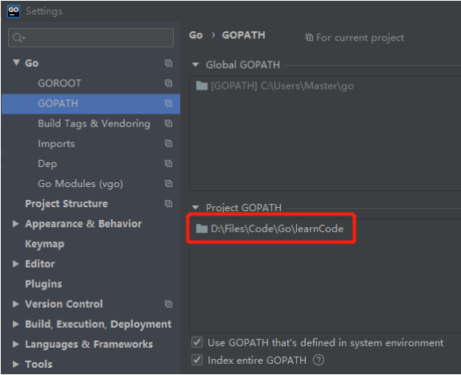
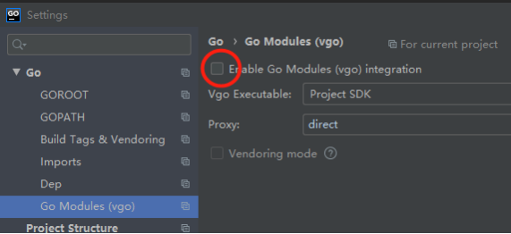
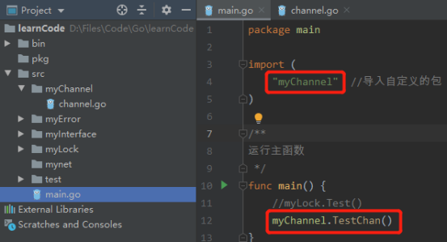
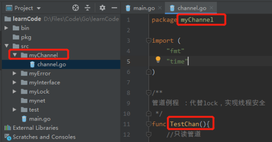

Go中文API手册：https://studygolang.com/pkgdoc

Go官方教程：https://tour.golang.org/welcome/1

# 1、基本语法

## 1.1、数据类型

- **<font color='red'>Go数据之间的比较，必须是建立在两个数据类型相同的情况下，否则无法进行比较，未编译之前就报错</font>**

- 数据输出printf：
  - %d：输出整数  （%02d：输出2位数长度的int数据）
  - %x、%X：输出十六进制
  - %f：输出float数据（%.2f：保留2位小数输出）
  - %e：输出科学计数法格式
  - %s：输出字符串
  - %c：输出字符

### 1.1.1、基本数据类型

基本数据类型在赋值时，是将内存地址中的数据进行复制，并不会修改原有内存地址中的数据。

- bool

- string：Go中的字符串可根据需要，自动调整占用内存大小（1~4字节），java中的string固定占用2字节

- int：int8（-128 -> 127）、  int16 、 int32 、 int64
  uint：uint8（0-> 255）、 uint16、 uint32、 uint64 

  uintptr：无符号整型，用于存放指针
  
  `int`, `uint` 和 `uintptr` 在 32 位系统上通常为 32 位宽，在 64 位系统上则为 64 位宽。 当需要一个整数值时应使用 `int` 类型，除非你有特殊的理由使用固定大小或无符号的整数类型。
  
- byte ：uint8 的别名

- rune ：int32 的别名，表示一个 Unicode 码点
  
- float32（少用）

  float64（常用）：因为math包中需要传入的参数基本都是float64

- complex64  ：32位实数 + 32位虚数

  complex128

- iota：特殊的常量，可以被编译器修改。用于const之后，当第一次出现const时，iota被初始化为0，定义变量时每增加一行，iota的值自动+1.

  eg：

  ```go
  const(
  	a = iota	//1
      b = iota	//2
      c = iota	//3
  )
  
  const(
  	a = iota	//1
      b			//1，iota + 1
      c = iota	//2
  )
  ```


### 1.1.2、引用数据类型

引用数据类型，本质上是指向内存地址中的数据，可以直接修改内存地址中的数据。

Eg：使用指针结构体作为参数，传入函数中，可修改该结构体中的数据。

- 指针：Go中的指针并不支持移动（eg：*num++），简化了指针使用的难度，防止出现内存泄漏问题
- map
- channel


## 1.2、变量

仅全局变量可被声明但不使用。局部变量必须声明且使用（否则会报错）

- 定义变量的方式

  - var param string = “chris”  //（显式类型定义）需要写明参数类型、初值

  - var param := “chris”            //（隐式类型定义）自动根据初值类型，获取相应的类型

  - param := “chris”                  //自动根据初值类型，获取相应的类型

  - const param string = ”chris“ //定义常量，

    **数字型的常量，没有精度限制，即定义任意精度都不会出现溢出**

    const可用于定义枚举

  - **_ **  ：用于for、定义变量时，忽略某个参数值（抛弃数据）

    ```go
    const(
    	_	= iota  			//忽略0
        a	= 1 << (10 * iota)	//1 << (10 * 1)
    )
    ```

    

-  Go默认未赋值变量的初始值（**Go给所有的变量都进行了初始化**）

  - bool：false
  - int：0
  - string：”“
  - *int、[]int、map[string] int、chan int、funct(string) int、error（接口）：默认均为nil（空值、无、null）

-  &param：返回param的存储地址

  *param：表明param为指针 变量

  

## 1.3、基本控制流程语句

- if-else

  **在if中定义局部变量v，仅可在此if-else中使用**

  ```go
  func ifTest(num1 int , num2 int) int{
  	//在if中定义局部变量v，仅可在此if-else中使用
  	if v := num1 - num2; v < num2{
  		return num2
  	} else{
  		fmt.Println("return V=：", v)
  	}
  	//这里不能使用v
  	return num1 - num2
  }
  ```

  

- switch

  - Go 自动提供了每个 case 后面所需的 break 语句，因此不需要添加break。

  - case后面若存在多条语句，可以不添加{}
  - 可以使用fallthrough，继续执行后面的case

  ```go
  func switchTest(str string) string{
  	switch sw := str; sw{
  	case "chris":
  		return "select " + str
  	case "fyj":{
  		return  "select " + str
  	}
  	default:
  		return "null"
  	}
  }
  ```

  

- defer

  defer推迟调用函数：仅当外层函数执行完后，才执行defer。
  
  **作用**：可用于追踪代码执行的位置（因为，defer是在函数执行完成之后，才会执行的）
  
  **原理**：推迟的函数调用会被压入一个栈中。当外层函数返回时，被推迟的函数会按照后进先出的顺序调用
  
  ```go
  func deferTest(){
     for index := 0; index < 10; index++{
        defer fmt.Print(index)
     }
  }
  ```


-  for

  - Go中没有while，使用 for {   }来实现while(true){  }功能
  - 使用for实现while(index >= 1){}的功能：for index >=1{}
  - for-range：循环读取容器中的数据。eg：for val := range chan{ }
  
  ```go
  func arrTest(){
     //方式1
     var arr1 [10]int
     for index := 0; index < len(arr1); index++{
        arr1[index] = index
     }
     for index := 0; index < len(arr1); index++{
        fmt.Print(" ", arr1[index])
     }
  
     //方式2：输出[1 2 3 4 5]
     arr2 := [5]int{1,2,3,4,5}
     fmt.Println(arr2)
  }
  ```
  
  
  
-  goto（少用）

   可以跳转至指定标签的位置，但是会导致代码混乱

   ```go
   func main() {
   
   LABEL1:
   	for i := 0; i <= 5; i++ {
   		for j := 0; j <= 5; j++ {
   			if j == 4 {
   				continue LABEL1
   			}
   			fmt.Printf("i is: %d, and j is: %d\n", i, j)
   		}
   	}
   
   }
   ```

   

-  

## 1.4、集合

- 数组

  - 定义方式

    var := [3]int {1,2,3}

    或者

    var arr [3]int = [3]int {1,2,3}

  - 遍历数组

    ```go
    var arr [3]int = [3]int {1,2,3}
    for index := 0; index < len(arr); index++{
       fmt.Println(arr[index])
    }
    
    arr1 := [3]int {2,2,3}
    for index := 0; index < len(arr); index++{
       fmt.Println(arr1[index])
    }
    ```

- **切片**

  切片的长度可以扩充，数组是固定的长度

  - 定义方式

    - slice := []int {1, 2, 3}

    - var slice []int

    - var silce []int = make([]int, 长度, 容量)   // 容量：可选填

      或者 slice := make([]int, 长度, 容量)

  - 切片初始化

    slice := []int {1, 2, 3}

  -  获取切片中的片段

    newSlice := slice[startIndex : endIndex]  // startIndex：可从0开始    ；  endIndex：最终获取的结果不包括endIndex所在的元素。 

  - len(切片)：获取切片中现存元素的个数

    cap(切片) ：获取切片允许的最大长度

  - append(切片, 数据)：在切片后面，添加数据

    copy(newSlice, oleSlice)：拷贝切片数据至另一个切片

  - 遍历切片

    ```go
    slice := []int {1,2,3,4}
    for index, val := range slice{
        //打印索引、数据、数据类型
        fmt.Printf("index = %d, val = %d, type = %T", index, val, val)
    }
    ```

    

-  map映射

  存放键值对，和java的hashmap类似

   ```go
   /**
   映射：类似于java中的hashmap：存放的是键值对
    */
   type websites struct{
   	name string
   	ip string
   }
   
   /*
   map中key为string，value为websites结构体
   */
   var m = map[string]websites{
   	//websites可以省略
   	"baidu": websites{
   		"baidu",
   		"1,2,3,4",
   	},
   	"google": websites{
   		"google",
   		"8.7.9.7",
   	},
   }
   
   func mapTest(){
   	fmt.Println(m)
   	//获取元素
   	fmt.Println(m["baidu"])
   
   	//修改元素
   	m["baidu"] = websites{m["baidu"].name, "2.2.2.2"}
   	fmt.Println(m["baidu"])
   
   	//查找元素是否存在
   	if val, ok := m["baidu"]; ok{
   		//删除元素
   		delete(m, "baidu")
   		fmt.Println("delete val = ", val)
   	}
   	fmt.Println(m)
   }
   ```


## 1.5、编程类型

- 函数值

  将函数作为参数传入另一个函数中，在该函数中可以之接使用传入的函数，进行运算

  ```go
  //f为传入的函数值
  func funcVal(f func(float64, float64) float64, x float64, y float64) float64{
     return f(x, y)
  }
  
  func funcValTest(){
     //作为参数传入的函数
     mySqrt := func(x float64, y float64) float64{
        sum := 1.0
        for index := 1; index <= int(y); index++{
           sum = sum * x
        }
        return sum
     }
     //两者等效
     fmt.Println(funcVal(mySqrt, 3, 4))
     fmt.Println(funcVal(math.Pow, 3, 4))
  }
  ```

   

- 闭包

  本质：函数A返回另一个函数B的返回值，并且函数A中的局部变量可被缓存、重复使用

  ```go
  //closure：即为函数A
  func closure() func(int) int{
     //该值可被缓存
     sum := 0
     //将x值循环叠加（return 函数B）
     return func(x int) int{
        sum += x
        return sum
     }
  }
  
  func closureTest(){
     //f1、 f2对应一个闭包：闭包中的数值会一直存在，可以循环叠加
     f1, f2 := closure(), closure()
     for index := 0; index < 10; index++{
        //index即为传入的x值
        fmt.Println(f1(index), f2(-2 * index))
     }
  }
  ```


- 定义结构体的方法

  Go中没有类，使用该方式给结构体增加方法，相当于java中定义类的方法。

  **方法的定义**：

  - func (参数名  结构体名)  方法名(参数名  类型)  返回值{}
    - **结构体名**：可使用指针接收者*，也可不使用
      - 值接收者（少用，无法改变传入结构体的属性、数据值）
      - 指针接收者（常用，可以改变传入结构体的属性、数据值）
    - **<font color='red'>方法名（变全局量名也一样）</font>**：
      - **首字母大写**：即java中的public方法，可被所有类调用
      - **首字母小写**：即java中的protected方法，只能被类内、包内的类调用。包外的类无法访问。

  ```go
  /*
  结构体
  */
  type way struct{
  	x float64
  	y float64
  }
  
  /**
  值接收者（少用）：myWay way，该方式仅仅修改way结构体中数据的副本（退出该函数后，不影响原有的数据）
   */
  func (myWay way) ABS() float64{
  	if myWay.x - myWay.y >= 0{
  		return myWay.x - myWay.y
  	} else{
  		return myWay.y - myWay.x
  	}
  }
  
  /**
  指针接收者（常用）：myWay *way，可以直接改变way结构体中的数据
   */
  func (myWay *way) Scale(num float64){
  	myWay.x = myWay.x * num
  	myWay.y = myWay.y * num
  }
  //将上述的  方法  重写为  函数
  func ScaleFunc(myWay *way, num float64){
  	myWay.x = myWay.x * num
  	myWay.y = myWay.y * num
  }
  
  /**
  该方法：仅能被类内、包内的类调用
  */
  func (myWay *way) getData() (float64, float64){
      return myWay.x, myWay.y
  }
  
  func wayTest(){
  	w := way{
  		x: 3,
  		y: 4,
  	}
  	w1 := &way{
  		x: 5,
  		y: 6,
  	}
  	//调用 ： 方法
  	w.Scale(10)
  	//调用 ： 函数   (两者等效)
  	//ScaleFunc(&w, 10)
  
  	fmt.Printf("w = %v, w1 = %v \n", w, w1)
  	fmt.Println(w.ABS())
  }
  ```

  

- 接口

  和java中的接口类似。可以对接口中的方法进行重写，eg：Error（）、String（）等方法

  ```go
  //接口
  type I interface{
  	Say()
  }
  
  //结构体
  type T struct{
  	name string
  	age int
  }
  
  //实现接口I中的方法
  func (t *T) Say(){
  	fmt.Println(t.name)
  }
  
  //重写fmt中的String()方法
  func (t *T) String() string{
  	return fmt.Sprintf("%v :(%d year)", t.name, t.age)
  }
  
  //重写Error()方法：当出现错误时，若需要返回error对象，则会调用该重写的方法打印信息
  func (t *T) Error() string{
  	if t.name == ""  || t.age <= 0 {
  		return fmt.Sprintf("name or age is error")
  	}
  	return ""
  }
  
  //创建新的对象
  func CreateNew(name string, age int) error{
  	return &T{name, age}
  }
  
  
  func main()  {
  	var impl I = &T{name: "chris", age: 18}
  	impl.Say()
  	//重写String(), 使用自定义的输出格式
  	fmt.Println(impl)
  	//重写error()
  	if err := CreateNew("chris", -1); err != nil {
  		fmt.Println(err)
  	} else{
  		fmt.Println("success")
  	}
  }
  ```

  
  
-  二元运算（Go中不存在三元运算，eg：return  num = 3 ?  true ：false）

  

- 

## 1.6、并发

- 通道

  类似于java中的队列，先进先出。

  - 定义：

    ch := make(chan 存入的数据类型,  缓存空间大小)

    **默认缓存空间为0，即ch存入数据的同时，需要立刻将其取出。因此，通常需要指定一定大小的缓存空间，以存放数据，等待协程将其取出**

  - 存数据：

    ch <- 2

  - 取数据：

    val := <- ch

  - **channel会出现堵塞的情况**：

    channel缓存区满：写数据堵塞，读数据不堵塞

    channel缓存区空：读数据堵塞，写数据不堵塞

  ```go
  func fibonacci(num int, ch chan int){
  	pre := 0
  	next := 1
  	temp := 0
  	for index := 0; index < num; index++{
  		ch <- pre
  		temp = pre
  		pre = next
  		next = pre + temp
  	}
  	//结束数据输入后：关闭信道
  	close(ch)
  }
  
  func main(){
  	ch := make(chan int, 10)
  	go fibonacci(cap(ch), ch)
      //遍历channel中的数据
  	for val := range ch{
  		fmt.Println(val)
  	}
  }
  ```

  

- 协程

  属于轻量级线程，和java中的线程不同。Go协程不涉及锁的升级、状态转换等，因此速度更快。协程使用sync包中的Mutex（互斥锁）、Channel（通道、信道）来保证各个协程之间的并发控制。

  - 开启方式

    go 方法名(参数)

  ```go
  func goForSum(arr []int, ch chan int) {
  	res := 0
  	for _, val := range arr{
  		res += val
  	}
  	//结果存入信道
  	ch <- res
  }
  
  func main(){
  	var arr []int = []int{1,2,3,4,5,6,7,8,9}
  	//创建信道：缓冲区为2，即：信道中最多可存储2个数据
  	ch := make(chan int, 3)
  	//开启两个协程：计算求和
  	go goForSum(arr[ : len(arr) / 2], ch)
  	go goForSum(arr[len(arr) / 2 :], ch)
  	//从信道中取出结果
  	res1 := <- ch
  	res2 := <- ch
  	fmt.Println(res1, res2, res1 + res2)
  }
  ```

  

- 锁

  使用sync.Mutex中的Lock()、Unlock()方法进行上锁、解锁操作。

  ```go
  type mutex struct{
  	//map：存放键值对
  	myMap map[string]int
  	//互斥锁
  	mux sync.Mutex
  }
  
  /**
  增加key对应的val
   */
  func (m *mutex) IncVal(key string){
  	//上锁
  	m.mux.Lock()
  	if val, ok := m.myMap[key]; ok{
  		m.myMap[key] = val + 1
  	}
  	//释放锁
  	m.mux.Unlock()
  }
  
  /**
  获取key对应的value
   */
  func (m *mutex) getValue(key string) int{
  	m.mux.Lock()
  	var res int
  	if val, ok := m.myMap[key]; ok{
  		res = val
  	} else{
  		res = -1
  	}
  	m.mux.Unlock()
  	return res
  }
  
  func main() {
  	exam := mutex{
  		myMap: make(map[string]int),
  		mux:   sync.Mutex{},
  	}
  	exam.myMap["chris"] = 0
  	for index := 0; index < 10; index++{
  		go exam.IncVal("chris")
  	}
  	time.Sleep(1000 * time.Millisecond)
  	fmt.Println("key = chris , value = ", exam.myMap["chris"])
  }
  ```

  

# 2、Goland编译器使用

## 2.1、配置

1. 增加Gopath路径，添加自己工程的路径

   

2. 不使用Go Modules

   


## 2.2、 调用自定义包中的函数

**<font color='red'>问题：若不在src文件夹中新建package包存放新的.go文件，则无法在同一个包中调用其他类的方法，亦无法使用File方式运行.go文件。</font>**

**<font color='red'>解决方式</font>：这是由于Goland编译器的底层调用机制原因，导致无法调用同一个package包中其他类的方法。需要配置run configuration中的Run kind为Package模式，然后运行**。

1. 调用代码的地方

   

2. 被调用的代码

   
   
   

## 2.3、cmd命令

- `go build` 编译自身包和依赖包
- `go install` 编译并安装自身包和依赖包


# 3、常用函数

## 3.1、init()函数

- 作用：该函数用于初始化配置。
- 执行时间：在系统初始化init()函数所在包之后，自动执行init()函数，且该函数无法被手动调用，先于main()函数之前执行。

```go
package main
import "fmt"

func init() {
	fmt.Println("init package: main")
}

func main(){
    
}
```


## 3.2、painc()


