# 1、磁盘性能评估

- 工具：fio

- 下载地址：https://github.com/axboe/fio/releases/tag/fio-3.27

- 安装命令：

  - ./configure
  - make
  - make install

- 测试命令：

  该命令运行在测试数据存储文件夹所在目录

  - fio --rw=write --ioengine=sync --fdatasync=1 --directory=test-data-fio --size=22m --bs=2300 --name=mytest
  - 参数：
    - --directory=测试数据存储的位置

- 性能指标： [Prometheus](https://prometheus.io/) 指标中的wal_fsync_duration_seconds，该指标的**第 99 个百分位数应小于 10 毫秒**，即可认为存储设备足够快。

  eg：

  ```shell
  #测试结果
  mytest: (g=0): rw=write, bs=(R) 2300B-2300B, (W) 2300B-2300B, (T) 2300B-2300B, ioengine=sync, iodepth=1
  fio-3.27
  Starting 1 process
  Jobs: 1 (f=1)
  mytest: (groupid=0, jobs=1): err= 0: pid=12041: Wed Jun 30 15:01:07 2021
    write: IOPS=8240, BW=18.1MiB/s (19.0MB/s)(22.0MiB/1217msec); 0 zone resets
      clat (usec): min=2, max=3090, avg=44.71, stdev=48.88
       lat (usec): min=2, max=3090, avg=44.87, stdev=48.88
      clat percentiles (usec):
       |  1.00th=[    3],  5.00th=[    4], 10.00th=[    4], 20.00th=[    4],
       | 30.00th=[    4], 40.00th=[    4], 50.00th=[   71], 60.00th=[   72],
       | 70.00th=[   73], 80.00th=[   74], 90.00th=[   85], 95.00th=[   88],
       | 99.00th=[  115], 99.50th=[  124], 99.90th=[  221], 99.95th=[  375],
       | 99.99th=[  486]
     bw (  KiB/s): min=18355, max=18736, per=100.00%, avg=18545.50, stdev=269.41, samples=2
     iops        : min= 8172, max= 8342, avg=8257.00, stdev=120.21, samples=2
    lat (usec)   : 4=41.72%, 10=1.93%, 20=0.16%, 50=0.03%, 100=54.25%
    lat (usec)   : 250=1.81%, 500=0.08%
    lat (msec)   : 4=0.01%
    
    #################### （查看第99次sync percentiles）此处的时间单位：us #################### 
    fsync/fdatasync/sync_file_range:
      sync (usec): min=52, max=552, avg=73.71, stdev=14.16
      sync percentiles (usec):
       |  1.00th=[   67],  5.00th=[   69], 10.00th=[   70], 20.00th=[   71],
       | 30.00th=[   71], 40.00th=[   72], 50.00th=[   72], 60.00th=[   73],
       | 70.00th=[   74], 80.00th=[   75], 90.00th=[   77], 95.00th=[   84],
       | 99.00th=[  116], 99.50th=[  130], 99.90th=[  343], 99.95th=[  367],
       | 99.99th=[  453]
    cpu          : usr=0.00%, sys=63.40%, ctx=21292, majf=0, minf=16
    IO depths    : 1=200.0%, 2=0.0%, 4=0.0%, 8=0.0%, 16=0.0%, 32=0.0%, >=64=0.0%
       submit    : 0=0.0%, 4=100.0%, 8=0.0%, 16=0.0%, 32=0.0%, 64=0.0%, >=64=0.0%
       complete  : 0=0.0%, 4=100.0%, 8=0.0%, 16=0.0%, 32=0.0%, 64=0.0%, >=64=0.0%
       issued rwts: total=0,10029,0,0 short=10029,0,0,0 dropped=0,0,0,0
       latency   : target=0, window=0, percentile=100.00%, depth=1
  
  Run status group 0 (all jobs):
    WRITE: bw=18.1MiB/s (19.0MB/s), 18.1MiB/s-18.1MiB/s (19.0MB/s-19.0MB/s), io=22.0MiB (23.1MB), run=1217-1217msec
  
  Disk stats (read/write):
    sda: ios=5211/9278, merge=0/0, ticks=303/549, in_queue=0, util=91.86%
  ```

  

# 2、ETCD基准测试

- 工具：etcd/tools/benchmark
- 下载：go get go.etcd.io/etcd/v3/tools/benchmark


# 3、ETCD入门

## 3.1、ETCD部署要求

### 3.1.1、系统要求

- 系统

  amd64-linux

- 存储设备：

  80GB以上的SDD。ETCD数据需要写入磁盘中，因此为增加数据读写速度，ETCD数据存储设备需要使用SSD，且需要验证存储设备的性能。可使用fio工具进行检测。

- 处理器

  双核以上

- RAM

  最大8GB，最小2GB。因为ETCD需要强制设置一个默认的RAM大小（2GB）
  
  - 设置占用RAM的大小：--quota-backend-bytes


### 3.1.2、部署原则

- ETCD集群的数量必须为奇数

  因为ETCD主机出现宕机时，需要从其他节点中选取leaer。若集群节点数量为偶数，则可能会出现某个节点所得票数相等，无法选举出leader。

- ETCD集群最大数量 ≤ 7

  虽然增加集群的数量，可以增加ETCD的容错性，但是集群数量越大数据的写入性能就会下降，因为需要将数据复制至更多的节点中。推荐集群数量 = 5，可容忍2个节点故障

- ETCD可用于跨区域、跨数据中心部署

  但是由于集群中的节点分布在不同的网段中，会增加数据请求的延时。并且，节点之间的数据复制，将会占用带宽。

- 删除节点的操作步骤：

  此顺序不能颠倒。

  - 首先删除节点
  - 然后添加新的节点


## 3.2、部署ETCD

### 3.2.1、部署单个ETCD

#### 3.2.1.1、使用二进制文件安装

- release文件下载：https://github.com/etcd-io/etcd/releases/
- 解压之后，将etcd二进制文件存入/usr/local/bin中
- 测试是否安装完成（在任意路径下）：etcd --version


#### 3.2.1.2、使用源码安装

- 前提：Go1.16以上的版本

- 安装命令：

  - 下载：git clone -b v3.5.0 https://github.com/etcd-io/etcd.git

  - 进入目录etcd，执行构建脚本：./build.sh

  - 构建后生成的二进制文件位于`bin`目录下，将`bin`目录的完整路径添加到系统环境变量中：

    export PATH="$PATH:pwd/bin"

  - 测试是否安装成功：etcd --version

- 启动： 

  - 命令：etcd， 或者./etcd

- 查看启动的详情：

  - 命令：etcdctl member list

  - 结果：默认情况下：client address  =  http://127.0.0.1:2379

  | ID               | STATUS  | NAME   | PEER ADDRS             | CLIENT ADDRS          | IS LEARNER |
  | ---------------- | ------- | ------ | ---------------------- | --------------------- | ---------- |
  | 8211f1d0f64f3269 | started | infra1 | http://127.0.0.1:12380 | http://127.0.0.1:2379 | false      |


### 3.2.2、部署ETCD集群

#### 3.2.2.1、部署：在Ubuntu系统

- **准备：**

  - **安装goreman**

    - 命令：go get github.com/mattn/goreman 

    - goreman 程序来控制基于 Procfile 的配置文件的ETCD程序。通过goreman + Procfile配置文件，可以快速启动ETCD集群。

      

- **<font color='red'>Procfile配置文件参数说明</font>**

  1. --name：

     etcd 集群中的节点名，不可重复

  2. --data-dir：

     存放数据目录，节点ID，集群ID，Snapshot文件，集群初始化配置，WAL 文件

  3. **--listen-peer-urls：**

     本member使用，用于监听其他member发送信息的地址。ip为全0代表监听本member侧所有接口。(应用场景：如选举，数据同步等)

  4. **--initial-advertise-peer-urls** ：

     其他member通过该地址与本member交互信息。该参数的value一定要同时配置到--initial-cluster参数中。

  5. **<font color='red'>--listen-client-urls</font>** ：

     监听外部客户端的请求（即：**etcd节点对外提供服务的地址**，**可添加多个，使用,分隔**）。

     - **注意事项：**

       <font color='red'>--listen-client-urls，必须配置一个url = **http://本机网卡的IP+端口**，远程客户端才能访问本机的ETCD数据库。</font>

       否则会出现错误：

       ```shell
       grpc: Conn.resetTransport failed to create client transport: connection error: desc = "transport: dial tcp 192.168.83.130:2379: connectex: No connection could be made because the target machine actively refused it.";
       ```

       

     **eg：**etcdctl工具、curl请求、go编写的访问etcd服务代码

     ```shell
     #启动etcd节点时，建议的配置：
     #保证本地etcdctl工具、远程客户端均可请求访问etcd服务端
     --listen-client-urls http://127.0.0.1:2379,http://本地网卡IP:2379 --advertise-client-urls http://127.0.0.1:2379
     ```

     

  6. **<font color='red'>--advertise-client-urls</font>** ：

     该节点的客户端（广播客户端），用于此url与其他etcd节点通信（**可添加多个，使用,分隔**）（**注意：此url不是用于远程客户端访问该节点的**）。

     **此处，不能配置为  空、localhost。**

  7. --initial-cluster-token：

     集群的token值，设置该值后集群将生成唯一id,并为每个节点也生成唯一id,当使用相同配置文件再启动一个集群时，只要该token值不一样，ETCD集群就不会相互影响

  8. **--initial-cluster** ：

     是集群中所有--initial-advertise-peer-urls 的合集，即：**此处配置的url必须和--initial-advertise-peer-urls配置的一致** 

  9. --initial-cluster-state new：

     新建集群的标志

     

- **<font color='red'>Procfile配置文件</font>**

  - 先准备Procfile配置文件，在该文件中写入需要启动节点的信息。

    

  - **参考官方配置文件：**https://github.com/etcd-io/etcd/blob/main/Procfile
    
    - 客户端通信地址为：
      - 各个节点访问其他节点的客户端地址：http://127.0.0.1:2379 , http://127.0.0.1:22379 ,  http://127.0.0.1:32379
      - **远程客户端访问ETCD节点的地址**：http://192.168.83.130:2379，http://192.168.83.130:22379，http://192.168.83.130:32379
    - 配置文件如下：文件名Procfile
    
    ```shell
    # Use goreman to run `go get github.com/mattn/goreman`
    # Change the path of bin/etcd if etcd is located elsewhere
    
    # ETCD1
    etcd1: etcd --name infra1 --listen-client-urls http://127.0.0.1:2379,http://192.168.83.130:2379 --advertise-client-urls http://127.0.0.1:2379 --listen-peer-urls http://127.0.0.1:12380 --initial-advertise-peer-urls http://127.0.0.1:12380 --initial-cluster-token etcd-cluster-1 --initial-cluster 'infra1=http://127.0.0.1:12380,infra2=http://127.0.0.1:22380,infra3=http://127.0.0.1:32380' --initial-cluster-state new --enable-pprof --logger=zap --log-outputs=stderr
    
    # ETCD2
    etcd2: etcd --name infra2 --listen-client-urls http://127.0.0.1:22379,http://192.168.83.130:22379 --advertise-client-urls http://127.0.0.1:22379 --listen-peer-urls http://127.0.0.1:22380 --initial-advertise-peer-urls http://127.0.0.1:22380 --initial-cluster-token etcd-cluster-1 --initial-cluster 'infra1=http://127.0.0.1:12380,infra2=http://127.0.0.1:22380,infra3=http://127.0.0.1:32380' --initial-cluster-state new --enable-pprof --logger=zap --log-outputs=stderr
    
    # ETCD3
    etcd3: etcd --name infra3 --listen-client-urls http://127.0.0.1:32379,http://192.168.83.130:32379 --advertise-client-urls http://127.0.0.1:32379 --listen-peer-urls http://127.0.0.1:32380 --initial-advertise-peer-urls http://127.0.0.1:32380 --initial-cluster-token etcd-cluster-1 --initial-cluster 'infra1=http://127.0.0.1:12380,infra2=http://127.0.0.1:22380,infra3=http://127.0.0.1:32380' --initial-cluster-state new --enable-pprof --logger=zap --log-outputs=stderr
    #proxy: etcd grpc-proxy start --endpoints=127.0.0.1:2379,127.0.0.1:22379,127.0.0.1:32379 --listen-addr=127.0.0.1:23790 --advertise-client-url=127.0.0.1:23790 --enable-pprof
    
    # A learner node can be started using Procfile.learner
    ```

  

- **启动集群：**

  - 命令：goreman -f **Procfile** start 

  - Procfile为之前路径中编写的配置文件（因此，**该命令必须在Procfile文件所在路径中使用**）

    

- **使用etcdctl客户端工具**

  - 配置所使用的etcdctl工具命令版本

    - 命令：export ETCDCTL_API=3 
    - 默认使用 v2 API 来和 etcd 数据库通信，这是为了向后兼容 etcdctl。若需要使用v3 的etcdctl API，就必须配置环境变量：ETCDCTL_API 设置为版本3。

    

  - 查看集群中的信息

    etcdctl --write-out=table --endpoints=localhost:2379 member list

    | ID               | STATUS  | NAME   | PEER ADDRS             | CLIENT ADDRS           | IS LEARNER |
    | ---------------- | ------- | ------ | ---------------------- | ---------------------- | ---------- |
    | 8211f1d0f64f3269 | started | infra1 | http://127.0.0.1:12380 | http://127.0.0.1:2379  | false      |
    | 91bc3c398fb3c146 | started | infra2 | http://127.0.0.1:12380 | http://127.0.0.1:22379 | false      |
    | fd422379fda50e48 | started | infra3 | http://127.0.0.1:12380 | http://127.0.0.1:32379 | false      |


#### 3.2.2.2、部署：1台物理机运行3个ETCD容器

docker-compose.yml文件如下

```shell
version: '3'
networks:
  byfn:
services:

  etcd1:
    image: quay.io/coreos/etcd
    container_name: etcd1
    command: etcd -name etcd1 -advertise-client-urls http://0.0.0.0:2379 -listen-client-urls http://0.0.0.0:2379 -listen-peer-urls http://0.0.0.0:2380 -initial-cluster-token etcd-cluster -initial-cluster "etcd1=http://etcd1:2380,etcd2=http://etcd2:2380,etcd3=http://etcd3:2380" -initial-cluster-state new
    ports:
      - 12379:2379
    networks:
      - byfn
      
  etcd2:
    image: quay.io/coreos/etcd
    container_name: etcd2
    command: etcd -name etcd2 -advertise-client-urls http://0.0.0.0:2379 -listen-client-urls http://0.0.0.0:2379 -listen-peer-urls http://0.0.0.0:2380 -initial-cluster-token etcd-cluster -initial-cluster "etcd1=http://etcd1:2380,etcd2=http://etcd2:2380,etcd3=http://etcd3:2380" -initial-cluster-state new
    ports:
      - 22379:2379
    networks:
      - byfn
      
  etcd3:
    image: quay.io/coreos/etcd
    container_name: etcd3
    command: etcd -name etcd3 -advertise-client-urls http://0.0.0.0:2379 -listen-client-urls http://0.0.0.0:2379 -listen-peer-urls http://0.0.0.0:2380 -initial-cluster-token etcd-cluster -initial-cluster "etcd1=http://etcd1:2380,etcd2=http://etcd2:2380,etcd3=http://etcd3:2380" -initial-cluster-state new
    ports:
      - 32379:2379
    networks:
      - byfn
```


#### 3.2.2.3、部署：3台物理机运行分别1个ETCD容器

（此方法有待进一步改进，还不可使用，因为无法建立集群，问题：3台机器的ID不匹配）

- **构建自己的ETCD镜像包**

  - 文件名：Dockerfile

  - 构建命令：docker build -t DockerHub的ID/etcd:版本号

    eg：docker build -t z1294550676/etcd:3.4.16

  ```shell
  FROM centos
  
  MAINTAINER chris
  
  ENV TZ="Asia/Shanghai";\
      DOWNLOAD=https://github.com/etcd-io/etcd/releases/download/v3.4.16/ \
  	ETCDVERSION=etcd-v3.4.16-linux-amd64 \
  	USER=admin
  
  RUN yum install curl wget tar -y ;\
      useradd ${USER} ;\
      mkdir -p /export/{servers,Logs,packages,Apps,Shell} ;\
      wget ${DOWNLOAD}${ETCDVERSION}.tar.gz && tar -zxf ${ETCDVERSION}.tar.gz -C /export/servers/ && \
      /bin/rm -rf ${ETCDVERSION}.tar.gz ;\
      chown -R ${USER}.${USER} /export ;\
      ln -s /export/servers/${ETCDVERSION}/etcd* /usr/local/bin/;\
  	rm -rf /etcd-data/ ;
  
  EXPOSE 2379 2380
  ```

  

- **使用docker-compose运行**

  - docker-compose.yml文件

    每台机器上需要修改的地方：

    - --name：修改为对应节点名称

    - --initial-cluster：修改对应的etcd的IP，本机IP为0.0.0.0:2380，其他机器为相应网卡的IP:2380

      **注意：0.0.0.0、127.0.0.1、localhost的区别**

      - 0.0.0.0

        - 在**服务器**中，表示本机上的所有IPV4地址，若主机有两个IP地址，192.168.1.1 和 10.1.2.1，并且该主机上的一个服务监听的地址是0.0.0.0,那么通过两个ip地址都能够访问该服务。
        - 在**路由**中，0.0.0.0表示的是默认路由，即当路由表中没有找到完全匹配的路由的时，则使用该IP进行路由

      - 127.0.0.1

        127.0.0.1属于{127,}集合中的一个，而所有网络号为127的地址都被称之为回环地址，所以回环地址 ≠ 127.0.0.1,它们是包含关系，即回环地址包含127.0.0.1。

      - localhost

        localhost是个域名，而不是一个ip地址。一般情况下，认为localhost、127.0.0.1是等价的，因为大多数电脑上都在hosts文件中将localhost指向了127.0.0.1。

  - 启动命令：docker-compose up

  ```shell
  #docker-compose.yml
  version: '2'
  
  services:
    etcd:
      image: z1294550676/etcd:3.4.16
      command: ["/usr/local/bin/etcd","--name", "etcd1",
                 "--data-dir", "/etcd-data",
                 "--listen-client-urls","http://0.0.0.0:2379",
                 "--advertise-client-urls","http://0.0.0.0:2379",
                 "--listen-peer-urls","http://0.0.0.0:2380",
                 "--initial-advertise-peer-urls","http://0.0.0.0:2380",
                 "--initial-cluster","etcd1=http://0.0.0.0:2380,etcd2=http://192.168.83.137:2380,etcd3=http://192.168.83.138:2380",
                 "--initial-cluster-token","2021CTyun!",
                 "--initial-cluster-state","new",
                 "--auto-compaction-retention","10"]
      volumes:
        - /data/etcd:/etcd-data
      ports:
        - 2379:2379
        - 2380:2380
  ```


## 3.3、ETCD工具

### 3.3.1、etcdctl

这是命令行客户端工具，可直接对etcd数据库进行操作。

#### 3.3.1.1、<font color='red'>命令的附加选项</font>

- 指定节点启动的地址、端口

  --endpoints=localhost:2379  

- 指定范围

  key1 keyn

  eg：etcdctl get foo1 foo4    ：注意，获取区间间 **[key1, key4)**，第4个键值无法被获取到

- 指定前缀（可实现模糊匹配）

  --prefix=xxx

- 限制数量

  --limit=n

- 大于等于某个key对应的value

  --from-key key1

  eg：etcdctl get --from-key foo

- 查询历史版本

  --rev=n  ：查找版本为n的键值对

- 数据显式格式

  - -w=json

    以json的格式显示数据（无论数据是否存在，均可以显示）

    eg：etcdctl get foo -w=json 。


#### 3.3.1.2、节点相关命令

- **查看节点信息**

  - 方式1：

    etcdctl member list

    查看成员信息（精简版）

  - 方式2：

    etcdctl --write-out=table --endpoints=localhost:2379 member list 

    查看节点localhost:2379中的成员信息


- **停止节点**

  goreman run stop **节点名**

  - **eg：**goreman run stop etcd2 

  - **注意**：这个命令无法停止etcd，最后还是用ps命令找出pid，然后kill 

    - ps -ef | grep etcd | grep endpoints的地址 

    - kill PID号

      

- **重启节点**

  goreman run restart **节点名**

  **eg：**goreman run restart etcd2


#### 3.3.1.3、数据相关命令

- **存数据**

  - 命令：

    - 方式1：etcdctl  put **键 值**

    - 方式2：etcdctl --endpoints=localhost:2379 put **键 值**

      

- **取数据**

  - 方式1：etcdctl  get **键 值**
  - 方式2：etcdctl --endpoints=localhost:2379 get **键**

  

- **删除键值对**

  etcdctl del 键

  

- **<font color='red'>监控数据</font>**

  etcdctl watch key

  实时监控key所对应值的变化

  - **范围监控**

    etcdctl watch key1 keyn

  - **监控指定的多个key-val**

    etcdctl watch -i

    watch key1

    watch key3

  

- **压缩数据**

  etcdctl compact 版本号

   压缩之后，版本号之前的数据均无法访问，即：不可以获通过etcdctl get --rev=版本号-1 ，获取历史版本为（版本号-1）的数据

  

- **<font color='red'>存活时间（租约）</font>**

  - **设置存活时间**

    - 新建一个存活时间（单位：秒）

      etcdctl lease grant 时间

      - eg：etcdctl lease grant 10

      - 结果：lease 32695410dcc0ca06 granted with TTL(10s)    

        **存活时间配置id：**32695410dcc0ca06 ，需要使用该id取设置key的存活时间

        

    - 给指定key设置存活时间

      etcdctl put --lease=存活时间配置id key value

      

  - **撤销存活时间**

    etcdctl lease revoke 存活时间配置id

    注意：当存活时间撤销之后，配置了该存活时间的key-val将被删除。

    

  - **维持存活时间**

    - 新建一个存活时间配置

      etcdctl lease grant 时间

    - 维持旧的存活时间

      etcdctl lease keep-alive 新建的存活时间配置id

    

  - **查看存活时间的信息**

    - 查看存活时间配置

      etcdctl lease timetolive 存活时间配置id

    - 查看使用了存活时间配置的key-value

      etcdctl lease timetolive --keys 存活时间配置id

- 


### 3.3.2、grpc-gateway

网关接收 ETCD的 protocol buffer 消息定义的 JSON mapping 。key 和 value 字段被定义为 byte 数组，因此必须在 JSON 中以 base64 编码。任何HTTP/JSON 客户端都可使用 curl访问ETCD数据库。

**需要使用到v3alpha/kv/中的组件。**

- 存key-value

  curl -L http://localhost:2379/v3alpha/kv/put \ 

  -X POST -d '{"key": "Zm9v", "value": "YmFy"}' 

  

- 读取key-value

  curl -L http://localhost:2379/v3alpha/kv/range \ 

  -X POST -d '{"key": "Zm9v"}' 

  

- 监控数据

  curl http://localhost:2379/v3alpha/watch \ 

  -X POST -d '{"create_request": {"key":"Zm9v"} }' & 

  

- 事务

  curl -L http://localhost:2379/v3alpha/kv/txn \ 

  -X POST \ 

  -d '{"compare":[{"target":"CREATE","key":"Zm9v","createRevision":"2"}],"success":[ 

  {"requestPut":{"key":"Zm9v","value":"YmFy"}}]}' 

  

- 搭建认证服务

  - 创建 root 用户 

    curl -L http://localhost:2379/v3alpha/auth/user/add \ 

    -X POST -d '{"name": "root", "password": "pass"}' 

  - 创建 root 角色 

    curl -L http://localhost:2379/v3alpha/auth/role/add \ 

    -X POST -d '{"name": "root"}' 

  - 授予 root 角色 

    curl -L http://localhost:2379/v3alpha/auth/user/grant \ 

    -X POST -d '{"user": "root", "role": "root"}' 

  - 开启认证 

    curl -L http://localhost:2379/v3alpha/auth/enable -X POST -d '{}' 

  - root 用户 获取认证 token 

    curl -L http://localhost:2379/v3alpha/auth/authenticate \ 

    -X POST -d '{"name": "root", "password": "pass"}' 

  - 为认证 token 设置 Authorization header，以便在获取键时使用认证证书

    curl -L http://localhost:2379/v3alpha/kv/put \ 

    -H 'Authorization : sssvIpwfnLAcWAQH.9' \ 

    -X POST -d '{"key": "Zm9v", "value": "YmFy"}' 


## 3.4、go代码远程访问ETCD

- **启动ETCD集群**
  - 前提：注意启动节点时，所配置的<font color='red'>--listen-client-urls</font>，此处必须有ETCD所在机器的IP（网卡地址），否则无法远程访问ETCD
  - 命令：goreman -f Procfile start     （Procfile为配置文件：包含各个节点的配置详情）
  - 如果还是出现refuse it的错误：
    - 方式1：ETCD的启动配置中，增加--listen-client-urls的监听地址 
    - 方式2：
      - 查看已经开放的端口：netstat -tlnp
      - 开放远程访问端口：ufw allow 端口号


- **代码**

  ```go
  package main
  
  /**
   * Created by Chris on 2021/7/6.
   */
  
  import (
  	"context"
  	"fmt"
  	"github.com/coreos/etcd/clientv3"
  	"time"
  )
  
  func main() {
  
  	//连接
  	cli, err := clientv3.New(clientv3.Config{
  		//此处IP为：--listen-client-urls监听地址（各个ETCD节点监听地址）
  		Endpoints:   []string{
  			"192.168.83.130:2379",
  			"192.168.83.130:22379",
  			"192.168.83.130:32379"},
  		DialTimeout: 5 * time.Second,
  	})
  	if err != nil {
  		fmt.Println("connect failed, err:", err)
  		return
  	}
  	fmt.Println("connect success")
  	defer cli.Close()
  
  
  	ctx, _ := context.WithCancel(context.TODO())
  
  	//存数据
  	startTime :=time.Now()
  	_, err = cli.Put(ctx, "name", "chris")
  	//操作完毕，取消连接
  	// cancel()
  	endTime :=time.Now()
  	fmt.Println("put耗时", endTime.Sub(startTime))
  	if err != nil {
  		fmt.Println("put failed, err:", err)
  		return
  	}
  
  	//设置超时为5秒
  	ctx, _ = context.WithTimeout(context.Background(), 5*time.Second)
  
  	//取数据
  	startTime = time.Now()
  	resp, err := cli.Get(ctx, "name")
  	fmt.Println("get 耗时:",time.Now().Sub(startTime))
  	// 	cancel()
  	if err != nil {
  		fmt.Println("get failed, err:", err)
  		return
  	}
  
  	//打印数据
  	for _, ev := range resp.Kvs {
  		fmt.Printf("%s : %s\n", ev.Key, ev.Value)
  	}
  }
  ```


# 4、ETCD进阶

## 4.0、ETCD的重要概念

### 4.0.1、ETCD的专有名词

- **<font color='red'>心跳机制：</font>**

  - **ETCD集群的所有节点都是设定为随机的超时时间（相当于定时器，防止出现选票瓜分的情况）**。当集群已经产生了 Leader节点，则 Leader节点会在固定间隔内给所有节点发送心跳。其他节点收到心跳以后重置心跳等待时间，只要心跳等待不超时，Follower节点的状态就不会改变。当Follower节点未接收到心跳时（心跳超时），则重新选举Leader节点。
  - **Leader节点发送的心跳包中，会携带Leader节点的任期term，用于发现哪些节点已经过期了。**
- **Raft**：etcd所采用的保证分布式系统强一致性的算法。
- Node：一个Raft状态机实例。
- Member： 一个etcd实例。它管理着一个Node，并且可以为客户端请求提供服务。
- Cluster：由多个Member构成可以协同工作的ETCD集群。
- Peer：对同一个ETCD集群中另外一个Member的称呼。
- Client： 向etcd集群发送HTTP请求的客户端。
- **WAL**：（write ahead log）预写式日志，保存的是Raft Log中的操作指令。ETCD用于持久化存储的日志格式。
- **Raft Log**：用于保存客户端发送的写数据操作指令。
- **snapshot**：ETCD防止WAL文件过多而设置的快照，存储ETCD数据状态。
- Proxy：ETCD的一种模式，为etcd集群提供反向代理服务。
- Index：数据项编号。Raft中通过Term和Index来定位数据。


- **Follower：**

  负责处理客户端的读数据请求，同时需要从 Leader 同步数据，将Leader发送的raft log日志数据写入该节点的raft log文件，最后再写入状态机=》写入dolt db数据库。如果客户端的写数据操作请求发送给了 Follower，会由 Follower 重定向给 Leader 。

- **Candidate：**

  如果 Follower在一定时间内没有收到 Leader 的心跳，则判断 Leader 可能已经故障，此时启动 Leader election 过程，本节点（心跳超时的Follower节点）切换为 Candidate，参与Leader 选举， 直到选主流程结束。

- **Leader：**

  用于接收客户端发起的写数据操作请求，写入本地raft log日志后同步至集群其它节点。

  

- **Term**：

  - 每开始一次新的选举，称为一个**任期**（**term**），每个 term 都是**单调递增**的。

  - **每当 candidate 触发 leader election 时都会增加 term值**，如果一个 candidate 赢得选举，他将在本 term 中担任 leader 的角色。但并不是每个 term 都一定对应一个 leader，有时候某个 term 内会由于选举超时导致选不出 leader，这时 candicate 会递增 term 号并开始新一轮选举。

  - **<font color='red'>每一个节点都保存一个 current term，在通信时带上这个 term ，通过对比Leader节点的term，就可以发现哪些节点的状态已经过期，然后进行后续的raft log日志更新操作。</font>**

  - **Leader节点和任期的关系图**：

    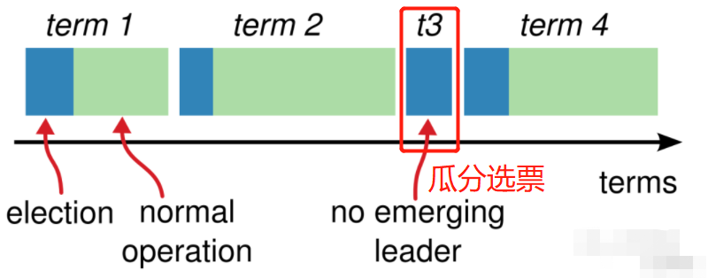


### 4.0.1、强一致性的概念

- 强一致性（线性一致性）：

  并不是指集群中所有节点在任一时刻的状态必须完全一致，而是指让一个分布式系统看起来只有一个数据副本，并且读写操作都是原子的，这样应用层就可以忽略系统底层存在多个数据副本的数据同步问题。

- 将一个强一致性分布式系统当成一个整体，一旦某个客户端成功的执行了写操作，那么所有客户端都一定能读出刚刚写入的值。即使发生网络分区故障，或者少部分节点发生异常，整个集群依然能够像单机一样提供服务。

- **<font color='red'>ETCD保证强一致性的核心：</font>**

  使用Raft算法 = 复置状态机 + Leader选举


### 4.0.2、Raft算法的基本概念（重要）

- **法定人数机制：**

  **<font color='red'>客户端的指令执行成功、保存的判断依据：</font>**

  Raft 算法使用 **法定人数（Quorum） 机制**判断执行的命令是否成功，即：客户端发送的写数据请求，必须有**50%以上的节点**成功写入该指令后，才能算指令执行成功，否则不对该指令进行数据写入操作。

- Leader、Candidata、Follower、Term概念：参照4.0.1

- Lease租约机制

- Watch监控机制


- **<font color='red'>Raft算法核心实现：</font>**

  - **状态机：**

    - **<font color='red'>每个ETCD节点都维护了一个状态机，用于写入已提交的raft log日志数据（保证leader的状态机数据是最新的，wal日志则是用于持久化数据操作）</font>**。当ETCD集群接收到读请求时，在任意节点都可以读，而写请求只能重定向到Leader节点，由Leader节点执行，通过Raft协议保证写操作对状态机的改动会可靠的同步到其他Follower节点。

    - **raft log日志：**负责存储客户端发过来的写数据指令，Leader节点需要将该日志中的数据同步给其它Follower节点，当超过50%的Follower节点都同步了客户端发送来的写数据指令后，就认为该集群已经安全复制了该指令，Leader节点将该指令提交至状态机中，最后返回该指令的执行状态给客户端。

  


  - **Leader选举：**

    - ETCD的Leader节点负责写日志（处理客户端的写数据指令，并将这些指令同步至Follower节点的日志中），Follower节点负责读日志。

    - Leader节点的作用：保证整个集群仅有一份日志 =》保证所有节点执行数据写入操作的顺序一致 =》保证集群数据的一致性。

  


  - **安全性：**

    - 对Leader选举的规则限制
    - ETCD服务端server对客户端client的数据操作指令提交的限制
      1. Leader 节点从来不会覆盖或者删除自己的日志
      2. Leader 只允许 commit 包含当前 term 的日志


## 4.1、ETCD基本框架

### 4.1.1、ETCD层次结构（详细-重点）

- **client层：**提供简单易用的API，用于访问etcd数据库

- **API层：**

  - client和server之间的通信协议：etcdv2使用http协议，etcdv3使用grpc协议。
  - server之间的通信协议：使用http协议，并且使用raft算法保证数据一致性。

- **raft算法层：**保证etcd多个节点之间数据的一致性。

- **逻辑层：**

  - kvserver模块：

    - 限速判断（保证集群稳定性，避免雪崩）
    - 生成一个唯一的 ID，将此请求关联到一个对应的消息通知 channel，然后向 Raft 模块发起（Propose）一个提案（Proposal）
    - 等待此 put 请求，等待写入结果通过消息通知 channel 返回或者超时。etcd 默认超时时间是 7 秒（5 秒磁盘 IO 延时 +2*1 秒竞选超时时间），如果一个请求超时未返回结果，则可能会出现 etcdserver: request timed out 错误

  - lease租约模块、

  - auth鉴权模块、

  - treeIndex模块：用于建立数据索引树

  - Quota配额模块：

    检查当前etcd db的大小加上请求的key-value大小是否超过配额，若超过配额则会产生告警，并通过raft日志同步给其他节点告知db无空间了，而且该告警会持久化存储到db中，当集群内其他节点想写入时会先检查是否存在告警，若存在无法写入，最终集群内所有节点都无法写入只能读。

  - Apply模块：

    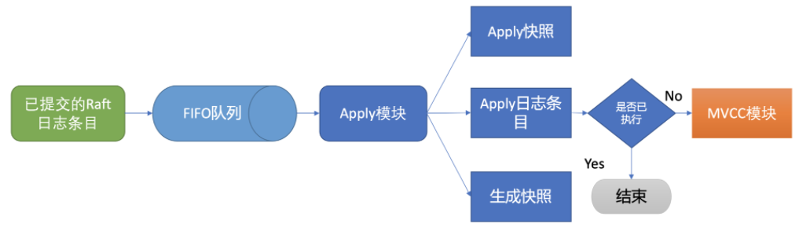

- **存储层：**

  - **boltdb数据库**：保存用户写入的数据，即：将数据写入磁盘——数据持久化。

    

  - **wal日志模块**：

    - **概念：**WAL技术（Write Ahead Log，预写日志)，为了使用复制状态机系统，保证集群节点的数据一致性。
    - **作用：**存放预写式日志,最大的作用是记录了整个数据变化的全部历程。在etcd中，**所有数据的修改在提交前，都要先写入到wal中**。当日志数据大于默认的64M时就会生成新的文件写入日志（自动切分日志）。
    - **注意：**wal文件是只追加不删除的，因此随着系统数据增多，wal文件会变得越来越多(因为切割成64MB的文件)，文件中可能存在很多重复或者已经删除的record数据。

    - **文件命名规则**：$seq-$index.wal   （seq：raft日志的索引；index：raft状态编号，即：实际数据的索引位置 + 1）

    - **eg：**
      - 初始值：0000000000000000-0000000000000000.wal
      - 记录20条数据后，进行日志分割：
        - 0000000000000000-0000000000000020.wal
        - 0000000000000001-0000000000000021.wal

    

  - **snapshot快照**：

    - **作用：**存放**已经提交的wal**快照数据（即：存储etcd数据状态），防止wal中的文件过大。定期生成snap文件仅保留 term、index、key value 数据。
  
    - **注意：**snapshot是根据apply数量的创建，超过一定阈值就会触发创建snapshot。`ep.appliedi-ep.snapi <= s.Cfg.SnapshotCount`,合并wal并写入磁盘，减少了wal文件占用的磁盘空间。
  
    - **文件命名规则：**$term-$index.snap   （term：任期编号； index：实际数据的索引位置）
  
      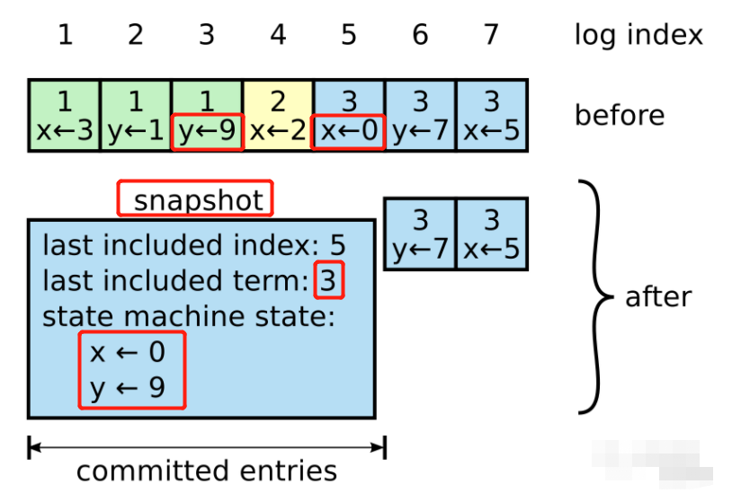
  
    - **eg：**
  
      - 当前ETCD有3个wal文件：
        - 0000000000000001-0000000000000000.wal
        - 0000000000000002-0000000000001000.wal
        - 0000000000000003-0000000000002000.wal
      - 经过一次snapshot后：
        - wal文件变为1个：0000000000000001-0000000000002000.wal
        - snapshot文件为：0000000000000001-0000000000001fff.snap
  
      
  
  - **snap和wal文件的区别：**
    
    snapshot 和 wal，在写入的方式是不同的。对于这两种方式系统调优的方式是不同的。
    
    - snapshot ：是内存直接 dump file。，snapshot 可以通过增加 io 平滑写来提高磁盘 io 能力。
    - wal ：是顺序追加写，wal 可以通过降低 pagecache 的方式提前写入时序。
    - 因此，对于不同的场景，可以考虑将 snap 与 wal 进行分盘，放在两块 SSD 盘上，提高整体的 IO 效率，这种方式可以提升 etcd 20% 左右的性能。
    
    
    
  - **<font color='red'>存储层总结：</font>**
    
    - ETCD通过WAL和snapshot相结合的方式，可以有效的进行数据存储和节点故障恢复等操作。
    - ETCD默认每10000条记录做一次snapshot，经过snapshot以后的WAL文件就可以删除。
    - 首次启动时，ETCD会把启动的配置信息存储到data-dir参数指定的数据目录中。配置信息包括：本地节点的ID、集群ID和初始时集群信息。因此，**用户需要避免etcd从一个过期的数据目录中重新启动，因为使用过期的数据目录启动的节点会与集群中的其他节点产生不一致**。
    - 当etcd重启的时候先从snapshot恢复，之后的数据再从wal文件中恢复，这样能提高系统的恢复速度

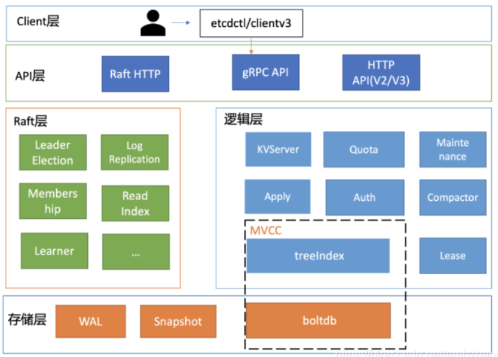


### 4.1.2、ETCD基本模块（精简）

- **raft-http：** 用于不同etcd node之间进行通信，接收来自其他node的消息；

- **server：**用于接收client客户端发送的请求，eg：etcdctl命令行工具、go编写的client

- **raft模块 ：**实现分布式一致性raft协议, raft模块与server模块的通信采用了四个channel：

  - `propc`： 处理server发送来的client命令
  - `recvc`： 处理raft-http发送来的http消息
  - `readyc`:  消息经过raft处理之后封装成Ready交给server处理
  - `advanceC`：server处理一条raft发送来的消息后，将处理结果返回给raft

- **raftlog：**

  raftlog模块包含unstable和raft的snapshot，unstable保存log entries，但是entries数量比较多的时候，就需要compact，创建一个snapshot，这里的snapshot还是保存在memory中的。raft模块会定时收集entries交给server处理。

- **wal：**

- **snapshotter：**

- **mvcc：**

  实现多版本的并发控制，使用revision（main和sub）来描述一个key的整个过程：从创建到删除。mvcc中还包含了watcher，用于实现监听key、prefix、range的变化。

- **backend 和 boltdb：**持久化key value数据到boltdb数据库

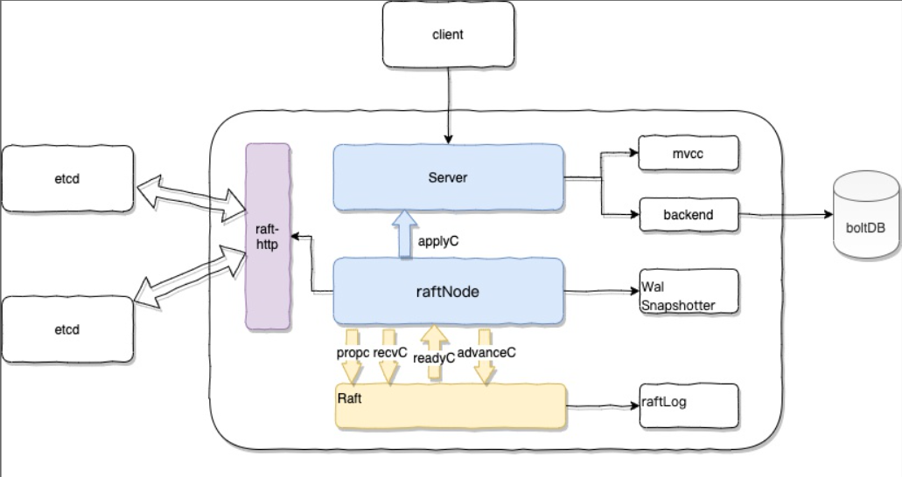


## 4.2、数据结构

### 4.2.1、boltdb数据库的结构

按照功能可分为：元数据页 (meta page)、B+ tree 索引节点页 (branch page)、B+ tree 叶子节点页 (leaf page)、空闲页管理页 (freelist page)、空闲页 (free page)。

- **meta page：**存储固定的 db 元数据
- **branch page：**编排所有数据的 key，存取数据时即可通过二分搜索查找需要的 key数据
- **leaf page：**负责存储key-value 数据、bucket 数据，从branch page页获取key之后，根据key来该页查找对应的key-value数据。
- **freelist page：**存储空闲页free page的ID，用于记录db 中哪些页是空闲、可使用的。当boltdb 中删除大量数据的时候，其对应的 page 就会被释放。
- **free page：**当写入数据的时候，就可直接从空闲页中申请页面使用。


### 4.2.2、数据读取

- **具体步骤：**

  1. client执行etcdctl get name后，通过KVServer模块解析get请求，并访问etcd server：通过负载均衡选择一个节点，选好节点之后，由KVServer模块的rpc方法把请求发给etcd server。

  2. **读取数据分两种方式：**

     **假设现在另一个客户端进行数据更新操作，Leader节点已经将数据hello，更新为world。**

     - **串行读**

       直接读取所选择节点的状态机，若此时部分节点的数据未从raft同步过来，可能会读取到未更新的旧数据。即：读取到的数据是：hello，而不是更新后的数据：world。

       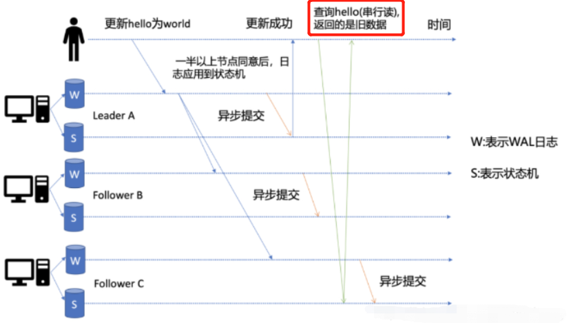

     - **线性读**（常用）

       例如客户端client选择从节点C中读取数据。

       ①节点C收到线性读请求。

       ②节点C会先从leader节点A中获取日志index

       ③等待一半以上节点确认leader身份后返回ReadIndex给节点C

       ④此时，C节点等待直到状态机的索引 ≥ leader节点返回的ReadIndex索引。

       ⑤然后去访问状态机数据，此时获取到的数据就是：world。

       ⑥返回数据给客户端。

       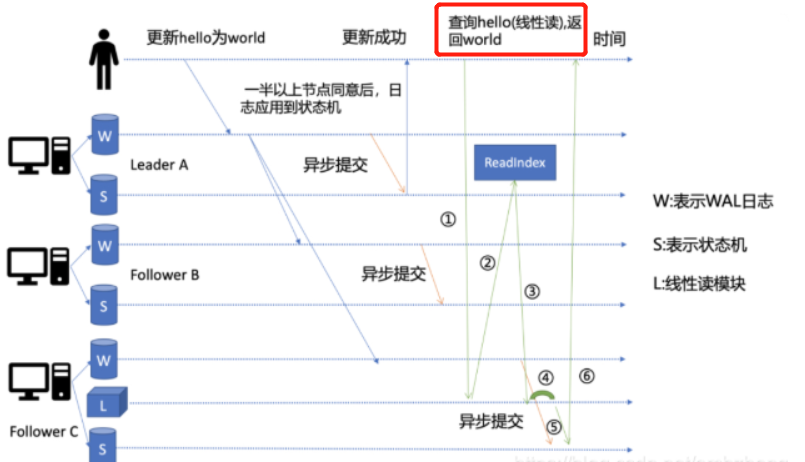

  3. 上述的两种数据读取方式：**串行读、线性读，均需要使用MVCC**，控制数据在多并发情况下的多版本问题。

     进入MVCC模块后，先从treeIndex中获取key对应的版本号，再到缓存中根据版本号查询对应的value，若缓存中不存在，再到boltdb根据版本号查询对应的value信息（每一个key对应一棵树，类似于mysql的InnoDB搜索引擎）。

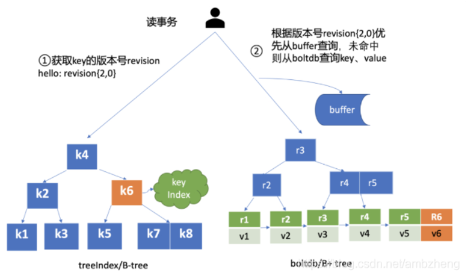


### 4.2.3、数据写入

**注意：ETCD中仅leader节点拥有写数据权限，因此其他节点接收到客户端的写数请求时，需要将该请求发送给leader节点。**

- **具体步骤：**
  1. client端通过负载均衡算法选择一个ETCD节点，通过http或者gprc发送写数据请求。
  2. 进入quota模块，检查当前etcd db的大小加上请求的key-value大小是否超过配额，若超过配额则会产生告警，并通过raft日志同步给其他节点告知db无空间了，而且该告警会持久化存储到db中，当集群内其他节点想写入时会先检查是否存在告警，若存在无法写入，最终集群内所有节点都无法写入只能读。最后请求转入raft模块
  3. raft收到KVServer的put请求，若非leader节点则会将请求转给leader节点，因为只有leader节点可以处理写请求。
  4. raft将数据写入日志模块wal中，并通过队列返回日志消息给etcd server。
  5. etcd server读取队列中的日志消息，将数据同步至状态机。
  6. 最后执行事务，将数据存入boltdb数据库：写事物会到treeIndex查询key的最大版本号，并获取对应的创建版本号、修改次数等，生成+1的新版本号，然后写入boltdb和buffer，最后将最新版本号存到treeIndex（以便客户端读取最新数据），并提交事务


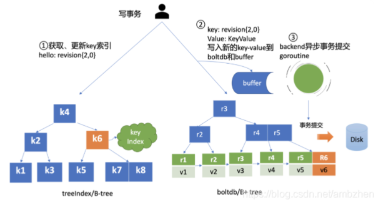


- **使用buffer缓存的原因：**

  使用put操作写入数据时，会先存储在RAM内存中，但此时并未提交事务，将数据更新写入到磁盘（数据持久化），**ETCD每隔100ms批量提交数据到磁盘中，以提升吞吐量**。但这又导致无法直接从boltdb中获取最新的数据，因此为了获取最新数据需要先到buffer中的查找。


## 4.3、ETCD的事务

### 4.3.1、ETCD的锁机制

- **ETCD：**乐观锁，认为数据不会发生冲突，但是当事务提交时，具备检测数据是否冲突的能力。

- **MYSQL：**悲观锁，认为多个并发事务可能会发生冲突，因此它要求事务必须先获得锁，才能进行修改数据操作，比如数据库读写锁。


## 4.4、状态机（重点）

### 4.4.0、向分布式系统写入数据时可能存在的问题

按照节点执行的命令分类，可分为2类：读、写。只有写命令可以改变节点数据、状态。因此需要将写命令同步至所有节点中。

需要解决的问题：

- 网络不确定性：在非拜占庭情况下,出现网络 分区/冗余/丢失/乱序 等问题下要保证正确。

- 不依赖时序：不依赖物理时钟或极端的消息延迟来保证一致性

- 快速响应：对客户端请求的响应不能依赖集群中最慢的节点

- 基本可用性：集群中大部分节点能够保持相互通信,那么集群就应该能够正确响应客户端


### 4.4.1、状态机的基本概念

- **状态机、raft log、wal文件的含义：**

  - **状态机：**

    状态机中数据的含义：Leader节点已提交的raft log数据 = 那些已经被安全复制至Follower节点的raftlog数据。

    **<font color='red'>每个ETCD节点都维护了一个状态机（每个节点都拥有Leader节点所有的状态机数据），用于写入已提交的raft log日志数据</font>**。当ETCD集群接收到读请求时，在任意节点都可以读，而写请求只能重定向到Leader节点，由Leader节点执行，通过Raft协议保证写操作对状态机的改动会可靠的同步到其他Follower节点。

  - **raft log：**

    Leader节点的raft log，用于存放客户端发送的写数据指令（包含已提交至状态机的日志数据）

  - **wal文件：**

    用于持久化数据操作，将状态机的数据写入本地磁盘。
    
    

- **复制状态机系统的概念：**

  - **复制单元：**

    复制单元是一个状态机，其数据存储在日志中，复制单元严格按照顺序逐条执行日志上的指令。

  - **复制状态机系统：**

    - **结构：**

      由多个复制单元组成。

    - **应用：**

      用于解决一份数据存在多个副本的问题。

    - **实现方式：**

      通过Leader节点分发数据至Follower节点（复制单元、状态机），因此每个状态机都是确定的，所以每个外部命令都将产生相同的操作顺序（日志）。又因为每一个日志都是按照相同的顺序存放相同的指令，所以每个状态机都将执行相同的指令序列，并且最终保证所有状态机具有相同的状态。

  - **注意：**

    - 状态机执行指令的顺序并不一定等同于指令的发出顺序。
    - 复制状态机只是保证所有的状态机都以相同的顺序执行命令。


### 4.4.2、节点提交日志的原则

- **判断是否安全复制日志：**

  客户端提交写数据请求给Leader时，Leader节点将命令写入日志中，并发送至所有的Follower节点，仅当**超过50%的Follower节点**都已经复制日志后该后，leader 会将该日志提交到它本地的状态机中，然后把操作成功的结果返回给客户端。


- **Leader将roft log日志提交至状态机的准则**
  1. Leader 节点从来不会覆盖或者删除自己的日志
  2. Leader 只允许 commit 包含当前 term 的日志


### 4.4.3、发送日志的数据结构

Leader节点发送至Follower节点的日志数据中，都包含Leader节点的任期term、日志数据的索引index

具体为：**当前日志的（index、term） +  上一条日志的（index、term）+ 下一条日志的（index，term）**


### 4.4.4、为什么用状态机

Raft一致性算法的目的是：保证集群中所有节点的数据、状态一致。按照节点执行的命令分类，可分为2类：读、写。只有写命令可以改变节点数据、状态。因此需要将写命令同步至所有节点中。但是，由于网络存在延时，就会导致各个节点接收到的写命令顺序不同，进而导致写入数据的不一致。因此，**ETCD中Leader节点负责执行写命令，Follower节点负责执行读命令的方式，且所有节点的日志数据均有Leader节点维护，从而保证集群中所有节点数据的一致性**。


### 4.4.5、<font color='red'>ETCD的状态机执行流程</font>

- **集群中raft log日志数据同步的流程：<font color='red'>（复制状态机系统的执行流程）</font>**
  
  1. ETCD集群启动，会初始化一个Leader节点，决定日志的顺序，负责发送日志到其他Follower节点。
  
  2. 当Leader节点的**一致性模块**（consensus module）接收到客户端的写请求时，先将命令写入自己的日志，然后同步给所有Follower节点，仅当50%以上Follower节点都接收到日志后，Leader节点才提交日志。日志提交后，由Leader节点按顺序应用于状态机。
  
     Leader节点发送至Follower节点的**日志数据同步流程**如下：
  
     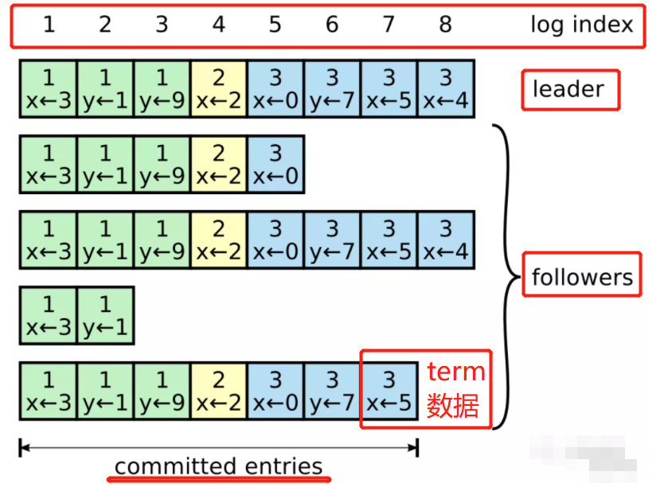
  
  3. 仅当Leader日志提交成功后，其他Follower节点才会将来自步骤2：Leader节点中consensus module发送的日志数据，应用到该Follower节点的状态机中，然后进行数据写入操作。（从而保证所有Follower节点的数据一致性）
  
  4. 最后，Leader节点将数据写入命令的执行状态，返回给客户端client。

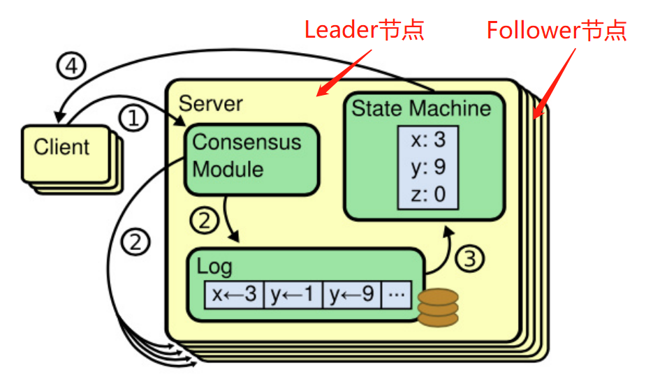


- **何如处理Follower节点日志和Leader节点日志不一致的问题（重点）**

  （即：raft log日志数据同步过程中，步骤②执行失败时，如何保证Follower节点数据与Leader节点数据一致）

  - **集群中的节点，日志不同步的处理流程：**

    1. Leader节点发送至Follower节点的日志数据中，都包含Leader节点的任期term、日志数据的索引index。

       具体为：**当前日志的（index、term） +  上一条日志的（index、term）+ 下一条日志的（index，term）**

    2. Leader节点会用n个参数（next index），来记录应发送给每一个Follower节点的下一条日志索引位置。

       （如果此时Leader节点宕机，并完成了Leader选举流程，Candidate节点 =》新的Leader节点之后，这个新的Leader节点会将所有的next index重置为自己的最新的日志索引。）

    4. 然后开始进行数据同步，Leader节点发送自己的日志至Follower节点中。当Follower节点接收到Leader节点发送的日志数据时，**需要判断所接收到的日志数据的index_A   是否等于   Follower节点最新日志的index_B + 1？**

       **若相等**，则说明Leader节点需要从index_A开始同步日志数据值Follower

       **若不相等**，则Follwer节点拒绝接收该数据，说明Follower缺失了部分日志数据，Leader节点需要将index_A - 1（即：发送上一条日志），然后继续发送日志数据至Follower节点。直至index_A = index_B + 1

       

       下图，用于模仿上述流程：S1、S5为Leader节点，在阶段（a-d），两个节点相互交替成为Leader节点，进行集群节点的日志数据同步。

    

  - **结论：**

    1. 通过数学归纳法（递归），可以验证：在不同的节点日志中，如果他们日志数据中有相同的 term 和 index，那么从这些(term，index）开始往前看，所有日志数据也全部相同。


## 4.5、Leader节点选举（重点）

### 4.5.1、Leader节点重新选举的原因：

当Leader节点崩溃后，集群无法进行数据写入操作，其他Follower节点通过心跳可以感知到，并从剩余的节点中选举出新的Leader节点，以维持集群的正常运转。


### 4.5.2、<font color='red'>节点投票的原则</font>

- Candidate节点只会投票给自己，仅当某个Candidate节点的票数超过50%时，才能成为Leader节点。

- Follower节点只会投票给任期比自己大、最后一条日志比自己新的Candidate节点。

  

### 4.5.3、<font color='red'>Leader选举流程（精简）</font>

大致叙述Leader节点的选举流程。

1. **ETCD集群启动时**：会自动选举出一个Leader节点，这样才能使整个集群正常工作。若没有选举出Leader，则会不断地重新进行Leader选举，直至选举出Leader，集群才会进入正常工作状态。（这是因为，ETCD集群必须要有一个Leader节点负责数据写入操作，否则集群中就无法实现数据写入功能）
2. **Leader节点宕机时：**当Follower节点没有接收到Leader节点的心跳时，会导致Follower节点心跳超时，超时的Follower节点转变为Candidate。然后集群开始进入Leader选举流程。
3. **选票瓜分情况：**若，存在多个Candidate，此时可能会出现所有Candidate得到的选票数量一致（这就是为什么ETCD集群的节点数量必须为奇数，若为偶数，则会增加选票瓜分情况出现的概率），需要重新开始投票以选取Leader节点。
4. **选举过程中已经选好新的Leader**：若，某个Candidate在选举过程中，循环等待Follower节点的选票，此时已经有一个Candidate得票超过50%，并当选为Leader节点。则剩余的Candidate自动变为Follower。
5. **候选人当选为Leader的条件**：当某个Candidate得票超过50%时，该Candidate成为Leader节点。
6. 若，某个Candidate A已经成为Leader节点，但该节点宕机，退出集群。此时，ETCD集群需要从剩余的节点中选出Leader节点B。现在，节点A（旧的Leader）的任期term < 节点B（新的Leader），因此节点A自动转为Follower。

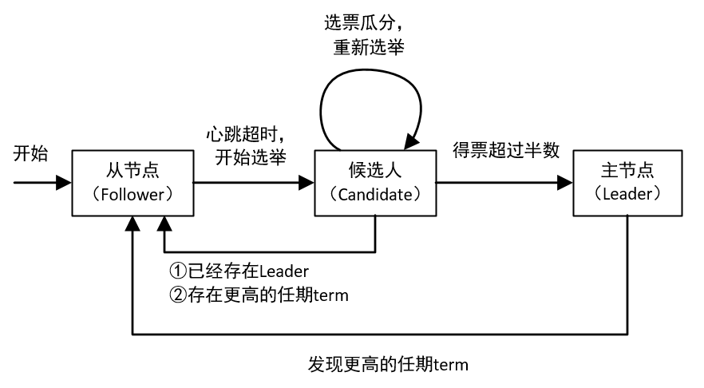


**总结：Leader选举的流程**（具体流程见下一小节）

（1）第一阶段：ETCD集群启动时，选举Leader过程

（2）第二阶段：集群的Leader节点宕机时，选举Leader过程

（3）第三阶段：集群中Leader宕机并恢复后，加入集群时的状态转换过程


### 4.5.4、<font color='red'>Leader选举流程（详细）</font>

- **第一阶段：ETCD集群启动时**

  1. ETCD集群启动时，Raft算法给每个节点设置了随机的超时时间（控制在一定范围内的随机值）——这样可以降低同时出现多个节点心跳超时的概率，减小瓜分选票出现的概率。
  2. 此时，集群中的节点都是Follower节点，不存在Leader节点。需要从Follower节点中选举出一个Leader节点。
  3. 等待集群中有一个Follower节点出现心跳超时，该Follower节点 =》Candidate节点**（并给自己的任期 + 1）**，开始给其他节点发起投票请求，即：进入Leader选举。（一般来说，因为设置了随机超时时间，所以集群刚启动时，同时只有一个Follower节点 =》Candidate，这个阶段进行Leader选举，可以成功获取50%以上的选票，产生一个Leader节点）

  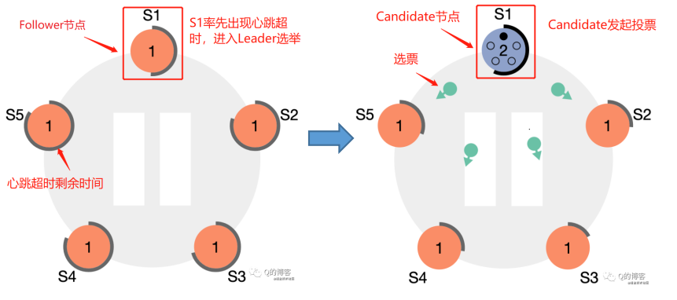

  

- **第二阶段：ETCD集群的Leader节点宕机**（开始选举新的Leader节点——**Candidate节点状态的转换**）

   Candidate节点发起投票后，可能存在3种结果：（一般来说，ETCD集群刚启动时，进行第一次Leader选举都会成功）

  1、选举成功； 2、选举失败； 3、选举超时

  

  - **选举成功**

    该Candidate节点获取了50%以上的Follower节点选票，成功转变为Leader节点，并且发送自己的心跳报包至Follower节点，以维持整个集群的正常运行。

    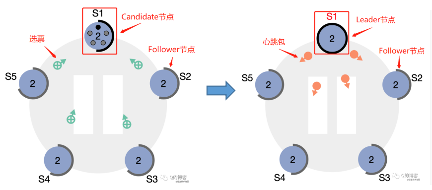

  - **选举失败**（ETCD集群的Leader节点宕机后，再次恢复后，加入集群时）

    当Candidate节点进行Leader选举时，收到了某个Leader节点（该节点可能之前时Leader，但是宕机了，现在又恢复了）发送来的心跳包。此时需要判断该心跳包中的任期term和Candidate节点的term大小：

    - 该心跳包中的任期term **≥** Candidate节点的term

      说明集群中已经选举出新的Leader节点。Candidate节点切换为Follower节点，结束选举流程。

      

    - 该心跳包中的任期term **<** Candidate节点的term

      该Candidate继续进行Leader选举流程，直至集群中选举出新的Leader节点。

  - **选举超时**（选票瓜分情况）

    集群中存在多个Candidate节点参与选举Leader节点。此时所有的Candidate节点的得票一致，无法选举出新的Leader节点。就需要进行下一轮Leader选举，直至集群中选举出新的Leader节点。

    

  

- **第三阶段：ETCD集群的Leader节点宕机后，再次恢复后，加入集群时**

  1. 当集群中的Leader节点宕机时，集群中已经心跳超时的Follower节点会进入Leader选举流程，Follower节点 =》 Candidate节点，Candidate节点的term + 1，并开始投票流程，成功选举某个Candidate节点为Leader节点。
  2. 此时，宕机的Leader节点恢复，集群中会出现一个过期的Leader节点。当过期的Leader节点接收到新Leader节点发送的心跳包时，由于该过期的Leader节点的term **小于** Candidate的term， 该过期节点会变为Follower节点。

  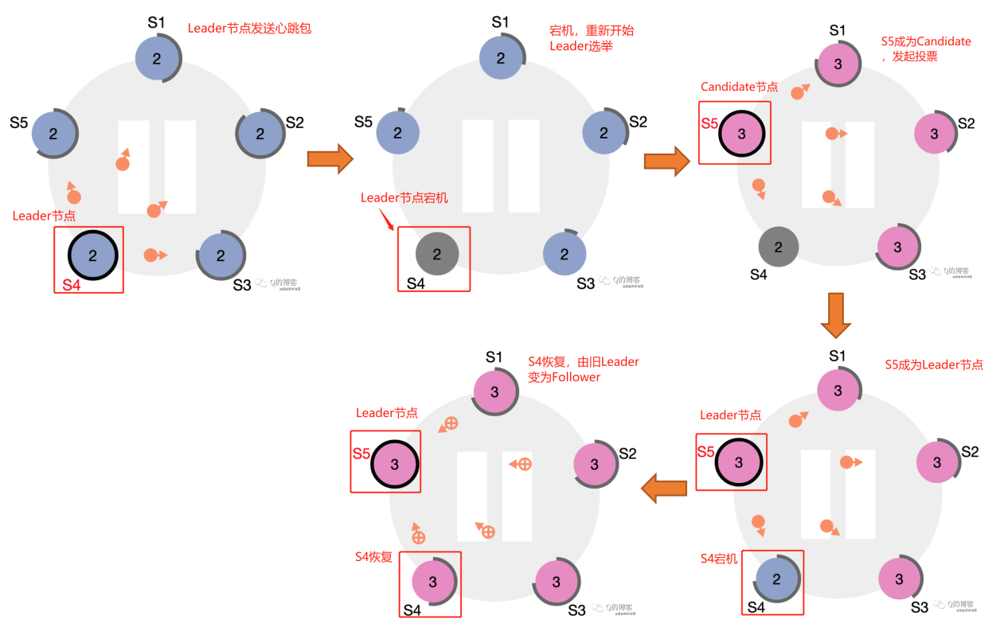


# 5、ETCD高级

## 5.1、限制ETCD性能的因素

ETCD性能测试参考链接：https://developer.aliyun.com/article/719079

- **限制因素：**

  影响 etcd 扩展性的一个关键问题在底层 bbolt db 的 page 页面分配算法上：随着 etcd 中存储的数据量的增长，bbolt db 中线性查找“连续长度为 n 的 page 存储页面”的性能显著下降。

- **解决方式：**

  通过基于 segregrated hashmap 的空闲页面管理算法，hashmap 以连续 page 大小为 key, 连续页面起始 page id 为 value。通过查这个 segregrated hashmap 实现 O(1) 的空闲 page 查找，极大地提高了性能。在释放块时，新算法尝试和地址相邻的 page 合并，并更新 segregrated hashmap。

  通过这个算法改进，我们可以将 etcd 的存储空间从推荐的 2GB 扩展到 100GB，极大的提高了 etcd 存储数据的规模，并且读写无显著延迟增长。

  **参考连接：**https://www.cncf.io/blog/2019/05/09/performance-optimization-of-etcd-in-web-scale-data-scenario/?spm=a2c6h.12873639.0.0.3cf050eaGX979R


