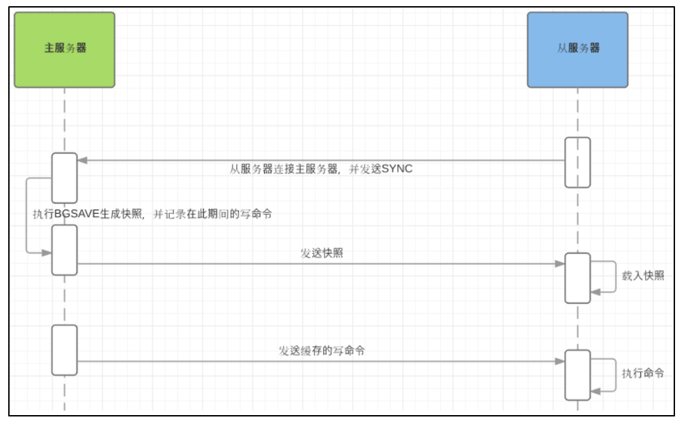
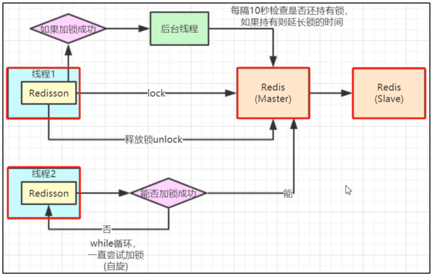

# 1、Redis基础

## 1.1、Redis基本概念

Redis全称：remote directionary server（远程字典服务器），属于非关系型数据库。也是分布式内存数据库，基于内存运行。存储的是key-value数据，也被称为“数据结构服务器”。特性：

- redis可对数据持久化，将数据保存在硬盘中，等到下次启动 redis时，从硬盘中加载数据；
- redis不仅仅支持key-value数据，还支持string、list、set、hash结构的数据；
- 支持数据备份，使用master-slave模式


## 1.2、Redis五大数据类型

- String：

 

- List：

  底层是链表结构，可以在节点的左、右两边插入元素

-  Hash：

  类似于java中的HashMap<String,Object>，也是采用这种方式添加元素的。

-  Set：

  类似于java中的Set，是无序、不重复的集合；存储的是String类型的数据。

- Zset：

  sorted set，有序的Set，每个数据都有一个double类型的分数，按照分数从小到大排序。

  

- 特殊的数据类型

  - Geospatial：

    地理位置

  - Hyperloglog：

    基数统计，存放大量数据时，根据输入元素计算基数集（不重复元素）

  - bitmap

    位存储，使用一个bit来存放数据，可以用作计数（上下班打卡）

    eg：setbit month 1 1  //第一个位置存入1

    setbit month 2 1  //第二个位置存入1

    bitocunt month   //输出2 


## 1.3、常用命令

- **string类型**

  - **redis-cli**：启动redis客户端；

    redis-cli –h 远程主机IP –p 端口 –a 密码：连接远程主机 

  - **redis-server**：启动redis服务端；

  - del key：删除key键；

  - exist key：是否存在这个key；
  - expire key x秒：设置key的过期时间（秒）；
  - prexpire key x毫秒：设置key的过期时间（毫秒）；
  - persist key：移除key的过期时间； 
  - keys *：查找出所有的key；
  - **keys ch\***：查找出所有以“ch”开头的key ；
  - **select x**：选择数据库x，将当前缓存的数据都放到第x个数据库； 
  - move chris x：将“chris”数据移动到第x个数据库中； 
  - ttl key：返回key的剩余存活时间（秒）；
  - pttl key：返回key的剩余存活时间（毫秒）；
  - randomkey：从当前数据库中随机获取一个key；
  - type key：返回key的数据类型； 
  - dump key：序列化key，并返回key被序列化的值；
  - **set key** **“value”**：给key设置value值；
  - **get key**：获取key的value值；
  - getrange key 开始位置 结束位置：获取key指定范围的value值；

  ​       0 -1 ：则是获取所有vaule值；

  - mset key1 "Hello" key2 "World"：同时设定多个key-value值；

  - mget key1 key2：同时获取多个key值； 

  - strlen key：获取key的value值的长度；

  - setex key 60 “chris”：设置key的value = chris，过期时间为60秒；

  - incr key：key的value值 + 1；

  - incrby key x：key的value值 + x；

  - decr key： key的value值 - 1；

  - decrb key x： key的value值 – x；

  - append key x：key的value值是字符串时，在尾部添加字符串x；

  - **flushall**：删除所有数据库中的数据；

  - **flushdb**：删除当前所在数据库中的数据；

    

- **List**类型

  - **lpush list** **“chris”**：向指定列表**list头部**中存入“chris”数据；可以同时存入多个数据；
  - blpop list x秒：用阻塞的方式弹出list列表数据，当list中没有数据时，会阻塞10秒再结束弹出操作；（获取列表的第一个元素）

  - **lpop list**：移除list列表的第一个元素；
  - brpop list x秒：用阻塞的方式弹出list列表数据，当list中没有数据时，会阻塞10秒再结束弹出操作；（获取列表的最后一个元素）；
  - **rpop list**：移除list列表的最后一个元素；
  - llen list：获取list列表数据的长度；
  - lrange list 开始位置 结束位置：获取list列表中指定范围的数据；

  ​       0 -1：获取list所有的数据； （索引从0开始）

  - lrem list x “chris”：移除列表list中x个为“chris”的数据。

    

- **Hash类型**

  - **hset person** **“name” “chris”**：在指定的hash表中（person），存放指定的数据（key = name、value = chris）

  - **hget person** **“name”**：获取hash表指定key的value值；

  - hdel person “name”：删除制动hash表（persion）中指定的key；

  - hgetall person：获取指定hash表（persion）中所有的key值； 

  - **hlen person**：获取指定hash表（persion）的字段数量；

  - hkeys person：获取指定hash表（persion）中所有key；

  - hvals person：获取指定hash表（persion）中所有的value值；

    

- Set类型

  - **sadd set** **“chris”**：在set集合中添加元素chris；

  - smembers set：获取set中所有的元素 

  - scard set：获取set集合的成员个数； 

  - spop set x：随机移除set集合中x个元素；

  - srandmember set x：随机返回set集合中x个元素；

     eg：抽奖。**使用Redis做关注模型：**eg：微信公众号中的好友共同关注数量

  - sismenber set “cc”：判断“cc”是否为set集合的成员；

  - sinter set1 set2 set3：求交集，set1 set2 set3共有的

  - sunion set1 set2 set3：求并集，set1 + set2 + set3

  - sdiff set1 set2 set3：在set1中去除（set2 + set3）存在的数据。即：set1 - （set2 + set3）

    

    

- **Zset类型**

  - **zadd zset 99** **“chris”**：在集合zset中添加chris元素，分数 = 99；

  - zrange zset 开始位置结束位置 withscors：获取zset集合在指定范围的元素，按照分数从小到大排序；

    0 -1：获取zset集合的所有元素；

  - zcard zset：获取zset集合的元素个数；
  - zcount zset minscore maxscore：获取zset集合中，所有分数在指定区间的元素个数；
  - zrange salary 0 -1 withscore：显示所有成员及其 score 值
  - zscore salary “chris”：获取zset集合中，chris的分数；


## 1.4、Redis数据存储模型

redis中的数据存储都是一样的：key-value。不同的是value存储的数据结构不同，eg：String、hash、list、set、zset、bitmap、Geospatial、Hyperloglog。


## 1.5、Redis配置文件：redis.conf

**注意：**redis配置文件对大小写不敏感

- 网络配置

  -  

- **GENERAL**通用配置

  - Daemonize：设置为守护线程（后台运行）。需要指定pid文件：pidfile /var/run/redis_6379.pid

  - Pidfile：进程管道id文件，如果没有指定其他路径，就用默认路径指定pid

  - Port：端口

  - tcp-backlog

    - 设置tcp的backlog，backlog其实是一个连接队列，backlog队列总和 = 未完成三次握手队列 + 已经完成三次握手队列。

    - 在高并发环境下，需要一个高backlog值来避免慢客户端连接问题。注意Linux内核会将这个值减小到/proc/sys/net/core/somaxconn的值，所以需要确认增大somaxconn和tcp_max_syn_backlog两个值来达到想要的效果。

  - Timeout：超时

  - Bind：

  - Tcp-keepalive：单位为秒，如果设置为0，则不会进行Keepalive检测，建议设置成60 

  - Loglevel：日志级别，eg：notice

  - Logfile：日志文件名

  - Syslog-enabled：是否把日志输出到syslog中

  - Syslog-ident：指定syslog里的日志标志

  - Syslog-facility：指定syslog设备，可以是USER或LOCAL0 - LOCAL7

  - Databases：数据库，**默认情况下有16个库**

    

- 快照

  用于持久化，在多少时间内需要进行持久化，**将数据保存到.rdb或者.aof文件中**。（因为redis是把数据保存到内存RAM中，如果机器断电，就会使数据丢失） 

  - save ""         //禁用快照

  - save 900 1   //900秒内有1次操作，就进行持久化操作

  - save 300 10

  - save 60 10000

  - dir ./             //rdb文件保存的位置

    

- replication主从复制

  

- security安全

  在redis的命令行中使用下面的命令

  - 查看密码：config get requirepass
  - 设置密码：config set requirepass "123456"
  - 删除密码：auth 123456

  

- **LIMITS**限制

  - maxclients 1000 ：客户端连接上限1000个

  - maxmemory <bytes>：redis占用的最大内存

  - maxmemory-policy noevication：内存到达最大上限后的处理策略

    **缓存清除的6种机制：**清除快要到期的key数据

    - volatile-lru：使用LRU算法移除key，只对设置了过期时间的键

    - allkeys-lru：使用LRU算法移除key

    - volatile-random：在过期集合中移除随机的key，只对设置了过期时间的键

    - allkeys-random：移除随机的key

    - volatile-ttl：移除那些TTL值最小的key，即那些最近要过期的key

    - noeviction：不进行移除。针对写操作，只是返回错误信息。

      

- AOF模式

  - appendonly no：默认不开启
  - appendfilename “apendonly.aof”： 持久化的文件名字
  - appendfsync everysec：每一秒执行一次sync
  - appendfsync always：每次修改都会进行sync
  - appendfsync no：不执行sync，系统子集同步数据


# 2、Redis持久化机制

redis的持久化机制和VMware中的快照一样，可将当时保存的数据恢复，读取到内存中。

## 2.1、RDB

**<font color='red'>RDB：redis database，redis的持久化默认机制，保存二进制格式的数据</font>**

- **RDB进行持久化的流程**

  - redis创建（fork）一个子进程来进行持久化。将数据都写到临时的文件中；

  - 此时父进程会阻塞（无法处理其他的请求），子进程单独拷贝父进程的数据（在共享内存中），然后进行数据持久化。当内容写入完毕后，就会替换原来的rdb文件；

  - 写入完成之后，父进程可以继续响应后面的请求。

    


- **RDB**的特点

  - 适合大规模的数据恢复；

  - fork子进程会占用一定的内存空间

  - 如果redis意外宕机，就会只能恢复到最近的一次rdb数据

    


- **触发rdb的情况**
  - 满足redis.conf配置文件中的save情况
  - 执行flushdb指令
  - 退出redis


- 问题：**为什么redis是fork一个子进程而不是子线程来进行持久化？**

  因为，redis响应客户端的模式是：单进线和单线程的，如果在主进程内启动一个线程，这样会造成对数据的竞争条件。所以为了避免使用锁降低性能，**Redis选择启动新的子进程，独立拥有一份父进程的内存拷贝**，以此为基础执行RDB持久化。


## 2.2、AOF

**AOF：append only file，保存操作命令**

- **AOF的持久化流程**

  - **父进程：**fork一个子进程，父进程缓存操作数据的指令（除了读指令）；

  - **子进程：**保存内存中的数据到临时的AOF文件中，保存完数据后通知父进程；

  - **父进程：**将缓存的操作数据的指令（除了读指令）写入到临时的AOF文件中。完成后，将原来的AOF文件替换成临时的AOF文件。以后写入的指令都保存到这个新的AOF文件中

    


- **AOF的特点**

  - 每次保存的都是最新的数据操作指令（除了读数据指令）；

  - redis宕机后，可以恢复到最新的数据状态；

  - 由于redis的AOF是不断追加的，因此AOF文件会比较大，如果AOF文件大于64MB，就会重新fork一个子进程来对AOF文件进行写数据（重写aof文件，把对某些key重复的操作进行整合，减少aof文件中的操作数量）

  - 由于AOF存的数据多，因此恢复数据也比较慢，但是数据同步率高，数据保留完整；

    


- 问题：**同时开启两种持久化机制:RDB、AOF会怎么样？**

  redis会优先使用AOF来恢复数据，因为AOF保存的数据比RDB更完全

  

## 2.3、混合持久化模式：RDB + AOF

redis先把数据备份以RDB方式写入.aof文件中，然后把之后 的操作命令放入到aof文件尾部。


# 3、Redis事务

**注意：Redis中没有隔离级别的概念。**

- **Redis执行事务的流程**

  开始事务 à redis命令入队 à 执行事务

  

- **Redis事务特性**

  - Redis的事务**不具备原子性**，**即：事务里面某些语句执行失败时，不会回滚，其他语句仍然执行；（**若，事务中的命令存在错误，则该事务中所有的命令都不会执行**）

  - 批量执行redis命令时，需要在执行exec命令前，将所有批量操作命令放到队列中；

  - 事务执行过程中，其他客户端提交的命令不会放到该事务中执行；


- **Redis事务的命令**
  - mutli：新事务的开始的标志；
  - exec：执行事务块中的所有命令；
  - discard：取消事务；
  - watch key1 key2：监视某个事务块中的某些key，当这些key被修改，在执行该事务块时，会使这个key相关的语句执行失败（其他的语句正常执行）；
  - unwatch：取消监视所有的key。


# 4、Redis进阶

## 4.1、Redis实现乐观锁

- 命令：watch 监控对象

- 测试：使用两个客户端模拟多线程

  - 客户端1：

    ```shell
    set money 100
    
    watch money
    
    multi
    
    decrby money 20
    ```

    

  - 客户端2：

    ```shell
    mutli
    
    decrby money 50
    
    exec        //执行这个事务
    ```

    

  - 客户端1：

    ```shell
    exec  //执行（1）中的事务
    ```

    若，上述命令无法成功，是因为客户端2将其修改

    **解决方法：**

    执行unwatch，先解锁

    然后再次执行watch money


## 4.2、Redis消息订阅

**一般不会用这个，有专门的MQ，eg：rabbitmq**

- 推送命令：publish
- 订阅命令：subscribe


##　4.3、主从复制

**redis主机宕机后，需要手动选择主机**

- 默认情况下，所有redis机器都是主机

- **所有的写操作都是在msater（主机）上执行的，然后同步更新到slave（从机）上**，因此master到slave上有延时，当写请求很频繁时（或者slave从机多），会导致延时更加严重；**必须保证主机不会宕机，否则当主机宕机后，从机无法继续获取数据。**

  

- **<font color='red'>主从复制的流程</font>**

  **从机第一次连接主机：先全增式复制 ， 后增量式复制**

  - **全增式复制：**

    - 从机第一次连接上主机，发送SYN命令；

    - 主机接收到SYN后，开始执行BGSAVE命令，生成RDB文件，并且用缓存区存储那些被阻塞的命令；

    - 主机执行完BGSAVE后，向所有从机发送RDB的快照文件，并且执行那些缓冲区的命令；

    - 从机接收完RDB文件后，直接覆盖原有的数据；

      

  - **增量式复制：** 
    - 在从机完成全增式复制后，就会接收来自主机发送缓存的写命令，将其保存在RDB文件中；

​	


- **主从复制的作用**

  - **读写分离：**

    **主机：**所有的写操作都在上进行；

    **从机：**负责读取数据，每当主机有新数据写入时，从机自动获取到主机的数据；

    **从机的复制原理：**

    **从机刚接入主机时，使用的是全增复制（即：把主机上的数据全部复制到从机上），当下次主机存入新数据时，从机采用增量式复制（即：从机只复制此次更新的数据）**

  - **容灾机制：**

  - **数据冗余：**

    实现数据热备份。

  - **高可用：**

    基于主从复制的哨兵模式、集群。


- **配置主机、从机的方式** 

  使用命令info replication查看当前机器的配置信息；


## 4.4、哨兵模式

- **本质：**

  就是主从复制**，只不过在主从复制上增加了**主机竞选机制**——当redis主机宕机时，会依赖sentinel进程在从机中投票选举出一个主机，并将原主机的配置放到这个从机上，配置完成后，将新主机的配置广播给其他从机。

  

- 集群中的所有sentinel不会并发着去对同一个主节点进行故障转移。故障转移只会从第一个sentinel开始，当第一个故障转移失败后，才会尝试下一个。当选择一个从节点作为新的主节点后，故障转移即成功了


## 4.5、Redis的集群

- **Redis集群的基本概念**

  - Redis集群并不支持处理多个keys的命令,因为这需要在不同的节点间移动数据。

   

  - Redis集群的数据分片，没有使用一致性hash, 而是引入了哈希槽的概念。Redis 集群有16384个哈希槽,每个key通过CRC16校验后对16384取模来决定放置哪个槽.集群的每个节点负责一部分hash槽。 每个集群至少需要3个主服务器才能使用，默认需要16384个哈希槽都能使用时，集群才能对外提供服务。

   

  - **redis** **集群的从节点本身只有备份作用，不进行读也不直接写，只备份主机的数据，唯一作用是当master宕机了，其中一个从机会升级为主。**

  

- **hash槽（slots）的概念**

  - objective数据经过CRC16 % 16384计算后，存储到对应的Node中（每个Node节点都对应一段哈希槽的范围），当有Node节点宕机，这个节点的哈希槽会被均匀分配到其他Node节点上。

  - **特点：**

    - **缺点：**每个Node承担着互相监听、高并发数据写入、高并发数据读出，工作任务繁重

    - **优点：**将Redis的写操作分摊到多个节点上，提高写的并发能力，扩容简单；

  


- **<font color='red'>Redis集群的架构</font>**

  需要先进行CRC16计算，将数据分配到某个哈希槽中（逻辑节点），每个节点中都是主从模式。

  - 想扩展并发读就添加Slaver；

  - 想扩展并发写就添加Master；

  - 想扩容也就是添加Master，任何一个Slaver或者几个Master挂了都不会是灾难性的故障。

  


## 4.6、Redis实现分布式锁

### 4.6.1、Redis实现分布式锁的方式

- **使用redission**

  redission使用了后台线程维护lockKey的过期时间

  

  

### 4.6.2、Java+Redis实现分布式锁

代码中没有使用后台线程维护lockKey的过期时间

```java
@Autowired
@Qualifier("redisCustomizeTemplate")
private RedisTemplate redisTemplate;
public String sell(){
    //商品名字
    String productName = "rice_#001";
    //锁名字
    String lockKey = "lock_rice_#001";
    //每个线程一个锁id：防止其他线程调用finally中的delete删除该线程的lockKey
    String clientId = UUID.randomUUID().toString();
    //尝试获取锁
    try{
        //如果无法setnex数据，即：这个锁被占用，设置key过期时间
        boolean res = redisTemplate.opsForValue().setIfAbsent(lockKey, clientId, 30, TimeUnit.SECONDS);
        if(!res){
            return "get lock failure!";
        }
        //成功获取锁，下单操作
       int stock = Integer.valueOf((Integer) redisTemplate.opsForValue().get(productName));
        //判断库存是否充足
        if(stock > 0){
            System.out.println("当前商品剩余量 = " + stock);
            redisTemplate.opsForValue().set(productName, stock - 1);
            return "当前商品剩余量 = " + stock;
        } else{
            System.out.println("ERROR：当前商品剩余量 = " + stock);
            return "ERROR：当前商品剩余量 = " + stock;
        }
    }
    //finally解锁
    finally{
	//判断当前线程是否持有这个分布式锁：是，就删除这个锁
if(clientId.equals(redisTemplate.opsForValue().get(lockKey))){
           redisTemplate.delete(lockKey);
        }
    }
}
```


# 5、Redis开发使用的示例代码

## 5.1、准备工作

- 安装Docker
- 安装redis：直接在Docker中安装
  - 命令：
    - docker search redis
    - docker pull redis
- 安装RedisDesktopManager：redis的客户端，查看redis中的数据


## 5.2、Go使用Redis的代码

- 需要安装redis的依赖包
  
  - 命令：go get github.com/garyburd/redigo/redis
  
  ```go
  package main
  
  import (
  	"fmt"
  	"github.com/garyburd/redigo/redis"
  )
  /**
   * Created by Chris on 2021/7/1.
   */
  
  //redis连接池
  var pool *redis.Pool
  
  //启动时，自动初始化连接池
  func init(){
  	pool = &redis.Pool{
  		// 初始化链接的代码， 链接哪个ip的redis（这里，连接docker中的redis，因此端口不是redis默认的6379）
  		Dial: func() (conn redis.Conn, err error) {
  			return redis.Dial("tcp", "192.168.154.19:4000")
  		},
  		TestOnBorrow:    nil,   //提供一个方法，用来诊断一个连接的健康状态
  		MaxIdle:         8,		//最大空闲链接数
  		MaxActive:       0,		//表示和数据库的最大链接数， 0 表示没有限制
  		IdleTimeout:     100,	//最大空闲时间
  		Wait:            false, //如果Wait被设置成true，则Get()方法将会阻塞
  		MaxConnLifetime: 0,     //关闭早于此时间的连接。如果为0，则连接池不会根据年龄关闭连接。
  	}
  }
  
  func main(){
  	//获取连接
  	conn := pool.Get()
  	//退出程序时，关闭连接
  	defer conn.Close()
  
  	//存入数据：string
  	_, err := conn.Do("Set", "name", "chris_zhang")
  	if err != nil{
  		fmt.Println("set error = ", err)
  		return
  	}
  
  	//取出数据：string
  	getData, err := redis.String(conn.Do("Get", "name"))
  	if err != nil{
  		fmt.Println("get error = ", err)
  		return
  	}
  	fmt.Println("getData = ", getData)
  
  	//写入数据：key-val数据： [string] int/string
  	_, err = conn.Do("HMSet", "user01", "name", "FJY", "age", 19)
  	if err != nil {
  		fmt.Println("HMSet  err=", err)
  		return
  	}
  
  	//读取数据：key-val数据： [string] int/string
  	r, err := redis.Strings(conn.Do("HMGet","user01", "name", "age"))
  	if err != nil {
  		fmt.Println("HMGet  err=", err)
  		return
  	}
  	for i, v := range r {
  		fmt.Printf("r[%d]=%s\n", i, v)
  	}
  }
  ```


# 常见问题

# 1、NoSQL数据库的类型：4种

-  key-value：键值对的数据库，eg：redis

-  document store：文档类型的数据库，eg：mongoDB

- column oriented：基于列的存储数据库：

- graph database：图形数据库


