# 1、OpenStack入门

## 1.1、云服务的基本概念

- 云服务模式
  - IaaS：基础设施即服务

    用户通过网络获取虚机、存储、网络，然后用户根据自己的需求操作获取的资源。 典型应用：亚马逊AWS等

  - PaaS：平台即服务

    将软件研发平台作为一种服务， 如Eclipse/Java编程平台，服务商提供编程接口/运行平台等。典型应用：Google AppEngine、Force.com、微软Azure等 

  - SaaS：软件即服务

    将软件作为一种服务通过网络提供给用户，如web的电子邮件、HR系统、订单管理系统、客户关系系统等。用户无需购买软件，而是向提供商租用基于web的软件，来管理企业经营活动。典型应用：Google Doc、Saleforce.com、Oracle CRM On Demand、Office Live Workspace等


- 云应用形式

  -  私有云

    将基础设施与软硬件资源构建于防火墙内，基于iaas构建私有云平台供企业内部使用，开源组件有：openstack（最为出色），cloudstack等

  - 云存储

    云存储系统是一个以数据存储和管理为核心的云计算系统

  - 云游戏

    游戏运行云平台服务端，云平台将游戏画面解压缩后传给用户，用户端无需高配置处理器和显卡，只需要基本的视频解压缩能力即可。

  - 云物联

    基于云平台实现物物相连的互联网。

  - 云安全

    通过网状的大量客户端检测网络中软件的异常,获取木马，恶意程序的最新信息，推送到云平台服务端自动分析和处理，再把解决方案发送给每一个客户端。云平台使用者越多，越安全。

  - 公有云

    云平台对外开放，主要以Iaas和Paas为主，较为成熟的是Iaas，如阿里云，腾讯云，青云，ucloud，首都在线等

  - 混合云  

    公有云和私有云的结合，即对企业内部又对企业外部，例如AWS


## 1.2、OpenStack的网络架构

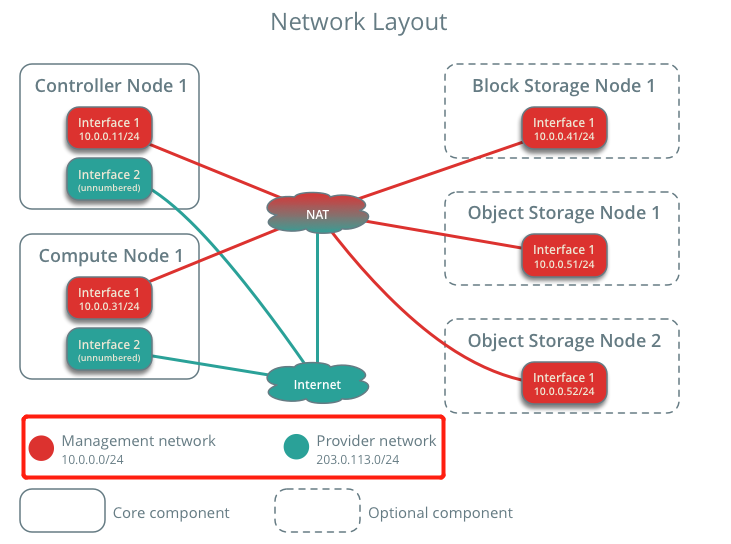

**OpenStack的网络分为两种：**

- **provider networks（供应商网络）**

  - 作用：主要用于OpenStack部署在**公网服务器**中，负责各个节点的通信
  - 提供商网络选项以最简单的方式部署 OpenStack 网络服务，主要是第 2 层（桥接/交换）服务和网络的 VLAN 分段。从本质上讲，它将虚拟网络连接到物理网络，并依赖物理网络基础设施提供第 3 层（路由）服务。此外，DHCP服务还为实例提供 IP 地址信息。

  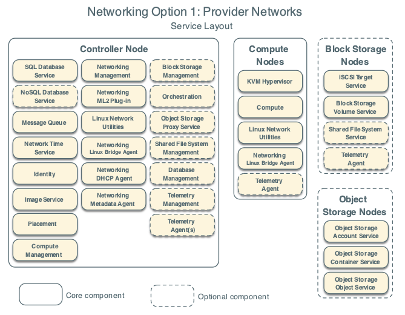

  

- **Self-service networks（自助服务网络）**

  - 作用：主要用于OpenStack部署在**局域网服务器**中，负责各个节点的通信。
  - 自助服务网络选项通过第 3 层（路由）服务增强了提供商网络选项，这些服务支持 使用[VXLAN](https://docs.openstack.org/install-guide/common/glossary.html#term-Virtual-Extensible-LAN-VXLAN)等覆盖分段方法的[自助服务](https://docs.openstack.org/install-guide/common/glossary.html#term-self-service)网络。本质上，它使用[NAT 将](https://docs.openstack.org/install-guide/common/glossary.html#term-Network-Address-Translation-NAT)虚拟网络路由到物理网络。

  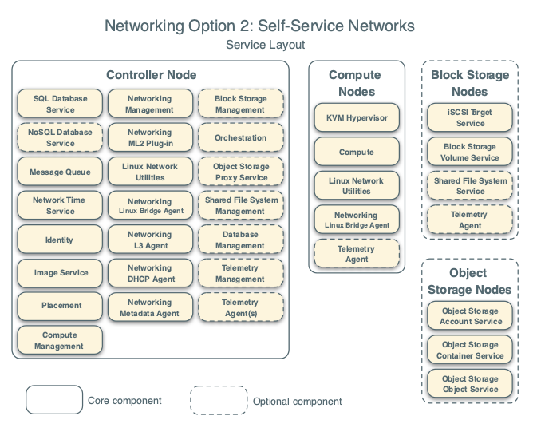


## 1.3、OpenStack的硬件架构

- 控制节点（controller node）

  - 控制器节点运行身份服务（Identity service：keystone）、镜像服务（Image service：glance）、放置服务（Placement service：placement）、计算的管理部分、网络的管理部分、各种网络代理（networking agent：neutron）、仪表板（dashboard：horizon）。还包含：支持服务，eg： SQL 数据库、消息队列和 NTP。控制器节点运行部分块存储（cinder）、对象存储（switf）、编排（heat）和遥测服务。

  - 控制器节点至少需要两个网络接口。

  

- 计算节点（compute node）

  - 计算节点运行运行实例的 Compute的管理程序部分。默认情况下，Compute 使用 KVM管理程序。计算节点还运行网络服务代理，将实例连接到虚拟网络，并通过安全组为实例提供防火墙服务 。

  - 可以部署多个计算节点。每个节点至少需要两个网络接口。

  

- 块存储节点（block storage node）

  - 块存储节点包含块存储和共享文件系统服务为虚拟机提供磁盘。

  - 可以部署多个块存储节点。每个节点至少需要一个网络接口。

  

- 对象存储节点（object storage node）

  - 对象存储节点用来存储虚拟机中的数据，包含存储帐户、容器和对象的磁盘。
  - 此服务需要两个节点。每个节点至少需要一个网络接口。您可以部署两个以上的对象存储节点。

  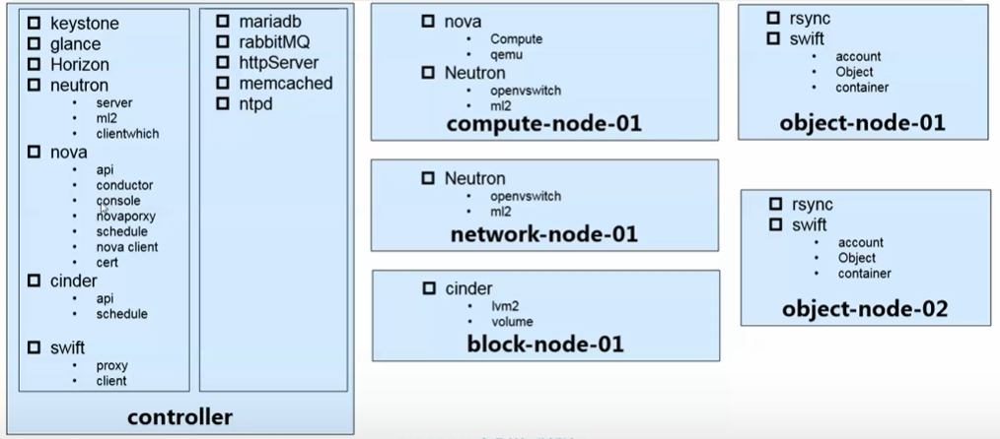

  

- **各个节点的硬件配置需求**

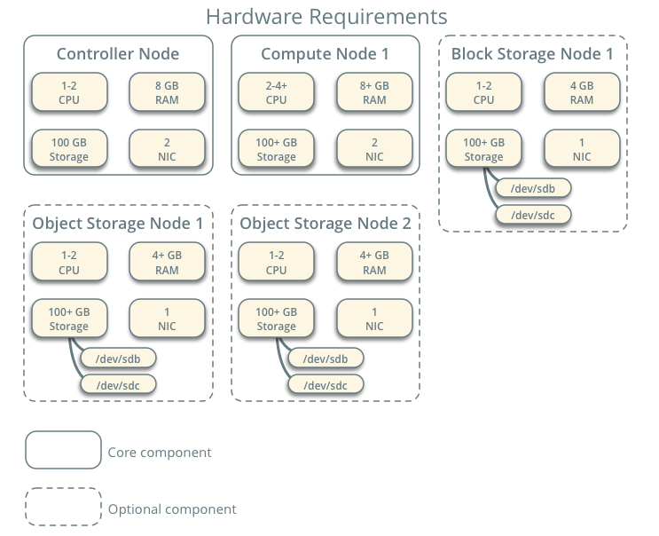


## 1.4、OpenStack的基本组件架构

- 主要的组件

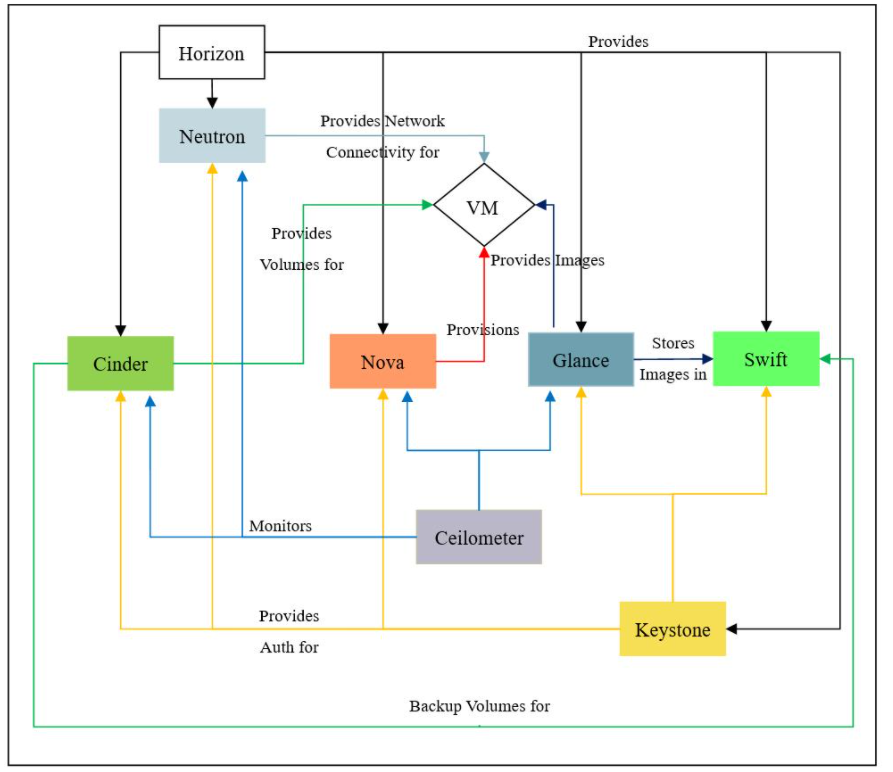

- **核心项目（3个）**

  1. 控制台

     服务名：Dashboard

     项目名：Horizon

     功能：web方式管理云平台，建云主机，分配网络，配安全组，加云盘

    

  2. 计算

     - 服务名：计算

     - 项目名：Nova

     - 功能：负责响应虚拟机创建请求、调度、销毁云主机

     - **Nova包含的模块：**

       - `nova-api` 服务

         接受并响应最终用户计算 API 调用。该服务支持 OpenStack Compute API。它执行一些策略并启动大多数编排活动，例如运行实例。

       - `nova-api-metadata`服务

         接受来自实例的元数据请求。`nova-api-metadata`在多主机模式下运行`nova-network` 时，会使用该服务。

       - `nova-compute` 服务

         通过管理程序 API 创建和终止虚拟机实例的工作守护进程。例如：

         - 用于 XenServer/XCP 的 XenAPI
         - 用于 KVM 或 QEMU 的 libvirt
         - 适用于 VMware 的 VMwareAPI

       - `nova-placement-api` 服务

         跟踪每个提供商的库存和使用情况。

       - `nova-scheduler` 服务

         从队列中获取虚拟机实例请求并确定它在哪个计算服务器主机上运行。

       - `nova-conductor` 模块

         调解`nova-compute`服务和数据库之间的交互。避免了`nova-compute`服务直接访问云数据库 。不可将其部署在`nova-compute`服务节点上。

       - `nova-consoleauth` 守护进程

         为控制台代理提供的用户授权令牌。

       - `nova-novncproxy` 守护进程

         提供用于通过 VNC 连接访问正在运行的实例的代理。支持基于浏览器的 novnc 客户端。

       - `nova-spicehtml5proxy` 守护进程

         提供用于通过 SPICE 连接访问正在运行的实例的代理。支持基于浏览器的 HTML5 客户端。

       - `nova-xvpvncproxy` 守护进程

         提供用于通过 VNC 连接访问正在运行的实例的代理。支持特定于 OpenStack 的 Java 客户端。

       - 消息队列

         在守护进程之间传递消息的中心枢纽。通常用[RabbitMQ](https://www.rabbitmq.com/)实现 ，也可以用另一个 AMQP 消息队列实现，比如[ZeroMQ](http://www.zeromq.org/)。

       - SQL数据库

         通常采用MySQL、MariaDB

         

  3. 网络

     - 服务名：网络

     - 项目名：Neutron

     - 功能：实现SDN（软件定义网络），提供一整套API,用户可以基于该API实现自己定义专属网络，不同厂商可以基于此API提供自己的产品实现。**主要与 OpenStack Compute 进行数据交互。**Neutron用于管理 OpenStack 的虚拟网络基础设施 (VNI) 和物理网络基础设施 (PNI) 。能够创建：防火墙、负载均衡器和虚拟专用网络 (VPN) 等服务。
     
     - **Neutron包含的模块：**
     
       - Neutron服务器（Neutron-server）
     
         接受 API 请求并将其路由到相应的 OpenStack Networking 插件。
     
       - OpenStack Networking 插件和代理
     
         插入和拔出端口，用于创建网络或子网，并提供 IP 寻址。常见的代理有 L3（第 3 层）、DHCP（动态主机 IP 寻址）和插件代理。
     
       - 消息队列
     
         用于Neutron-server 和各种代理之间通信。还充当数据库来存储特定插件的网络状态。

  

- **存储项目 （2个）**

  1. 对象存储

     服务名：对象存储

     项目名：Swift

     功能：用来存OpenStack平台的数据，包含：帐户、容器、对象、**镜像数据**等。需要两个节点。每个节点至少需要一个网络接口。REST风格的接口和扁平的数据组织结构。RESTFUL HTTP API来保存和访问任意非结构化数据。

    

  2. 块存储

     服务名：块存储

     项目名：Cinder

     功能：提供持久化块存储，即为云主机提供附加云盘（相当于**虚拟机的硬盘**，可以通过cinder给虚拟机挂载多个硬盘）。包含：块存储和共享文件系统服务的磁盘。可以部署多个块存储节点。每个节点至少需要一个网络接口。有多种可用的驱动程序：NAS/SAN、NFS、iSCSI、Ceph 等

  

- **共享服务项目（3个）**

  1. 认证服务

     服务名：认证服务

     项目名：Keystone

     功能：为访问openstack各组件提供认证和授权功能，认证通过后，提供一个服务列表（存放你有权访问的服务），可以通过该列表访问各个组件。

    

  2. 镜像服务

     服务名：镜像服务

     项目名：Glance

     功能：为云主机安装操作系统提供不同的镜像选择

   

  3. 计费服务

     服务名：计费服务

     项目名：Ceilometer

     功能：收集云平台资源使用数据，用来计费或者性能监控

  

- **高层服务项目（1个）**

  1. 编排服务

     服务名：编排服务

     项目名：Heat

     功能：自动化部署应用，自动化管理应用的整个生命周期.主要用于Paas 


## 1.5、OpenStack新建云主机的流程

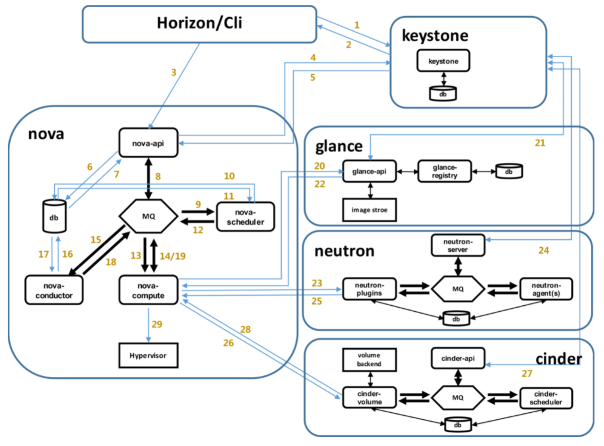


# 2、OpenStack基本概念

OpenStack在Liberty版本（2015.4）之后才使用python3开发，以前的版本都是基于python2.7

## 2.1、端点类型

- 每个服务可以有一个或多个端点，每个端点分为三种类型：管理（admin）、内部（internal）、公共（public）。在生产环境中，出于安全原因，不同的端点类型可能位于向不同类型用户公开的不同网络上。
  - 公共 API 网络：可能从 Internet 上可见，因此客户可以管理他们的云。
  - 管理 API 网络：可能仅限于组织内管理云基础架构的操作员。
  - 内部 API 网络：可能仅限于包含 OpenStack 服务的主机


# 3、底层通用组件

## 3.1虚拟化软件（hypervisor）

- **基本概念：**

  hypervisor是一种软件，运行在基础服务器中，允许存在多个操作系统、应用去共享服务器中的硬件设施。也称之为VMM（virtual machine monitor）——虚拟机监视器。

  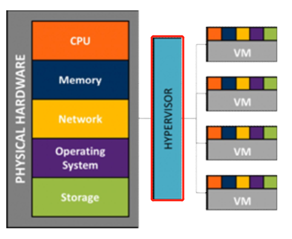

- **hypervisor分类：**

  - **全虚拟化（eg：KVM）**

    将虚拟机（VM）的指令集通过hypervisor转化为宿主机系统的指令集。通过hypervisor屏蔽了虚拟机系统和宿主机系统之间的差异。虚拟机具有Ring1（用户态）权限，宿主机具有Ring0（内核态权限）。

    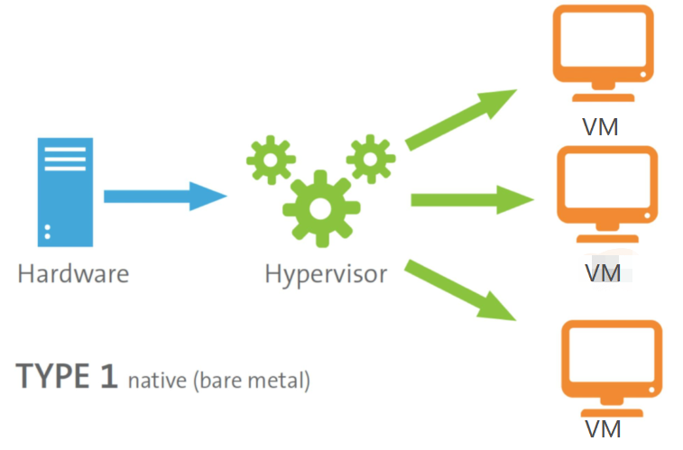

    全虚拟化采用Intel VT、AMD-V技术，但需要CPU支持该项技术：

    ```shell
    #查看Intel的CPU是否支持
    grep "vmx" /proc/cpuinfo
    
    #查看AMD的CPU是否支持
    grep "svm" /proc/cpuinfo
    ```

    

  - **半虚拟化（eg：qemu）**

    对虚拟机操作系统（VM）的内核进行修改，在全虚拟化的基础上，增加了一个专门的API，这个API可以将VM发出的指令进行优化，即：不需要Hypervisor进行翻译操作。因此，减小了Hypervisor的工作负担，提升了整体性能。对于某些不含该API的操作系统（eg：windows）来说，就不行能用这种方法。

    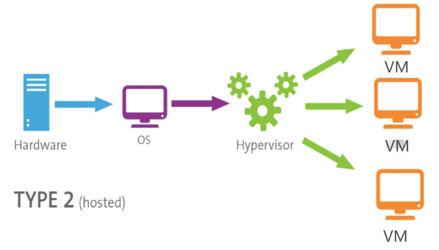

    

### 3.1.1、qemu

Qemu 是纯软件实现的虚拟化模拟器，可以模拟大多数硬件设备。虚拟机使用的硬件设备就是qemu模拟出来的。

- **KVM**：是硬件辅助的虚拟化技术，主要负责 比较繁琐的 CPU 和内存虚拟化。

- **qemu**：是负责 I/O 虚拟化。


### 3.1.2、KVM

KVM（kernel-based virtual machine）基于内核的虚拟机。需要CPU为X86架构、支持虚拟化技术（eg：Intel VT、AMD-V技术）。可以使得多个虚拟机使用同一个镜像，并为每个虚拟机配置硬件设备（eg：网卡、硬盘等）


## 3.2、libvirt

- 概念

  libvirt是一个开源的C函数库，提供API用于管理Linux中的虚拟化管理程序（eg：KVM）。Linux平台的虚拟化管理工具：图形化virt-manager、命令行模式virtsh，都是基于libvirt开发的。

  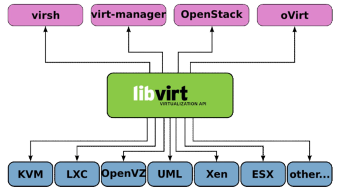

  

- 节点（Node）

  一个节点 = 一台物理机，一个节点可以运行多个虚拟机。Hypervisor、Domain都运行在节点上。

  

- 域（Domain）

  域，可称之为：实例instance、虚拟机VM、客户端操作系统guest OS。是在Hypervisor上运行的。


## 3.3、Open vSwitch（OVS）

- **概念**

  OVS是一个开源的软件交换机，用于实现交换机功能，eg：二层交换、网络隔离、QoS、流量监控。包含的基本名词如下：

  - Bridge：

    表示一个一台网交换机（switch），一个主机中可以创建多个Bridge设备。

  - Port：

    端口，类似于物理交换机中的端口，每一个端口都属于一个Bridge。

  - Interface：

    连接到Port的网络接口设备。

  - Controller：

    OpenFlow控制器。

  - Datapath：

    负责执行数据交换，在Flow table中查找接收端口收到的数据包，并执行匹配到的指令。

  - Flow table：

    每一个Datapath都和一个Flow table关联，当Datapath接收到数据之后，OVS会在Flow table中查找相匹配的Flow，然后执行对应的操作。

    

- **特点**

  - 支持openflow，openflow，定义了灵活的数据包处理规范。为用户提供L1-L4包处理能力。

    （L1、L4指的是：OSI七层模型中的物理层、传输层）

  - 支持多种Linux虚拟化技术，包括Xen、KVM以及VirtualBox


## 3.4、Linux Bridge

- **Linxu Bridge：**

  - 概念：

    Linux Bridge是一个虚拟设备，用于Linux中实现二层协议交换，类似于物理交换机的作用。该虚拟设备可以绑定多个以太网接口设备，并将其桥接起来。

  - 安装：

    yum install bridge-utils -y  

  - 配置命令：

    brctl  

    

- **桥接的概念：**

  - 依据OSI七层模型中的第二层（数据链路层）的地址，将数据包转发的过程
  - 桥接的方式，可以把一台机器中的多个网络接口连接起来。


## 3.5、WSGI

- 概念：

  WSGI（web server gateway interface），是一个规范，用于定义web server和web application交互流程，以及web application如何处理请求。和Apache的概念不同。

- 架构：

  - server：接收web客户端请求，然后传递给middleware
  - middleware：根据路由配置，将请求传递给application
  - application：处理请求。

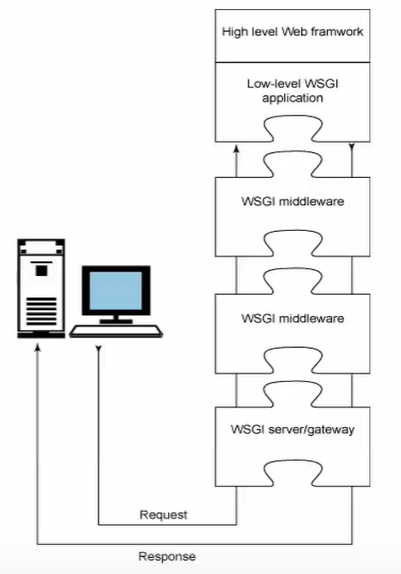


## 3.6、Paste Deployment

- 概念：

  Paste Deployment是一个WSGI工具包。

- 使用

  基于Paste Deployment的应用配置文件，该配置文件的内容被分为多端，通过前缀来识别。

  eg：

  - [app:main]：定义WSGI应用，main表示只有一个应用
  - [DEFAULT]：定义默认变量的值
  - [filter:]：定义过滤器。


## 3.7、MariaDB

MariaDB是MySQL的一个分支版本，采用XtraDB存储引擎，替代了MySQL的InnoDB。所有操作方式和MySQL一致。OpenStack中的Keystone、Cinder、Neutron、Nova都使用了该数据库。


