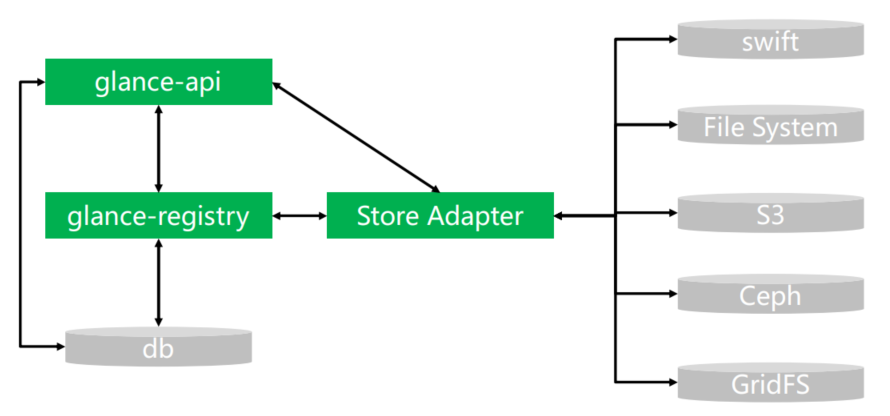

# 1、OpenStack入门

## 1.1、云服务的基本概念

- 云服务模式
  - IaaS：基础设施即服务

    用户通过网络获取虚机、存储、网络，然后用户根据自己的需求操作获取的资源。 典型应用：亚马逊AWS等

  - PaaS：平台即服务

    将软件研发平台作为一种服务， 如Eclipse/Java编程平台，服务商提供编程接口/运行平台等。典型应用：Google AppEngine、Force.com、微软Azure等 

  - SaaS：软件即服务

    将软件作为一种服务通过网络提供给用户，如web的电子邮件、HR系统、订单管理系统、客户关系系统等。用户无需购买软件，而是向提供商租用基于web的软件，来管理企业经营活动。典型应用：Google Doc、Saleforce.com、Oracle CRM On Demand、Office Live Workspace等


- 云应用形式

  -  私有云

    将基础设施与软硬件资源构建于防火墙内，基于iaas构建私有云平台供企业内部使用，开源组件有：openstack（最为出色），cloudstack等

  - 云存储

    云存储系统是一个以数据存储和管理为核心的云计算系统

  - 云游戏

    游戏运行云平台服务端，云平台将游戏画面解压缩后传给用户，用户端无需高配置处理器和显卡，只需要基本的视频解压缩能力即可。

  - 云物联

    基于云平台实现物物相连的互联网。

  - 云安全

    通过网状的大量客户端检测网络中软件的异常,获取木马，恶意程序的最新信息，推送到云平台服务端自动分析和处理，再把解决方案发送给每一个客户端。云平台使用者越多，越安全。

  - 公有云

    云平台对外开放，主要以Iaas和Paas为主，较为成熟的是Iaas，如阿里云，腾讯云，青云，ucloud，首都在线等

  - 混合云  

    公有云和私有云的结合，即对企业内部又对企业外部，例如AWS


## 1.2、OpenStack的网络架构


**OpenStack的网络分为两种：**

- **provider networks（供应商网络）**

  - 作用：主要用于OpenStack部署在**公网服务器**中，负责各个节点的通信
  - 提供商网络选项以最简单的方式部署 OpenStack 网络服务，主要是第 2 层（桥接/交换）服务和网络的 VLAN 分段。从本质上讲，它将虚拟网络连接到物理网络，并依赖物理网络基础设施提供第 3 层（路由）服务。此外，DHCP服务还为实例提供 IP 地址信息。

  

  

- **Self-service networks（自助服务网络）**

  - 作用：主要用于OpenStack部署在**局域网服务器**中，负责各个节点的通信。
  - 自助服务网络选项通过第 3 层（路由）服务增强了提供商网络选项，这些服务支持 使用[VXLAN](https://docs.openstack.org/install-guide/common/glossary.html#term-Virtual-Extensible-LAN-VXLAN)等覆盖分段方法的[自助服务](https://docs.openstack.org/install-guide/common/glossary.html#term-self-service)网络。本质上，它使用[NAT 将](https://docs.openstack.org/install-guide/common/glossary.html#term-Network-Address-Translation-NAT)虚拟网络路由到物理网络。

  


## 1.3、OpenStack的节点架构

- 控制节点（controller node）

  - 控制器节点运行身份服务（Identity service：keystone）、镜像服务（Image service：glance）、放置服务（Placement service：placement）、计算的管理部分、网络的管理部分、各种网络代理（networking agent：neutron）、仪表板（dashboard：horizon）。还包含：支持服务，eg： SQL 数据库、消息队列和 NTP。控制器节点运行部分块存储（cinder）、对象存储（switf）、编排（heat）和遥测服务。

  - 控制器节点至少需要两个网络接口。

  

- 计算节点（compute node）

  - 计算节点运行运行实例的 Compute的管理程序部分。默认情况下，Compute 使用 KVM管理程序。计算节点还运行网络服务代理，将实例连接到虚拟网络，并通过安全组为实例提供防火墙服务 。

  - 可以部署多个计算节点。每个节点至少需要两个网络接口。

  

- 块存储节点（block storage node）

  - 块存储节点包含块存储和共享文件系统服务为虚拟机提供磁盘。

  - 可以部署多个块存储节点。每个节点至少需要一个网络接口。

  

- 对象存储节点（object storage node）

  - 对象存储节点用来存储虚拟机中的数据，包含存储帐户、容器和对象的磁盘。
  - 此服务需要两个节点。每个节点至少需要一个网络接口。您可以部署两个以上的对象存储节点。

  

  

- **各个节点的硬件配置需求**


## 1.4、OpenStack的基本组件架构

- 主要的组件


- **核心项目（3个）**

  1. 控制台

     服务名：Dashboard

     项目名：Horizon

     功能：web方式管理云平台，建云主机，分配网络，配安全组，加云盘

    

  2. 计算

     - 服务名：计算

     - 项目名：Nova

     - 功能：负责响应虚拟机创建请求、调度、销毁云主机

     - **Nova包含的模块：**

       - `nova-api` 服务

         接受并响应最终用户计算 API 调用。该服务支持 OpenStack Compute API。它执行一些策略并启动大多数编排活动，例如运行实例。

       - `nova-api-metadata`服务

         接受来自实例的元数据请求。`nova-api-metadata`在多主机模式下运行`nova-network` 时，会使用该服务。

       - `nova-compute` 服务

         通过管理程序 API 创建和终止虚拟机实例的工作守护进程。例如：

         - 用于 XenServer/XCP 的 XenAPI
         - 用于 KVM 或 QEMU 的 libvirt
         - 适用于 VMware 的 VMwareAPI

       - `nova-placement-api` 服务

         跟踪每个提供商的库存和使用情况。

       - `nova-scheduler` 服务

         从队列中获取虚拟机实例请求并确定它在哪个计算服务器主机上运行。

       - `nova-conductor` 模块

         调解`nova-compute`服务和数据库之间的交互。避免了`nova-compute`服务直接访问云数据库 。不可将其部署在`nova-compute`服务节点上。

       - `nova-consoleauth` 守护进程

         为控制台代理提供的用户授权令牌。

       - `nova-novncproxy` 守护进程

         提供用于通过 VNC 连接访问正在运行的实例的代理。支持基于浏览器的 novnc 客户端。

       - `nova-spicehtml5proxy` 守护进程

         提供用于通过 SPICE 连接访问正在运行的实例的代理。支持基于浏览器的 HTML5 客户端。

       - `nova-xvpvncproxy` 守护进程

         提供用于通过 VNC 连接访问正在运行的实例的代理。支持特定于 OpenStack 的 Java 客户端。

       - 消息队列

         在守护进程之间传递消息的中心枢纽。通常用[RabbitMQ](https://www.rabbitmq.com/)实现 ，也可以用另一个 AMQP 消息队列实现，比如[ZeroMQ](http://www.zeromq.org/)。

       - SQL数据库

         通常采用MySQL、MariaDB

         

  3. 网络

     - 服务名：网络

     - 项目名：Neutron

     - 功能：实现SDN（软件定义网络），提供一整套API,用户可以基于该API实现自己定义专属网络，不同厂商可以基于此API提供自己的产品实现。**主要与 OpenStack Compute 进行数据交互。**Neutron用于管理 OpenStack 的虚拟网络基础设施 (VNI) 和物理网络基础设施 (PNI) 。能够创建：防火墙、负载均衡器和虚拟专用网络 (VPN) 等服务。
     
     - **Neutron包含的模块：**
     
       - Neutron服务器（Neutron-server）
     
         接受 API 请求并将其路由到相应的 OpenStack Networking 插件。
     
       - OpenStack Networking 插件和代理
     
         插入和拔出端口，用于创建网络或子网，并提供 IP 寻址。常见的代理有 L3（第 3 层）、DHCP（动态主机 IP 寻址）和插件代理。
     
       - 消息队列
     
         用于Neutron-server 和各种代理之间通信。还充当数据库来存储特定插件的网络状态。

  

- **存储项目 （2个）**

  1. 对象存储

     服务名：对象存储

     项目名：Swift

     功能：（可以当成是网盘，来存储数据）用来存OpenStack平台的数据，包含：帐户、容器、对象、**镜像数据**等。需要两个节点。每个节点至少需要一个网络接口。REST风格的接口和扁平的数据组织结构。RESTFUL HTTP API来保存和访问任意非结构化数据。

    

  2. 块存储

     服务名：块存储

     项目名：Cinder

     功能：提供持久化块存储，即为云主机提供附加云盘（相当于**虚拟机的硬盘**，可以通过cinder给虚拟机挂载多个硬盘）。包含：块存储和共享文件系统服务的磁盘。可以部署多个块存储节点。每个节点至少需要一个网络接口。有多种可用的驱动程序：NAS/SAN、NFS、iSCSI、Ceph 等

  

- **共享服务项目（3个）**

  1. 认证服务

     服务名：认证服务

     项目名：Keystone

     功能：为访问openstack各组件提供认证和授权功能，认证通过后，提供一个服务列表（存放你有权访问的服务），可以通过该列表访问各个组件。

    

  2. 镜像服务

     服务名：镜像服务

     项目名：Glance

     功能：为云主机安装操作系统提供不同的镜像选择

   

  3. 计费服务

     服务名：计费服务

     项目名：Ceilometer

     功能：收集云平台资源使用数据，用来计费或者性能监控

  

- **高层服务项目（1个）**

  1. 编排服务

     服务名：编排服务

     项目名：Heat

     功能：自动化部署应用，自动化管理应用的整个生命周期.主要用于Paas 


## 1.5、OpenStack新建云主机的流程


# 2、OpenStack基本概念

OpenStack在Liberty版本（2015.4）之后才使用python3开发，以前的版本都是基于python2.7

## 2.0、Metadata、User data区别

私有云或公有云，在创建虚拟机时，用户都需要对虚拟机进行配置，eg：主机名（hostname）、密钥、服务等。在 OpenStack 中，将这些配置信息被分成两类：元数据（metadata）、用户数据（user data）。

### 2.0.1、Metadata

- **概念**

  元数据（metadata）采用key-value的形式保存数据，主要包含虚拟机自身常用的属性，eg：hostname、网络配置信息、SSH登陆密钥。

  

- **虚拟机获取metadat数据的方式（metadata机制）**

   在OpenStack中，虚拟机获取 Metadata 信息的方式有两种：Config drive 和 metadata RESTful 服务。

  - **metadata RESTful 服务**

    OpenStack 提供了 RESTful 接口，虚拟机可以通过 REST API 来获取 metadata 信息。需要使用的组件为：nova-api-metadata、neutron-metadata-agent、neutron-ns-metadata-proxy。

    

### 2.0.2、User data

- **概念**

  用户数据（user data）的数据通过文件形式传递，eg：shell脚本、cloud-init配置文件等，主要包括的内容为：常用命令、脚本文件等。

  

- **虚拟机获取user data数据的方式（user data机制）**

  在创建虚拟机时，可通过定制脚本源输入脚本数据，或者设置SSH密钥。

  


## 2.1、Keytone中的基本概念

### 2.1.1、端点的类型

- **端点（endpoint）**是一个地址，该地址可以用来访问某个具体服务。每个服务可以有一个或多个端点，每个端点分为三种类型：管理（admin）、内部（internal）、公共（public）。在生产环境中，出于安全原因，不同的端点类型可能位于向不同类型用户公开的不同网络上。
  - 公共 API 网络：可能从 Internet 上可见，因此客户可以管理他们的云。
  - 管理 API 网络：可能仅限于组织内管理云基础架构的操作员。
  - 内部 API 网络：可能仅限于包含 OpenStack 服务的主机


### 2.1.2、Keystone中的对象关系（重点）

- 角色（role）

- 用户（user）：

  通过keystone访问openstack服务的个人、系统、某个服务，keystone会通过认证信息验证用户请求的合法性，通过验证的用户将会分配到一个特定的令牌（token），该令牌可以用作后续资源访问的一个通行证，**不需要全局唯一，只需要在域内唯一即可**。

- 组（group）：

  用户组。一个组users的容器，可以向group中添加用户，并直接给group分配角色，那么在这个group中的所有用户都拥有了group所拥有的角色权限。

- 服务实例（instance）：

  依据镜像创建的服务对象。eg：创建的虚拟机

- 服务（service）：

  通过keystone连接、管理的：nova、cinder、swift等OpenStack中的服务组件。

- 项目（project）：

  项目是各个服务中的一些可以访问的资源集合。因此，在创建虚拟机时需要指定某个项目。用户默认被绑定到某些项目上，用户访问项目的资源前，必须具拥有对该项目的访问权限。

- 域（domain）：

  指的是一台虚拟机。其上可创建多个project、users、group和roles。用户可以对其上的多个project进行管理。

- 区域（region）：

  指的是物理机的集群（资源池、数据中心）

- 端点（endpoint）：

  端点是一个地址，该地址可以用来访问某个具体服务。

- 凭证（credential）：

  指用户的用户名和密码。


## 2.2、Cinder中的基本概念

### 2.2.1、LVM分类

LCM（Logical Volume Manager）逻辑卷管理，Linux环境下对磁盘分区进行管理的一种机制。可分为4类：

- PE（physical extend）物理扩展
- PV（physical volume）物理卷
- VG（volume group）卷组
- LV（logical volume）逻辑卷


### 2.2.2、Cinder核心组件

- **cinder-api：**

  负责接收、处理Rest请求，将请求放入MQ队列中

- **cinder-scheduler：**

  负责处理任务队列中的任务，根据预定策略选择合适的Volume service节点来执行任务。

- **cinder-volume：**

  该服务运行哎存储节点上，负责管理存储空间，每个存储节点都有一个Volume Service，多个存储节点联合起来可以组成一个资源池。

- **cinder provider**

  用来连接不同型号的存储设备。（由不同的存储设备生产厂商来提供）


## 2.3、Swift中的基本概念

### 2.3.1、Swift数据模型

- **Account：**

  Account是一个存储区域，不是表示认证系统里的帐号。每个Account都对应一个租户。

- **Container：**

  容器表示一组封装的对象，类似于文件夹的作用。

- **Object：**

  对象，由元数据 + 内容组成，即：一个对象就是一个文件。


### 2.3.2、Swift核心组件

- **代理服务（Proxy Server）**

  负责Swift中各个组件之间的通信

- **账户服务**

  提供账户元数据和统计信息，维护容器列表，将每个账户的信息存入SQLite数据库中。

- **容器服务**

  提供容器原数据和统计信息，维护对象列表，将每个容器的信息存入SQLite数据库中。

- **对象服务**

  提供对象元数据和内容，每个对象的内容将被以文件形式存入文件系统中，元数据则作为文件属性来存储。


## 2.4、Glance中的基本概念

### 2.4.1、虚拟机镜像

虚拟机镜像文件就是一个已经安装好操作系统的虚拟磁盘。

- **虚机镜像格式**

  - RAW：裸格式，创建时就需要指定存储容量，不支持动态扩容，不支持快照，性能好.
  - qcow2：由qemu模拟器支持，可动态扩展、支持写时复制技术。
  - vhd：微软的Hyper-V虚拟机软件使用的VHD镜像格式
  - vmdk：VMWare使用的镜像格式
  - vdi：VirtualBox使用的镜像格式
  - iso：光盘数据的归档格式。

- **虚机镜像容器格式**

  通过格式可判断该虚拟机镜像是否包含metadata数据。具体格式如下：

  - bare：该镜像不包含容器、metadata数据
  - ovf：OVF容器的格式
  - docker：Docker容器的格式


### 2.4.2、Glance核心组件

- glance-api
- glance-registry
- soter adapter




## 2.5、Neutrom中的基本概念

### 2.5.1、OSI七层模型


### 2.5.2、网络命名空间（netns）

- 概念：每个网络空间都有独立的网卡、路由表、防火墙规则等。
- 作用：用于在同一台物理机上，隔离出不同的网络空间。
- 网络空间之间的通信：每个网络空间都有veth-pair（**虚拟设备接口**，成对出现），负责和其他网络空间通信。


### 2.5.3、OpenStack的网络类型

- **管理网络**

  用于OpenStack各个组件之间的内部通信

- **数据网络**

  用于云主机中虚拟数据之间的通信

- **外部网络**

  就是公共网络，可以通过WAN网络访问

- **API网络**

  用于外部调用OpenStack所有API的网络


### 2.5.4、网络分类

- **按照数据中心分类**

  - OpenStack Cloud network

    Openstack所管理的网络

  - External network

    数据中心所管理的公司网络，eg：虚拟机使用的Floating IP

  - Internet

    各大运营商所管理的网络，这里使用的IP为公网IP

  

- **按照创建网络的用户权限分类**

  - provider network（供应商网络）

    管理员创建的虚拟网络，和物理网络存在映射关系。创建的类型分为：Flat、Vlan、GRE、Vxlan

  - project network（租户网络）

    普通用户（项目中的用户）创建的虚拟网络，创建的类型分为：Local、Flat、Vlan、GRE、Vxlan
  
  


### 2.5.5、虚拟网络的类型

- **Local**

  只允许在本地服务器内通信，不支持跨服务器通信（一般用于单节点测试）

- **Flat**

  所有租户都在该网络里，所有租户均可以接收到广播信息（类似于UDP的广播播报形式），一般用于provider network（供应商网络）

- **Vlan** 

  虚拟局域网（Virtual Local Area Network），在交换机实现过程中涉及到的Vlan概念。

  - 概念：

    基于物理网络实现的，可以将一个物理网络划分为多个Vlan网络，每个Vlan网络之间是相互隔离的、且Vlan网络之间可以存在重名的IP地址。每个Vlan网络由一个自己的ID，该ID取值范围为：1~4094。

  - 作用：

    可以防止广播报文的泛滥（全网络的广播）

    

  - 适用范围：

    适用于私有云。若，**用在公有云中，Vlan的ID数量可能不够使用**。

- **Vxlan**

  虚拟可拓展局域网（Virtual eXtential LAN），可以将处于不同网段网络设备整合在同一个逻辑链路层网络中。通过将第2层扩展到第3层网络来构建大型的多租户数据中心，同时将虚拟网络与物理基础设施分离。

- **GRE**

  通用路由协议（Generic Routing Encapsulation） ，基于IP路由表实现路由。 


### 2.5.6、对象模型

- **网络（network）**

  指的是一个二层网络（即：只有物理层、数据链路层），只需要通过MAC寻址就可以实现通讯。

  （**PS：**三层网络，包含：物理层、数据链路层、网络层，需要通过IP地址进行通信）

- **子网（subnet）**

  子网是一组IPv4或IPv6地址，eg：192.168.200.2/24。子网可用于给虚拟机分配IP地址。每个子网指定一个路由，然后和一个网络关联。

- **端口（port）**

  - **一个端口表示虚拟网络交换机中的一个虚拟交换端口。端口的IP地址是从子网中分配的。**

  - **虚拟机的网卡（VIF - Virtual Interface ）会被连接到端口上，然后网卡就可以获得的MAC地址、IP地址。**

- **虚拟交换机（Virtual switch ）**

  

- **虚拟路由器（Virtual router ）**

  提供不同网段之间的IP表路由功能。


### 2.5.7、Neutron核心组件

- neutron server

  包含neutron-server、各种插件，该组件可安装在控制节点或者网络节点中。

- neutron-dhcp-agent

  为虚拟机提供DHCP服务

- neutron L2 agent

  为虚拟机提供二层交换服务。（即：二层网络中的路由功能）

- neutron L3 agent

  为虚拟机提供三层交换服务。（即：三层网络中的路由功能）


## 2.6、Nova中的基本概念

### 2.6.1、Nova基本框架


### 2.6.2、Nova-compute架构


# 3、底层通用组件

## 3.1虚拟化软件（hypervisor）

- **基本概念：**

  hypervisor是一种软件，运行在基础服务器中，允许存在多个操作系统、应用去共享服务器中的硬件设施。也称之为VMM（virtual machine monitor）——虚拟机监视器。

  

- **hypervisor分类：**

  - **全虚拟化（eg：KVM）**

    将虚拟机（VM）的指令集通过hypervisor转化为宿主机系统的指令集。通过hypervisor屏蔽了虚拟机系统和宿主机系统之间的差异。虚拟机具有Ring1（用户态）权限，宿主机具有Ring0（内核态权限）。

    

    全虚拟化采用Intel VT、AMD-V技术，但需要CPU支持该项技术：

    ```shell
    #查看Intel的CPU是否支持
    grep "vmx" /proc/cpuinfo
    
    #查看AMD的CPU是否支持
    grep "svm" /proc/cpuinfo
    ```

    

  - **半虚拟化（eg：qemu）**

    对虚拟机操作系统（VM）的内核进行修改，在全虚拟化的基础上，增加了一个专门的API，这个API可以将VM发出的指令进行优化，即：不需要Hypervisor进行翻译操作。因此，减小了Hypervisor的工作负担，提升了整体性能。对于某些不含该API的操作系统（eg：windows）来说，就不行能用这种方法。

    

    

### 3.1.1、qemu

Qemu 是纯软件实现的虚拟化模拟器，可以模拟大多数硬件设备。虚拟机使用的硬件设备就是qemu模拟出来的。

- **KVM**：是硬件辅助的虚拟化技术，主要负责 比较繁琐的 CPU 和内存虚拟化。

- **qemu**：是负责 I/O 虚拟化。


### 3.1.2、KVM

KVM（kernel-based virtual machine）基于内核的虚拟机。需要CPU为X86架构、支持虚拟化技术（eg：Intel VT、AMD-V技术）。可以使得多个虚拟机使用同一个镜像，并为每个虚拟机配置硬件设备（eg：网卡、硬盘等）


## 3.2、libvirt

- 概念

  libvirt是一个开源的C函数库，提供API用于管理Linux中的虚拟化管理程序（eg：KVM）。Linux平台的虚拟化管理工具：图形化virt-manager、命令行模式virtsh，都是基于libvirt开发的。

  

  

- 节点（Node）

  一个节点 = 一台物理机，一个节点可以运行多个虚拟机。Hypervisor、Domain都运行在节点上。

  

- 域（Domain）

  域，可称之为：实例instance、虚拟机VM、客户端操作系统guest OS。是在Hypervisor上运行的。


## 3.3、Open vSwitch（OVS）

- **概念**

  OVS是一个开源的软件交换机，用于实现交换机功能，eg：二层交换、网络隔离、QoS、流量监控。包含的基本名词如下：

  - Bridge：

    表示一个一台网交换机（switch），一个主机中可以创建多个Bridge设备。

  - Port：

    端口，类似于物理交换机中的端口，每一个端口都属于一个Bridge。

  - Interface：

    连接到Port的网络接口设备。

  - Controller：

    OpenFlow控制器。

  - Datapath：

    负责执行数据交换，在Flow table中查找接收端口收到的数据包，并执行匹配到的指令。

  - Flow table：

    每一个Datapath都和一个Flow table关联，当Datapath接收到数据之后，OVS会在Flow table中查找相匹配的Flow，然后执行对应的操作。

    

- **特点**

  - 支持openflow，openflow，定义了灵活的数据包处理规范。为用户提供L1-L4包处理能力。

    （L1、L4指的是：OSI七层模型中的物理层、传输层）

  - 支持多种Linux虚拟化技术，包括Xen、KVM以及VirtualBox


## 3.4、Linux Bridge

- **Linxu Bridge：**

  - 概念：

    Linux Bridge是一个虚拟设备，用于Linux中实现二层协议交换，类似于物理交换机的作用。该虚拟设备可以绑定多个以太网接口设备，并将其桥接起来。

  - 安装：

    yum install bridge-utils -y  

  - 配置命令：

    brctl  

    

- **桥接的概念：**

  - 依据OSI七层模型中的第二层（数据链路层）的地址，将数据包转发的过程
  - 桥接的方式，可以把一台机器中的多个网络接口连接起来。


## 3.5、WSGI

- 概念：

  WSGI（web server gateway interface），是一个python语言的规范，用于定义web server和web application交互流程，以及web application如何处理请求。和Apache的概念不同。

  

- 架构：

  - server：接收web客户端请求，然后传递给middleware
  - middleware：根据路由配置，将请求传递给application
  - application：处理请求。


## 3.6、Paste Deployment

- 概念：

  Paste Deployment是一个WSGI工具包。

- 使用

  基于Paste Deployment的应用配置文件，该配置文件的内容被分为多端，通过前缀来识别。

  eg：

  - [app:main]：定义WSGI应用，main表示只有一个应用
  - [DEFAULT]：定义默认变量的值
  - [filter:]：定义过滤器。


## 3.7、MariaDB

MariaDB是MySQL的一个分支版本，采用XtraDB存储引擎，替代了MySQL的InnoDB。所有操作方式和MySQL一致。OpenStack中的Keystone、Cinder、Neutron、Nova都使用了该数据库。


# 4、OpenStack上传镜像

本示例演示CentOS7镜像的上传过程。

## 4.1、准备工作

- 下载OpenStack官网提供的镜像（该镜像已经打包好，不需要自己创建）

  - 本示例需要下载CentOS7镜像，下载地址：http://cloud.centos.org/centos/7/images/CentOS-7-x86_64-GenericCloud-20140929_01.qcow2
  - OpenStack官网提供的**其他镜像**下载地址：https://docs.openstack.org/image-guide/obtain-images.html

- 创建脚本文件admin-openrc：用于获取管理员凭证的CLI

  ```shell
  [root@controller /]# vim admin-openrc
  export OS_PROJECT_DOMAIN_NAME=Default
  export OS_USER_DOMAIN_NAME=Default
  export OS_PROJECT_NAME=admin
  export OS_USERNAME=admin
  export OS_PASSWORD=ADMIN_PASS
  export OS_AUTH_URL=http://controller:5000/v3
  export OS_IDENTITY_API_VERSION=3
  export OS_IMAGE_API_VERSION=2
  ```

  

## 4.2、上传镜像

```shell
[root@controller Downloads]# openstack image create "centos7" \
                             --file CentOS-7-x86_64-GenericCloud-20140929_01.qcow2 \
                             --disk-format qcow2 --container-format bare \
                             --public
                             
#结果
+------------------+------------------------------------------------------+
| Field            | Value                                                |
+------------------+------------------------------------------------------+
| checksum         | 8aee60d75949bc796c6fd7a90ba29bd7                     |
| container_format | bare                                                 |
| created_at       | 2021-07-28T09:37:40Z                                 |
| disk_format      | qcow2                                                |
| file             | /v2/images/c3587da6-1e0b-44ef-8c84-f3e4aaab1790/file |
| id               | c3587da6-1e0b-44ef-8c84-f3e4aaab1790                 |
| min_disk         | 0                                                    |
| min_ram          | 0                                                    |
| name             | centos7                                              |
| owner            | 427fe79ef63547aaa55fb6c8a14fa62b                     |
| protected        | False                                                |
| schema           | /v2/schemas/image                                    |
| size             | 418688512                                            |
| status           | active                                               |
| tags             |                                                      |
| updated_at       | 2021-07-28T09:37:43Z                                 |
| virtual_size     | None                                                 |
| visibility       | public                                               |
+------------------+------------------------------------------------------+
```


## 4.3、命令参数说明

```shell
[root@controller Downloads]# openstack image create -h
# openstack image create命令的可选参数
usage: openstack image create [-h] [-f {json,shell,table,value,yaml}]
                              [-c COLUMN] [--max-width <integer>]
                              [--fit-width] [--print-empty] [--noindent]
                              [--prefix PREFIX] [--id <id>]
                              [--container-format <container-format>]
                              [--disk-format <disk-format>]
                              [--min-disk <disk-gb>] [--min-ram <ram-mb>]
                              [--file <file> | --volume <volume>] [--force]
                              [--protected | --unprotected]
                              [--public | --private | --community | --shared]
                              [--property <key=value>] [--tag <tag>]
                              [--project <project>]
                              [--project-domain <project-domain>]
                              <image-name>

#参数说明
<image-name>		：指定上传后镜像的名字
--id <id> 			：要保留的镜像ID
--container-format <container-format> ：镜像容器的格式，支持如下格式：ami, ari, aki, bare, docker, ova, ovf。
                                        默认格式为：bare
--disk-format <disk-format>			  ：镜像磁盘格式，支持的格式如下：ami, ari, aki, vhd, vmdk, raw, qcow2, 
                                        vhdx, vdi, iso。默认格式为：raw。
--min-disk <disk-gb>	：启动镜像所需的最小磁盘容量（单位：GB）
--min-ram <ram-mb>		：启动镜像所需的最小运行内存（单位：MB）
--file <file>  			：本地上传的镜像文件（可以使用相对路径）
--volume <volume>		：从卷中创建镜像
--force					：如果卷正在使用，也强行创建镜像
--property <key=value>				：
--tag <tag>							：添加镜像标签
--project <project>					：指定该镜像的备用项目（项目的名称或者ID）
--project-domain <project-domain> 	：指定项目所属的域（域的名或者ID），当项目名冲突时使用该配置

#镜像是否被保护
--protected         ：镜像受保护，不允许删除
--unprotected		：镜像不受保护，允许删除

#镜像的可见性
--public            ：公共镜像
--private           ：私有镜像（默认值）
--community         ：社区可获取该镜像
--shared            ：镜像可被分享

```


