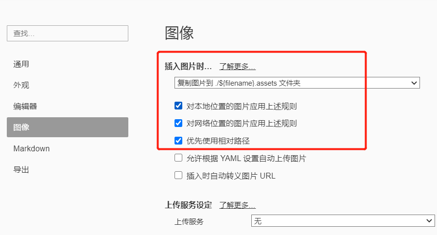
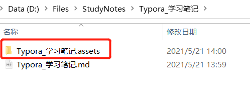

# 1、图片问题

**Q**：如何将Typora的图片存放到相对路径的文件夹中，方便发送md文件给其他人观看时，图片可被Typora加载。

**A**：Typora默认的图片存放在C盘，且文档的图片中使用的是绝对路径，某个文件夹内（C:\Users\Lenovo\AppData\Roaming\Typora\），因此Typora文档发送给别人时，会导致图片不存在。

**解决方式**

参考链接：https://www.jianshu.com/p/2138c5981c7f

文件 -> 偏好设置 -> 图像：选择使用相对路径存储即可，该方式会将图片存放到该markdown笔记所在的文件夹目录中的xxx.assets文件夹中。

结果：

----

