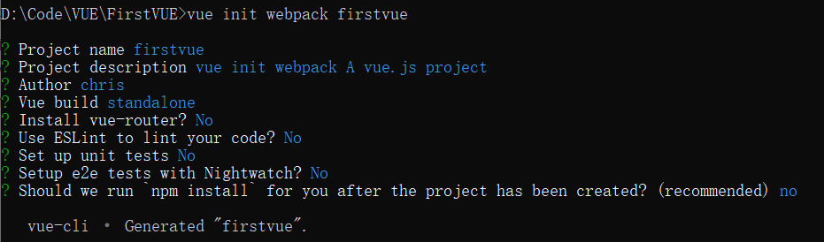
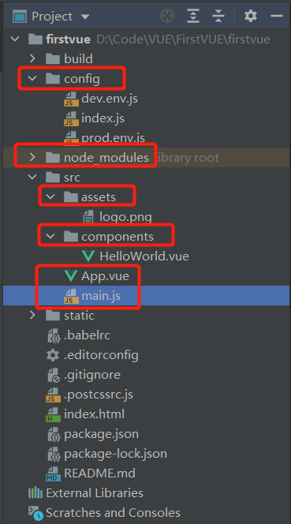
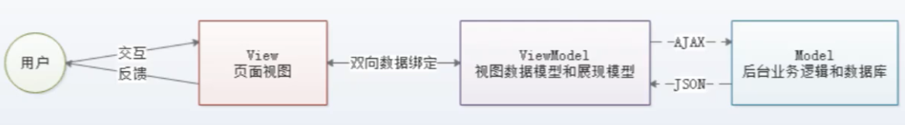
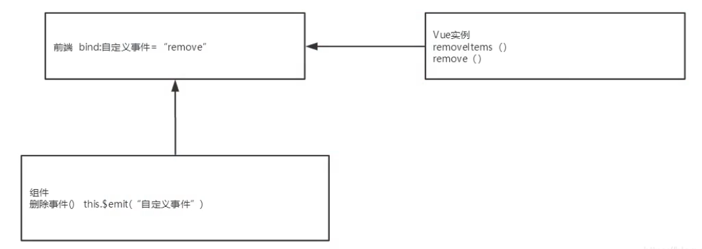

# 1、VUE开发环境配置

参考链接（含创建、启动项目）：https://www.cnblogs.com/dybk/p/10643067.html

## 1.1、安装node.js、npm

- node官网：https://nodejs.org/en/download/   （新版的node安装后自带npm）

- 在nodejs的安装目录下，新建node_global和node_cache两个文件夹，然后在node commande prompt命令工具中配置 这两个文件的绝对位置。

  - npm config set prefix "D:\Program Files\nodejs\node_global"

  - npm config set cache "D:\Program Files\nodejs\node_cache"

- 配置环境变量

  - 新增用户变量：在Path中新增  D:\Program Files\nodejs\node_global”
  - 新增系统变量NODE_PATH：创建NODE_PATH，变量值为D:\Program Files\nodejs\node_global\node_modules

- （可不安装）安装cnpm，这个工具node已经自带，但是没有配置环境变量，因此无法在node commande prompt中使用（自己仿照上一步，添加环境变量之后就可以使用）

- 安装VUE、VUE命令行工具、webpack、vue/cli工具：

  - 安装VUE：  -g全局安装

    cnpm install vue -g

  - 安装VUE命令行工具：

    cnpm install vue-cli -g

  - 安装webpack：

    npm install webpack -g      或者     cnpm install webpack -g

  - vue/cli工具：

    npm install --g @vue/cli   或者  cnpm install --g @vue/cli   

    （若安装错误，以管理员身份运行命令，先清除缓存：npm clean cache –force） 

    

- 测试安装否成功：（v注意大小写）

  - node -v

  - npm -V

  - vue -V

  - webpack -v

    

## 1.2、使用命令创建VUE工程

- 下载模板：cd至需要存放工程的目录，创建mytest工程，vue init webpack mytest

  命令行下初始化时的选择：

  

- 安装模块：cd至工程目录的根目录，npm install

- 测试运行：npm run dev


----

# 2、WebStorm开发VUE项目

参考网站：

- 配置、启动vue项目：https://blog.csdn.net/jenybom/article/details/90213374

- 创建项目（该方式不适用于2021的webstorm，无法创建）：https://blog.csdn.net/qq_37350706/article/details/86591102

- **WebStorm打开VUE项目，其目录结构、含义：**

  

  - config：配置文件，dev.env.js（开发环境的配置文件）、index.js（配置端口、静态文件等参数）

  - node_modules：npm install安装的依赖包存放目录

  - src：主要写程序的文件夹

    - assets：存放图片
    - components：存放编写的VUE组件
    - App.vue：调用components中的模板
    - main.js：调用App.vue文件，启动整个项目
  
  - 根目录的**index.html**（该页面为web主页的根目录）：调用main.js
  
    
  
- 启动github下载的代码：

  - 在项目所在的根目录：下载工程依赖模块， npm install

  - 配置相应的启动参数：

    

    

    

  - 启动后的样子：

    

    


---

# 3、VUE基础

**参考笔记**：[狂神笔记]https://blog.csdn.net/okForrest27/article/details/106849246/

**VUE菜鸟教程**：https://www.runoob.com/vue2/vue-examples.html

## 3.1、前端三要素

- HTML：超文本标记语言，决定网页的结构、内容

- CSS：层叠样式表，设计网页的表现样式

- JavaScript：无需编译，浏览器可直接解释运行，用于控制网页的行为

  - 标准：按照[ECMAScript] 标准的开发方式，简称是ES.

    ES4 (内部,未征式发布)
    ES5 (全浏览器支持)
    ES6 (常用，当前主流版本: webpack打包成为ES5支持! )

  - 框架：
    - **jQuery**
    - **React**
    - **Vue**
    - **Axios** :前端通信框架;因为Vue 的边界很明确，就是为了处理DOM,所以并不具备通信能力，此时就需要额外使用一个通信框架与服务器交互;当然也可以直接选择使用jQuery提供的AJAX通信功能

- UI框架：

  - Ant-Design:阿里巴巴出品，基于React的UI框架
  - ElementUI、 iview、 ice: 饿了么出品，基于Vue的UI框架
  - Bootstrap: Twitter推出的一个用于前端开发的开源工具包
  - AmazeUI:又叫"妹子UI"，一款HTML5跨屏前端框架.
    JavaScript 构建工具
  - Babel: JS编译工具，主要用于浏览器不支持的ES新特性，比如用于编译TypeScript
  - WebPack: 模块打包器，主要作用是打包、压缩、合并及按序加载。能把各种资源，如 JS、JSX、ES6、SASS、LESS、图片等**都作为模块来处理和使用**。

- 实现三端统一开发的框架（windows、android、ios共用一套代码）
  - 打包方式：
    - 云打包: **HBuild -> HBuildX， DCloud出品; API Cloud**
    - 本地打包: **Cordova** (前身是PhoneGap)
  - 三端统一的框架：**NodeJS **，其框架、工具如下：
    - Express: NodeJS框架
    - Koa: Express简化版
    - NPM: 项目综合管理工具，类似于Maven
    - YARN: NPM的替代方案，类似于Maven和Gradle的关系


----

## 3.2、VUE基础入门语法

- MVVM模式：

  - Mode层：模型层，对应JavaScript对象
  - View层：视图层，也就是DOM（HTML中的标签元素）
  - ViewMode层（**核心部分**）：即，Vue.js。连接视图和数据的中间件，监听、观察数据变化，并对视图进行更新。

  **MVVM的数据传输流程：**

  


- VUE的生命周期：

  开始创建**→**初始化数据**→**编译模板**→**挂载DOM→渲染→更新→渲染→卸载

  

- **基本语法：**（**<font color='red'>以下示例，在HTML文件中运行，实际开发则在.vue文件，使用vue-cli创建.vue模板文件</font>**）

  - class、style：

    - class：给div命名。可通过'\<div v-bind:class="[xxx, qqq]">'，配置div的样式。

    - style：类型，即样式设计。可在'\<div style="xxx">'进行设计

      

  - '\<div>'和'\<span>'区别

    - '\<div>'：独占一行，用于开辟块空间

    - '\<span>'：不占一行，会根据内容的大小占用空间，用于定义小的标签

      

  - ==和===的区别

    - ==：先比较数据类型，若类型不同，则自动转换为相同类型，再进行数据值比较

    - ===：直接比较数据类型，若类型不同，直接返回false

      

  -  {{}}

    用于输出对象属性、函数返回值

    ```html
    {{5+5}}<br>   //10
    {{ ok ? 'YES' : 'NO' }}<br>  //ok = true,  输出：YES
    {{ message.split('').reverse().join('') }} //反转字符串
    ```

    

  - .修饰符：

    **.** 指明的特殊后缀，用于指出一个指令应该以特殊方式绑定。

    eg：**.prevent** 修饰符告诉 **v-on** 指令对于触发的事件调用 **event.preventDefault()**

    

  -  | 过滤器

     用于实现文本的格式化。

     ```html
     <div id="app">
       <!--调用capitalize方法格式化message数据：将message字符串的首字母大写-->
       {{ message | capitalize }}
     </div>
         
     <script>
     new Vue({
       el: '#app',
       data: {
         message: 'runoob'
       },
       filters: {
         //首字母大写的方法
         capitalize: function (value) {
           if (!value) 
               return '';
           value = value.toString();
           return value.charAt(0).toUpperCase() + value.slice(1);
         }
       }
     })
     </script>
     ```

     

  - $ 调用实例属性、方法

     ```html
     <script>
         var data = { site: "chris", url: "www.baidu.com", alexa: 10000}
         var vm = new Vue({
             el: '#app',
             data: data
         })
         // vm$data：获取vm中的data数据
         document.write(vm.$data === data) // true
     </script>
     ```

      

  - '\<lable for="xx">'

    for为id为xx的DOM元素绑定一个标签

    ```html
    <!--为id=runoob的元素绑定标签：Runoob-->
    <input type="checkbox" id="runoob" value="R" v-model="checkedNames">
    <label for="runoob">Runoob</label>
    ```

    

  - v-bind  （可缩写为:）

    用于绑定数据、类型

    ```html
    <!--绑定数据-->
    <div id="app">
        <!--将href的数值绑定为url-->    
        <pre><a v-bind:href="url">菜鸟教程</a></pre>
    </div>
        
    <script>
    new Vue({
      el: '#app',
      data: {
        url: 'http://www.runoob.com'
      }
    })
    </script>
    ```

    

    ```html
    <!--绑定class的类型（style）-->
    <style>
    .active {
    	width: 100px;
    	height: 100px;
    	background: green;
    }
    </style>
    </head>
    <body>
    <div id="app">
      <!--当isActive = true时，两个div相同含义-->  
      <div v-bind:class="{ 'active': isActive }"></div>
      <div class="active"></div>
    </div>
    
    <script>
    new Vue({
      el: '#app',
      data: {
        isActive: true
      }
    })
    </script>
    ```

    

  -  v-on  （可缩写为@）

    监听DOM的事件

    ```
    <!-- v-on:click为button按键绑定方法 -->
    <button v-on:click="sayHi()">点我</button>
    ```

    click使用.修饰符，处理事件细节。

    ```html
    <!-- 阻止单击事件冒泡 -->
    <a v-on:click.stop="doThis"></a>
    <!-- 提交事件不再重载页面 -->
    <form v-on:submit.prevent="onSubmit"></form>
    <!-- 修饰符可以串联  -->
    <a v-on:click.stop.prevent="doThat"></a>
    <!-- 只有修饰符 -->
    <form v-on:submit.prevent></form>
    <!-- 添加事件侦听器时使用事件捕获模式 -->
    <div v-on:click.capture="doThis">...</div>
    <!-- 只当事件在该元素本身（而不是子元素）触发时触发回调 -->
    <div v-on:click.self="doThat">...</div>
    
    <!-- click 事件只能点击一次，2.1.4版本新增 -->
    <a v-on:click.once="doThis"></a>
    ```

    

  - v-model

    **实现双向绑定**，用在 input、select、textarea、checkbox、radio 等表单控件元素上创建双向数据绑定。即：用户输入的数据，可以在页面实时更新。

    ```html
    <div id="app">
        <p>{{ message }}</p>
        <input v-model="message">
    </div>
        
    <script>
    new Vue({
      el: '#app',
      data: {
        message: 'Runoob!'
      }
    })
    </script>
    ```

    

  - v-show

    根据条件，显示数据 。

    ```html
    <div id="app">
        <h1 v-show="ok">Hello!</h1>
    </div>
    	
    <script>
    new Vue({
      el: '#app',
      data: {
        ok: true
      }
    })
    </script>
    ```

    

  - if-else语法： 

    ```HTML
    <!DOCTYPE html>
    <html lang="en">
    <head>
        <meta charset="UTF-8">
        <title>Title</title>
        <!--1.导入vue.js-->
        <script src="https://cdn.jsdelivr.net/npm/vue@2.5.21/dist/vue.min.js"></script>
    </head>
    <body>
    <div id="app">
        <!--{{}}：用于输出对象属性、函数返回值-->
        <h1>{{ok}}</h1>
        <h1 v-if="ok">Yes</h1>
        <h1 v-else-if="other">Other</h1>
        <h1 v-else>No</h1>
    </div>
    <script>
        //声明变量：let（局部变量）、var（全局变量）
        let vm = new Vue({
            //el：将这个Vue实例挂载到id=app的DOM元素中
            el: "#app",
            //数据：
            data: {
                //参数名：值
                ok: true
            }
        });
    </script>
    </body>
    </html>
    ```

  - for

    ``` HTML
    <div id="app">
        <!--读取vm对象data部分数组中对象的message数据-->
        <li v-for="text in allTexts">
            {{text.message}}
        </li>
    </div>
    <script>
        let vm = new Vue({
            el: "#app",
            data: {
                allTexts: [
                    {message: "1"},
                    {message: "2"},
                    {message: "3"},
                ]
            }
        });
    </script>
    ```

  - 事件绑定（eg：click鼠标点击事件）

    ````HTML
    <div id="app">
        <!-- v-on:click为button按键绑定方法 -->
        <button v-on:click="sayHi()">点我</button>
    </div>
    <script>
        let vm = new Vue({
            el: "#app",
            data: {
                message: "xxxxxx"
            },
            methods: {
                //event为传入事件，调用syHi方法
                sayHi: function (event) {
                    alert(this.message);
                }
            }
        });
    </script>
    ````

    

  - 双向数据绑定：

    数据、View视图层相互绑定：两者的数据是实时同步的。

    ````HTML
    <div id="app">
        <select v-model="selected">
            <option value="" disabled>--请选择--</option>
            <option>A</option>
            <option>B</option>
            <option>C</option>
          </select>
          <p>当前选中的是：{{selected}}</p>
    </div>
    <script>
    	var vm = new Vue({
        el: "#app",
        //1.数据
        data: {
          //双向绑定：页面选择后，直接在页面显示当前选择的数据
          selected: ''
          }
        });
    </script>
    ````

    

  - 组件（VUE的模板功能--**核心部分**）：

    相当于HTML文件中的JSTL标签，自定义的模板可通过引用标签调用，实现模板的重复套用。

    需要使用Vue.component()方法组测组件。

    ```html
    <div id="app">
    	<!-- 遍历items数组,获取message参数，传给模板中的element  -->
        <chris v-for="item in items" v-bind:element="item.message"></chris>
    </div>
    <script>
        //自定义VUE组件  （组件需要放在script的头部，否则无法使用）  chris为自定义组件的名称
        Vue.component("chris", {
            //参数：使用v-bind传入参数
            props: ["element"],
            //模板：获取上面的参数element
            template: '<li> {{element}} </li>'
        });
        
        var vm = new Vue({
            el: "#app",
            //1.数据
            data: {
              //数组
              items: [
                //对象：message
                {message: "chris"},
                {message: "FYJ"},
                {message: "Vickey"}
              ],
            }
        });
    </script>
    ```

    

  - Axios通信组件

    Axios是一个开源的可以用在浏览器端和NodeJS 的异步通信框架，主要作用就是实现AJAX异步通信，其功能特点如下:

    - 从浏览器中创建XMLHttpRequests
    - 从node.js创建http请求
    - 支持Promise API [JS中链式编程]
    - 拦截请求和响应
    - 转换请求数据和响应数据
    - 取消请求
    - 自动转换JSON数据
    - 客户端支持防御XSRF (跨站请求伪造)

    ```html
    <div id = "app1">
      <div>
        {{info.name}}
      </div>
      <div>
        {{info.links}}
      </div>
      <a v-bind:href="info.links.address">跳转{{info.links.name}}</a>
    </div>
    
    <script>
      //Axios异步通信：替代JQuery、Ajax，读取json文件
      var vm1 = new Vue({
        el: "#app1",
    
        //data方法：使用该方法返回Json格式的数据
        data () {
          return {
            info: {
              name: null,
              links: [
                {
                  name: null,
                  address: null
                }
              ]
            }
          }
        },
    
        //钩子函数：读取Json文件的数据，返回给浏览器（ES6特性）
        mounted () {
          axios
              .get('../../data/testjson.json')
              .then(response=>(this.info=response.data))
              .catch(function (error) { // 请求失败处理
              	console.log(error);
          	  });
        }
      });
    </script>
    ```

    

  - **计算属性：**

    计算属性默认只有getter方法，也可自定义一个setter方法。

    ```html
    <body>
    <div id="app">
      <!--同时调用了site中的get、set方法-->  
      <p>{{ site }}</p>
    </div>
    
    <script>
    var vm = new Vue({
      el: '#app',
      data: {
    	name: 'Google',
    	url: 'http://www.google.com'
      },
      computed: {
        site: {
          // getter
          get: function () {
            return this.name + ' ' + this.url
          },
          // setter
          set: function (newValue) {
            var names = newValue.split(' ')
            this.name = names[0]
            this.url = names[names.length - 1]
          }
        }
      }
    })
    // 调用 setter， vm.name 和 vm.url 也会被对应更新
    vm.site = 'xxxxx http://www.runoob.com';
    document.write('name: ' + vm.name);
    document.write('<br>');
    document.write('url: ' + vm.url);
    </script>
    ```

    

    <font color='red'>**计算属性和调用方法不同：**</font>

    - 计算属性：可缓存数据（**仅当计算属性中所调用方法内的数据发生变化时，才会再次调用方法计算数据，否则直接返回上次的计算结果，等同于redis缓存**）
    - 调用方法：每次都会调用方法进行计算。导致处理速度变慢。

    ```html
    <div>
        <span>当前时间（method获取）：{{getTimeByMethods()}}</span> <br/>
        <span>当前时间（computed获取）：{{getTimeByComputed}}</span>
    </div>
    <script>
        var vm=new Vue({
            //方法：需要绑定在Vue对象内  (不具备缓存，需要实时计算)
            methods:{
              getTimeByMethods: function(){
                return Date.now();
              }
            },
    
            //计算属性: (具备缓存，不需要实时计算，有点像redis缓存，仅当该方法中的数据发生变化时，才会再次进行计算)
            computed:{
              getTimeByComputed: function(){
                this.type;
                return Date.now();
              }
            }
        });
    </script>
    ```

    

  - 插槽：slot

    可结合模板使用，将数据循环读出

    - 缩写：

      v-bind: 可以缩写为:
      v-on: 可以缩写为@ 

     ```html
     <div id="app">
       <mylist>
         <!--使用自定义的slot_title，为slot_title组件中的title属性赋值-->
         <slot_title slot="slot_title" v-bind:title="title"></slot_title>
         <!--使用自定义的slot_itms-->
         <slot_items slot="slot_items" v-for="item in arr" v-bind:item = item></slot_items>
       </mylist>
     </div>
     
     <script>
       <!--自定义组件、模板-->
       Vue.component("mylist",{
         template:
           '<div>' +
             //使用插槽：结合模板使用
             '<slot name="slot_title"></slot>'+
             '<ul>' +
               '<slot name="slot_items"></slot>'+
             '</ul>'+
           '</div>'
       });
     
       Vue.component("slot_title",{
         //属性：属于单向绑定，父组件传入的参数发生变化时，子组件跟着变化（反之不行）
         props: ['title'],
         template: '<div>{{title}}</div>'
       });
     
       Vue.component("slot_items",{
         props: ['item'],
         template: '<div>{{item}}</div>'
       });
     
       var v = new Vue({
         el: "#app",
         data:{
           title: "chris-title",
           arr: ['aaaa', 'bbbb', 'cccc']
         }
       });
     </script>
     ```

    

  - 自定义事件：

    - 使用this.$emit('自定义事件名', 参数)

    - 可用于设定数据分发、触发事件的方式

    - 结构：

      

    ```html
    <div id="app">
      <mylist>
        <!--使用自定义的slot_title-->
        <slot_title slot="slot_title" v-bind:title="title"></slot_title>
          
        <!--使用自定义的slot_itms ：
        需要为slot_items对应的item、index、remove赋值(这边的v-on:remove为this.$emit()定义的事件名)
        -->
        <slot_items slot="slot_items"
                    v-for="(item, index) in arr"
                    v-bind:item = "item"
                    v-bind:index = "index"
                    v-on:remove="removeItem(index)"
        ></slot_items>
      </mylist>
    </div>
    
    <script>
      //slot 插槽 这个组件要定义在前面，不然出不来数据
      <!--自定义组件、模板， myList为自定义组件的名称-->
      Vue.component("mylist",{
        template:
          '<div>' +
          //使用插槽：结合模板使用
          '<slot name="slot_title"></slot>'+
          '<ul>' +
          '<slot name="slot_items"></slot>'+
          '</ul>'+
          '</div>'
      });
    
      Vue.component("slot_title",{
        props: ['title'],
        template: '<div>{{title}}</div>'
      });
    
      Vue.component("slot_items",{
        props: ['item', 'index'],
          
        //为每个元素添加删除按钮
        template:'<div>'+
          '{{index}} - {{item}} '+
          ' <button style="margin: 5px" v-on:click="removeFunc">删除</button>'+
          '</div>',
          
        methods: {
          removeFunc: function(index){
            // this.$emit('事件名',参数) 自定义事件分发（远程调用方法）
            this.$emit('remove', index)
          }
        }
      });
    
      var v = new Vue({
        el: "#app",
        data:{
          title: "chris-title",
          arr: ['aaaa', 'bbbb', 'cccc']
        },
        methods:{
          removeItem: function(index){
            // 一次删除arr数组的一个元素
            this.arr.splice(index, 1)
            //浏览器控制台打印信息
            console.log("成功删除了: " + this.arr[index])
          }
        }
      });
    
    </script>
    ```

    

  - 自定义指令

     - Vue.directive('指令名称', {编写功能})

       **定义全局指令**（若需要定义**局部指令**，只需要在new Vue({})中添加**属性directives**即可）

       ```html
        <div id = "app">
        	<p>
                打开页面时，文本框自动获取焦点（自动定位到输入位置）
            </p>    
            <input type="txt" v-focus>
        </div>
        
        <script>
        	//注册一个全局指令(v-focus)
            Vue.directive('focus', {
                //绑定当前元素到DOM中
                inserted: function(el){
                    el.focus()
                }
            })
            new Vue({
                el: '#app'
            });
        </script>
       ```

       

     - 钩子函数

       - 钩子函数的类型：

         - `bind`: 只调用一次，指令第一次绑定到元素时调用，用这个钩子函数可以定义一个在绑定时执行一次的初始化动作。
         - `inserted`: 被绑定元素插入父节点时调用（父节点存在即可调用，不必存在于 document 中）。
         - `update`: 被绑定元素所在的模板更新时调用，而不论绑定值是否变化。通过比较更新前后的绑定值，可以忽略不必要的模板更新（详细的钩子函数参数见下）。
         - `componentUpdated`: 被绑定元素所在模板完成一次更新周期时调用。
         - `unbind`: 只调用一次， 指令与元素解绑时调用。

       - 钩子函数中的参数：

         - **el**: 指令所绑定的元素，可以用来直接操作 DOM 。
         - **binding**： 一个对象，包含以下属性：
           - **name**: 指令名，不包括 `v-` 前缀。
           - **value**: 指令的绑定值， 例如： `v-my-directive="1 + 1"`, value 的值是 `2`。
           - **oldValue**: 指令绑定的前一个值，仅在 `update` 和 `componentUpdated` 钩子中可用。无论值是否改变都可用。
           - **expression**: 绑定值的表达式或变量名。 例如 `v-my-directive="1 + 1"` ， expression 的值是 `"1 + 1"`。
           - **arg**: 传给指令的参数。例如 `v-my-directive:foo`， arg 的值是 `"foo"`。
           - **modifiers**: 一个包含修饰符的对象。 例如： `v-my-directive.foo.bar`, 修饰符对象 modifiers 的值是 `{ foo: true, bar: true }`。
         - **vnode**: Vue 编译生成的虚拟节点。
         - **oldVnode**: 上一个虚拟节点，仅在 `update` 和 `componentUpdated` 钩子中可用。

         ```html
         <div id="app">
             <div v-runoob="{ color: 'green', text: '菜鸟教程!' }"></div>
         </div>
         
         <script>
         Vue.directive('runoob', function (el, binding) {
         	// 简写方式设置文本及背景颜色：获取上面text、color的值
         	el.innerHTML = binding.value.text
         	el.style.backgroundColor = binding.value.color
         })
         new Vue({
           el: '#app'
         })
         </script>
         ```

         

  - watch 监听器

     ```html
     <div id = "app">
       千米：<input type="txt" v-model="kilometer"></input>
       米：<input type="txt" v-model="meter"></input>
       <p id = "info"></p>
     </div>
     <script>
       let vm = new Vue({
         el: '#app',
         data: {
           kilometer: 0,
           meter: 0
         },
         //在vm实例里面使用监听器
         watch:{
           //监听到kilometer数据发生变化时，执行函数
           kilometer:function (val){
             this.kilometer = val;
             this.meter = val * 1000;
           },
           meter:function(val){
             this.meter = val;
             this.kilometer = val / 1000;
           }
         }
       });
       //在vm实例之外使用监听器：需使用$watch实例化方法，监听到kilometer发生变化时执行。
       //function（改变后的参数值，未改变前的参数值）  
       vm.$watch('kilometer', function(newVal, oldVal){
         //在页面显示kilometer的变化
         document.getElementById("info").innerHTML = "修改前：" + oldVal + " , 修改后：" + newVal;
       })
     </script>
     ```

     

  - router-link 路由：

     - 安装路由router：cnpm install vue-router

     - 作用：用于通过不同的url访问不同的页面

     - 相关属性：

       - to

         传入目标路由URL之后，会把to的值传输到router.push

         ```html
         <!--1、字符串形式-->
         <router-link to="/main">main</router-link>
         <!-- 渲染结果：与下面的相同 -->
         <a href="/main">main</a>
         
         <!--2、使用v-bind的JS表达式-->
         <router-link v-bind:to="/main">main</router-link>
         //或者
         <router-link :to="/main">main</router-link>
         //或者
         <router-link :to="{ path: '/main' }">main</router-link>
         
         <!-- 3、命名的路由 -->
         <router-link :to="{ name: 'user', params: { userId: 123 }}">User</router-link>
         
         <!-- 4、带查询参数，下面的结果为 /register?plan=private -->
         <router-link :to="{ path: 'register', query: { plan: 'private' }}">Register</router-link>
         ```

         

       - replace

         当点击时，会调用 router.replace() 而不是 router.push()，导航后不会留下 history 记录

         ```html
         <router-link :to="{ path: '/abc'}" replace></router-link>
         ```

         

       - append

         在当前 (相对) 路径前添加其路径

         ```html
         <router-link :to="{ path: 'relative/path'}" append></router-link>
         ```

         

       - tag

         将'\<router-link>' 渲染成某种标签，例如 '\<li>'

         ```html
         <router-link to="/foo" tag="li">foo</router-link>
         <!-- 渲染结果：与下面的相同 -->
         <li>foo</li>
         ```

         

       - active-class

         设置链接激活时使用的 CSS 类名

          ```html
          <style>
             ._active{
                background-color : red;
             }
          </style>
          <p>
             <router-link v-bind:to = "{ path: '/route1'}" active-class = "_active">R1</router-link>
          </p>
          ```

         

       -  event

          用来触发导航的事件。

         eg：event设置为鼠标移动至router时，html页面内容发生变化。

         ```html
         <router-link v-bind:to = "{ path: '/route1'}" event = "mouseover">Router Link 1</router-link>
         ```

         

     - 示例代码

       ```html
       <!DOCTYPE html>
       <html>
       <head>
         <meta charset="utf-8">
         <title>Vue 测试router</title>
         <script src="https://cdn.staticfile.org/vue/2.4.2/vue.min.js"></script>
         <script src="https://cdn.staticfile.org/vue-router/2.7.0/vue-router.min.js"></script>
       </head>
       <body>
       <div id="testRouter">
         <h1>Hello App!</h1>
         <p>
           <!-- 使用 router-link 组件来导航. -->
           <!-- 通过传入 `to` 属性指定链接. -->
           <!-- <router-link> 默认会被渲染成一个 `<a>` 标签：通过tag将其修改为普通的字符-->
           <router-link to="/foo" tag="ul">Go to Foo</router-link>
           <router-link to="/bar" tag="ul">Go to Bar</router-link>
         </p>
         <!-- 路由出口: 路由匹配到的组件将渲染在这里 -->
         <router-view></router-view>
       </div>
       
       <script>
         //PS: 如果使用模块化机制编程，導入Vue和VueRouter，要调用 Vue.use(VueRouter)
       
         // 1. 定义（路由）组件。
         // 可以从其他文件 import 进来
         Foo = { template: '<div>foo</div>' }
         Bar = { template: '<div>bar</div>' }
       
         // 2. 定义路由
         // 每个路由应该映射一个组件。 其中"component" 可以是通过 Vue.extend() 创建的组件构造器，或者，只是一个组件配置对象。
         myroutes = [
           { path: '/foo', component: Foo },
           { path: '/bar', component: Bar }
         ]
       
         // 3. 创建 router 实例，然后传 `myroutes` 配置
         router = new VueRouter({
           routes: myroutes   // 可缩写为：myroutes
         })
       
         // 4. 创建和挂载根实例。通过 router 配置参数注入路由，从而让整个应用都有路由功能
         vm = new Vue({
           router
         }).$mount('#testRouter')
       
       </script>
       </body>
       </html>
       ```

       

  - Vue的响应接口

     - setTimeout

       定时执行任务

       ```html
       <script type = "text/javascript">
           let vm = new Vue({
               data:{
                   counter: 1
               }
           });
           //每过10s，counter+20
           setTimeout(
               function(){
                   vm.counter += 20;
               },10000
           );
       </script>
       ```

       

     - set

       为对象添加属性:   Vue.set( target, key, value )  //对象、属性名、属性值

       ```html
       <script type = "text/javascript">
       //新建对象
       var myproduct = {
           "id":1,
           name:"book", 
           "price":"20.00"
       };
       var vm = new Vue({
          el: '#app',
          //products = 新建的对象 
          data: {
             products: myproduct
          }
       });
       //增加属性（方式1）：为products增加属性age（此方法，不自带get、set方法）
       vm.products.age = "1";
       //增加属性（方式2）：
       Vue.set(myproduct, 'age', 1);
       
       console.log(vm);
       vm.$watch('products.id', function(nval, oval) {
          alert('计数器值的变化 :' + oval + ' 变为 ' + nval + '!');
       });
       </script>
       ```

       

     - delete

       删除属性：  Vue.delete( target, key )  // 对象、属性名

      

  - Axios（**<font color='red'>VUE2.0以上推荐使用Axios完成Ajax请求</font>**）

     - 安装：npm install axios

     - get方法

       - 读取数据

         data.json文件

         ```html
         {
         	"name" : "chris",
         	"info" : [
         		"addr": "xxxx",
         		"tel": "12345678"
         	]
         }
         ```

         html文件

         ```html
         <!DOCTYPE html>
         <html lang="en">
         <head>
           <meta charset="UTF-8">
           <title>Title</title>
           <script src="https://cdn.staticfile.org/vue/2.4.2/vue.min.js"></script>
           <script src="https://cdn.staticfile.org/axios/0.18.0/axios.min.js"></script>
         </head>
         <body>
         <div id = "app">
           <h1>读取data.json文件的数据</h1>
           <div>
             显示所有数据：<br>
             {{ datas }}
           </div>
           <br>
           <!--读取info数组中的对象-->
           <div v-for="item in datas">
             读取具体的数据数据：<br>
             <!--读取对象中的数据-->
             addr: {{item.addr}} <br>
             tel: {{item.tel}}
           </div>
         
         </div>
         
         <script>
             let vm = new Vue({
               el: '#app',
               //数据返回模板
               data(){
                 return {
                   datas: null
                 }
               },
               //读取数据
               mounted() {
                 axios
                     .get('../data/data.json')
                     //使用response获取json文件中特定位置的数据
                     .then(response => (this.datas = response.data.info))
                     .catch(function (error){
                       console.log(error);
                     });
              // axios
              //   .get('../data/data.json')
              //使用response获取json文件全部数据
              //   .then(response => (this.datas = response))
              //   .catch(function (error) { // 请求失败处理
              //     console.log(error);
              //   });
               }
             });
         </script>
         </body>
         </html>
         ```

         

       - 传递参数

         ```html
         <script>
         	let vm = new Vue({
                 data(){
                     return {
                         info: null
                     }
                 },
                 mounted(){
                     //方式一： 直接在 URL 上添加参数 ID=12345
                     axios
                       .get('/user?ID=12345')
                       .then(function (response) {
                         console.log(response);
                       })
                       .catch(function (error) {
                         console.log(error);
                       });
         
                     //方式二： 可以通过 params 设置参数：
                     axios
                       .get('/user', {
                         params: {
                           ID: 12345
                         }
                       })
                       .then(function (response) {
                         console.log(response);
                       })
                       .catch(function (error) {
                         console.log(error);
                       });
                 }
             });
         </script>
         ```

         

     - post方法：

       - 读取数据

         ```html
         <script type = "text/javascript">
         new Vue({
           el: '#app',
           data () {
             return {
               info: null
             }
           },
           mounted () {
             axios
               //使用post
               .post('https://www.runoob.com/try/ajax/demo_axios_post.php')
               .then(response => (this.info = response))
               .catch(function (error) { // 请求失败处理
                 console.log(error);
               });
           }
         })
         </script>
         ```

         

       - 传递参数

         ```html
         axios.post('/user', {
             firstName: 'Fred',        // 参数 firstName
             lastName: 'Flintstone'    // 参数 lastName
           })
           .then(function (response) {
             console.log(response);
           })
           .catch(function (error) {
             console.log(error);
           });
         ```

         

       - 同时发送多个请求

         ```
         function getUserAccount() {
           return axios.get('/user/12345');
         }
          
         function getUserPermissions() {
           return axios.get('/user/12345/permissions');
         }
         axios.all([getUserAccount(), getUserPermissions()])
           .then(axios.spread(function (acct, perms) {
             // 两个请求现在都执行完成
         }));
         ```

     

  - Ajax（**<font color='red'>这个比较繁琐，使用的比较少，基本上都用Axios</font>**）

     - get方法

       ```html
       <!DOCTYPE html>
       <html>
       <head>
       <meta charset="utf-8">
       <title>Vue 测试实例</title>
       <script src="https://cdn.staticfile.org/vue/2.4.2/vue.min.js"></script>
       <script src="https://cdn.staticfile.org/vue-resource/1.5.1/vue-resource.min.js"></script>
       </head>
       <body>
       <div id="box">
       	<input type="button" @click="get()" value="点我异步获取数据(Get)">
       </div>
       <script type = "text/javascript">
       window.onload = function(){
       var vm = new Vue({
           el:'#box',
           data:{
               msg:'Hello World!',
           },
           methods:{
               get:function(){
                   //发送get请求
                   this.$http
                       .get('/try/ajax/ajax_info.txt')
                       .then(function(res){
                       	document.write(res.body);    
                   	}
                       ,function(){
                       console.log('请求失败处理');
                   });
                   //传递参数
                   this.$http
                       .get('get.php',{params : {a:1,b:2}})
                       .then(function(res){
           				document.write(res.body);    
       				}
                       ,function(res){
           				console.log(res.status);
       				});
               }
           }
       });
       }
       </script>
       </body>
       </html>
       ```

       

     - post方法

       ```html
       window.onload = function(){
           var vm = new Vue({
               el:'#box',
               data:{
                   msg:'Hello World!',
               },
               methods:{
                   post:function(){
                       //发送 post 请求
                       this.$http.post('/try/ajax/demo_test_post.php',{name:"菜鸟教程",url:"http://www.runoob.com"},{emulateJSON:true}).then(function(res){
                           document.write(res.body);    
                       },function(res){
                           console.log(res.status);
                       });
                   }
               }
           });
       }
       ```

       


----

## 3.2、使用VUE进行开发

- vue-cli

   官方提供的脚手架，快速创建工程模板，类似于Maven

- npm（或者cnpm）

  软件包管理工具，和Linux中的apt类似

- webpack:

   JavaScript应用程序的静态模块打包器(module bundler)。当webpack处理应用程序时，它会递归地构建一个依赖关系图(dependency graph),其中包含应用程序需要的每个模块，然后将所有这些模块打包成一个或多个bundle。

  通过loader转换，任何形式的资源都可以当做模块，比如CommonsJS、AMD、ES6、 CSS、JSON、CoffeeScript、LESS等。

- vue-router

   Vue.js官方的**路由管理器**（路径跳转）。它和Vue.js的核心深度集成，用于构建单页面应用。包含功能：

  包含的功能有:

  1. 嵌套的路由/视图表
  2. 模块化的、基于组件的路由配置
  3. 路由参数、查询、通配符
  4. 基于Vue.js过渡系统的视图过渡效果
  5. 细粒度的导航控制
  6. 带有自动激活的CSS class的链接
  7. HTML5历史模式或hash模式，在IE9中自动降级
  8. 自定义的滚动条行为

  **需要安装vur-router：**npm install vue-router --save-dev

  

### 3.2.1使用VUE + Element-UI

（**<font color='red'>以下示例，在webstorm的vue文件中运行</font>**）

element-UI手册：https://element.eleme.cn/#/zh-CN/component/installation

- 创建工程： 

  - 下载模板：cd至需要存放工程的目录，创建mytest工程，vue init webpack mytest

  - 安装软件：

    - 安装 vue-router（路由）：npm install vue-router --save-dev

    - 安装 element-ui（UI组件）：npm i element-ui -S

    - 安装依赖：npm install

    - 安装 SASS 加载器、SASS：cnpm install sass-loader node-sass --save-dev

      SASS-loader：把sass和scss 样式文件转为 css

      SASS：一个库，它将Node.js绑定到LibSass（流行样式表预处理器Sass的C版本），将.scss文件本地编译为css，并通过连接中间件自动编译。

    - 启动测试：npm run dev	

    - 出现saas错误时：

      - 需要考虑saas版本问题：

        在package.json中修改node-sass、sass-loader的版本：可修改为4.0.0、7.3.1

        使用cnpm安装（若无使用安装：npm install -g cnpm --registry=https://registry.npm.taobao.orgcnpm）

        cnpm install node-sass --save  （或者使用npm install）

        

-  main.js中的配置：

  ```js
  import Vue from 'vue'
  import App from './App'
  
  //使用路由
  import VueRouter from "vue-router";
  
  //自动扫描路由
  import router from './router';
  
  //（完整引入element）导入element ui、element css
  import ElementUI from 'element-ui';
  import 'element-ui/lib/theme-chalk/index.css';
  
  //Axios
  import axios from 'axios';
  import VueAxios from 'vue-axios';
  
  //使用配置
  Vue.use(VueRouter);
  Vue.use(ElementUI);
  Vue.use(VueAxios, axios);
  
  Vue.config.productionTip = false
  
  /* eslint-disable no-new */
  new Vue({
    el: '#app',
    router,
    //element-ui中要求使用的方式
    render: h => h(App)
    // 原调用模板的方式
    // components: { App },
    // template: '<App/>'
  })
  ```

  

- 配置路由组件：index.js

  ```js
  //导入vue
  import Vue from 'vue';
  import VueRouter from 'vue-router'
  
  //导入自定义组件：import 定义导入的组件名 from 导入的组件
  import Main from '../view/Main';
  import Login from "../view/Login";
  //导入子组件：路由嵌套
  import Profile from "../view/user/Profile";
  import UserList from "../view/user/UserList";
  import NotFound from "../view/error/NotFound";
  
  //使用路由
  Vue.use(VueRouter);
  
  //配置路由
  export default new VueRouter({
    // hash（默认值）：路径带 # 符号，如 http://localhost/#/login
    // history：路径不带 # 符号，如 http://localhost/login
    mode: 'history',
    routes:[
      {
        //url路径  
        path: '/main',
        //此路径调用的组件（import导入的模板）
        component: Main,
        //此路由的名称：可使用v-bind:to="{name:'main'}" 调用 
        name: 'main',
        //写入子模块（嵌套路由）：转到子路由时，需要在url前面添加/mian
        children: [
          // {
          //   //传入参数（方式一，耦合较高）：  :id 为传递的参数，使用此url需要传入一个参数
          //   path: '/user/profile/:id',
          //   name: 'Profile',
          //   component: Profile
          // },
          {
            //传入参数（方式二）：  :id 为传递的参数，使用此url需要传入一个参数
            path: '/user/profile/:id',
            name: 'Profile',
            component: Profile,
            //打开参数属性
            props: true
          },
          {
            path: '/user/list',
            component: UserList
          }
        ]
      },
      {
        path: '/login',
        component: Login
      },
      //重定向：给url取别名
      {
        path: '/goHome',
        redirect: '/main'
      },
      //配置404路径
      {
        path: '*',
        component: NotFound
      }
    ]
  });
  ```

  

-  登录界面：Login.vue（测试的url：http://localhost:8080/login）

   ```vue
   <template>
     <div>
       <h1>登陆页面</h1>
       <el-form ref="loginForm" :model="form" :rules="rules" label-width="80px" class="login-box">
         <h3 class="login-title">欢迎登录</h3>
         <el-form-item label="账号" prop="username">
           <el-input type="text" placeholder="请输入账号" v-model="form.username"/>
         </el-form-item>
         <el-form-item label="密码" prop="password">
           <el-input type="password" placeholder="请输入密码" v-model="form.password"/>
         </el-form-item>
         <el-form-item>
           <el-button type="primary" v-on:click="onSubmit('loginForm')">登录</el-button>
         </el-form-item>
       </el-form>
   
       <el-dialog
         title="温馨提示"
         :visible.sync="dialogVisible"
         width="30%"
         :before-close="handleClose">
         <span>请输入账号和密码</span>
         <span slot="footer" class="dialog-footer">
           <el-button type="primary" @click="dialogVisible = false">确 定</el-button>
         </span>
       </el-dialog>
     </div>
   </template>
   
   <script>
   export default {
     //Login：为导出的模板名称。
     //其他vue调用时，需import此vue，在其components中添加Login，就可在<template>标签中引用此模板：<Login></>Login>
     name: "Login",
     data() {
       return {
         form: {
           username: '',
           password: ''
         },
   
         // 表单验证，需要在 el-form-item 元素中增加 prop 属性
         rules: {
           username: [
             {required: true, message: '账号不可为空', trigger: 'blur'}
           ],
           password: [
             {required: true, message: '密码不可为空', trigger: 'blur'}
           ]
         },
   
         // 对话框显示和隐藏
         dialogVisible: false
       }
     },
     methods: {
       onSubmit(formName) {
         // 为表单绑定验证功能
         this.$refs[formName].validate((valid) => {
           if (valid) {
             // 使用 vue-router 路由到指定页面，该方式称之为编程式导航
             this.$router.push("/main");
           } else {
             this.dialogVisible = true;
             return false;
           }
         });
       }
     }
   }
   </script>
   
   <style lang="scss" scoped>
   .login-box {
     border: 1px solid #DCDFE6;
     width: 350px;
     margin: 180px auto;
     padding: 35px 35px 15px 35px;
     border-radius: 5px;
     -webkit-border-radius: 5px;
     -moz-border-radius: 5px;
     box-shadow: 0 0 25px #909399;
   }
   
   .login-title {
     text-align: center;
     margin: 0 auto 40px auto;
     color: #303133;
   }
   </style>
   
   ```

   

- 主页：Main.js

   ```vue
   <template>
     <el-container>
       <el-aside width="200px">
         <!-- 默认展开第一个el-submenu-->
         <el-menu :default-openeds="['1']">
           <el-menu-item index="0">
             <router-link to="/goHome">首页</router-link>
           </el-menu-item>
           <el-submenu index="1">
             <template slot="title"><i class="el-icon-caret-right"></i>用户管理</template>
             <el-menu-item-group>
               <el-menu-item index="/">
                 <!--插入跳转链接-->
                 <!-- <router-link to="/user/profile">个人信息</router-link>-->
                 <!--传入参数（方式一，耦合较高）：name为组件名字（调用index.js中name为Profile的组件），
   				params中的id为参数，tag将样式修改为li（默认为<a超链接标签）-->
                 <router-link v-bind:to="{name: 'Profile', params: {id:1}}" tag="li">个人信息</router-link>
               </el-menu-item>
               <el-menu-item index="1-2">
                 <router-link to="/user/list">用户列表</router-link>
               </el-menu-item>
             </el-menu-item-group>
           </el-submenu>
           <el-submenu index="2">
             <template slot="title"><i class="el-icon-menu"></i>内容管理</template>
             <el-menu-item-group>
               <el-menu-item index="2-1">分类列表</el-menu-item>
               <el-menu-item index="2-2">内容列表</el-menu-item>
             </el-menu-item-group>
           </el-submenu>
         </el-menu>
       </el-aside>
   
       <el-container>
         <el-header style="text-align: right; font-size: 12px">
           <el-dropdown>
             <i class="el-icon-setting" style="margin-right: 15px"></i>
             <el-dropdown-menu slot="dropdown">
               <el-dropdown-item>个人信息</el-dropdown-item>
               <el-dropdown-item>退出登录</el-dropdown-item>
             </el-dropdown-menu>
           </el-dropdown>
         </el-header>
   
         <el-main>
           <!--在这里展示视图-->
           <router-view />
         </el-main>
       </el-container>
   
     </el-container>
   </template>
   
   <script>
   export default {
     name: "Main",
   }
   </script>
   
   <style scoped>
   .el-header {
     background-color: #B3C0D1;
     color: #333;
     line-height: 60px;
   }
   
   .el-aside {
     color: #333;
   }
   </style>
   ```

   

-  个人信息：Profile.vue（<font color='red'>获取url传入的参数、**钩子函数（拦截器）**、Axios读取json文件并回传数据</font>）

  ```vue
  <template>
    <div>
      <h1>个人信息</h1>
      <!--传入参数（方式一，耦合较高）：获取传入的参数id-->
      <!--{{$route.params.id}}-->
  
      <!--传入参数（方式二）：获取传入的参数id-->
      {{id}}
    </div>
  </template>
  
  <script>
  export default {
    name: "Profile",
    //传入参数（方式二）:定义参数：id
    props: ['id'],
    //配置钩子（进入前拦截）：类似于java中的过滤器。to：路由将要跳转的路径信息；from：路径跳转前的路径信息；next：路由的控制参数
    beforeRouteEnter: (to, from, next) => {
      console.log("准备进入Profile个人信息界面");
      //跳入下一个页面：进入页面之前，调用getData方法(vm 就是当前组件的实例, 相当于this)
      next(vm => {
        vm.getDate()
      });
    },
    //配置钩子（离开前拦截）
    beforeRouteLeave: (to, from, next) => {
      console.log("准备离开Profile个人信息界面");
      next();
    },
    methods:{
      //获取testjson.json的数据
      getDate: function(){
        this.axios({
          method: "get",
          url: "http://localhost:8080/static/mock/testjson.json"
        }).then(
          function(response){
            console.log(response)
          }
        )
      }
    }
  }
  </script>
  
  <style scoped>
  
  </style>
  ```

  

-  

- 


