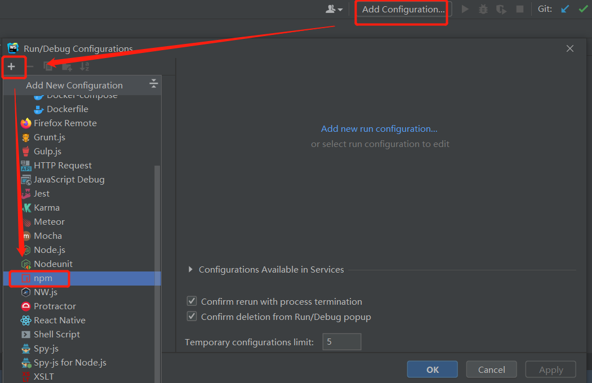
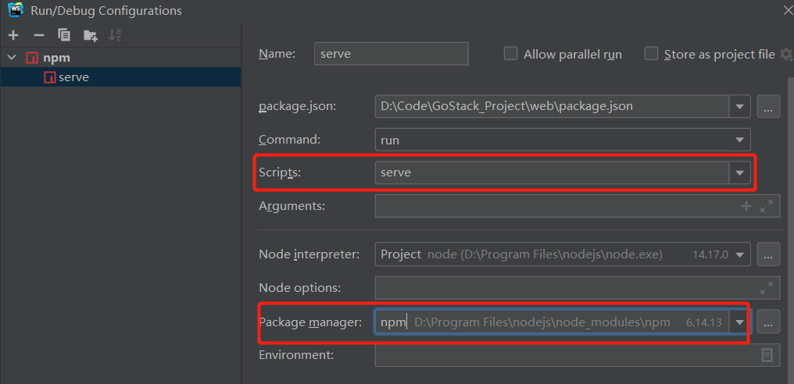
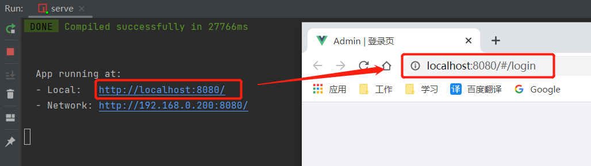

# 1、VUE开发环境配置

参考链接（含创建、启动项目）：https://www.cnblogs.com/dybk/p/10643067.html

## 1.1、安装node.js、npm

- node官网：https://nodejs.org/en/download/   （新版的node安装后自带npm）

- 在nodejs的安装目录下，新建node_global和node_cache两个文件夹，然后在node commande prompt命令工具中配置 这两个文件的绝对位置。

  - npm config set prefix "D:\Program Files\nodejs\node_global"

  - npm config set cache "D:\Program Files\nodejs\node_cache"

- 配置环境变量

  - 新增用户变量：在Path中新增  D:\Program Files\nodejs\node_global”
  - 新增系统变量NODE_PATH：创建NODE_PATH，变量值为D:\Program Files\nodejs\node_global\node_modules

- （可不安装）安装cnpm，这个工具node已经自带，但是没有配置环境变量，因此无法在node commande prompt中使用（自己仿照上一步，添加环境变量之后就可以使用）

- 安装VUE、VUE命令行工具、webpack、vue/cli工具：

  - 安装VUE：

    cnpm install vue -g

  - 安装VUE命令行工具：

    cnpm install vue-cli -g

  - 安装webpack：

    npm install webpack -g      或者     cnpm install webpack -g

  - vue/cli工具：

    npm install --g @vue/cli   或者  cnpm install --g @vue/cli   

    （若安装错误，以管理员身份运行命令，先清除缓存：npm clean cache –force） 

    

- 测试安装否成功：（v注意大小写）

  - node -v
  - npm -V
  - vue -V
  - webpack -v
  
  
  
- 使用命令创建VUE工程：

  - 下载模板：cd至需要存放工程的目录，创建mytest工程，vue init webpack mytest
  - 安装模块：cd至工程目录的根目录，npm install
  - 测试运行：npm run dev

----

# 2、WebStorm开发VUE项目

参考网站：

- 配置、启动vue项目：https://blog.csdn.net/jenybom/article/details/90213374
- 创建项目（该方式不适用于2021的webstorm，无法创建）：https://blog.csdn.net/qq_37350706/article/details/86591102

- 启动github下载的代码：

  - 在项目所在的根目录：下载工程依赖模块， npm install

  - 配置相应的启动参数：

    

    

    

  - 启动后的样子：

    

    

---

# 3、VUE基础

**参考笔记**：[狂神笔记]https://blog.csdn.net/okForrest27/article/details/106849246/

